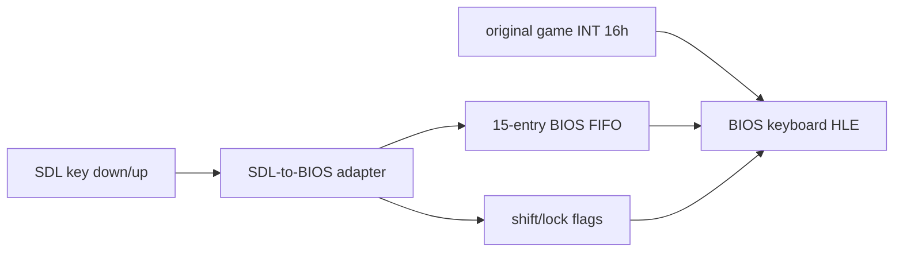

# 20260820-496 창 키보드 BIOS 입력 설계 / Window keyboard BIOS input design

## 한국어

### 문제

게임은 렌더 루프에서 `INT 16h AH=12h`, `AH=11h`, 필요할 때 `AH=10h`를 호출하지만,
현재 BIOS 키보드 HLE는 항상 빈 버퍼와 modifier 없음만 보고합니다. SDL 창은 이미 key down/up
event를 받으므로, 창에 들어온 IBM PC 키보드로 표현 가능한 입력을 원본 게임의 BIOS 조회
경로에 전달해야 합니다.

### 설계

플랫폼 중립적인 BIOS keystroke 표현과 15-entry FIFO를 둡니다. 각 entry는 legacy
`AH=00h/01h`용 AX와 enhanced `AH=10h/11h`용 AX를 함께 보존합니다. producer인 SDL host
thread와 consumer인 guest thread는 짧은 mutex 임계 구역으로 FIFO와 shift flags를
공유합니다. 버퍼가 가득 차면 실제 BIOS ring buffer처럼 새 입력을 버리고 기존 입력 순서를
보존합니다.

SDL adapter는 key down을 US 101-key BIOS scan code와 ASCII로 변환합니다. 반복 key down은
DOS typematic 입력과 같이 새 keystroke로 넣습니다. Shift, Ctrl, Alt 및 lock key event는
`AH=02h/12h` 상태를 갱신하지만 modifier 자체를 keystroke FIFO에 넣지는 않습니다. 이는
modifier가 독립 문자로 반환되지 않는 BIOS 의미를 따릅니다. 포커스를 잃으면 눌림 modifier를
해제하되 Caps/Num/Scroll lock toggle은 유지합니다.

`INT 16h` HLE는 check 함수에서 FIFO head를 소비하지 않고 ZF를 정확히 설정하며, read
함수에서 같은 head를 소비합니다. 현재 게임은 check 뒤에만 read를 호출하므로 정상 경로에서
빈 read는 발생하지 않습니다. 방어적으로 빈 read는 기존 비차단 동작을 유지합니다.

JAMMA key mapping은 기존 타임스탬프 경로를 그대로 유지합니다. 동일한 key event가 JAMMA와
BIOS 양쪽 의미를 가지면 두 경로 모두 전달합니다. `Alt+1..4` 창 배율 shortcut도 사용자 요구의
"모든 키 입력 전달"에 맞춰 BIOS 입력을 함께 생성합니다. SDL이 나타낼 수 있지만 IBM PC BIOS
keystroke로 대응할 수 없는 media/application key는 무시합니다.

### 검증

- 문자, Shift/Caps/Ctrl 조합, function/navigation/keypad scan code 변환을 probe로 검증합니다.
- peek 비소비, read 소비, FIFO 순서와 overflow, shift flags 및 focus-loss 해제를 검증합니다.
- Win32 x86 빌드와 전체 AOT probe를 실행합니다.
- 가능한 경우 게임 창에서 키 입력 후 `INT 16h AH=11h/10h` 소비를 runtime smoke로 확인합니다.

## English

### Problem

The game calls `INT 16h AH=12h`, `AH=11h`, and conditionally `AH=10h` from its render loop,
but the current BIOS keyboard HLE always reports an empty buffer and no modifiers. The SDL
window already receives key down/up events, so every input representable by an IBM PC keyboard
must reach the original game's BIOS query path.

### Design

Add a platform-neutral BIOS keystroke representation and a 15-entry FIFO. Each entry retains
both the legacy AX result for `AH=00h/01h` and enhanced AX result for `AH=10h/11h`. The SDL host
thread producer and guest thread consumer share the FIFO and shift flags under short mutex
critical sections. A full buffer drops the new entry, preserving existing order like a BIOS ring
buffer.

The SDL adapter translates key-down events to US 101-key BIOS scan codes and ASCII. Repeated
key-down events become DOS-style typematic keystrokes. Shift, Ctrl, Alt, and lock-key events update
the `AH=02h/12h` state but modifiers are not themselves queued, matching BIOS semantics. Focus loss
releases pressed modifiers while preserving Caps/Num/Scroll lock toggles.

The `INT 16h` HLE peeks without consuming and sets ZF accurately, while read consumes the same
head entry. The observed game checks before reading, so an empty read does not occur in normal
execution; defensively, it retains the existing non-blocking fallback.

JAMMA mapping remains on its existing timestamped path. An event meaningful to both JAMMA and BIOS
is delivered to both. The `Alt+1..4` host scale shortcuts also produce BIOS input to satisfy the
all-window-keys requirement. Media/application keys without an IBM PC BIOS representation are
ignored.

### Verification

Probe character/modifier combinations and function/navigation/keypad scan codes; verify peek/read,
FIFO order and overflow, shift flags, and focus-loss release; then run the Win32 x86 build and full
AOT probe. When practical, use a runtime smoke test to observe `AH=11h/10h` consuming a window key.
