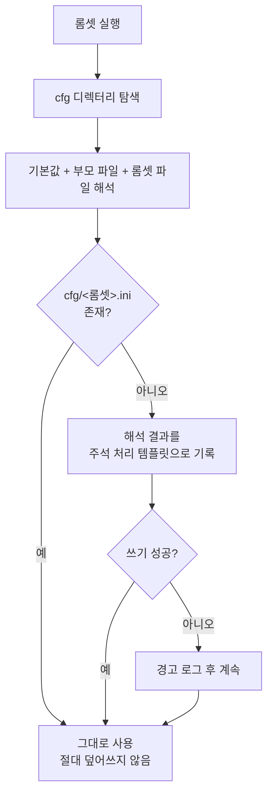
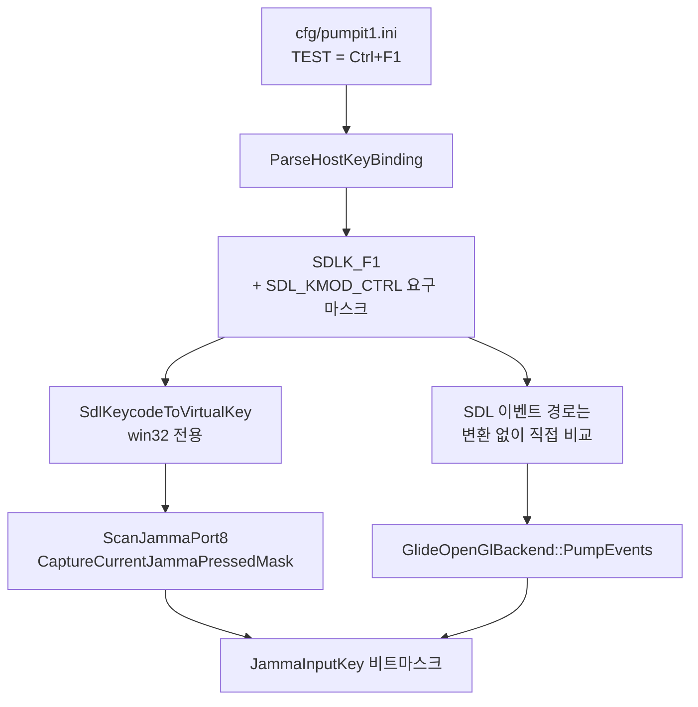
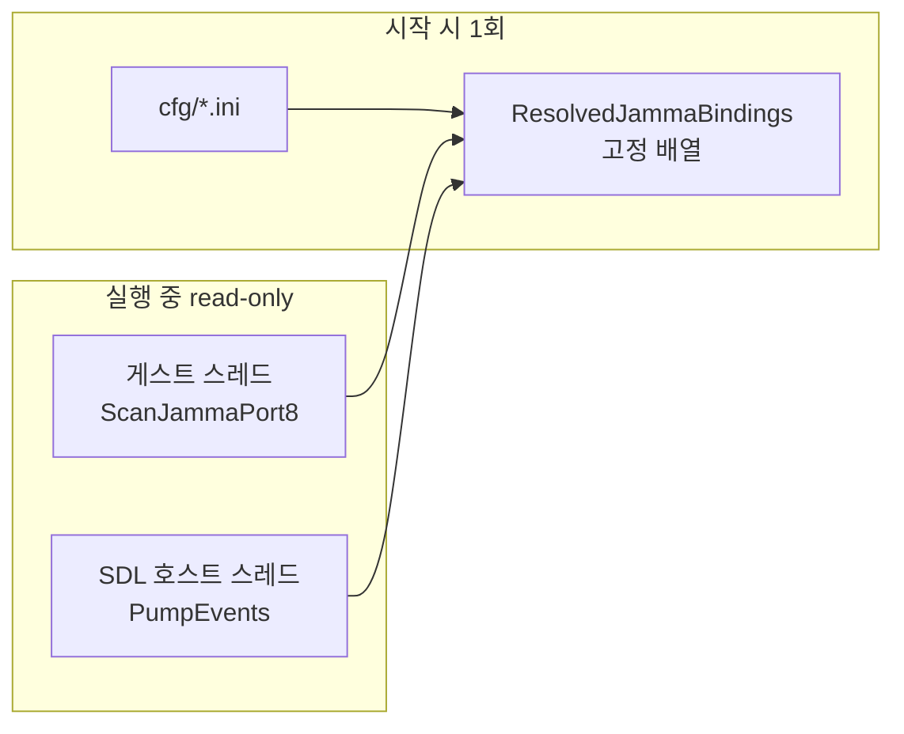
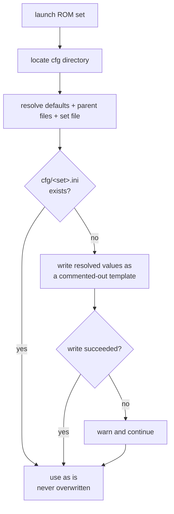
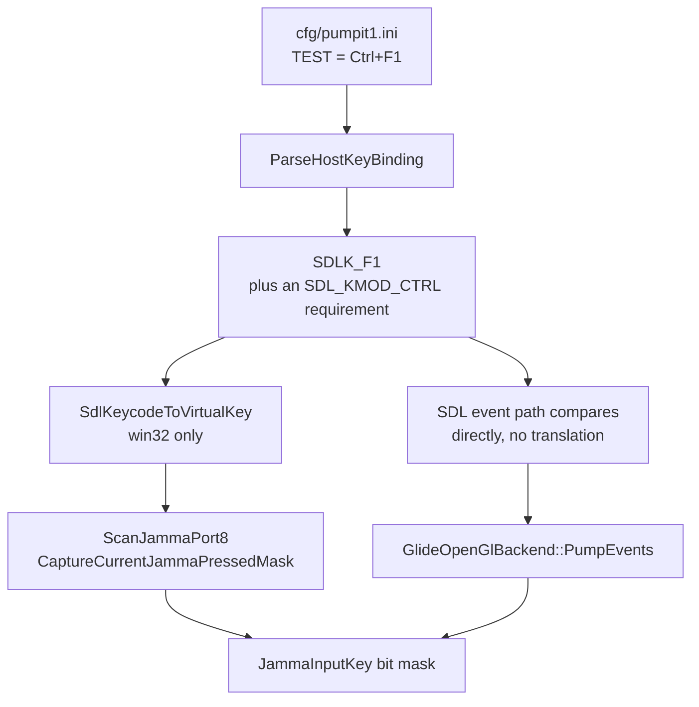
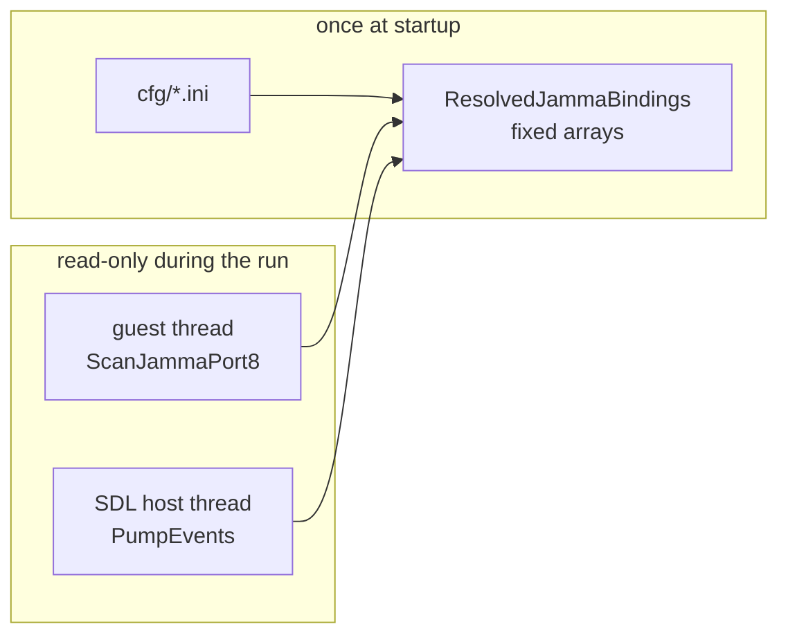

# 20260820-497 롬셋별 설정 파일 설계 / Per-ROM-set configuration file design

## 한국어

### 1. 목적

롬셋마다 별도의 설정 파일을 두고, 실행한 롬셋 이름과 같은 이름의 INI 파일을 읽어
런타임 설정을 적용한다. 1차 범위는 PIUIO(JAMMA) 입력의 호스트 키 매핑이며, 이후
다른 설정 항목을 같은 파일에 섹션 단위로 추가할 수 있는 구조를 먼저 세운다.

파일이 없으면 기본값으로 파일을 생성하고, 조합키를 지원하며, 설정 가능한 키 이름
목록을 문서와 생성 파일 주석 양쪽에서 확인할 수 있어야 한다.

현재 호스트 키 매핑은 세 곳에 하드코딩되어 있다.

| 위치 | 역할 | 키 표현 |
|---|---|---|
| `src/platform/win32/io/port_io_emulator.cpp` `ScanJammaPort8` | 게스트 `IN` 트랩에서 포트 바이트 합성 | Win32 가상키 |
| `src/platform/win32/io/jamma_input_timeline.cpp` `CaptureCurrentJammaPressedMask` | 타임라인 초기 상태 캡처 | Win32 가상키 |
| `src/platform/win32/glide_opengl_backend.cpp` `TranslateJammaInputKeyValue` | SDL 창 이벤트를 타임라인 edge로 기록 | SDL3 keycode |

세 곳이 같은 매핑을 서로 다른 키 표현으로 중복 정의하고 있어, 한 곳만 바꾸면 조용히
어긋난다. 설정 파일 도입은 이 중복을 하나의 바인딩 표로 합치는 작업이기도 하다.

### 2. 파일 위치와 이름

* 디렉터리 이름은 `cfg`, 파일 이름은 `<롬셋 ID>.ini`다. 예: `cfg/pumpit1.ini`.
* 확장자는 `.ini`로 확정한다. 내용 형식이 INI(섹션 + `key = value`)이므로 형식과
  확장자를 일치시킨다.
* 탐색 순서는 다음과 같고, 처음 존재하는 디렉터리 하나만 사용한다.
  1. 환경 변수 `REPIU_CFG_DIR`
  2. 현재 작업 디렉터리의 `cfg`
  3. 호스트 실행 파일이 있는 디렉터리의 `cfg`
* 2번을 기본으로 두는 이유는 기존 자산 경로 규약과 같기 때문이다. `roms`와
  `build/runtime_mounts`도 현재 작업 디렉터리 기준으로 해석된다.
* 어느 후보 디렉터리도 없으면 2번 위치를 새로 만든다. 5절의 첫 실행 생성이 여기에
  파일을 쓴다.
* `rom_set_id`가 빈 프로파일(`dos4gw_hello`, `direct_executable`)은 롬셋이 아니므로
  설정 파일을 읽지도 만들지도 않는다.

### 3. 해석 순서와 레이어링

내장 기본값을 바닥에 두고, 부모 롬셋 파일, 마지막으로 실행 롬셋 파일을 순서대로
덮어쓴다. 덮어쓰기는 파일 단위가 아니라 **키 단위**이므로, 자식 파일에 없는 항목은
부모 값 또는 내장 기본값이 그대로 남는다.


* 부모 사슬은 `TargetProfile::parent_rom_set_id`를 따라 올라가며, 순환과 폭주를
  막기 위해 최대 4단계로 제한한다.
* `pumpitup`처럼 `TargetProfile`이 없는 부모 ID도 파일 이름으로는 유효하다. 파일이
  없으면 그 단계를 건너뛴다.
* **파일이 하나도 없으면 내장 기본값이 그대로 쓰이고, 결과는 현재 동작과 완전히
  동일하다.** 이것이 이번 변경의 회귀 방지선이다.

### 4. INI 문법

| 항목 | 규칙 |
|---|---|
| 주석 | 줄 시작이 `;` 또는 `#` |
| 섹션 | `[Input]`, 대소문자 무시 |
| 키 | `key = value`, 대소문자와 언더스코어 무시 (`P1_UP_LEFT` = `p1upleft`) |
| 공백 | 키와 값 앞뒤 공백 제거 |
| 따옴표 | 값의 `'Q'`, `"Q"`는 벗겨낸다 |
| 별칭 | 쉼표로 여러 호스트 키: `P2_UP_LEFT = Keypad7, Home` |
| 조합키 | `+`로 수식키 결합, 기본 키가 마지막: `TEST = Ctrl+F1` |
| 빈 값 | 그 입력을 끈다. 어떤 키로도 동작하지 않는다 |
| 중복 키 | 마지막 항목이 이긴다 |
| 알 수 없는 섹션·키·키 이름 | 경고 로그 후 무시하고 계속 진행 |

마지막 항목이 중요하다. 설정 파일 오타로 게임이 실행되지 않는 것은 받아들일 수 없다.
파서는 실패하지 않고 경고만 남긴다.

#### 4.1 빈 값은 그 입력을 끈다

`[Input]` 항목은 값이 비어 있어도 **적용된다.** 그 입력에 키가 하나도 남지 않으므로 게스트는
그 입력이 눌린 것을 영영 보지 못한다. 캐비닛 버튼을 꺼 두는 방법이 이것이다.

| 값 | 결과 |
|---|---|
| `TEST = F9` | `F9`로 동작 |
| `TEST = F9, NoSuchKey` | 유효한 `F9`만 적용, 나머지는 경고 |
| `TEST =` | **입력 꺼짐.** 어떤 키로도 동작하지 않음 |
| `TEST = NoSuchKey` | 경고 후 입력 꺼짐 |

항목은 그 입력의 별칭 목록을 **통째로 교체**한다. 이전 계층 값에 더하는 것이 아니므로, 적힌
값이 그 입력에 대한 완전한 답이 된다. 값이 비었다는 것은 "이 입력에 키가 없다"는 완전한 답이다.

키 이름을 잘못 적었을 때도 결과는 같지만 경고가 남는다. 로더 로그의 `Config:` 줄이 파일 이름과
줄 번호를 알려주므로, 의도한 끄기와 오타를 구분할 수 있다.

### 5. 첫 실행 시 기본 파일 생성

실행 롬셋의 설정 파일이 없으면 **해석이 끝난 뒤** 그 결과를 **주석 처리된 템플릿**으로
쓴다.



#### 5.1 왜 주석 처리인가

활성 항목으로 쓰면 3절의 레이어링이 사실상 죽는다. 생성 파일은 14개 키를 전부 담으므로,
`pumpit1`을 한 번 실행한 순간 `cfg/pumpit1.ini`가 모든 키를 덮어쓰게 되고 그 뒤로는
`cfg/pumpitup.ini`를 고쳐도 효과가 없다. 레이어링이 "아직 실행하지 않은 롬셋"에만
동작하게 되어, 언제 처음 실행했는지에 따라 결과가 달라진다.

주석 처리 템플릿은 이 문제를 없앤다.

* 부모 파일과 내장 기본값이 계속 유효하다. 공용 설정을 한 곳에서 관리할 수 있다.
* 특정 롬셋만 다르게 하고 싶으면 그 줄의 주석만 푼다.
* "파일 생성이 동작을 바꾸지 않는다"는 불변식이 자명하게 성립한다. 활성 항목이 하나도
  없으므로 해석 결과에 아무 영향이 없다.
* 주석에 현재 유효한 값이 적혀 있으므로, 파일을 열면 무엇이 적용 중인지 바로 보인다.

#### 5.2 정책

* **기본값이 아니라 해석 결과를 주석으로 적는다.** 부모 파일이 값을 제공했다면 그 값이
  보인다. 주석은 "지금 이 롬셋에 실제로 적용 중인 값"을 나타내야 하기 때문이다.
* **기존 파일은 절대 덮어쓰지 않는다.** 없을 때만 만든다. 사용자가 주석을 풀어 둔 항목도,
  지운 항목도 다음 실행에서 되돌아가지 않는다.
* 임시 파일에 쓴 뒤 이름을 바꿔, 쓰다 만 파일이 남지 않게 한다.
* 줄바꿈은 CRLF로 쓴다. 사용자가 Windows 기본 편집기로 열 파일이다.
* 쓰기에 실패해도(읽기 전용 위치, 권한 없음) 경고만 남기고 해석 결과로 계속 실행한다.
* `REPIU_CFG_WRITE_DEFAULT=0`으로 생성을 끌 수 있다. 자동화 실행과 probe에서 쓴다.
* **부모 파일은 만들지 않는다.** 어느 부모를 만들지가 롬셋마다 다르고(대부분 `pumpitup`,
  일부는 `pumpit3` 같은 실제 롬셋), 쓰지도 않을 파일을 미리 만들 이유가 없다. 대신
  생성 파일 헤더 주석에서 공용 설정을 만드는 방법을 안내한다.

생성되는 파일에는 7.3절의 키 이름 목록이 주석으로 함께 들어간다.

### 6. `[Input]` 섹션 키 이름

발판 위치명은 `docs/analysis/piu-io-port-specification.md`의 포트 비트 표를 따른다.
섹션이 이미 입력임을 한정하므로 접두어는 붙이지 않는다.

| 키 이름 | 포트 | 비트 | 기본 호스트 키 |
|---|---|---:|---|
| `P1_UP_LEFT` | `0x02A8` | `0x01` | `Q` |
| `P1_UP_RIGHT` | `0x02A8` | `0x02` | `E` |
| `P1_CENTER` | `0x02A8` | `0x04` | `S` |
| `P1_DOWN_LEFT` | `0x02A8` | `0x08` | `Z` |
| `P1_DOWN_RIGHT` | `0x02A8` | `0x10` | `C` |
| `P2_UP_LEFT` | `0x02AA` | `0x01` | `Keypad7, Home` |
| `P2_UP_RIGHT` | `0x02AA` | `0x02` | `Keypad9, PageUp` |
| `P2_CENTER` | `0x02AA` | `0x04` | `Keypad5, Clear` |
| `P2_DOWN_LEFT` | `0x02AA` | `0x08` | `Keypad1, End` |
| `P2_DOWN_RIGHT` | `0x02AA` | `0x10` | `Keypad3, PageDown` |
| `TEST` | `0x02A9` | `0x02` | `F1` |
| `COIN1` | `0x02A9` | `0x04` | `F5` |
| `SERVICE` | `0x02A9` | `0x40` | `F2` |
| `CLEAR` | `0x02A9` | `0x80` | `F3` |

2P 기본값의 `Home`, `PageUp`, `Clear`, `End`, `PageDown` 별칭은 NumLock이 꺼진
숫자패드가 보고하는 키다. 근거는 같은 문서의 2.2절이다.

`COIN2`와 캐비닛 입력 포트 `0x02AB`는 현재 에뮬레이터가 스캔하지 않는 비트이므로
이번 범위에서 제외한다. 해당 비트를 구현할 때 같은 표에 추가한다.

### 7. 호스트 키 표현과 이름 표

#### 7.1 정식 타입은 `SDL_Keycode`

설정 값의 정식 내부 표현은 `SDL_Keycode`다. 별도의 중립 열거를 두지 않는다.

* SDL 창 이벤트 경로는 `event.key.key`와 직접 비교하므로 변환이 없다.
* 폴링 경로만 Win32 가상키를 필요로 하므로, 남는 변환표는 `SDL_Keycode` → VK 하나다.
* `repiu_exe`와 `repiu_aot_probe` 모두 이미 `SDL3::SDL3-static`을 링크하므로
  (`CMakeLists.txt:247`, `CMakeLists.txt:346`) 새 의존성이 생기지 않는다.



#### 7.2 이름 문자열은 SDL 것을 쓰지 않는다

`SDL_GetKeyFromName`을 쓰면 이름 표 자체가 필요 없어 보이지만, SDL3 헤더가 그 용도를
직접 배제하고 있다.

> **Warning**: The returned name is by design not stable across platforms (...)
> This function is therefore unsuitable for creating a stable cross-platform two-way
> mapping between strings and scancodes.
> — `SDL_keyboard.h`, `SDL_GetScancodeName`

설정 파일이 필요로 하는 것이 바로 그 "안정적인 문자열 ↔ 키 양방향 매핑"이다. 실무적인
문제도 함께 있다.

* SDL 이름에는 공백이 들어간다. `Keypad 7`, `Page Up`, `Left Ctrl`. INI 값에서 파싱은
  되지만 `P2_UP_LEFT = Keypad 7, Home`은 읽기도 쓰기도 나쁘다.
* `SDL_GetKeyName`과 `SDL_GetScancodeName`은 헤더에 `not thread safe`로 명시되어 있다.
* 이름이 플랫폼과 레이아웃에 따라 달라지므로, 같은 설정 파일이 다른 환경에서 다르게
  해석될 수 있다.

따라서 이름 표는 프로젝트가 직접 유지하고, 대상만 `SDL_Keycode`로 둔다. 항목 하나는
`{"Keypad7", SDLK_KP_7, 분류}` 형태다. 이름 비교는 대소문자와 언더스코어를 무시하므로
`Keypad7`, `KEYPAD_7`, `keypad7`이 모두 같은 키다.

#### 7.3 이름 목록

이 표가 설정 가능한 키 이름의 **유일한 출처**이며, 문서와 생성 파일 주석이 모두
여기에서 나온다.

| 분류 | 이름 |
|---|---|
| 문자 | `A` – `Z` |
| 숫자 | `0` – `9` |
| 기능키 | `F1` – `F12` |
| 숫자패드 | `Keypad0` – `Keypad9`, `KeypadEnter`, `KeypadPlus`, `KeypadMinus`, `KeypadMultiply`, `KeypadDivide`, `KeypadPeriod` |
| 이동·편집 | `Up`, `Down`, `Left`, `Right`, `Home`, `End`, `PageUp`, `PageDown`, `Insert`, `Delete`, `Clear` |
| 기타 | `Space`, `Enter`, `Tab`, `Backspace`, `Escape` |
| 수식키 | `LeftShift`, `RightShift`, `LeftCtrl`, `RightCtrl`, `LeftAlt`, `RightAlt` |

`Win`(Windows 키, `SDL_KMOD_GUI`)은 넣지 않는다. 대부분의 조합을 셸이 먼저 가로채므로
설정할 수 있게 해도 실제로 눌리지 않는 경우가 많다.

### 8. 조합키 문법과 의미

#### 8.1 문법

```
바인딩   := 별칭 ( ',' 별칭 )*
별칭     := ( 수식키 '+' )* 기본키
수식키   := Ctrl | Shift | Alt            (좌우 구분 없음)
          | LeftCtrl | RightCtrl | LeftShift | RightShift | LeftAlt | RightAlt
기본키   := 7.3절의 모든 이름
```

마지막 토큰이 기본 키이고, 앞의 토큰은 모두 수식키여야 한다. 예:

```ini
TEST     = Ctrl+F1
SERVICE  = Ctrl+Shift+F2
CLEAR    = LeftAlt+F3, F3
```

`Ctrl`은 좌우 어느 쪽이든 만족한다. 특정 쪽만 원하면 `LeftCtrl`처럼 적는다.
수식키 이름은 기본 키로도 쓸 수 있다. `P1_CENTER = LeftShift`는 유효하다.

#### 8.2 수식키 마스크 타입도 SDL을 쓴다

`SDL_Keymod`가 그대로 마스크 타입이 된다. SDL이 이미 좌우 통합 상수를 정의해 두었고,
그것이 위 문법의 "좌우 무관" 의미와 정확히 일치한다.

| 설정 표기 | 마스크 | 값 |
|---|---|---|
| `Ctrl` | `SDL_KMOD_CTRL` | `LCTRL \| RCTRL` |
| `Shift` | `SDL_KMOD_SHIFT` | `LSHIFT \| RSHIFT` |
| `Alt` | `SDL_KMOD_ALT` | `LALT \| RALT` |
| `LeftCtrl` | `SDL_KMOD_LCTRL` | `0x0040` |

SDL 이벤트 경로는 `event.key.mod`를 그대로 쓰고, 폴링 경로는 6개 수식키의
`GetAsyncKeyState` 결과로 같은 형태의 `SDL_Keymod` 값을 조립한다. 두 경로가 같은
타입으로 비교하므로 판정 코드가 하나로 유지된다.

**주의**: `event.key.mod`에는 `SDL_KMOD_NUM`, `SDL_KMOD_CAPS`, `SDL_KMOD_SCROLL` 같은
lock 상태 비트도 들어 있다. 이 비트를 금지 마스크에 포함하면 NumLock이 켜진 것만으로
모든 바인딩이 죽는다. 비교 전에 항상
`kConfigurableModifierMask = SDL_KMOD_SHIFT | SDL_KMOD_CTRL | SDL_KMOD_ALT`로
마스킹한다. 2P 기본값이 NumLock OFF 숫자패드를 쓴다는 점 때문에 이 실수는 특히 치명적
이므로, probe에 lock 비트가 섞인 입력을 명시적으로 넣는다.

#### 8.3 판정 규칙

수식키 판정에는 두 가지가 필요하다. 무엇이 눌려 있어야 하는가와, 무엇이 눌려 있으면
안 되는가다. 두 번째가 없으면 `TEST = Ctrl+F1`과 `CLEAR = F1`이 공존할 때
`Ctrl+F1`이 둘 다 발동한다.

* **수식키가 붙은 별칭은 정확히 일치해야 한다.** 요구한 수식키는 눌려 있어야 하고,
  나머지 수식키는 눌려 있으면 안 된다. `Ctrl+F1`은 `Ctrl+Shift+F1`에서 발동하지
  않는다.
* **수식키가 없는 별칭은 기본적으로 수식키를 따지지 않는다.** 즉 지금 동작 그대로
  `Ctrl+Q`도 `P1_UP_LEFT`를 누른 것으로 본다. 이 규칙이 없으면 설정 파일을 쓰지 않는
  사용자에게 회귀가 된다.
* **예외는 같은 기본 키를 두고 경쟁이 있을 때뿐이다.** 어떤 기본 키 K에 대해
  수식키가 붙은 별칭이 하나라도 있으면, 같은 K를 쓰는 수식키 없는 별칭은 그 수식키가
  눌리지 않았을 때만 발동한다. 위 예에서 `F1`은 Ctrl이 눌리지 않았을 때만 `CLEAR`가
  되고, `Shift+F1`은 여전히 `CLEAR`다.

이 판정은 전부 **로드 시점에** 별칭마다 `요구 마스크`와 `금지 마스크`로 환산된다.
실행 중에는 마스크 비교만 남는다. 요구 마스크는 목록이고, 각 항목은 "그 마스크의
비트 중 하나 이상"으로 판정한다. 금지 마스크는 하나이고 "모든 비트가 0"으로 판정한다.

| 별칭 | 요구 | 금지 |
|---|---|---|
| `Ctrl+F1` | `SDL_KMOD_CTRL` | `SHIFT \| ALT` |
| `LeftCtrl+F1` | `SDL_KMOD_LCTRL` | `RCTRL \| SHIFT \| ALT` |
| `F1` (경쟁 없음) | 없음 | 없음 |
| `F1` (`Ctrl+F1`과 경쟁) | 없음 | `SDL_KMOD_CTRL` |

#### 8.4 두 입력 경로의 차이

두 소비 경로는 수식키를 보는 시점이 다르다. 의도된 차이이므로 명시한다.

* **폴링 경로**(`ScanJammaPort8`)는 매 스캔마다 수식키의 현재 상태를 본다. 기본 키를
  누른 채 Ctrl에서 손을 떼면 그 순간 입력이 풀린다.
* **창 이벤트 경로**(`PumpEvents`)는 SDL이 준 `event.key.mod`, 즉 **기본 키를 누른
  순간의** 수식키 상태로 판정한다. 기본 키를 누른 뒤 Ctrl에서 손을 떼도, 기본 키를 뗄
  때까지 눌린 상태가 유지된다. 수식키를 놓는다고 별도의 키 이벤트가 기본 키에 대해
  발생하지 않기 때문이며, 실기 버튼에 가까운 동작이기도 하다.

TEST, SERVICE 같은 캐비닛 버튼에서만 조합키를 쓸 것이므로 이 차이가 실제로 문제되는
경우는 없다. 발판 입력에 조합키를 거는 것은 권장하지 않으며, 문서에 적어 둔다.

### 9. 성능 제약

Task 403에서 확인된 사실 때문에 스캔 경로는 건드릴 수 없다. 게스트는 `0x02A8`을 지연
목적으로 연속 200회 읽고, `GetAsyncKeyState`가 포트 I/O 핸들러 본체의 99.21%를
차지했었다. 따라서:

* 파싱과 이름 해석은 시작 시 1회만 수행한다. 스캔 경로에는 문자열 비교, 맵 조회,
  할당이 없다. `SDL_Keycode` → VK 변환도 로드 시점에 끝나므로 스캔 경로에는 이미
  변환된 VK만 남는다.
* `GetAsyncKeyState` 호출 횟수는 바인딩 개수와 정확히 같다. 기본값이면 현재와 동일한
  횟수다.
* **수식키 조회는 조건부다.** 로드 시점에 `any_binding_uses_modifiers` 플래그를
  계산한다. 거짓이면(기본 설정이 그렇다) 수식키를 아예 읽지 않아 호출 횟수가 지금과
  같다. 참이면 스냅샷 갱신마다 6개 수식키를 **한 번씩만** 읽어 `SDL_Keymod` 값을
  조립하고 모든 별칭이 공유한다. 별칭마다 읽지 않는다.
* Task 403의 스냅샷 캐시(`REPIU_JAMMA_SNAPSHOT_US`)와 Task 492의 타임라인 재생 경로는
  구조를 바꾸지 않는다. 키 목록만 표에서 읽어온다.

### 10. 코드 배치

`AGENTS.md`의 "플랫폼 공용 상태와 플랫폼 backend를 분리한다", "독립적으로 이름 붙일
수 있는 하위 시스템은 전용 파일로 추출한다" 규칙에 따라 나눈다.

| 파일 | 책임 | 계층 |
|---|---|---|
| `include/repiu/config/ini_document.h`, `src/config/ini_document.cpp` | INI 어휘 분석과 섹션/키 조회 | 중립 |
| `include/repiu/input/host_key_names.h`, `src/input/host_key_names.cpp` | 이름 ↔ `SDL_Keycode` 표와 분류 메타데이터 | SDL |
| `include/repiu/input/host_key_binding.h`, `src/input/host_key_binding.cpp` | 조합키 문법 파싱, 요구·금지 `SDL_Keymod` 마스크 환산 | SDL |
| `include/repiu/input/jamma_input_bindings.h`, `src/input/jamma_input_bindings.cpp` | 액션 정의, 내장 기본값, `[Input]` 적용 | SDL |
| `include/repiu/config/romset_config.h`, `src/config/romset_config.cpp` | `cfg` 탐색, 부모 사슬 레이어링, 첫 실행 생성, 로드 진입점 | 중립 |
| `include/repiu/config/romset_config_template.h`, `src/config/romset_config_template.cpp` | 기본 파일 본문(주석 포함) 렌더링 | 중립 |
| `src/platform/win32/input/win32_host_key_translation.{h,cpp}` | `SDL_Keycode` → Win32 가상키, 수식키 상태를 `SDL_Keymod`로 조립 | win32 |

"SDL" 계층은 플랫폼 종속이 아니다. SDL3가 win32·linux·web을 모두 덮는 이식 계층이므로,
`SDL_Keycode`에 의존하는 것이 오히려 이 파일들을 이식 가능하게 만든다. 진짜 플랫폼
종속은 마지막 줄 하나뿐이며, `GetAsyncKeyState`를 쓰는 폴링 경로가 존재하는 한
필요하다.

파일 본문 렌더링을 별도 파일로 뺀 이유는 probe가 디스크를 건드리지 않고 생성 결과를
검사할 수 있게 하기 위해서다.

통합 지점은 `src/host/win32/main.cpp` 한 곳이다. 대상 프로파일이 확정된 직후,
게스트 스레드와 SDL 창이 만들어지기 전에 한 번 로드한다.

### 11. 런타임 자료구조와 스레드 규약



* `ResolvedJammaBindings`는 `JammaInputKey`마다 최대 4개의 별칭을 담는 고정 크기
  배열이다. 별칭 하나는 `SDL_Keycode`, 미리 계산한 Win32 가상키, 요구 마스크 목록,
  금지 마스크로 이루어진다. 동적 할당과 문자열이 없다.
* 로드는 게스트 스레드와 SDL 창 생성 이전에 끝나고, 이후에는 아무도 쓰지 않는다.
  두 스레드가 동시에 읽지만 불변이므로 락이 필요 없다. 이 불변식은 코드 주석으로
  명시한다.

### 12. 생성 파일 형태

`cfg/pumpit1.ini`가 없을 때 만들어지는 파일이다. 모든 입력 항목이 주석 처리되어 있고,
주석의 값은 지금 실제로 적용 중인 설정이다. 키 이름 목록은 7.3절 표에서 생성되므로
표가 바뀌면 주석도 함께 바뀐다.

```ini
; rePIU configuration for ROM set "pumpit1"
;
; Created automatically on first run. rePIU never overwrites an existing file,
; so anything you change here is kept.
;
; Every entry below is commented out and shows the value currently in effect.
; Uncomment a line to override it for this ROM set only.
;
; To change a setting for every ROM set at once, put it in a shared file
; instead: create cfg/pumpitup.ini and add the entry there. This ROM set's own
; file always wins over the shared one.
;
; Syntax
;   NAME = key            bind one host key
;   NAME = key1, key2     bind several; any one of them works
;   NAME = Ctrl+F1        modifier combination, base key last
;   NAME =                no value: turn this input off
;   ;  or  #              comment
;
; Modifiers
;   Ctrl, Shift, Alt        either side of the keyboard
;   LeftCtrl, RightCtrl, LeftShift, RightShift, LeftAlt, RightAlt
;   Combine with '+': Ctrl+Shift+F2
;
; Host key names (case and underscores are ignored: Keypad7 = KEYPAD_7)
;   Letters     A .. Z
;   Digits      0 .. 9
;   Function    F1 .. F12
;   Keypad      Keypad0 .. Keypad9, KeypadEnter, KeypadPlus, KeypadMinus,
;               KeypadMultiply, KeypadDivide, KeypadPeriod
;   Navigation  Up, Down, Left, Right, Home, End, PageUp, PageDown,
;               Insert, Delete, Clear
;   Other       Space, Enter, Tab, Backspace, Escape
;   Modifiers   LeftShift, RightShift, LeftCtrl, RightCtrl, LeftAlt, RightAlt
;
; Full reference: docs/guides/romset-config-files.md

[Input]
; Player 1 stage panels (I/O port 0x02A8)
;P1_UP_LEFT    = Q
;P1_UP_RIGHT   = E
;P1_CENTER     = S
;P1_DOWN_LEFT  = Z
;P1_DOWN_RIGHT = C

; Player 2 stage panels (I/O port 0x02AA)
; Keypad names assume NumLock off; the aliases are what Windows reports then.
;P2_UP_LEFT    = Keypad7, Home
;P2_UP_RIGHT   = Keypad9, PageUp
;P2_CENTER     = Keypad5, Clear
;P2_DOWN_LEFT  = Keypad1, End
;P2_DOWN_RIGHT = Keypad3, PageDown

; Cabinet buttons (I/O port 0x02A9)
;TEST    = F1
;SERVICE = F2
;CLEAR   = F3
;COIN1   = F5
```

`[Input]` 섹션 헤더는 주석 처리하지 않는다. 사용자가 항목의 주석을 풀었을 때 그 항목이
어느 섹션에 속하는지가 유지되어야 하기 때문이다.

### 13. 사용자 문서

`docs/guides/romset-config-files.md`를 새로 쓴다. 내용은 파일 위치와 이름, 첫 실행
생성 동작, INI 문법, 조합키 문법과 판정 규칙, 전체 키 이름 목록, 입력 이름 표, 자주
겪는 문제(설정이 반영되지 않을 때 확인할 것)다. `README.md`의 사용 예 절에서 링크한다.

키 이름 목록은 코드의 이름 표, 생성 파일 주석, 이 문서 세 곳에 나타난다. 드리프트를
막기 위해 probe가 생성 파일 주석에 이름 표 전체가 빠짐없이 들어갔는지 검사한다. 문서는
표 변경 시 같은 작업에서 갱신한다.

### 14. `JammaInputKey` 열거 이름 정정

현재 열거 이름과 실제 포트 비트 의미가 어긋나 있다. `kP1Down`은 비트 `0x02`이며 로그
이름은 `P1-UpRight`다. `kP1Left`는 `0x08`이고 로그 이름은 `P1-DownLeft`다.

설정 파일 키 이름(`P1_UP_RIGHT`)과 열거 이름(`kP1Down`)이 다르면 매핑 표를 읽는
사람이 계속 오해하게 되므로, 이번 작업에서 열거 이름을 실제 비트 의미로 맞춘다.

| 현재 | 변경 후 | 비트 |
|---|---|---:|
| `kP1Up` | `kP1UpLeft` | `0x01` |
| `kP1Down` | `kP1UpRight` | `0x02` |
| `kP1Center` | `kP1Center` (유지) | `0x04` |
| `kP1Left` | `kP1DownLeft` | `0x08` |
| `kP1Right` | `kP1DownRight` | `0x10` |

P2도 같은 방식이다. **열거 순서는 바꾸지 않는다.** `JammaInputKeyMask`가 열거 순서를
비트 위치로 쓰고 타임라인 마스크가 그 위에 서 있으므로, 순수 이름 변경으로만 제한한다.

영향 파일: `jamma_input_timeline.h`, `jamma_input_timeline.cpp`,
`port_io_emulator.cpp`, `glide_opengl_backend.cpp`,
`src/tools/aot_probe/jamma_input_timeline_probe.cpp`.

### 15. 중복 매핑 표 통합

현재 `port_io_emulator.cpp`는 로그용 비트 이름 표(`kJammaBitsIn0` 등)와 스캔 코드의
비트 조작을 따로 갖고 있다. 이번에 포트·비트·`JammaInputKey`·표시 이름을 한 표로
합치고, 로그와 스캔이 같은 표를 읽게 한다. 비트 이름이 스캔과 어긋나는 상태가 구조적
으로 불가능해진다.

### 16. 검증 계획

새 probe `src/tools/aot_probe/romset_config_probe.cpp`를 추가한다.

1. INI 파싱: 주석, 공백, 따옴표, 대소문자, 중복 키
2. 별칭 목록, 빈 값 = 입력 꺼짐(가상키까지 사라지는지 확인), 잘못된 키 이름 =
   경고 후 꺼짐, 일부만 유효한 값은 유효한 쪽만 적용
3. 이름 표 자체의 건전성: 이름 중복 없음, `SDL_Keycode` 중복 없음, 모든 항목이 유효한
   Win32 가상키로 변환됨, 모든 이름이 파서를 왕복함
4. 조합키 파싱: `Ctrl+F1`, `Ctrl+Shift+F2`, `LeftAlt+F3`, 잘못된 형태
   (`F1+Ctrl`, `Ctrl+`, `Ctrl+Ctrl+F1`)
5. 수식키 판정: 요구·금지 마스크 환산 결과, 경쟁하는 기본 키의 금지 마스크 파생,
   경쟁이 없을 때 금지 마스크가 비어 있는지(회귀 방지),
   **`SDL_KMOD_NUM`·`SDL_KMOD_CAPS`가 섞인 입력이 판정에 영향을 주지 않는지**
6. 레이어링: 내장 기본값 → 부모 → 자식 덮어쓰기 순서
7. **회귀 가드**: 설정 파일이 없을 때 해석된 바인딩이 현재 하드코딩 값과 가상키 단위로
   정확히 일치하고, `any_binding_uses_modifiers`가 거짓인지 확인한다
8. 생성 파일:
   - 렌더링한 본문을 **그대로** 되읽으면 `[Input]` 항목이 하나도 나오지 않는지
     (전부 주석이므로, 생성이 동작을 바꾸지 않는다는 불변식의 직접 검사)
   - 모든 항목의 선행 `;`를 제거한 뒤 되읽으면 해석 결과가 입력과 정확히 같은지(왕복)
   - `[Input]` 섹션 헤더는 주석 처리되지 않았는지
   - 주석에 이름 표 전체가 등장하는지

파일 생성 자체는 임시 디렉터리를 써서 확인한다. 기존 파일 미덮어쓰기와 쓰기 실패 시
계속 진행하는지도 함께 본다.

9. 레이어링과 생성의 상호작용(설계 5.1절이 해결한 문제의 회귀 가드): 자식 파일을
   생성한 뒤에도 부모 파일의 값이 계속 적용되는지 확인한다. 이 검사가 실패하면 생성
   파일이 다시 활성 항목으로 돌아간 것이다.

기존 `glide_opengl_backend.cpp`의 `static_assert` 검증(숫자패드 별칭 10건)은 컴파일
타임 상수가 아니게 되므로 3번과 7번 항목의 단언으로 옮긴다.

그 외 전체 `repiu_aot_probe` 실행과 Win32 x86 Debug 빌드를 통과해야 한다. 런타임
스모크는 사용자 확인 후에만 수행한다.

### 17. 향후 확장

* `[Video]`, `[Audio]`, `[Timing]` 섹션 추가. 지금은 `[Input]`만 인식하고 나머지
  섹션은 경고만 남긴다. 생성 파일도 `[Input]`만 쓴다.
* 게임패드·조이스틱 바인딩. `SDL_Gamepad` 기반이므로 `Joy1_Button3` 형태의 이름 공간을
  키 이름 표 밖에 예약해 둔다.
* 폴링 경로를 `SDL_GetKeyboardState`로 옮기면 `SDL_Keycode` → VK 표까지 사라진다.
  이번에는 입력이 창 포커스 기준이 되는 동작 변화와 폴링 신선도가 이벤트 펌프 주기에
  묶이는 문제 때문에 채택하지 않았다. 나중에 다시 검토할 수 있도록 근거를 남긴다.
* 현재는 첫 실행 생성 외에는 쓰기가 없다. 게임 내 설정 화면에서 저장하는 기능은
  범위 밖이다.

### 18. 결정된 사항과 남은 항목

확정된 결정:

* 파일 확장자는 `.ini`, 키 이름은 섹션 스코프 발판 위치명(`P1_UP_LEFT` 형태).
* 생성 파일은 주석 처리 템플릿이고, 부모 롬셋 레이어링을 유지한다(5.1절).
* 폴링 경로는 `GetAsyncKeyState`를 유지하고, `SDL_Keycode` → VK 표 하나를 남긴다.
* `COIN2`는 이번 범위에서 제외한다. `0x02A9`에서 COIN2 비트가 특정되지 않았고, 근거
  없이 비트를 고르는 것은 원본 하드웨어 동작을 지어내는 일이 된다.
* 첫 실행 생성이 있으므로 저장소에 예제 `.ini`를 커밋하지 않고, `.gitignore`에 `cfg/`를
  추가한다. 사용자의 로컬 키 설정이 저장소 상태를 더럽히지 않아야 한다.

남은 항목:

* `COIN2`와 캐비닛 포트 `0x02AB` 비트는 에뮬레이터가 아직 스캔하지 않는다. 별도 작업에서
  먼저 비트를 특정해야 하며, 그때 설정 키를 6절 표에 추가한다. 게임이 실제로 COIN2를
  읽는지 확인하는 것이 그 작업의 출발점이다.

---

## English

### 1. Objective

Give each ROM set its own configuration file, read from an INI file named after the
ROM set that was launched. The first scope is host key mapping for PIUIO (JAMMA)
input, with a structure that lets later settings be added to the same file as
additional sections.

If the file is missing it is created with default values; key combinations are
supported; and the list of configurable key names is discoverable from both the
documentation and the comments in the generated file.

Host key mapping is currently hardcoded in three places.

| Location | Role | Key representation |
|---|---|---|
| `src/platform/win32/io/port_io_emulator.cpp` `ScanJammaPort8` | Composes port bytes inside the guest `IN` trap | Win32 virtual key |
| `src/platform/win32/io/jamma_input_timeline.cpp` `CaptureCurrentJammaPressedMask` | Captures the timeline's initial state | Win32 virtual key |
| `src/platform/win32/glide_opengl_backend.cpp` `TranslateJammaInputKeyValue` | Records SDL window events as timeline edges | SDL3 keycode |

The three define the same mapping in different key vocabularies, so changing one
silently desynchronizes the others. Introducing the config file is also the work of
collapsing that duplication into a single binding table.

### 2. File location and name

* The directory is `cfg` and the file is `<rom-set-id>.ini`, e.g. `cfg/pumpit1.ini`.
* The extension is `.ini`, matching the INI content format (sections plus
  `key = value`).
* Search order, using the first directory that exists:
  1. The `REPIU_CFG_DIR` environment variable
  2. `cfg` under the current working directory
  3. `cfg` next to the host executable
* Item 2 is the default because it matches the existing asset-path convention;
  `roms` and `build/runtime_mounts` are also resolved against the working directory.
* If no candidate directory exists, item 2 is created. The first-run generation in
  section 5 writes there.
* Profiles with an empty `rom_set_id` (`dos4gw_hello`, `direct_executable`) are not
  ROM sets, so no config file is read or created for them.

### 3. Resolution order and layering

Built-in defaults sit at the bottom, then parent ROM-set files, then the launched ROM
set's file. Overriding is **per key**, not per file, so an entry absent from the child
file keeps the parent or built-in value.


* The parent chain follows `TargetProfile::parent_rom_set_id` and is capped at four
  levels to bound cycles and runaway walks.
* A parent ID with no `TargetProfile`, such as `pumpitup`, is still a valid file name.
  A missing file simply skips that layer.
* **With no file present at all, the built-in defaults apply and behavior is identical
  to today.** That is this change's regression guard.

### 4. INI syntax

| Item | Rule |
|---|---|
| Comment | Line begins with `;` or `#` |
| Section | `[Input]`, case-insensitive |
| Key | `key = value`, ignoring case and underscores (`P1_UP_LEFT` = `p1upleft`) |
| Whitespace | Trimmed around key and value |
| Quotes | `'Q'` and `"Q"` are unwrapped |
| Aliases | Comma-separated host keys: `P2_UP_LEFT = Keypad7, Home` |
| Combination | Modifiers joined with `+`, base key last: `TEST = Ctrl+F1` |
| Empty value | Turns the input off; no key drives it |
| Duplicate key | Last entry wins |
| Unknown section, key, or key name | Warn and continue |

The last row matters: a typo in a config file must never stop the game from running.
The parser warns instead of failing.

#### 4.1 An empty value turns the input off

An `[Input]` entry applies **even when its value is empty**. The input is left with no key
at all, so the guest never sees it pressed. That is how a cabinet button is switched off.

| Value | Result |
|---|---|
| `TEST = F9` | Driven by `F9` |
| `TEST = F9, NoSuchKey` | The valid `F9` applies; the rest warns |
| `TEST =` | **Input off.** No key drives it |
| `TEST = NoSuchKey` | Warns, then leaves the input off |

An entry **replaces** the input's alias list rather than adding to the previous layer's, so
the written value is the complete answer for that input — and an empty value is the
complete answer "no key drives this".

A mistyped key name reaches the same result but leaves a warning. The loader log's
`Config:` line names the file and line number, which is what separates an intended
switch-off from a typo.

### 5. First-run default file generation

When the launched ROM set has no config file, the resolution result is written as a
**commented-out template** after resolution completes.



#### 5.1 Why commented out

Writing active entries would effectively kill the layering in section 3. The generated
file carries all 14 keys, so the moment `pumpit1` runs once, `cfg/pumpit1.ini` overrides
every key and editing `cfg/pumpitup.ini` afterwards has no effect. Layering would work
only for ROM sets never launched yet, making the result depend on when each set happened
to be run for the first time.

A commented-out template removes that problem.

* Parent files and built-in defaults keep applying, so shared settings can be managed in
  one place.
* To differ for one ROM set, uncomment just that line.
* The "generating the file never changes behavior" invariant becomes trivially true:
  with no active entry, resolution is unaffected.
* The comments carry the values currently in effect, so opening the file shows what is
  applied right now.

#### 5.2 Policy

* **Comment in the resolved values, not the built-in defaults.** If a parent file
  supplied a value, that value is what appears, because the comment must show what is
  actually in effect for this ROM set.
* **Never overwrite an existing file.** Create only when absent. Neither an entry the
  user uncommented nor one they deleted reverts on the next run.
* Write to a temporary file and rename, so a half-written file is never left behind.
* Use CRLF line endings. Users will open this in a stock Windows editor.
* If the write fails (read-only location, no permission), warn and keep running on the
  resolved values.
* `REPIU_CFG_WRITE_DEFAULT=0` disables generation, for automated runs and probes.
* **Parent files are never created.** Which parent to create differs per ROM set — mostly
  `pumpitup`, sometimes a real set such as `pumpit3` — and there is no reason to
  pre-create a file nobody may use. The generated header comment explains how to make a
  shared file instead.

The generated file carries the section 7.3 key-name list as comments.

### 6. `[Input]` section key names

Panel position names follow the port-bit tables in
`docs/analysis/piu-io-port-specification.md`. The section already scopes the names to
input, so no prefix is used.

| Key name | Port | Bit | Default host key |
|---|---|---:|---|
| `P1_UP_LEFT` | `0x02A8` | `0x01` | `Q` |
| `P1_UP_RIGHT` | `0x02A8` | `0x02` | `E` |
| `P1_CENTER` | `0x02A8` | `0x04` | `S` |
| `P1_DOWN_LEFT` | `0x02A8` | `0x08` | `Z` |
| `P1_DOWN_RIGHT` | `0x02A8` | `0x10` | `C` |
| `P2_UP_LEFT` | `0x02AA` | `0x01` | `Keypad7, Home` |
| `P2_UP_RIGHT` | `0x02AA` | `0x02` | `Keypad9, PageUp` |
| `P2_CENTER` | `0x02AA` | `0x04` | `Keypad5, Clear` |
| `P2_DOWN_LEFT` | `0x02AA` | `0x08` | `Keypad1, End` |
| `P2_DOWN_RIGHT` | `0x02AA` | `0x10` | `Keypad3, PageDown` |
| `TEST` | `0x02A9` | `0x02` | `F1` |
| `COIN1` | `0x02A9` | `0x04` | `F5` |
| `SERVICE` | `0x02A9` | `0x40` | `F2` |
| `CLEAR` | `0x02A9` | `0x80` | `F3` |

The `Home`, `PageUp`, `Clear`, `End`, and `PageDown` aliases in the P2 defaults are
what a NumLock-off numeric keypad reports, per section 2.2 of the same document.

`COIN2` and the cabinet input port `0x02AB` are bits the emulator does not scan yet,
so they are out of scope here and will join the same table when implemented.

### 7. Host key representation and name table

#### 7.1 `SDL_Keycode` is the canonical type

The canonical internal representation of a config value is `SDL_Keycode`. No separate
neutral enum is introduced.

* The SDL window event path compares against `event.key.key` directly, with no
  translation.
* Only the polling path needs a Win32 virtual key, so exactly one translation table
  remains: `SDL_Keycode` to VK.
* Both `repiu_exe` and `repiu_aot_probe` already link `SDL3::SDL3-static`
  (`CMakeLists.txt:247`, `CMakeLists.txt:346`), so no new dependency appears.



#### 7.2 SDL's own name strings are not used

Parsing with `SDL_GetKeyFromName` would appear to remove the need for a name table
entirely, but the SDL3 header rules that use out directly:

> **Warning**: The returned name is by design not stable across platforms (...)
> This function is therefore unsuitable for creating a stable cross-platform two-way
> mapping between strings and scancodes.
> — `SDL_keyboard.h`, `SDL_GetScancodeName`

A stable two-way mapping between strings and keys is exactly what a config file needs.
There are practical problems as well:

* SDL names contain spaces: `Keypad 7`, `Page Up`, `Left Ctrl`. That parses inside an
  INI value, but `P2_UP_LEFT = Keypad 7, Home` is poor to read and to write.
* `SDL_GetKeyName` and `SDL_GetScancodeName` are both documented `not thread safe`.
* Names vary by platform and layout, so the same config file could resolve differently
  in different environments.

The project therefore maintains its own name table, targeting `SDL_Keycode`. An entry
looks like `{"Keypad7", SDLK_KP_7, group}`. Name comparison ignores case and
underscores, so `Keypad7`, `KEYPAD_7`, and `keypad7` are the same key.

#### 7.3 Name list

This table is the **single source** of configurable key names; both the documentation
and the generated file's comments derive from it.

| Group | Names |
|---|---|
| Letters | `A` – `Z` |
| Digits | `0` – `9` |
| Function | `F1` – `F12` |
| Keypad | `Keypad0` – `Keypad9`, `KeypadEnter`, `KeypadPlus`, `KeypadMinus`, `KeypadMultiply`, `KeypadDivide`, `KeypadPeriod` |
| Navigation and editing | `Up`, `Down`, `Left`, `Right`, `Home`, `End`, `PageUp`, `PageDown`, `Insert`, `Delete`, `Clear` |
| Other | `Space`, `Enter`, `Tab`, `Backspace`, `Escape` |
| Modifiers | `LeftShift`, `RightShift`, `LeftCtrl`, `RightCtrl`, `LeftAlt`, `RightAlt` |

`Win` (the Windows key, `SDL_KMOD_GUI`) is deliberately excluded: the shell intercepts
most of its combinations, so allowing it to be configured would often produce a key that
never arrives.

### 8. Combination syntax and semantics

#### 8.1 Syntax

```
binding   := alias ( ',' alias )*
alias     := ( modifier '+' )* base_key
modifier  := Ctrl | Shift | Alt             (either side)
           | LeftCtrl | RightCtrl | LeftShift | RightShift | LeftAlt | RightAlt
base_key  := any name from section 7.3
```

The last token is the base key and every preceding token must be a modifier:

```ini
TEST     = Ctrl+F1
SERVICE  = Ctrl+Shift+F2
CLEAR    = LeftAlt+F3, F3
```

`Ctrl` is satisfied by either side. Write `LeftCtrl` to require one specific side.
Modifier names are also usable as base keys; `P1_CENTER = LeftShift` is valid.

#### 8.2 Modifier masks also come from SDL

`SDL_Keymod` is the mask type directly. SDL already defines the side-combined constants,
and they match the "either side" meaning of the syntax above exactly.

| Config spelling | Mask | Value |
|---|---|---|
| `Ctrl` | `SDL_KMOD_CTRL` | `LCTRL \| RCTRL` |
| `Shift` | `SDL_KMOD_SHIFT` | `LSHIFT \| RSHIFT` |
| `Alt` | `SDL_KMOD_ALT` | `LALT \| RALT` |
| `LeftCtrl` | `SDL_KMOD_LCTRL` | `0x0040` |

The SDL event path uses `event.key.mod` as is, and the polling path assembles the same
kind of `SDL_Keymod` value from `GetAsyncKeyState` on the six modifier keys. Both paths
compare the same type, so the match logic exists once.

**Caution**: `event.key.mod` also carries lock bits such as `SDL_KMOD_NUM`,
`SDL_KMOD_CAPS`, and `SDL_KMOD_SCROLL`. Including those in a forbidden mask would kill
every binding the moment NumLock is on. Always mask with
`kConfigurableModifierMask = SDL_KMOD_SHIFT | SDL_KMOD_CTRL | SDL_KMOD_ALT` before
comparing. Because the P2 defaults depend on a NumLock-off keypad, this mistake would be
especially damaging, so the probe feeds inputs with lock bits set explicitly.

#### 8.3 Match rules

Modifier matching needs two things: what must be held, and what must *not* be held.
Without the second, `TEST = Ctrl+F1` and `CLEAR = F1` would both fire on `Ctrl+F1`.

* **An alias with modifiers must match exactly.** Required modifiers must be down and
  every other modifier must be up, so `Ctrl+F1` does not fire on `Ctrl+Shift+F1`.
* **An alias without modifiers ignores modifiers by default.** `Ctrl+Q` still counts as
  `P1_UP_LEFT`, exactly as today. Without this rule, users who never write a config
  file would see a regression.
* **The exception is contention over the same base key.** If any alias with modifiers
  uses base key K, then an unmodified alias on that same K fires only when those
  modifiers are up. In the example above, `F1` means `CLEAR` only when Ctrl is up, while
  `Shift+F1` still means `CLEAR`.

All of this is reduced **at load time** to a required mask and a forbidden mask per
alias. At runtime only mask comparison remains. The required mask is a list, and each
entry matches when at least one of its bits is set; the forbidden mask is a single value
that matches when all of its bits are clear.

| Alias | Required | Forbidden |
|---|---|---|
| `Ctrl+F1` | `SDL_KMOD_CTRL` | `SHIFT \| ALT` |
| `LeftCtrl+F1` | `SDL_KMOD_LCTRL` | `RCTRL \| SHIFT \| ALT` |
| `F1` (no contention) | none | none |
| `F1` (contends with `Ctrl+F1`) | none | `SDL_KMOD_CTRL` |

#### 8.4 Difference between the two input paths

The two consumers sample modifiers at different moments. The difference is intentional
and is stated here.

* The **polling path** (`ScanJammaPort8`) reads the current modifier state on every
  scan. Releasing Ctrl while the base key is still held releases the input immediately.
* The **window event path** (`PumpEvents`) judges from SDL's `event.key.mod`, i.e. the
  modifier state **at the moment the base key went down**. Releasing Ctrl afterwards
  keeps the input held until the base key is released, because releasing a modifier
  produces no key event for the base key — and this is also closer to how a real button
  behaves.

Combinations are meant for cabinet buttons such as TEST and SERVICE, where this
difference never matters in practice. Binding combinations to stage panels is not
recommended, and the guide says so.

### 9. Performance constraints

Task 403's findings make the scan path untouchable. The guest reads `0x02A8` 200
times in a row purely as a delay, and `GetAsyncKeyState` once accounted for 99.21% of
the port I/O handler body. Therefore:

* Parsing and name resolution happen once at startup. The scan path performs no
  string comparison, map lookup, or allocation. The `SDL_Keycode` to VK conversion also
  finishes at load time, so only already-translated virtual keys reach the scan path.
* The `GetAsyncKeyState` call count equals the binding count exactly — identical to
  today under default bindings.
* **Modifier queries are conditional.** An `any_binding_uses_modifiers` flag is computed
  at load time. When false — which is what the default configuration produces — modifiers
  are never read and the call count matches today's exactly. When true, the six modifier
  keys are read **once per snapshot refresh** to assemble an `SDL_Keymod` value shared by
  every alias, never per alias.
* Task 403's snapshot cache (`REPIU_JAMMA_SNAPSHOT_US`) and Task 492's timeline replay
  path keep their structure; only the key list comes from the table.

### 10. Code layout

Split according to `AGENTS.md`: separate platform-neutral state from platform
backends, and extract any independently named subsystem into its own file.

| File | Responsibility | Layer |
|---|---|---|
| `include/repiu/config/ini_document.h`, `src/config/ini_document.cpp` | INI lexing and section/key lookup | neutral |
| `include/repiu/input/host_key_names.h`, `src/input/host_key_names.cpp` | Name to `SDL_Keycode` table plus group metadata | SDL |
| `include/repiu/input/host_key_binding.h`, `src/input/host_key_binding.cpp` | Combination syntax parsing, required/forbidden `SDL_Keymod` reduction | SDL |
| `include/repiu/input/jamma_input_bindings.h`, `src/input/jamma_input_bindings.cpp` | Action definitions, built-in defaults, `[Input]` application | SDL |
| `include/repiu/config/romset_config.h`, `src/config/romset_config.cpp` | `cfg` discovery, parent-chain layering, first-run generation, load entry point | neutral |
| `include/repiu/config/romset_config_template.h`, `src/config/romset_config_template.cpp` | Renders the default file body including comments | neutral |
| `src/platform/win32/input/win32_host_key_translation.{h,cpp}` | `SDL_Keycode` to Win32 virtual key, modifier state assembled as `SDL_Keymod` | win32 |

The "SDL" layer is not platform-specific. SDL3 covers win32, linux, and web alike, so
depending on `SDL_Keycode` is what makes these files portable rather than what breaks
their portability. The only genuinely platform-specific piece is the last row, and it is
needed only as long as the polling path uses `GetAsyncKeyState`.

Rendering the file body lives in its own file so the probe can inspect generated output
without touching the disk.

The single integration point is `src/host/win32/main.cpp`, loading once right after
the target profile is resolved and before the guest thread and SDL window exist.

### 11. Runtime data structure and threading contract



* `ResolvedJammaBindings` is a fixed-size array holding up to four aliases per
  `JammaInputKey`. One alias is an `SDL_Keycode`, its precomputed Win32 virtual key, its
  list of required masks, and its forbidden mask. No dynamic allocation and no strings.
* Loading finishes before the guest thread and the SDL window exist, and nothing
  writes to it afterwards. Two threads read it concurrently, but it is immutable, so
  no lock is required. The invariant is stated in a code comment.

### 12. Shape of the generated file

This is what gets created when `cfg/pumpit1.ini` is absent. Every input entry is
commented out and its value is the setting currently in effect. The key list in the
comment block is generated from the section 7.3 table, so it changes when that table
changes.

```ini
; rePIU configuration for ROM set "pumpit1"
;
; Created automatically on first run. rePIU never overwrites an existing file,
; so anything you change here is kept.
;
; Every entry below is commented out and shows the value currently in effect.
; Uncomment a line to override it for this ROM set only.
;
; To change a setting for every ROM set at once, put it in a shared file
; instead: create cfg/pumpitup.ini and add the entry there. This ROM set's own
; file always wins over the shared one.
;
; Syntax
;   NAME = key            bind one host key
;   NAME = key1, key2     bind several; any one of them works
;   NAME = Ctrl+F1        modifier combination, base key last
;   NAME =                no value: turn this input off
;   ;  or  #              comment
;
; Modifiers
;   Ctrl, Shift, Alt        either side of the keyboard
;   LeftCtrl, RightCtrl, LeftShift, RightShift, LeftAlt, RightAlt
;   Combine with '+': Ctrl+Shift+F2
;
; Host key names (case and underscores are ignored: Keypad7 = KEYPAD_7)
;   Letters     A .. Z
;   Digits      0 .. 9
;   Function    F1 .. F12
;   Keypad      Keypad0 .. Keypad9, KeypadEnter, KeypadPlus, KeypadMinus,
;               KeypadMultiply, KeypadDivide, KeypadPeriod
;   Navigation  Up, Down, Left, Right, Home, End, PageUp, PageDown,
;               Insert, Delete, Clear
;   Other       Space, Enter, Tab, Backspace, Escape
;   Modifiers   LeftShift, RightShift, LeftCtrl, RightCtrl, LeftAlt, RightAlt
;
; Full reference: docs/guides/romset-config-files.md

[Input]
; Player 1 stage panels (I/O port 0x02A8)
;P1_UP_LEFT    = Q
;P1_UP_RIGHT   = E
;P1_CENTER     = S
;P1_DOWN_LEFT  = Z
;P1_DOWN_RIGHT = C

; Player 2 stage panels (I/O port 0x02AA)
; Keypad names assume NumLock off; the aliases are what Windows reports then.
;P2_UP_LEFT    = Keypad7, Home
;P2_UP_RIGHT   = Keypad9, PageUp
;P2_CENTER     = Keypad5, Clear
;P2_DOWN_LEFT  = Keypad1, End
;P2_DOWN_RIGHT = Keypad3, PageDown

; Cabinet buttons (I/O port 0x02A9)
;TEST    = F1
;SERVICE = F2
;CLEAR   = F3
;COIN1   = F5
```

The `[Input]` section header itself is not commented out, so an entry the user uncomments
still belongs to a section.

### 13. User documentation

Add `docs/guides/romset-config-files.md` covering: file location and naming, first-run
generation behavior, INI syntax, combination syntax and match rules, the full key-name
list, the input-name table, and common troubleshooting (what to check when a setting
appears to have no effect). Link it from the usage section of `README.md`.

The key-name list appears in three places: the name table in code, the generated file's
comments, and this guide. To prevent drift, the probe asserts that every table entry
appears in the generated comment block. The guide is updated in the same task whenever
the table changes.

### 14. Correcting the `JammaInputKey` enum names

The current enum names disagree with the port bits they represent. `kP1Down` is bit
`0x02`, whose log name is `P1-UpRight`; `kP1Left` is `0x08`, whose log name is
`P1-DownLeft`.

If the config key name (`P1_UP_RIGHT`) and the enum name (`kP1Down`) disagree, anyone
reading the mapping table keeps being misled, so this task aligns the enum names with
the actual bit meanings.

| Current | New | Bit |
|---|---|---:|
| `kP1Up` | `kP1UpLeft` | `0x01` |
| `kP1Down` | `kP1UpRight` | `0x02` |
| `kP1Center` | `kP1Center` (unchanged) | `0x04` |
| `kP1Left` | `kP1DownLeft` | `0x08` |
| `kP1Right` | `kP1DownRight` | `0x10` |

P2 follows the same pattern. **The enum order does not change.** `JammaInputKeyMask`
uses enum order as bit position and the timeline masks sit on top of it, so this stays
a pure rename.

Affected files: `jamma_input_timeline.h`, `jamma_input_timeline.cpp`,
`port_io_emulator.cpp`, `glide_opengl_backend.cpp`, and
`src/tools/aot_probe/jamma_input_timeline_probe.cpp`.

### 15. Merging the duplicated mapping tables

`port_io_emulator.cpp` currently keeps a bit-name table for logging (`kJammaBitsIn0`
and friends) separately from the bit manipulation in the scan code. This task merges
port, bit, `JammaInputKey`, and display name into one table that both logging and
scanning read, making a bit name that disagrees with the scan structurally impossible.

### 16. Verification plan

Add a new probe, `src/tools/aot_probe/romset_config_probe.cpp`.

1. INI parsing: comments, whitespace, quotes, case, duplicate keys
2. Alias lists; an empty value turns the input off, down to having no virtual key; an
   invalid key name warns and leaves it off; a partly valid value applies its usable half
3. Name table health: no duplicate names, no duplicate `SDL_Keycode` values, every entry
   converts to a valid Win32 virtual key, and every name round-trips through the parser
4. Combination parsing: `Ctrl+F1`, `Ctrl+Shift+F2`, `LeftAlt+F3`, and malformed forms
   (`F1+Ctrl`, `Ctrl+`, `Ctrl+Ctrl+F1`)
5. Modifier matching: the reduced required and forbidden masks, the derived forbidden
   mask on a contended base key, an empty forbidden mask when there is no contention
   (regression guard), and **that inputs carrying `SDL_KMOD_NUM` or `SDL_KMOD_CAPS` do
   not affect matching**
6. Layering: built-in defaults, then parent, then child override
7. **Regression guard**: with no config file, the resolved bindings match today's
   hardcoded values virtual-key for virtual-key and `any_binding_uses_modifiers` is false
8. Generated file:
   - reading the rendered body back **as is** yields no `[Input]` entry at all, since
     everything is commented — the direct check of the invariant that generation does not
     change behavior
   - stripping the leading `;` from every entry and reading it back reproduces the input
     bindings exactly (round trip)
   - the `[Input]` section header is not commented out
   - every name-table entry appears in the comment block

File creation itself is checked against a temporary directory, including that an
existing file is not overwritten and that a failed write keeps the run going.

9. Interaction of layering and generation — the regression guard for the problem section
   5.1 solves: after the child file has been generated, a parent file's values still
   apply. A failure here means generation went back to writing active entries.

The existing `static_assert` checks in `glide_opengl_backend.cpp` (ten keypad aliases)
stop being compile-time constants, so they move into the assertions of items 3 and 7.

Beyond that, the full `repiu_aot_probe` run and the Win32 x86 Debug build must pass.
A runtime smoke test is performed only after user confirmation.

### 17. Future extension

* Additional `[Video]`, `[Audio]`, and `[Timing]` sections. Today only `[Input]` is
  recognized, other sections only produce a warning, and generation writes `[Input]`
  alone.
* Gamepad and joystick bindings. They would be `SDL_Gamepad` based, so a `Joy1_Button3`
  style namespace is reserved outside the key name table.
* Moving the polling path to `SDL_GetKeyboardState` would remove even the `SDL_Keycode`
  to VK table. It was not adopted here because it makes input focus-scoped and ties
  polling freshness to the event pump cadence; the rationale is recorded so the option
  can be revisited.
* Apart from first-run generation there is no writing. Saving from an in-game settings
  screen is out of scope.

### 18. Decisions made and remaining items

Settled decisions:

* The extension is `.ini` and key names are section-scoped panel positions
  (`P1_UP_LEFT` and friends).
* The generated file is a commented-out template, and parent ROM-set layering stays
  (section 5.1).
* The polling path keeps `GetAsyncKeyState`, leaving one `SDL_Keycode` to VK table.
* `COIN2` is out of scope. Its bit in `0x02A9` is not identified, and picking one without
  evidence would mean inventing original hardware behavior.
* Because the file is generated on first run, no example `.ini` is committed and `cfg/`
  is added to `.gitignore`. A user's local key mapping must not dirty repository state.

Remaining items:

* `COIN2` and the cabinet port `0x02AB` bits are not scanned by the emulator yet. A
  separate task must identify the bits first and then add the config keys to the section 6
  table. Confirming whether the game actually reads COIN2 is that task's starting point.
