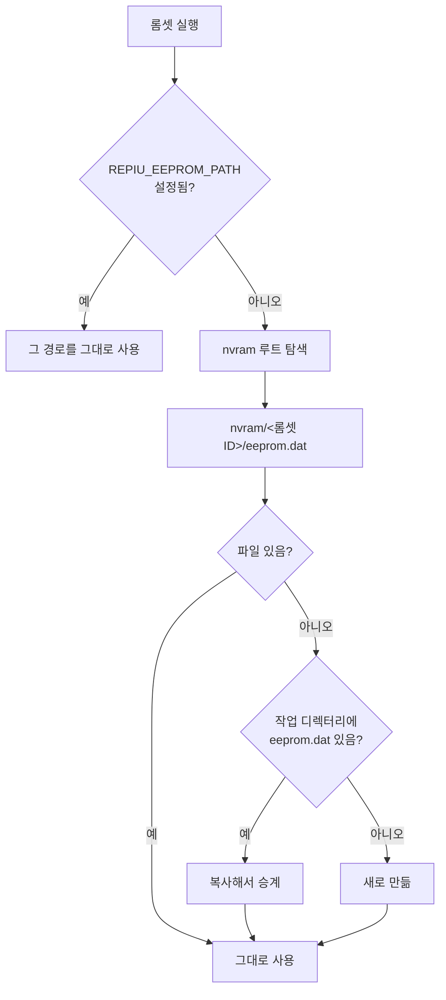
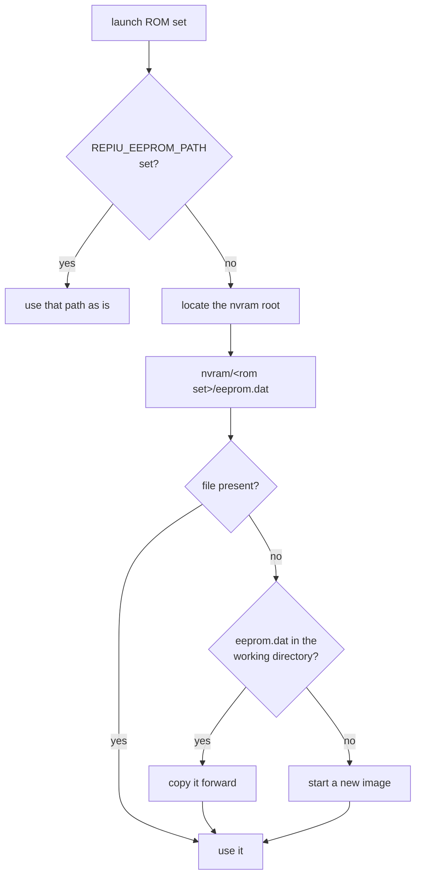

# 20260821-498 롬셋별 NVRAM 저장 설계 / Per-ROM-set NVRAM storage design

## 한국어

### 1. 목적

93C46 EEPROM 이미지를 MAME와 같은 방식으로 롬셋별 디렉터리에 저장한다.

```
nvram/pumpit1/eeprom.dat
nvram/pumpipx3/eeprom.dat
```

### 2. 현재 상태와 문제

`src/platform/win32/io/port_io_emulator.cpp`의 `EepromBackingPath()`는 작업 디렉터리의
`eeprom.dat` **한 파일**을 반환한다. 롬셋이 22개인데 EEPROM 이미지는 하나뿐이므로,
`pumpit1`에서 저장한 캐비닛 설정이 `pumpipx3`에도 그대로 보인다. 게임마다 EEPROM 레이아웃과
의미가 다르므로 이는 실기와 다르고, 한 타이틀에서 만든 설정이 다른 타이틀을 오염시킨다.

MAME는 `nvram/<machine>/` 아래에 장치별 파일을 둔다. 같은 구조를 따른다.

### 3. 경로 결정



* `REPIU_EEPROM_PATH`는 **전체 경로 오버라이드**로 유지한다. `scripts/benchmark_*.ps1`과
  `docs/guides/`의 측정 절차가 실행별 EEPROM 격리에 쓰고 있으므로 의미를 바꾸면 안 된다.
* `nvram` 루트 탐색 순서는 `cfg`와 같다. `REPIU_NVRAM_DIR` → 작업 디렉터리의 `nvram` →
  실행 파일 옆의 `nvram`. 없으면 작업 디렉터리 아래에 만든다.
* `rom_set_id`가 빈 프로파일(`dos4gw_hello`, `direct_executable`)은 롬셋이 아니므로 기존처럼
  작업 디렉터리의 `eeprom.dat`를 쓴다.

### 4. 기존 파일 승계

`nvram/<롬셋>/eeprom.dat`가 없고 작업 디렉터리에 `eeprom.dat`가 있으면 **한 번 복사한다.**

이전까지는 모든 롬셋이 그 파일 하나를 공유했으므로, 지금 실행하는 롬셋의 EEPROM 상태는 바로
그 파일에 들어 있다. 승계하지 않으면 사용자가 지금까지 맞춰 둔 캐비닛 설정이 조용히 초기화된다.

* 원본은 지우지 않는다. 되돌릴 여지를 남긴다.
* 복사는 대상이 없을 때만 한 번 일어난다. 그 뒤로는 롬셋별 파일이 정본이다.
* 여러 롬셋을 돌리면 각자 같은 시작점에서 갈라진다. 공유 파일 하나였을 때의 상태를 각 롬셋이
  물려받는 것이므로 이것이 의도한 동작이다.
* 복사 실패는 경고만 남기고 계속한다. EEPROM은 없으면 `0xFFFF`로 초기화되므로 치명적이지 않다.

### 5. 디렉터리 생성 시점

`Eeprom93c46`의 생성자는 `Load()`를 호출하고, 파일이 열리지 않으면 그 자리에서 `Save()`로
새 이미지를 쓴다. `Save()`는 `std::ofstream`이므로 **상위 디렉터리가 없으면 조용히 실패한다.**

따라서 경로를 결정하는 쪽이 디렉터리를 먼저 만들어야 한다. 이 순서를 어기면 EEPROM이 매 실행
초기화되면서 아무 오류도 남지 않는다.

### 6. 코드 배치

| 파일 | 책임 | 계층 |
|---|---|---|
| `include/repiu/storage/nvram_path.h`, `src/storage/nvram_path.cpp` | nvram 루트 탐색, 롬셋별 경로 결정, 디렉터리 생성, 기존 파일 승계 | 중립 |
| `src/platform/win32/io/port_io_emulator.{h,cpp}` | 결정된 경로를 EEPROM 백엔드에 주입 | win32 |
| `src/host/win32/main.cpp` | 시작 시 1회 해석하고 로그 | 통합 |

`src/storage/`는 게스트가 남기는 영속 상태의 호스트 경로 정책을 두는 자리다. 설정 파일은
사용자가 쓰고 프로그램이 읽는 반면 NVRAM은 게스트가 쓰고 게스트가 읽으므로, `repiu::config`와
분리한다. 이후 다른 영속 상태(세이브, 통계)가 생기면 같은 디렉터리에 둔다.

주입은 `SetEepromBackingPath()` 하나다. `g_eeprom`은 첫 EEPROM 접근에서 지연 생성되므로,
설정은 게스트 실행 전에 끝나야 한다. 이미 생성된 뒤의 호출은 무시하고 경고한다.

### 7. 검증

`repiu_aot_probe --nvram-path` probe를 추가한다.

1. `REPIU_EEPROM_PATH`가 다른 모든 규칙을 이긴다
2. 롬셋 경로가 `nvram/<롬셋>/eeprom.dat`로 만들어지고 디렉터리가 실제로 생성된다
3. 기존 파일 승계: 원본 내용이 그대로 복사되고 원본이 남는다
4. 대상이 이미 있으면 승계하지 않는다
5. `rom_set_id`가 비면 기존 `eeprom.dat` 경로를 쓴다
6. 롬셋이 다르면 경로가 다르다

### 8. 범위 밖

* MAME와 파일 이름까지 같게 맞추지는 않는다. MAME는 장치 태그를 파일명으로 쓰지만 여기서는
  `eeprom.dat`를 유지한다. 기존 이미지와 형식이 같아 승계가 그대로 가능하기 때문이다.
* EEPROM 내용 자체의 해석과 초기값은 바꾸지 않는다.

---

## English

### 1. Objective

Store the 93C46 EEPROM image in a per-ROM-set directory the way MAME does.

```
nvram/pumpit1/eeprom.dat
nvram/pumpipx3/eeprom.dat
```

### 2. Current state and the problem

`EepromBackingPath()` in `src/platform/win32/io/port_io_emulator.cpp` returns a single
`eeprom.dat` in the working directory. There are 22 ROM sets and one EEPROM image, so
cabinet settings saved under `pumpit1` are also what `pumpipx3` reads back. EEPROM layout
and meaning differ per title, so this does not match real hardware and lets one title's
settings contaminate another's.

MAME keeps per-device files under `nvram/<machine>/`. This follows the same structure.

### 3. Path resolution



* `REPIU_EEPROM_PATH` stays a **full-path override**. `scripts/benchmark_*.ps1` and the
  measurement procedures in `docs/guides/` rely on it to isolate the EEPROM per run, so its
  meaning must not change.
* The `nvram` root is located the same way as `cfg`: `REPIU_NVRAM_DIR`, then `nvram` under
  the working directory, then `nvram` next to the executable. If none exists, the
  working-directory one is created.
* Profiles with an empty `rom_set_id` (`dos4gw_hello`, `direct_executable`) are not ROM
  sets and keep using `eeprom.dat` in the working directory.

### 4. Carrying the existing file forward

When `nvram/<rom set>/eeprom.dat` is absent and `eeprom.dat` exists in the working
directory, it is **copied once**.

Every ROM set shared that one file until now, so the EEPROM state for whichever set is
being launched is exactly what that file holds. Without the copy, the cabinet settings a
user has built up would silently reset.

* The original is not deleted, leaving a way back.
* The copy happens only when the destination is missing, once. After that the per-ROM-set
  file is authoritative.
* Running several ROM sets makes each diverge from the same starting point. That is
  intended: each inherits the state the single shared file held.
* A failed copy warns and continues. A missing EEPROM initializes to `0xFFFF`, so this is
  not fatal.

### 5. When the directory is created

`Eeprom93c46`'s constructor calls `Load()`, and when the file will not open it writes a
fresh image through `Save()` right there. `Save()` uses `std::ofstream`, which **fails
silently when the parent directory does not exist.**

Whatever resolves the path must therefore create the directory first. Getting that order
wrong resets the EEPROM on every run and reports nothing.

### 6. Code layout

| File | Responsibility | Layer |
|---|---|---|
| `include/repiu/storage/nvram_path.h`, `src/storage/nvram_path.cpp` | nvram root discovery, per-ROM-set path, directory creation, carrying the legacy file forward | neutral |
| `src/platform/win32/io/port_io_emulator.{h,cpp}` | Inject the resolved path into the EEPROM backend | win32 |
| `src/host/win32/main.cpp` | Resolve once at startup and log | integration |

`src/storage/` is where host path policy for guest-written persistent state lives. A config
file is written by the user and read by the program, while NVRAM is written and read by the
guest, so it is kept apart from `repiu::config`. Later persistent state such as saves or
statistics belongs in the same directory.

Injection is the single `SetEepromBackingPath()`. `g_eeprom` is created lazily on the first
EEPROM access, so the path must be set before the guest runs; a call after construction is
ignored with a warning.

### 7. Verification

Add a `repiu_aot_probe --nvram-path` probe.

1. `REPIU_EEPROM_PATH` beats every other rule
2. The ROM-set path resolves to `nvram/<rom set>/eeprom.dat` and the directory really is
   created
3. Legacy carry-forward: the original content is copied and the original remains
4. No carry-forward when the destination already exists
5. An empty `rom_set_id` keeps the old `eeprom.dat` path
6. Different ROM sets resolve to different paths

### 8. Out of scope

* File names are not matched to MAME's. MAME uses the device tag as the file name; this
  keeps `eeprom.dat` because the format is identical to the existing image, which is what
  makes carrying it forward possible.
* The EEPROM contents and their initial values are unchanged.
