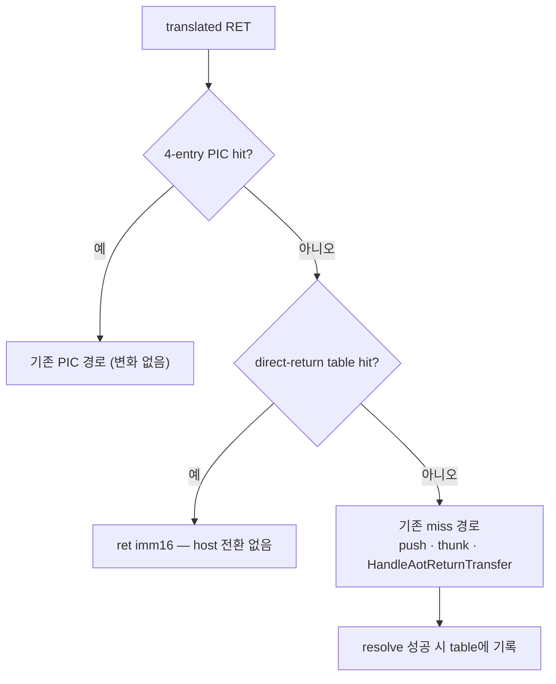

# Megamorphic direct-return table 설계

## 배경

[Task 482 pass 2](../analysis/aot-dbt-return-miss-dispatch.md)가 pumpit8 3회 실행에서
확인한 사실입니다.

* return 처리는 계측을 뺀 실비용으로 `guest-run`의 **약 27%**입니다. 기존 `kAotReturn`
  bucket(25.6~26.2%)은 `HandleAotReturnTransfer` 안만 재므로 adapter 구간이 빠져 있었고,
  실제 outer 창은 35.8~36.4%입니다.
* return 하나는 약 1,120~1,140 cycle이고 **지배적인 단계가 없습니다** — `resolve` 31.7%,
  `patch` 27.5%, `entry` 25.1%, `read` 8.3%, `continuation` 7.3%.
* 정책 관측의 **99.39~99.41%가 megamorphic bypass**입니다. 즉 거의 모든 return이 4-entry
  PIC로 수렴하지 못하는 site에서 발생하며, 그 return이 결국 하는 일은
  **guest target → cache target 조회 하나**입니다. 그 조회 자체
  (`ResolveAotTransferTarget`)는 호출당 221~226 cycle이고, 거기 도달하고 돌아오는 데 약
  900 cycle을 더 씁니다.

Task 481은 패치 **행위**를 없앴지만 host 왕복 자체는 남겼습니다. 이 설계는 그 왕복을
없앱니다.

## 결정

### 1. 무엇을 만드는가

megamorphic return이 host로 넘어가기 전에, **생성 코드가 직접 읽는 평평한 memo
table**에서 guest target → cache target을 찾습니다. 적중하면 host 전환 없이 그대로
return하고, 실패하면 **기존 경로가 한 바이트도 바뀌지 않은 채** 이어집니다.



### 2. 정확성 논거 — 새 불변식을 만들지 않습니다

**table 적중은 4-entry PIC 적중과 의미가 완전히 같습니다.** PIC 적중도 host를 거치지
않고, `aot_call_depth` bookkeeping·telemetry·`aot_reentry_pending`·trap flag 정리를 모두
건너뜁니다. 이 설계는 "같은 판단을 더 넓은 자료구조에서 한다"일 뿐이므로, 검증해야 할
것은 **table 항목이 PIC 항목과 같은 조건에서만 살아 있는가** 하나입니다.

따라서 규칙은 둘뿐입니다.

1. **삽입 조건.** host 경로가 `ResolveAotTransferTarget`으로 이미 검증한 결과만 넣습니다.
   HLE 경계·quarantine·비게스트·zero target은 애초에 resolve에서 걸러지므로 table에
   들어가지 않습니다. Glide gate direct target과 dynamic translation 결과는 **의도적으로
   제외**합니다 — 안정된 평범한 다수만 memo합니다.
2. **무효화 조건.** guest→cache 대응이 바뀔 수 있는 유일한 지점은 page retirement와
   quarantine이며, 이는 이미 `ResetInlineCacheGuardsTargetingPage`가 PIC guard를
   되돌리는 바로 그 지점입니다. 같은 자리에서 **table 전체를 지웁니다.**

**경합이 없는 이유.** 삽입은 return handler 안에서 일어나므로 게스트 스레드 단독입니다.
무효화는 worker 스레드에서 일어나지만, `RequestWin32AotGuestPageRetirement`가
`WaitForSingleObject(..., INFINITE)`로 **게스트 스레드를 정지시킨 채** 요청하므로 그동안
캐시 코드는 실행되지 않습니다. 따라서 lock-free 자료구조나 generation stamp가 필요
없습니다.

### 3. 자료구조

direct-mapped 배열 하나이며 site별이 아니라 **전역 공용**입니다. 같은 target으로 돌아가는
서로 다른 site들이 같은 항목을 재사용합니다.

```
struct AotDirectReturnEntry { uint32 guest_key; uint32 cache_target; };  // 8 B
```

* 크기는 2의 거듭제곱이고 `REPIU_AOT_DIRECT_RETURN_TABLE_BITS`로 8~18을 줍니다.
  **기본값은 15비트(32,768 항목)입니다** — 설계 당시 잡았던 13비트는 pumpit8 실측에서
  삽입의 98.7%가 덮어쓰기일 만큼 thrash했고, 15비트에서 같은 장면의 덮어쓰기가 33건으로
  떨어졌습니다([작업 로그 3.2절](../work-logs/20260822-499-megamorphic-direct-return-table.md)).
* `guest_key == 0`이 빈 항목입니다. guest 주소 0은 애초에 병리적이므로
  ([Task 245 zero-return 증거](../analysis/aot-return-stack-divergence.md)) 겸용해도
  손실이 없고, target 0은 계속 host로 내려가 기존 증거 덤프를 남깁니다.
* 충돌은 **덮어씁니다.** 체이닝도 재해싱도 하지 않습니다 — 실패는 곧 기존 경로이고,
  기존 경로는 정확합니다.
* 해시는 `(g ^ (g >> 13)) & mask`입니다. 생성 코드에서 네 명령입니다.

### 4. 생성 코드

기존 miss 지점(`miss_cache_offset`)에서 **기존 시퀀스 앞에** 삽입합니다. 실패하면 그대로
아래로 떨어지므로 기존 바이트는 이동만 하고 내용은 그대로입니다.

```
miss_cache_offset:            ; [esp]=flags(사이트 진입 시 pushfd), [esp+4]=guest return
    push eax
    push ecx
    mov  eax, [esp+12]        ; guest target
    mov  ecx, eax
    shr  ecx, 13
    xor  ecx, eax
    and  ecx, MASK            ; 배치 시 패치
    cmp  [TABLE + ecx*8], eax ; 배치 시 패치된 절대 주소
    jne  .miss
    mov  ecx, [TABLE + ecx*8 + 4]
    mov  [esp+12], ecx        ; guest return 슬롯을 cache target으로 덮어씀
    pop  ecx
    pop  eax
    popfd
    ret  imm16                ; 원본 RET과 같은 스택 효과
.miss:
    pop  ecx
    pop  eax
    popfd                     ; (이하 기존 시퀀스 그대로)
    push miss_address
    push guest_source
    jmp  thunk
```

**설계상 중요한 세부 둘.**

* 적중 시 결과를 **스택 슬롯**으로 전달하고 `ret`으로 점프합니다. 전역 스크래치 변수를
  쓰면 host가 비동기로 주입하는 타이머 인터럽트(Task 294)가 그 사이에 끼어들어 값을 덮을
  수 있습니다. 스택으로 넘기면 그 위험이 원천적으로 없습니다.
* 마지막 `ret imm16`은 **원본 명령의 스택 효과 그대로**입니다(`C3` 또는 `C2 iw`). 이미
  `success_cache_offset`이 쓰는 것과 같은 기법입니다.

`TABLE` 절대 주소와 `MASK`는 `timer_safe_point_sites`의 `request_address_offset`과 같은
방식으로 배치 시점에 패치하고, 동적 append 때 offset을 재보정합니다.

### 5. 비용과 상한

적중 경로는 14개 명령이고 메모리 접근은 table 한 줄과 스택뿐입니다. 대략 20~40 cycle로
보며, 대체하는 것은 약 1,120 cycle(계측 제외)입니다. 적중률을 h라 하면 상한은
`27% × h × (1 − 30/1120)` ≈ `26% × h`입니다. h가 0.9면 `guest-run`의 약 23%,
0.5여도 약 13%입니다.

코드 크기는 site당 약 45바이트 늘어납니다(pumpit8 return site 7,603개 → 약 330 KiB).
**실행되는 것은 megamorphic site뿐**이므로 I-cache 압력은 코드 크기가 아니라 실제
적중 site 수에 비례합니다.

### 6. 기본값과 검증

`REPIU_AOT_DIRECT_RETURN_TABLE`은 도입 시점에 opt-in이었고, **A/B 통과 후 기본 ON으로
승격**했습니다(`ResolvePromotedToggle`: 미설정은 ON, 명시적 `0|off|false`만 OFF).
꺼져 있으면 생성 코드에 probe 자체를 emit하지 않으므로 캐시 바이트가 기능 도입 전과
동일합니다 — 대조군이 진짜 대조군입니다.

승격은 [return stage 귀속 가이드](../guides/return-stage-attribution.md)의 판정 규칙을
따릅니다: 같은 구간 3회, 프레임당 패치·primitive 3% 이내, cycle당 swap과 cycle당
primitive가 같은 방향.

## 범위 밖

* indirect call/jump inline cache — return 경로만 다룹니다.
* Glide gate direct target과 dynamic translation 결과의 memo화.
* PIC 항목 수(`kInlineCacheEntryCount = 4`) 변경.

---

# Megamorphic Direct-Return Table Design

## Background

[Task 482 pass 2](../analysis/aot-dbt-return-miss-dispatch.md) established, across three pumpit8
runs, that return handling costs about **27% of `guest-run`** once the instrument's own overhead
is excluded — the old `kAotReturn` bucket measured only the inside of `HandleAotReturnTransfer`
and missed the adapter entirely. One return costs about 1,120-1,140 cycles with **no dominant
stage** (`resolve` 31.7%, `patch` 27.5%, `entry` 25.1%, `read` 8.3%, `continuation` 7.3%), and
**99.39-99.41% of policy observations are megamorphic bypasses**. Nearly every return therefore
happens at a site that cannot converge on a 4-entry PIC, and all it ultimately does is map one
guest target to one cache target — a lookup that costs 221-226 cycles inside
`ResolveAotTransferTarget`, wrapped in about 900 cycles of getting there and back. Task 481
removed the patching but kept the round trip; this design removes the round trip.

## Decisions

**What is built.** Before a megamorphic return crosses to the host, generated code probes a flat
memo table mapping guest target to cache target. A hit returns without any host transition; a
miss falls through into the existing path with not one byte of it changed.

**Why it is correct.** A table hit is semantically identical to a 4-entry PIC hit: the PIC hit
also skips the host, the call-depth bookkeeping, the telemetry, `aot_reentry_pending`, and the
trap-flag cleanup. This design does the same judgement over a wider structure, so the only new
obligation is that a table entry lives exactly as long as a PIC entry would. That reduces to two
rules. Insert only results the host already validated through `ResolveAotTransferTarget`, which
means HLE-boundary, quarantined, non-guest, and zero targets never enter, and deliberately
exclude Glide-gate direct targets and dynamic-translation results so only the stable ordinary
majority is memoized. And invalidate at the one place where a guest-to-cache mapping can change —
page retirement and quarantine — which is exactly where `ResetInlineCacheGuardsTargetingPage`
already resets PIC guards; the whole table is cleared there.

**Why there is no race.** Insertion happens inside the return handler, on the guest thread alone.
Invalidation runs on the worker thread, but `RequestWin32AotGuestPageRetirement` blocks the guest
thread on `WaitForSingleObject(..., INFINITE)` for the duration, so no cache code executes while
the table is cleared. No lock-free structure and no generation stamp are required.

**Structure.** One global direct-mapped array of `{guest_key, cache_target}` pairs, shared across
sites so different sites returning to the same target reuse one entry. It is a power of two,
tunable from 8 to 18 bits through
`REPIU_AOT_DIRECT_RETURN_TABLE_BITS` and defaulting to fifteen (32,768 entries) after measurement
showed the design's original thirteen thrashing at 98.7% overwrites on pumpit8. A `guest_key` of zero marks an empty slot, which costs
nothing because a zero guest target is pathological anyway and still descends to the host for its
existing evidence dump. Collisions overwrite: there is no chaining and no rehashing, because
failure simply means the existing path, and the existing path is correct. The hash is
`(g ^ (g >> 13)) & mask`, four instructions in generated code.

**Generated code.** The probe is emitted at `miss_cache_offset`, ahead of the existing sequence,
so a miss falls straight through and the existing bytes move but do not change. Fourteen
instructions: save `eax`/`ecx`, load the guest target from the stack, hash, compare the key,
load the cache target, overwrite the guest return slot with it, restore, `popfd`, and `ret imm16`
with the original instruction's own stack effect. Two details matter. The result travels through
a **stack slot** rather than a global scratch variable, because the host injects timer interrupts
asynchronously (Task 294) and could otherwise overwrite a global between the store and the jump.
And the closing `ret imm16` reuses the same technique `success_cache_offset` already uses. The
table's absolute address and mask are patched at placement exactly as
`timer_safe_point_sites.request_address_offset` is, and re-offset on dynamic append.

**Cost and ceiling.** The hit path touches one table line and the stack, an estimated 20-40
cycles against about 1,120. With hit rate h the ceiling is roughly `26% × h` of `guest-run`:
about 23% at h=0.9 and still about 13% at h=0.5. Code grows about 45 bytes per return site
(roughly 330 KiB for pumpit8's 7,603 sites), but only megamorphic sites ever execute it, so
instruction-cache pressure follows the number of hot sites rather than the code size.

**Default and validation.** `REPIU_AOT_DIRECT_RETURN_TABLE` started opt-in and was **promoted to
on by default after the A/B passed** (`ResolvePromotedToggle`: unset means on, and only an explicit
`0|off|false` opts out). While off, the probe is not emitted at all, so the cache bytes are
identical to a build without the feature and the control arm is a true control. Promotion follows the judging rule in the
[return-stage attribution guide](../guides/return-stage-attribution.md): the same section three
times, per-frame patches and primitives within 3%, and swaps per cycle and primitives per cycle
moving the same way.

## Out of scope

Indirect call and jump inline caches, memoizing Glide-gate or dynamic-translation results, and
any change to `kInlineCacheEntryCount`.
