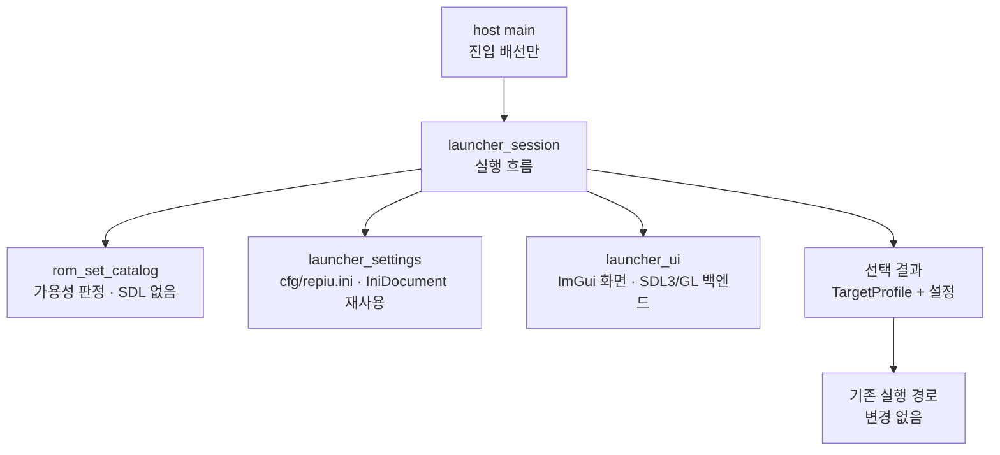

# 런처 GUI 설계

## 배경

지금 `repiu`는 인자가 없으면 `pumpit1`을 바로 띄웁니다
([main.cpp](../../src/host/win32/main.cpp)의 `SelectTargetProfile`). 롬셋은 22개이고
([target_profile.cpp](../../src/platform/../target/target_profile.cpp)), 어떤 것이 실제로
실행 가능한지는 `roms/`를 직접 뒤져야 알 수 있습니다. 옵션은 전부 환경 변수라 캐비닛에서
바꿀 방법이 없습니다.

목표는 셋입니다.

1. 인자 없이 실행하면 사용 가능한 롬셋을 나열하고 선택하면 실행한다.
2. 운영자가 바꿀 만한 옵션을 GUI에서 고르고 저장한다.
3. Linux 이식을 막지 않는 구조로 만든다.

## 결정 1: 네이티브 GUI가 아니라 창 안에 직접 그립니다

**라이선스가 사실상 결정합니다.** AGENTS는 GPL·LGPL·AGPL을 금지하는데, 리눅스에서 쓸 만한
크로스플랫폼 네이티브 툴킷은 Qt(LGPLv3/상용), GTK(LGPL), wxWidgets·FLTK(LGPL 파생)로 전부
그 계열입니다. 피하려면 Win32와 X11/Wayland를 각각 직접 구현해야 하고, 이는 같은 화면을
두세 번 만드는 일입니다.

**이미 SDL3와 OpenGL 컨텍스트를 띄우고 있습니다.**
[glide_opengl_backend.cpp](../../src/platform/win32/glide_opengl_backend.cpp)가 SDL3
(vendored 3.4) 창을 만듭니다. 같은 스택에 그리면 새 플랫폼 의존성이 0이고 두 OS의 동작이
구조적으로 같아집니다.

**캐비닛에는 키보드와 마우스가 없습니다.** 런처는 발판과 캐비닛 버튼으로 조작할 수 있어야
합니다. 창 안 UI는 기존 JAMMA·키 바인딩 계층(Tasks 496·497)을 그대로 쓸 수 있지만 네이티브
대화상자는 그럴 수 없습니다.

**같은 레이어가 나중에 인게임 OSD가 됩니다.** 네이티브 런처 창은 OSD가 될 수 없습니다.

네이티브가 유리한 축(HiDPI, IME, 접근성, 파일 선택창)은 이 범위에 거의 영향이 없고, 파일
선택이 필요해지면 SDL3의 `SDL_dialog.h`로 그 부분만 네이티브 대화상자를 띄울 수 있습니다.

## 결정 2: Dear ImGui (MIT)를 FetchContent로 가져옵니다

SDL3·minimp3·spdlog와 같은 방식으로 태그를 고정해 가져오고, ImGui 자체에는 CMake 타깃이
없으므로 코어 소스와 `imgui_impl_sdl3` · `imgui_impl_opengl3` 백엔드만 모아 정적
라이브러리 타깃 하나를 만듭니다. 라이선스는 MIT이므로 정책에 걸리지 않으며
`THIRD_PARTY_NOTICES.md`에 항목을 추가합니다.

직접 그리는 방식은 텍스트 렌더링·레이아웃·포커스 이동·스크롤을 전부 만들어야 해서 범위가
과도합니다. 첫 버전은 ImGui 기본 테마를 씁니다 — 도구 느낌이지만 동작이 먼저이고, 테마는
나중에 같은 레이어 위에서 바꿀 수 있습니다.

## 결정 3: 코드 배치는 플랫폼 공용을 먼저 둡니다



* `include/repiu/launcher/rom_set_catalog.h` · `src/launcher/rom_set_catalog.cpp` —
  내장 프로필 22개를 훑어 각 롬셋의 **가용성과 사유**를 만듭니다. `std::filesystem`만
  쓰고 SDL·ImGui에 의존하지 않으므로 probe가 직접 검증할 수 있습니다.
* `include/repiu/launcher/launcher_settings.h` · `src/launcher/launcher_settings.cpp` —
  `cfg/repiu.ini` 읽기·쓰기. 기존 [`IniDocument`](../../include/repiu/config/ini_document.h)를
  재사용합니다.
* `src/launcher/launcher_ui.cpp` — ImGui 화면. SDL3와 OpenGL만 쓰므로 플랫폼 공용에
  둡니다. Win32 전용 코드가 필요해지면 그때 분리합니다.
* host `main.cpp`에는 "인자가 없으면 런처를 돌리고 결과를 받는다"는 배선만 남깁니다.

## 결정 4: 진입 규칙은 기존 동작을 깨지 않습니다

| 실행 | 동작 |
|---|---|
| `repiu` | **런처를 띄웁니다** (새 동작). 게임이 끝나면 **런처로 복귀** |
| `repiu <romset>` | 지금과 동일. 게임이 끝나면 **완전 종료** |
| `repiu <path/to/PIU.EXE>` | 지금과 동일. 게임이 끝나면 **완전 종료** |
| `REPIU_LAUNCHER=0` + 인자 없음 | 런처를 건너뛰고 기존 기본값(`pumpit1`), 완전 종료 |

**복귀 루프는 단독 실행에만 있습니다.** 인자가 하나라도 있으면 `LauncherRequested()`가 즉시
false를 돌려주므로 런처 블록 자체를 지나가지 않습니다. 런처가 띄우는 자식도 롬셋을 인자로
받으므로 **자식 자신은 완전 종료**하고, 그 종료를 부모가 받아 목록을 다시 보여줍니다. 즉
게임을 실행하는 프로세스에는 루프가 없습니다.

루프에는 한 가지 함정이 있습니다. 설정을 환경 변수로 게시하므로 **첫 실행 이후에는 우리가
게시한 변수가 "호출자가 설정한 변수"처럼 보입니다.** 그대로 두면 두 번째 실행부터 런처에서
바꾼 값이 반영되지 않습니다. 그래서 호출자의 환경 상태를 **루프 진입 전에 한 번만 캡처**해
그 스냅샷으로 우선순위를 판단합니다.

`REPIU_LAUNCHER`는 opt-out입니다. 자동화가 인자 없이 부르는 경우를 위해 남깁니다.

**선택 후에는 새 프로세스로 실행합니다. (2026-08-22 정정)**

처음에는 "런처 창을 정리한 뒤 같은 프로세스에서 기존 실행 경로에 들어간다"로 결정했고,
그 이유는 자식 프로세스의 경로·환경 변수 문제를 피하는 것이었습니다. **첫 실행에서 이
결정이 틀렸음이 드러났습니다.**

```
Win32 host first blocking block base: 0x00010000 size: 0x00003000 MEM_COMMIT
Win32 reservation error: 487 (VirtualAlloc MEM_RESERVE 실패)
Win32 relocated base candidate 0x01000000 ~ 0x09000000: 전부 occupied
Failed to reserve an available relocated image base
```

런처는 화면을 그리려면 GPU 드라이버를 로드해야 하는데, 그 드라이버가 게스트가 claim해야
할 저주소 공간을 선점합니다. **게스트 주소 공간은 어떤 드라이버보다 먼저 확보되어야
하므로 "먼저 그리고 나중에 실행"과는 순서가 근본적으로 충돌합니다.** 예약을 런처보다 앞으로
당기는 방법도 있지만, relocated image 후보 대역까지 미리 붙잡아야 하고 드라이버가 원하는
주소를 우리가 보장할 수 없어 취약합니다.

따라서 고른 롬셋을 **주소 공간이 온전한 새 프로세스**에서 실행합니다. 자식은 롬셋 id를
인자로 받으므로 런처를 다시 열지 않고, 환경 변수를 상속하므로 방금 게시한 설정이 그대로
적용되며, 로거가 stderr에 쓰고 핸들이 상속되므로 리다이렉트한 로그에 부모와 자식 출력이
함께 남습니다. 명령줄 인용은
`BuildLauncherChildCommandLine`으로 분리해 probe가 검증합니다 — 설치 경로에 공백이 있을 때
조용히 깨지는 고전적인 지점이기 때문입니다.

## 결정 5: 가용성은 싸게 판정하고 사유를 보여줍니다

[`PreparePiuChdMount`](../../src/assets/piu_chd_mount.cpp)와 **같은 규칙**을 쓰되 추출은
하지 않습니다.

* `roms/<id>.zip`이 있고 PIU10 필수 엔트리를 담고 있는가
* `roms/<id>/`에 CHD가 정확히 하나 있는가

상태는 `실행 가능` / `ZIP 없음` / `ZIP에 필수 엔트리 없음` / `CHD 없음` / `CHD 중복`으로
구분하고 목록에 사유를 그대로 보여줍니다. 무결성 전체 검사는 하지 않습니다 — 느리고,
실제 판단은 실행 시점의 mount가 이미 합니다. 부모 롬셋도 함께 표시합니다.

## 결정 6: 첫 버전 옵션은 운영자용으로 제한합니다

| 항목 | 저장 키 | 비고 |
|---|---|---|
| 창 크기 | `[Video] window_width/height` | |
| 전체화면 | `[Video] fullscreen` | |
| vsync | `[Video] swap_interval` | 기존 `REPIU_GLIDE_SWAP_INTERVAL`과 같은 의미 |
| 사운드 게인 | `[Audio] ymz_volume` | 기존 `REPIU_YMZ_VOLUME`과 같은 의미 |
| 마지막 선택 롬셋 | `[Launcher] last_rom_set` | 다음 실행에서 커서 위치 |

**환경 변수가 설정돼 있으면 환경 변수가 이깁니다.** 진단 절차와 벤치마크 스크립트가 환경
변수로 동작하므로 그 우선순위를 깨면 안 됩니다. 실행 backend·direct-return table 같은 진단
토글은 첫 버전에서 노출하지 않습니다.

## 결정 7: 입력은 SDL 이벤트로 시작합니다

첫 버전은 키보드·마우스·게임패드(SDL이 주는 그대로)로 조작합니다. 발판 입력은 게스트가
실행 중일 때 PIUIO 포트로 들어오는 것이라 런처 단계에서는 경로가 다릅니다. 캐비닛 발판으로
런처를 조작하는 것은 별도 작업으로 두되, `rom_set_catalog`와 `launcher_settings`가 UI와
분리돼 있으므로 입력 경로만 바꾸면 됩니다.

## 범위 밖

* 인게임 OSD, 일시정지 메뉴
* 커스텀 테마와 폰트 자산
* 입력 리맵 UI (`cfg/<롬셋>.ini`가 이미 담당)
* CHD 무결성 전체 검사
* 발판으로 런처 조작

## 검증

* `rom_set_catalog`는 합성 디렉터리로 각 상태를 만들어 probe가 검증합니다.
* `launcher_settings`는 왕복(쓰고 다시 읽기), 없는 파일, 잘못된 값, 환경 변수 우선순위를
  probe가 검증합니다.
* 화면 자체는 자동 검증이 어렵습니다. 사용자 실행으로 목록 표시와 선택 실행을 확인합니다.
* 인자를 준 실행이 지금과 **동일한 경로**를 타는지 회귀 확인합니다.

---

# Launcher GUI Design

## Background

`repiu` currently launches `pumpit1` when given no arguments, the catalog holds 22 ROM sets, and
knowing which of them can actually run means inspecting `roms/` by hand. Every option is an
environment variable, so nothing can be changed from a cabinet. This design adds a launcher that
lists the ROM sets with their availability, runs the selected one, and exposes the options an
operator would change — without blocking a Linux port.

## Decision 1: draw inside our own window rather than use a native toolkit

Licensing effectively decides this. AGENTS forbids GPL, LGPL, and AGPL, and the viable
cross-platform native toolkits are all in that family: Qt (LGPLv3/commercial), GTK (LGPL), and
wxWidgets and FLTK (LGPL derivatives). Avoiding them means implementing the same screen separately
against Win32 and X11/Wayland.

Meanwhile the host already creates an SDL3 window and an OpenGL context for Glide output, so
drawing there adds no new platform dependency and makes both operating systems behave the same by
construction. It also matters that cabinets have no keyboard or mouse: a launcher must eventually
be drivable from the panels, which an in-window UI can do through the existing JAMMA and key
binding layers and a native dialog cannot. Finally, the same layer becomes the in-game OSD later,
which a separate native window never could.

Where native would win — HiDPI, IME, accessibility, file pickers — barely applies to picking one of
22 ROM sets, and SDL3's `SDL_dialog.h` can raise a native file dialog for that one case if needed.

## Decision 2: Dear ImGui, fetched like the other dependencies

ImGui is MIT, so it clears the license policy, and it ships official SDL3 and OpenGL3 backends that
match the existing stack. It is fetched with a pinned tag exactly as SDL3, minimp3, and spdlog are,
and because it has no CMake target of its own, one small static library target collects its core
sources and the two backends. `THIRD_PARTY_NOTICES.md` gains an entry. Hand-rolling the UI would
mean writing text rendering, layout, focus traversal, and scrolling, which is out of proportion to
the feature; the first version uses the default theme, and theming stays possible on the same layer.

## Decision 3: platform-neutral first

`rom_set_catalog` derives availability and a reason for every built-in profile using only
`std::filesystem`, so a probe can verify it without SDL. `launcher_settings` reads and writes
`cfg/repiu.ini` through the existing `IniDocument`. `launcher_ui` holds the ImGui screen and touches
only SDL3 and OpenGL, so it also lives in the platform-neutral tree until something genuinely
Win32-specific appears. The host `main.cpp` keeps only the wiring: run the launcher when there are
no arguments, then continue with what it returned.

## Decision 4: existing invocations are untouched

`repiu` with no arguments opens the launcher; `repiu <romset>` and `repiu <path>` behave exactly as
today; and `REPIU_LAUNCHER=0` skips the launcher and restores the old `pumpit1` default for
automation that invokes the binary bare.

**Corrected on 2026-08-22:** this originally continued in the same process after releasing the
launcher window, to avoid child-process path and environment plumbing. The first real run proved
that wrong. Drawing anything requires loading a GPU driver, and that driver claims the low address
space the guest must reserve: the fixed reservation at `0x00010000` was blocked by a committed
12 KiB block and every relocated-image candidate from `0x01000000` through `0x09000000` was
occupied. The guest address space has to be claimed before any driver loads, which cannot be
reconciled with drawing first, so the selection now runs in a fresh process. The child takes the
ROM set as its argument so it never reopens the launcher, inherits the environment the launcher
just published, and inherits stderr so a redirected log holds both processes' output. Command-line
quoting is factored into `BuildLauncherChildCommandLine` and probed, because an installation path
containing a space is the classic way this breaks outside a developer's tree.

## Decision 5: cheap availability with a stated reason

The catalog applies the same rules `PreparePiuChdMount` uses — a `roms/<id>.zip` containing the
required PIU10 entries and exactly one CHD under `roms/<id>/` — without extracting anything. Each
row reports runnable, missing zip, missing entries, missing CHD, or multiple CHDs, alongside the
parent ROM set. Full integrity verification is deliberately absent: it is slow, and the real
judgement already happens in the mount at launch.

## Decision 6: operator options only, with environment variables still winning

The first version stores window size, fullscreen, swap interval, sound gain, and the last selected
ROM set in `cfg/repiu.ini`. An environment variable, when set, overrides the stored value, because
the diagnostic procedures and benchmark scripts depend on that precedence. Diagnostic toggles such
as the execution backend or the direct-return table are not exposed yet.

## Decision 7: SDL input to begin with

The first version is driven by keyboard, mouse, and whatever gamepad SDL reports. Panel input
arrives over PIUIO ports while the guest runs, which is a different path, so driving the launcher
from the cabinet panels is a separate task — made straightforward by keeping the catalog and
settings independent of the UI.

## Out of scope

In-game OSD and pause menu, custom theming and font assets, an input remapping UI (already served
by `cfg/<rom-set>.ini`), full CHD integrity checks, and panel-driven launcher navigation.

## Verification

Probes cover the catalog against synthetic directories producing each availability state, and the
settings round trip including a missing file, malformed values, and environment precedence. The
screen itself is not automatically verifiable, so listing and launching are confirmed by a user
run, and an argument-bearing invocation is checked to take exactly the path it takes today.
