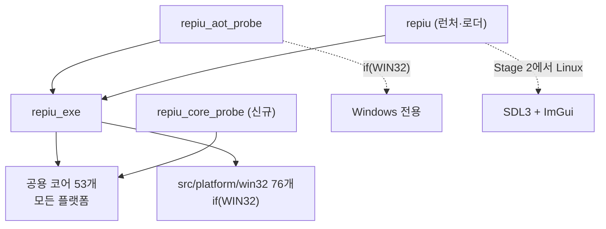

# Linux 코어 빌드 설계 (Stage 1)

## 배경

Linux 이식을 시작하기 전에 실제 의존 범위를 측정했습니다.

| 측정 | 결과 |
|---|---:|
| 전체 소스 | 192 |
| `src/platform/win32` | 76 |
| 공용 코어(assets·config·exe·hle·input·launcher·media·runtime·sound·storage·target) | 53 |
| 공용 코어가 win32 헤더를 include하는 곳 | **0** |
| 공용 코어의 MSVC 전용 구문 | **0** |
| 공용 코어의 32비트 포인터 가정 | **0** |
| **GCC 13.3 + C++20 `-fsyntax-only` 결과** | **오류 0** |
| Win32에 의존하지 않는 probe | 56개 중 **14개** |

**코어는 수정 없이 GCC로 넘어갑니다.** `AGENTS.md`의 "플랫폼 공용 구조를 우선 설계하고
플랫폼별 세부 사항은 분리한다"가 실제로 지켜져 있던 결과입니다.

반면 `src/platform/win32`의 결합도는 큽니다 — `CONTEXT` 270곳, `VirtualProtect` 47곳,
`fs:[...]` 어셈블리 28곳, `VirtualQuery` 15곳, `VirtualAlloc` 8곳, VEH 등록 3곳.

## 결정 1: 세 단계로 나눕니다

| 단계 | 내용 | 산출물 |
|---|---|---|
| **1 (이 설계)** | 빌드 분리, i386 Linux 툴체인, 코어와 Win32-free probe 실행 | Linux에서 빌드·probe 통과 |
| 2 | 런처를 WSLg에서 실행 | Linux에서 보이는 첫 화면 |
| 3 | 실행 엔진 이식 (VEH·CONTEXT·mprotect·세그먼트) | 게임 실행 |

Stage 1은 **게임을 실행하지 않습니다.** 빌드 체계와 코어 이식성을 실제 타겟
아키텍처에서 증명하는 것이 목적이며, 그 위에서만 Stage 3의 난제(시그널 기반 예외, SMC
감지)를 다룰 수 있습니다.

## 결정 2: 아키텍처는 i386입니다

게스트 32비트 x86 코드를 **같은 프로세스에서 네이티브 실행**하는 구조이므로 호스트도
32비트여야 합니다(현재 Win32 호스트도 `host pointer bits: 32`). x86-64 프로세스에서 32비트
코드 세그먼트로 전환하는 우회로가 이론상 있으나, 시그널 컨텍스트·포인터 폭·세그먼트 처리가
모두 예외 경로가 되어 검증 비용이 훨씬 큽니다.

Stage 1의 산출물도 **i386 ELF**로 만듭니다. 64비트로 먼저 만들면 Stage 3에서 아키텍처를
바꿀 때 구조가 다시 흔들립니다.

## 결정 3: CMake는 타깃을 쪼개지 않고 조건부 소스로 나눕니다

현재 `repiu_exe` 하나에 공용 코어와 Win32 계층이 함께 있습니다. 새 라이브러리 타깃을
만들면 링크 관계와 include 경로를 전부 다시 배선해야 하므로, **같은 타깃 안에서 Win32
소스만 `if(WIN32)`로 감쌉니다.** Windows 빌드의 결과물과 링크 구성은 그대로 유지되고,
Linux에서는 코어만 컴파일됩니다.

* Windows에서는 `repiu_aot_probe`, `repiu`, supervisor, analyzer가 지금과 동일하게
  빌드됩니다.
* Linux에서는 `repiu_exe`(코어)와 **신규 `repiu_core_probe`** 만 빌드됩니다.

## 결정 4: Linux probe는 별도 타깃으로 모읍니다

`repiu_aot_probe`는 56개 probe 중 42개가 Win32 계층을 씁니다. Linux에서 그 타깃을 살리려면
42개를 조건부로 빼야 하고, 그러면 같은 실행 파일이 플랫폼마다 다른 것을 검증하게 되어
"probe가 통과했다"의 의미가 흐려집니다.

대신 **Win32에 의존하지 않는 14개만 담는 `repiu_core_probe`** 를 새로 만듭니다. 이
타깃은 **양쪽 플랫폼에서 모두 빌드**되므로, 같은 코드가 두 OS에서 같은 결과를 내는지
직접 비교할 수 있습니다. Windows에서도 `repiu_aot_probe`가 같은 probe를 계속 호출하므로
검증이 줄지 않습니다.

## 결정 5: 빌드 스크립트는 기존 규약을 따릅니다

`scripts/build_win32_x86.ps1`이 configuration과 target을 받는 것처럼
`scripts/build_linux_i386.sh`도 같은 형태로 만듭니다. 빌드 트리는
`build/linux_i386`이며, Windows 트리(`build/win32_x86_debug`)와 섞이지 않습니다.

**전제 패키지:** `gcc-multilib`, `g++-multilib`, `libc6-dev-i386`. 없으면 스크립트가
설치 명령을 안내하고 종료합니다 — 컴파일러가 헤더를 못 찾아 수백 줄 오류를 쏟는 것보다
낫습니다.

## 범위 밖

* 실행 엔진(VEH·CONTEXT·mprotect·세그먼트) — Stage 3
* SDL3·ImGui의 i386 빌드와 런처 실행 — Stage 2
* 게임 실행, CHD 마운트의 Linux 검증
* CI 통합

## 검증

* Linux에서 `repiu_exe`와 `repiu_core_probe`가 i386으로 빌드되어야 합니다.
* `repiu_core_probe`가 Linux에서 통과해야 하고, **Windows에서 같은 항목이 같은 결과**를
  내야 합니다.
* Windows 빌드(`repiu`, `repiu_aot_probe`)가 지금과 동일하게 통과해야 합니다 — 이번
  변경은 CMake 구조만 건드리므로 회귀가 있으면 그 자리에서 드러납니다.

---

# Linux Core Build Design (Stage 1)

## Background

Measurement came before design. Of 192 sources, 76 are the Win32 platform layer and 53 are the
platform-neutral core, and that core includes **no** Win32 header, contains **no** MSVC-specific
construct, makes **no** 32-bit pointer assumption, and passes `g++ -std=c++20 -fsyntax-only`
under GCC 13.3 with **zero errors**. The core moves to Linux unmodified, which is what the
charter's "design the shared platform-neutral core first" bought. The Win32 layer is the opposite:
`CONTEXT` appears 270 times, `VirtualProtect` 47, `fs:[...]` assembly 28, `VirtualQuery` 15,
`VirtualAlloc` 8, and three vectored exception handlers.

## Decisions

**Three stages.** Stage 1, this design, splits the build, adds the i386 Linux toolchain, and gets
the core and the Win32-free probes building and passing. Stage 2 brings the launcher up under
WSLg. Stage 3 ports the execution engine. Stage 1 deliberately does not run a game: proving the
build system and the core's portability on the real target architecture is what makes Stage 3's
hard parts — signal-based exceptions and self-modifying-code detection — approachable at all.

**i386, not x86-64.** The guest's 32-bit code runs natively in-process, so the host is a 32-bit
process, as the Win32 host already is. Building Stage 1 as 64-bit would only have to be redone.

**Conditional sources, not a new library target.** The Win32 sources are wrapped in `if(WIN32)`
inside the existing `repiu_exe` rather than split into a second library, because a new target
would mean rewiring every link and include relationship for no gain. Windows output and linkage
stay exactly as they are.

**A separate probe target for Linux.** Forty-two of the 56 probes use the Win32 layer, so making
`repiu_aot_probe` build on Linux would mean excluding most of it and leaving one binary that
verifies different things per platform. Instead the 14 Win32-free probes get their own
`repiu_core_probe`, which builds on **both** platforms, so the same code can be compared directly
across the two operating systems. Windows loses no coverage because `repiu_aot_probe` still runs
the same probes.

**A build script matching the existing convention.** `scripts/build_linux_i386.sh` takes a
configuration and targets the way `build_win32_x86.ps1` does, and builds into `build/linux_i386`.
It checks for `gcc-multilib`, `g++-multilib`, and `libc6-dev-i386` first and prints the install
command if they are missing, which is far better than a compiler burying the cause in hundreds of
header errors.

## Out of scope

The execution engine, the i386 builds of SDL3 and ImGui and the launcher itself, running a game,
verifying the CHD mount on Linux, and CI integration.

## Verification

`repiu_exe` and `repiu_core_probe` must build as i386 on Linux, `repiu_core_probe` must pass
there and produce the same results on Windows, and the existing Windows builds must still pass,
since a CMake-structure change would show a regression immediately.
