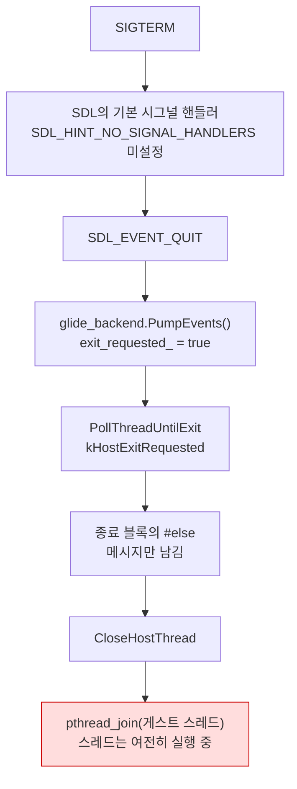
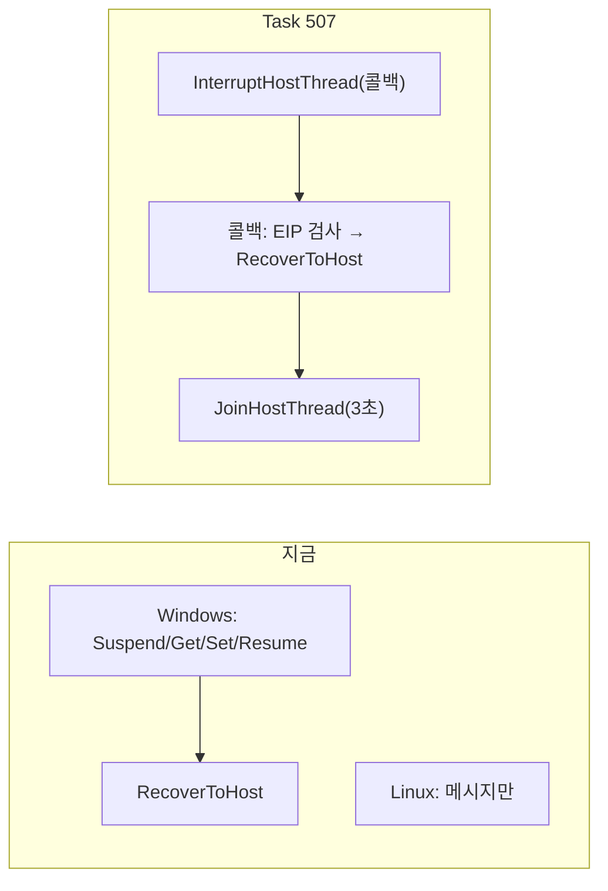

# Task 507 — Linux 종료 경로와 게스트 스레드 회수

작업 지시: [20260827-507](../work-orders/20260827-507-linux-shutdown-recovery.md) ·
frontier: [linux-port-frontier](../analysis/linux-port-frontier.md) ·
선행: [20260822-503](20260822-503-linux-execution-engine.md) · [20260827-506](20260827-506-linux-aot-code-cache.md)

## 배경 — frontier에 남은 마지막 항목

Task 506이 AOT 코드 캐시를 옮기면서 frontier 4절의 두 항목 중 하나가 지워졌습니다. 남은
것은 **감시견의 강제 중단**입니다.

`AttemptWin32GuestStackExecution`의 종료 처리는 **세 가지 사건이 모이는 한 블록**입니다.

| 사건 | 어디서 오는가 | poll 결과 |
|---|---|---|
| 실행 예산 만료 | `REPIU_EXECUTION_TIMEOUT_MS` | `kTimedOut` |
| 무진행 감시견 | `REPIU_STALL_TIMEOUT_MS` | `kTimedOut` |
| 창 닫힘 / 종료 요청 | SDL 이벤트 | `kHostExitRequested` |

그리고 그 블록의 본문 전체가 `#if defined(_WIN32)`입니다. Linux는 진단 문자열 하나만 남기고
**게스트 스레드를 세우지 못한 채** 정리 단계로 내려갑니다.

## 확정한 것 — "TERM에 응답하지 않는다"는 이 블록입니다

Task 506 검증에서 측정을 끝내고 종료를 요청했을 때 프로세스가 TERM에 반응하지 않아 PID를
확인한 뒤 SIGKILL로 정리했습니다. 그 경로를 코드에서 끝까지 따라갔고, **추정이 아니라
읽어서 확인한 사슬**입니다.

* `SDL_HINT_NO_SIGNAL_HANDLERS`는 저장소 어디에도 설정되어 있지 않습니다. SDL은 SIGINT과
  SIGTERM을 자기 핸들러로 받아 **종료 이벤트로 바꿉니다.** 그래서 기본 처분("프로세스 종료")이
  일어나지 않습니다.
* `glide_opengl_backend.cpp`가 `SDL_EVENT_QUIT`을 `exit_requested_`로 옮기고,
  `live_telemetry_snapshot.cpp`의 poll 루프가 그것을 `kHostExitRequested`로 반환합니다.
* 그 결과가 위 블록이고, Linux 분기는 스레드를 세우지 않습니다.
* 블록 끝의 `CloseHostThread`는 POSIX에서 **조건 없이 `pthread_join`** 합니다. 헤더가 "스레드가
  이미 종료했어야 한다"고 적어 둔 계약을 이 호출부만 지키지 않고 있었습니다.

**즉 TERM은 무시된 것이 아니라 접수되었고, 접수된 뒤에 영구히 기다린 것입니다.** 종료 요청이
가장 잘 동작해야 할 경로가 종료를 막고 있었습니다.

## 결정 1: 우아한 탈출은 `InterruptHostThread`로 수렴시킵니다

3d-18이 답을 이미 정해 두었습니다 — 정지 후 컨텍스트를 회수 진입점으로 돌리고 재개하는
Windows의 절차는 Linux에서 **시그널 한 번**이고, 3d-20이 그것을 `InterruptHostThread`로
양쪽 호스트에 이미 구현했습니다. 3d-21의 표본기가 같은 함수를 쓰고 있습니다.

지금 이 블록이 직접 부르는 `SuspendThread` / `GetThreadContext` / `SetThreadContext` /
`ResumeThread` 넷은 **`InterruptHostThread`가 Windows 백엔드에서 하는 일과 정확히 같습니다.**
그러니 새로 만들 것은 없고, 호출을 계층으로 올리는 일만 남습니다.

### 콜백은 두 호스트에서 서로 다른 스레드에서 돕니다

`host_thread.h`가 굵게 경고하는 지점이고, 이 작업이 그 경고의 **첫 편집 사용자**입니다.
Windows는 대상을 얼려 두고 **호출한 스레드**에서 콜백을 돌리지만, Linux는 **대상 스레드
자신의 시그널 핸들러 안에서** 돌립니다. 그래서 콜백 본문은 3c의 폴트 콜백과 같은 제약을
받습니다 — 할당하지 않고, 잠그지 않고, 블록하지 않습니다.

지금 블록은 그 안에서 `context.hle_message`에 `std::string`을 대입합니다. **할당입니다.**
콜백에 남는 것은 다음 셋뿐이고, 문자열은 요청한 스레드로 올라갑니다.

| 콜백 안 | 이유 |
|---|---|
| EIP가 게스트 이미지 또는 AOT 캐시 안인지 검사 | 정수 비교뿐 |
| `CopySnapshotFromContextRecord` | 필드 복사뿐 |
| `RecoverToHost` | 컨텍스트 필드 쓰기뿐 |

EIP 검사는 그대로 둡니다. 그것이 **잘못된 곳에서 탈출시키지 않는 유일한 방어**입니다. 게스트
스레드가 3c의 폴트 핸들러 안에 있거나 호스트 코드 안에 있으면 검사가 거절하고, 그 경우 이
작업은 회수를 시도하지 않습니다.

## 결정 2: `TerminateThread`에는 대응물을 만들지 않습니다 — 대신 기다리지 않습니다

3d-18과 `win32_thread_api.h`의 주석이 이미 정한 것입니다. `pthread_cancel`은 취소 지점에서만
동작하므로 같은 물건이 아니고, 게스트 코드에는 취소 지점이 없습니다. **Linux에서 멈추지 않는
게스트 스레드는 멈추지 않습니다.**

그래서 바꾸는 것은 "어떻게 죽이는가"가 아니라 **"죽지 않는 스레드를 어떻게 대하는가"** 입니다.
지금은 `pthread_join`으로 영원히 기다리고, 그것이 위에서 확인한 정지입니다.

`host_thread.h`에 `DetachHostThread`를 더합니다.

| 호스트 | 하는 일 |
|---|---|
| Windows | `CloseHandle` — 핸들만 놓습니다 |
| POSIX | `pthread_detach` 후 레코드를 **의도적으로 남깁니다** |

레코드를 지우지 않는 이유는 분명합니다. 살아 있는 스레드가 종료할 때 그 레코드의 완료 플래그와
종료 코드에 씁니다. 지우면 use-after-free이고, 남기면 프로세스가 내려가는 길에 한 번 새는
할당입니다. **로더는 이미 같은 판단을 한 번 하고 있습니다** — `main.cpp`가
`if (!attempt.timed_out)`일 때만 재배치 이미지를 해제합니다. 같은 이유이고, 같은 선택입니다.

이 함수는 `CloseHostThread`의 계약을 깨는 우회로가 아니라 **그 계약이 성립하지 않을 때 부르는
다른 함수**입니다. 헤더에 그렇게 적습니다.

## 결정 3: 종료 스냅샷의 `_M_IX86`

`CopySnapshotFromContextRecord`의 본문 전체가 `#if defined(_M_IX86)`입니다. 그 매크로는
MSVC의 것이라 Linux 빌드에서는 `captured = false`만 남습니다. 즉 **Linux에서 시간 초과
스냅샷은 지금까지 한 번도 채워진 적이 없습니다.**

frontier 8절이 모으는 "컴파일되면서 아무것도 안 하는 코드"와 같은 종류이고, 하필 이 작업이
고치는 경로 위에 있습니다. `native_phase_sampler.cpp`가 이미 쓰는 형태
(`defined(_M_IX86) || defined(__i386__)`)로 맞춥니다.

같은 모양이 저장소에 더 남아 있습니다(`aot_direct_return_table_probe.cpp`,
`host_crash_report.cpp`, `exception_transition_calibration_probe.cpp`,
`guest_stack_switch_probe.cpp`, `stack_bridge_probe.cpp`). **이 작업의 범위는 종료 경로 위의
하나뿐이고**, 나머지는 frontier에 목록으로 남깁니다 — 컴파일로는 볼 수 없는 종류라 한 번에
훑는 것이 옳고, 그것은 별도 단위입니다.

## 이 설계가 하지 않는 것

* **정지한 게스트 스레드를 살려내지 않습니다.** 회수가 거절되거나 시그널이 시한 안에 답하지
  않으면 이 작업이 하는 일은 정직하게 보고하고 기다리지 않는 것까지입니다. 핸들러가 반환하지
  않는 원인(frontier 6절)은 여전히 열린 질문입니다.
* **teardown SIGTRAP을 다루지 않습니다.** frontier 6절의 미확인 항목이며, 회수에 실패한 채로
  내려가는 길에 게스트 스레드가 아직 도는 것이 그것과 관계가 있을 수 있다는 점만 적어 둡니다.
* **Windows 동작을 바꾸지 않습니다.** Windows 경로는 같은 네 호출을 계층 뒤에서 그대로
  수행하고, `TerminateThread` 최후 수단도 그 자리에 남습니다.

## 검증 계획

| 대상 | 기준 |
|---|---|
| Linux i386 빌드 | `repiu` 링크까지 성공 |
| Linux `repiu_core_probe` | `core_probe_total=15`, 실패 0 |
| Linux DOS/4GW 샘플 (`legacy`/`dynamic`) | 3d-19 기준선 유지 — exit 2, 초점 0x10, opcode 0x80 |
| **Linux `pumpit1` 예산 만료** | `REPIU_EXECUTION_TIMEOUT_MS`로 끝낸 실행이 **스스로 종료** |
| **Linux `pumpit1` SIGTERM** | TERM 뒤 프로세스가 **스스로 종료** — SIGKILL 불필요 |
| Windows Debug 빌드·probe | 가능하면 회귀 확인, 불가하면 로그에 사유 |

**완료 조건은 하나입니다. 종료를 요청한 Linux 실행이 스스로 끝납니다.** 빌드도, 회수 성공
로그 한 줄도 완료 조건이 아닙니다 — 505와 506이 배운 것이 그것이고, 회수가 거절된 실행도
끝나야 합니다.

---

# Task 507 — The Linux shutdown path and reclaiming the guest thread

Work order: [20260827-507](../work-orders/20260827-507-linux-shutdown-recovery.md) ·
Frontier: [linux-port-frontier](../analysis/linux-port-frontier.md) ·
Predecessors: [20260822-503](20260822-503-linux-execution-engine.md) · [20260827-506](20260827-506-linux-aot-code-cache.md)

## Background — the last item on the frontier

Task 506 struck one of the two items in the frontier's section 4 by moving the AOT code cache. What
remains is **the watchdog's forced interruption.**

The shutdown handling in `AttemptWin32GuestStackExecution` is **one block where three events meet.**

| Event | Where it comes from | Poll outcome |
|---|---|---|
| Execution budget expiry | `REPIU_EXECUTION_TIMEOUT_MS` | `kTimedOut` |
| The no-progress watchdog | `REPIU_STALL_TIMEOUT_MS` | `kTimedOut` |
| Window close / quit request | an SDL event | `kHostExitRequested` |

The body of that block is `#if defined(_WIN32)` in its entirety. Linux leaves one diagnostic string
and goes down to teardown **without ever stopping the guest thread.**

## Established — "it does not respond to TERM" is this block

When measurement ended in Task 506's verification the process ignored TERM and had to be killed after
confirming its PID. That path has now been followed through the code to its end, and the chain below
is **read rather than inferred.**

* `SDL_HINT_NO_SIGNAL_HANDLERS` is set nowhere in this repository. SDL takes SIGINT and SIGTERM with
  handlers of its own and **turns them into a quit event**, so the default disposition — terminate
  the process — never happens.
* `glide_opengl_backend.cpp` moves `SDL_EVENT_QUIT` into `exit_requested_`, and the poll loop in
  `live_telemetry_snapshot.cpp` returns it as `kHostExitRequested`.
* That reaches the block above, whose Linux branch does not stop the thread.
* `CloseHostThread` at the end of the block joins **unconditionally** on POSIX. Its header records a
  contract — the thread must have exited — and this was the one call site not keeping it.

**TERM was not ignored. It was accepted, and then waited on forever.** The path that most needs to
work was the one preventing shutdown.

## Decision 1: converge the graceful exit onto `InterruptHostThread`

3d-18 settled this already: the Windows procedure — suspend, point the context at the recovery
entry, resume — is **a single signal** on Linux, and 3d-20 implemented exactly that as
`InterruptHostThread` on both hosts. 3d-21's sampler already uses it.

The four calls this block makes directly — `SuspendThread`, `GetThreadContext`, `SetThreadContext`,
`ResumeThread` — are **precisely what `InterruptHostThread`'s Windows backend does.** So nothing new
is needed; the calls move onto the layer.

### The callback runs on a different thread on each host

`host_thread.h` warns about this in bold, and this task is the **first editing caller** of it.
Windows freezes the target and runs the callback on the *calling* thread; Linux runs it **inside the
target thread's own signal handler**. The body therefore carries 3c's fault-callback constraints: no
allocation, no locks, no blocking.

Today the block assigns a `std::string` to `context.hle_message` inside that region. **That is an
allocation.** Only three things stay in the callback; the message moves up to the requesting thread.

| Inside the callback | Why it is safe |
|---|---|
| Testing EIP against the guest image and the AOT cache | integer comparisons |
| `CopySnapshotFromContextRecord` | field copies |
| `RecoverToHost` | writes to context fields |

The EIP test stays as it is. It is **the only defence against recovering from the wrong place**: if
the guest thread is inside 3c's fault handler or in host code, the test refuses and this task does
not attempt recovery.

## Decision 2: no counterpart for `TerminateThread` — instead, stop waiting

3d-18 and the comment in `win32_thread_api.h` settled this too. `pthread_cancel` acts at
cancellation points, which is not the same thing, and guest code has none. **A Linux guest thread
that will not stop does not stop.**

So what changes is not how to kill it but **how a thread that will not die is treated.** Today it is
waited on forever by `pthread_join`, and that wait is the stall established above.

`DetachHostThread` joins `host_thread.h`.

| Host | What it does |
|---|---|
| Windows | `CloseHandle` — releases the handle and nothing else |
| POSIX | `pthread_detach`, then **deliberately leaves the record** |

The record is not deleted for a plain reason: a thread that is still alive writes its completion flag
and exit code into it when it ends. Deleting it is a use-after-free; keeping it is one leaked
allocation on the way out of the process. **The loader already makes the same judgement** —
`main.cpp` releases the relocated image only `if (!attempt.timed_out)`. Same reason, same choice.

This is not a way around `CloseHostThread`'s contract but **the other function, called when that
contract does not hold.** The header says so.

## Decision 3: the timeout snapshot's `_M_IX86`

The whole body of `CopySnapshotFromContextRecord` sits under `#if defined(_M_IX86)`, which is MSVC's
macro, so a Linux build keeps only `captured = false`. **The timeout snapshot has therefore never
been filled in on Linux.**

That is the same family the frontier's section 8 collects — code that compiles and does nothing — and
it happens to sit on the path this task repairs. It is brought to the form
`native_phase_sampler.cpp` already uses: `defined(_M_IX86) || defined(__i386__)`.

More of the same shape remains (`aot_direct_return_table_probe.cpp`, `host_crash_report.cpp`,
`exception_transition_calibration_probe.cpp`, `guest_stack_switch_probe.cpp`,
`stack_bridge_probe.cpp`). **This task's scope is the one on the shutdown path**; the rest are listed
on the frontier, because a kind that compiling cannot see is best swept in one pass, and that pass is
its own unit.

## What this design does not do

* **It does not revive a stalled guest thread.** If recovery is refused, or the signal does not
  answer within its deadline, this task reports that honestly and stops waiting. Why the handler does
  not return (frontier section 6) remains open.
* **It does not address the teardown SIGTRAP** — an unconfirmed item in section 6. It only records
  that a guest thread still running while teardown proceeds may be related.
* **It does not change Windows behaviour.** The Windows path performs the same four calls behind the
  layer, and the `TerminateThread` last resort stays where it is.

## Verification plan

| Target | Criterion |
|---|---|
| Linux i386 build | links as far as `repiu` |
| Linux `repiu_core_probe` | `core_probe_total=15`, zero failures |
| The Linux DOS/4GW sample (`legacy`, `dynamic`) | 3d-19's baseline holds: exit 2, focus 0x10, opcode 0x80 |
| **Linux `pumpit1`, budget expiry** | a run ended by `REPIU_EXECUTION_TIMEOUT_MS` **exits by itself** |
| **Linux `pumpit1`, SIGTERM** | the process **exits by itself** after TERM; no SIGKILL needed |
| Windows Debug build and probes | regression checked if possible; otherwise the reason goes in the log |

**There is one completion criterion: a Linux run asked to stop stops by itself.** Not the build, and
not one log line saying recovery succeeded — that is what 505 and 506 taught, and a run whose
recovery was refused has to end too.
