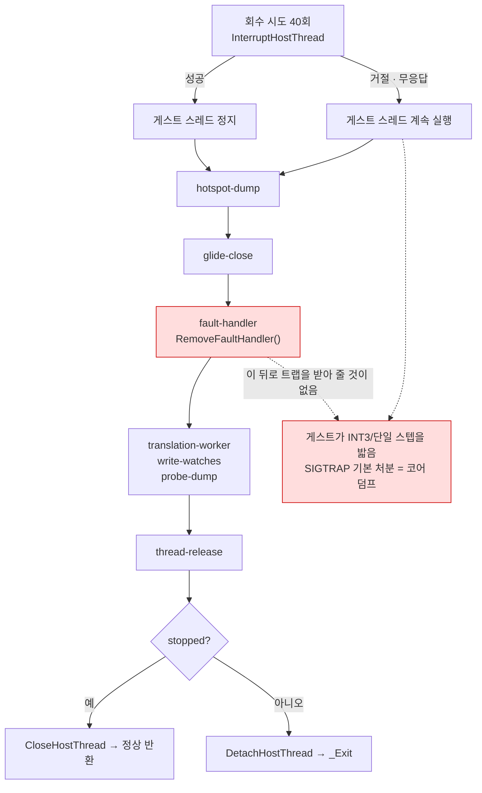

# Task 508 — 회수를 거절당한 종료가 코어를 덤프하지 않게

작업 지시: [20260828-508](../work-orders/20260828-508-refused-recovery-teardown.md) ·
작업 로그: [20260828-508](../work-logs/20260828-508-refused-recovery-teardown.md) ·
frontier: [linux-port-frontier](../analysis/linux-port-frontier.md) ·
확인 절차: [linux-shutdown-check](../guides/linux-shutdown-check.md) ·
선행: [20260827-507](20260827-507-linux-shutdown-recovery.md)

## 배경 — 507이 이름 붙여 남긴 경계

Task 507은 "종료를 요청받은 실행이 스스로 끝나는가"를 닫았습니다. 여덟 번 모두 끝났습니다.
그런데 그중 셋은 `_Exit`이 아니라 **SIGTRAP의 커널 기본 처분**, 곧 코어 덤프로 끝났습니다.
507의 완료 조건(매달리지 않는다)은 만족하지만 끝나는 방식이 다르고, 507은 그것을 자기 범위
밖으로 적어 두었습니다.

**이것을 정리의 청결 문제로 보면 우선순위를 잘못 읽습니다.** 값어치는 다음 측정에 있습니다.
`linux-shutdown-check` 3절이 "종료 코드 하나로 판정하지 마십시오"라고 적어 둔 이유가 바로
여기에 있습니다 — 앞으로 Linux에서 하는 모든 실행이 `exit=133`을 낼 수 있는데, 그 값은
**게스트가 크래시한 실행과 구별되지 않습니다.** 이 저장소가 이번 이식에서 반복해서 걸린
함정이 "성공 신호 하나로 판정"이었고(frontier 3.5절), 그 반대편이 지금 만들어지는 중입니다.

## 사슬 — 이 경로는 아직 필요한 핸들러를 스스로 떼어 냅니다

종료 블록은 회수 성공 여부와 **무관하게** 같은 정리 순서를 밟습니다.



`remove_vectored_handler()`는 `RemoveFaultHandler()`를 부르고, Linux 구현은 SIGSEGV·SIGBUS·
SIGTRAP·SIGILL·SIGFPE 다섯의 처분을 **설치 이전으로** 되돌립니다. 저장소 안에서 이 다섯을
건드리는 곳은 3c뿐이므로(`grep -rn "SIGTRAP\|SIGSEGV" src/`) 되돌아가는 자리는 `SIG_DFL`입니다.

그런데 회수를 거절당했다는 것은 **게스트 스레드가 계속 돈다**는 뜻입니다. `dynamic` backend는
정상 동작으로 INT3과 트랩 플래그를 심습니다 — 경계를 만날 때마다 그렇고, 밟는 것 자체에
이상한 데가 없습니다. 핸들러가 사라진 뒤 그중 하나를 밟으면 커널 기본 처분이 실행되고,
프로세스는 블록 끝의 `_Exit`에 닿기 전에 죽습니다.

**즉 근인은 트랩이 아니라 순서입니다.** 아직 그 핸들러를 필요로 하는 스레드가 도는 동안
핸들러를 떼는 것.

## 확인됨 — 재현하고, 죽은 자리를 표시로 짚었습니다

추정이 아닙니다. 60초 예산 `pumpit1` 실행에서 회수 거절과 코어 덤프를 같이 재현했고,
**어느 단계 뒤에서 죽었는지를 507이 넣어 둔 단계 표시가 그대로 말해 줍니다.**

| 예산 | 실행 | 회수 거절(`stopped=0`) | SIGTRAP |
|---|---:|---:|---:|
| 20초 | 5 | **0** | 0 |
| 60초 | 6 | **6** | **2** |

20초로는 이 갈래에 **닿지 않습니다.** 그때 게스트는 자산 디코드 중이고 EIP가 게스트 이미지나
AOT 캐시 안이라 회수가 다섯 번 다 성공했습니다. 60초는 렌더 루프 안이고, 여섯 번 다 40회 시도가
전부 거절됐습니다. 거절 시점의 EIP는 로더 자신의 텍스트(0x40000000 대역)이거나 공유
라이브러리 대역(0xF7Fxxxxx)이었습니다 — 어느 쪽이든 호스트 코드입니다.

죽은 실행의 마지막 줄들입니다.

```
[repiu-shutdown] reason=timeout attempts=40 answered=1 recovered=0 stopped=0 failure=0 eip=0x40152B94 gate=0
[repiu-shutdown] step=glide-close
[repiu-shutdown] step=fault-handler      ← 여기서 핸들러가 사라짐
[repiu-shutdown] step=translation-worker ← 마지막 줄. 이 뒤로 아무것도 없음
```

```
Trace/breakpoint trap (core dumped)
```

**두 번의 SIGTRAP이 같은 자리에서 났습니다** — 둘 다 마지막 표시가 `translation-worker`,
곧 `fault-handler` 바로 다음 단계입니다. 같은 조건에서 살아남은 네 실행은 `done`까지 찍고
`_Exit(3)`으로 끝났습니다. **차이는 게스트
스레드가 그 짧은 창 안에서 트랩을 밟았는지 하나뿐입니다** — 사슬이 맞다는 증거이면서, 왜 이
현상이 확률적으로 보였는지도 같이 설명합니다.

## 결정 — 회수를 거절당하면 정리를 하지 않습니다

507이 이미 절반을 정했습니다. 그 작업 로그의 문장이 그대로 근거입니다 — *"근본 해법은 회수를
거절당한 순간부터 이 프로세스의 나머지 작업 전체를 신뢰하지 않는 것"*. 그 결론이 `_Exit`으로
구현됐는데, **`_Exit` 앞에 있던 정리 순서는 손대지 않은 채 남았습니다.** 508은 같은 결론을 그
정리에도 적용합니다.

무엇을 잃는지 단계마다 셉니다. 셈이 이 결정의 전부입니다.

| 단계 | 거절된 경로에서 하는 일 | 잃는가 |
|---|---|---|
| `hotspot-dump` | 단일 스텝 census를 파일로 | **남깁니다** — 이미 순서의 맨 앞이고, 파일로 나갑니다 |
| `glide-close` | GL/SDL 자원 반납 | 아니오 — `_Exit`이면 커널이 같은 일을 합니다. 오히려 게이트 안의 게스트 스레드가 닫힌 backend를 밟을 창을 엽니다 |
| `fault-handler` | 3c 핸들러 제거 | **이것이 근인입니다** |
| `translation-worker` | 번역 워커 join | 아니오 — 그리고 join은 막힐 수 있습니다 |
| `write-watches` | 게스트 페이지 보호 복원 | 아니오 — 도는 스레드 밑에서 보호를 바꾸는 쪽이 위험합니다 |
| `probe-dump` | **이미 캡처된** 바이트를 파일로 | **남깁니다** — 게스트 메모리를 읽지 않으므로 경합이 없습니다 |
| `thread-release` | `attempt` 채우기 + detach | `attempt`는 `_Exit` 때문에 호출자에게 돌아가지 않습니다. detach만 남깁니다 |

남는 것은 **파일로 나가는 두 진단과 detach, 그리고 `_Exit`**입니다. 나머지는 아무도 읽지 않는
산출물을 만들면서 트랩 창만 여는 일이었습니다.

`DetachHostThread`는 `_Exit` 바로 앞이라 기능상 필요 없지만 남깁니다. 이 호출이 "이 caller는
스레드가 멈췄다고 말할 수 없다"는 진술이고, 507이 `CloseHostThread`의 join과 짝으로 세워 둔
계약입니다. 지우면 이 저장소가 이미 냄새로 기록해 둔 "호출자 없는 함수"가 하나 늘어납니다.

### 메시지를 새로 잃지는 않는가

`context.hle_message`(네 갈래 중 하나)는 `_Exit` 때문에 **이미** 출력되지 않습니다. 507이 그
자리를 대신할 `[repiu-shutdown]` 한 줄을 넣었고, 그 줄의 `answered`·`recovered`·`stopped`·
`failure` 네 필드가 네 메시지를 정확히 구분합니다. 508이 새로 잃는 것은 없습니다.

## 기각한 두 대안

**SIGTRAP을 `SIG_IGN`으로 두기.** `int3`은 무시해도 사라지지 않습니다. 핸들러 없이 재개하면
같은 `int3`을 다시 실행하므로 코어 덤프가 무한 루프로 바뀔 뿐이고, 그 사이 진짜 게스트
크래시까지 함께 삼킵니다.

**밟은 스레드를 재우는 핸들러.** 시그널 처분은 프로세스 전역이므로 main 스레드가 밟으면
"코어 덤프"가 "영원한 정지"로 바뀝니다. `fault_handler.cpp`의 주석이 정확히 그 실패를
경계하며 `pthread_sigmask` 한 줄을 남겨 두었고, 여기서도 같은 함정입니다. 스레드를 구분하려면
tid 비교 기구가 필요한데, **핸들러를 떼지 않으면** 그 기구가 통째로 필요 없습니다.

## 범위

`AttemptWin32GuestStackExecution`의 종료 블록 한 곳입니다. 플랫폼 분기를 새로 만들지 않습니다 —
두 호스트가 같은 결정을 씁니다. Windows에서 이 갈래는 `TerminateThread`마저 실패한 경우에만
닿으므로, 사실상 Linux의 경로이면서 Windows에서도 같은 뜻을 갖습니다.

## 범위 밖

* **인터럽트 핸들러가 반환하지 않는 것** (frontier 6절) — 508이 답하지 않습니다.
* **회수를 거절당하는 빈도를 줄이는 것** — 게스트가 호스트 코드 안에 있을 때 돌아갈 자리를
  만드는 문제이고, 별도 단위입니다. 508은 거절을 **없애지 않고** 거절당한 뒤를 정리합니다.
* 렌더 정확성 검증(Task 506이 남긴 항목).

---

# Task 508 — Ending a refused-recovery shutdown without a core dump

Work order: [20260828-508](../work-orders/20260828-508-refused-recovery-teardown.md) ·
Work log: [20260828-508](../work-logs/20260828-508-refused-recovery-teardown.md) ·
Frontier: [linux-port-frontier](../analysis/linux-port-frontier.md) ·
Procedure: [linux-shutdown-check](../guides/linux-shutdown-check.md) ·
Predecessor: [20260827-507](20260827-507-linux-shutdown-recovery.md)

## Background — the boundary 507 named and left

Task 507 closed "does a run asked to stop stop by itself". Eight of eight did. Three of those eight,
though, ended in **SIGTRAP's default kernel disposition** -- a core dump -- rather than in `_Exit`.
507's completion criterion (it does not hang) holds, but the way it ends is different, and 507
recorded that as outside its scope.

**Reading this as a tidiness problem gets the priority wrong.** The value is in the next
measurement. Section 3 of `linux-shutdown-check` says "do not judge from an exit code alone", and
this is exactly why: every Linux run from here on can produce `exit=133`, and that value is
**indistinguishable from a run whose guest crashed**. The trap this repository fell into repeatedly
during this port was judging success from a single success signal (frontier section 3.5); this is
the same coin's other face.

## Confirmed — reproduced, with the step markers naming where it died

Not inferred. A 60-second-budget `pumpit1` run reproduced both the refused recovery and the core
dump, and **507's own step markers say which step it died after**.

| Budget | Runs | Recovery refused (`stopped=0`) | SIGTRAP |
|---|---:|---:|---:|
| 20 s | 5 | **0** | 0 |
| 60 s | 6 | **6** | **2** |

A 20-second budget **never reaches this path**: the guest is still decoding assets, its EIP is inside
the guest image or the AOT cache, and recovery succeeded in all five. At 60 seconds it is in the
render loop, and all six runs had all forty attempts refused. The EIP at refusal was either the
loader's own text (the 0x40000000 range) or a shared library (0xF7Fxxxxx) -- host code either way.

The last lines of the run that died:

```
[repiu-shutdown] reason=timeout attempts=40 answered=1 recovered=0 stopped=0 failure=0 eip=0x40152B94 gate=0
[repiu-shutdown] step=glide-close
[repiu-shutdown] step=fault-handler      <- the handler goes here
[repiu-shutdown] step=translation-worker <- last line printed; nothing after it
```

```
Trace/breakpoint trap (core dumped)
```

**Both SIGTRAPs landed in the same place**: in each, the last marker printed was
`translation-worker`, the step immediately after `fault-handler`. The four runs that survived the
same conditions printed through `done` and ended with `_Exit(3)`.
**The only difference is whether the guest thread hit a trap inside that short window** -- which is
both the evidence for the chain and the reason the symptom looked probabilistic.

## The chain — this path removes a handler it still needs

The shutdown block walks the same cleanup sequence **whether or not recovery succeeded**.
`remove_vectored_handler()` calls `RemoveFaultHandler()`, and the Linux implementation restores the
dispositions of SIGSEGV, SIGBUS, SIGTRAP, SIGILL and SIGFPE to what they were before 3c installed
itself. Nothing else in this repository touches those five (`grep -rn "SIGTRAP\|SIGSEGV" src/`), so
what they are restored to is `SIG_DFL`.

But a refused recovery means **the guest thread is still running**, and the `dynamic` backend plants
INT3s and sets the trap flag in the ordinary course of dispatching. Hitting one after the handler is
gone runs the kernel's default disposition, and the process dies before it reaches the `_Exit` at the
bottom of the block.

**The root cause is the ordering, not the trap**: removing a handler while a thread that needs it is
still running.

## Decision — a refused recovery cleans nothing up

507 already settled half of this. Its work log is the reasoning verbatim: *"the real fix was to stop
trusting any of this process's remaining work once recovery has been refused."* That conclusion was
implemented as `_Exit` -- and **the cleanup sequence in front of that `_Exit` was left untouched.**
508 applies the same conclusion to that sequence.

What is lost, counted step by step. The count is the whole of this decision.

| Step | What it does on the refused path | Lost? |
|---|---|---|
| `hotspot-dump` | writes the single-step census to a file | **kept** -- already first in the sequence, and it writes a file |
| `glide-close` | hands back GL and SDL resources | no -- `_Exit` has the kernel do the same, and closing opens a window for a guest thread inside the gate to touch a closed backend |
| `fault-handler` | removes the 3c handler | **this is the cause** |
| `translation-worker` | joins the translation worker | no -- and the join can block |
| `write-watches` | restores guest page protections | no -- changing protections under a running thread is the more dangerous option |
| `probe-dump` | writes **already captured** bytes to a file | **kept** -- it reads no guest memory, so it races nothing |
| `thread-release` | fills `attempt`, then detaches | `attempt` never reaches the caller past `_Exit`; only the detach is kept |

What remains is **the two diagnostics that write files, the detach, and `_Exit`**. The rest produced
output nobody reads while holding the trap window open.

`DetachHostThread` is functionally unnecessary immediately before `_Exit` and is kept anyway: the
call is this caller's statement that it cannot say the thread stopped, and it is the half of the pair
507 built against `CloseHostThread`'s join. Removing it would add one more function with no callers,
which this repository has already recorded as a smell.

### Is any message newly lost

`context.hle_message` (one of four) is **already** never printed, because of the `_Exit`. 507 added
the one `[repiu-shutdown]` line that stands in for it, and that line's `answered`, `recovered`,
`stopped` and `failure` fields distinguish those four messages exactly. 508 loses nothing new.

## Two alternatives rejected

**Setting SIGTRAP to `SIG_IGN`.** An `int3` does not go away when ignored: resuming with no handler
re-executes the same `int3`, so a core dump becomes an infinite loop -- and a genuine guest crash
gets swallowed along with it.

**A handler that parks the offending thread.** Signal dispositions are process-wide, so a main thread
that hits one turns "core dump" into "hang forever". `fault_handler.cpp` has a comment guarding
exactly that failure, next to the `pthread_sigmask` call it left in place for it. Distinguishing
threads would need a tid comparison -- machinery that is not needed at all if the handler is simply
**not removed**.

## Scope

One place: the shutdown block in `AttemptWin32GuestStackExecution`. No new platform branch -- both
hosts take the same decision. On Windows this arm is reached only when `TerminateThread` itself
failed, so it is in practice Linux's path while meaning the same thing on Windows.

## Out of scope

* **The interrupt handler that does not return** (frontier section 6). 508 does not answer it.
* **Reducing how often recovery is refused** -- that is the problem of giving the guest somewhere to
  return to while it is inside host code, and is a separate unit. 508 does not remove refusals; it
  cleans up after one.
* Verifying render accuracy (the item Task 506 left).
