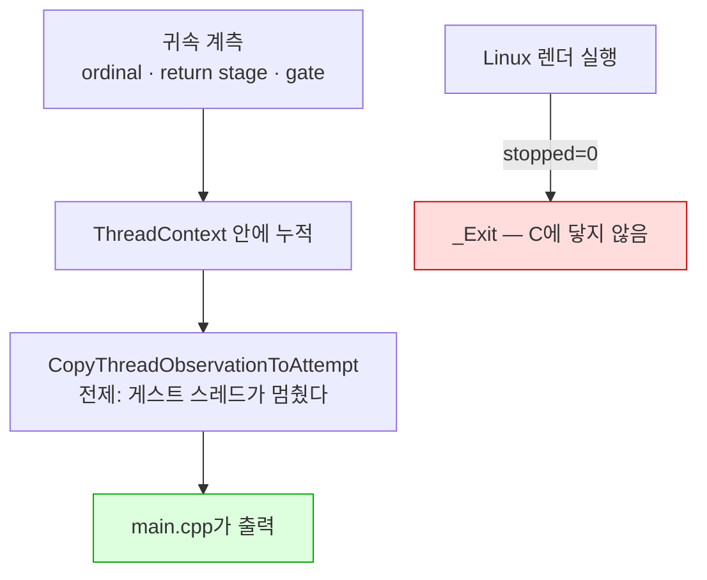

# Task 510 — Linux 속도의 첫 갈래: 엔진인가 표시 경로인가

작업 지시: [20260828-510](../work-orders/20260828-510-linux-speed-first-split.md) ·
작업 로그: [20260828-510](../work-logs/20260828-510-linux-speed-first-split.md) ·
frontier: [linux-port-frontier](../analysis/linux-port-frontier.md) ·
선행: [20260828-509](20260828-509-linux-execution-speed.md)

## 배경

Task 509가 배율을 쟀습니다 — **26.8배, 범위 무중첩, 프레임당 35.4 ms.** 이제 물을 것은
"어디인가"입니다.

## 확인됨 — 세밀한 귀속 계측은 Linux에서 출력되지 않습니다

먼저 켜 보려 했더니 켤 수가 없었습니다.

`REPIU_GLIDE_ORDINAL_TIME_PROFILE`과 `REPIU_AOT_RETURN_STAGE_PROFILE`은 전부
`Win32MinimalExecutionAttempt`를 거쳐 `main.cpp`가 출력합니다. `attempt`를 채우는
`CopyThreadObservationToAttempt`의 주석이 그 전제를 그대로 적어 두었습니다.

> Task 333: read after the guest thread has stopped, so the backend's counters are quiescent
> and no lock is needed here.

**그런데 Linux에서 렌더까지 간 실행은 게스트 스레드가 멈추지 않습니다.** 509의 측정 세 실행이
전부 `stopped=0`이었고, 그 갈래는 `CopyThreadObservationToAttempt`에 닿기 전에 `_Exit`으로
끝납니다(Task 508).

즉 **귀속 계측 전체가 "게스트 스레드가 멈춘다"를 전제로 서 있고, Linux는 그 전제를 만족하지
않습니다.** 509에서 프레임 수가 없던 것과 같은 벽이며, 같은 뿌리입니다.

고치는 방법은 있습니다 — 실행 중 주기 보고. 하지만 그것을 만들기 전에 **정말 필요한지**를
먼저 물어야 합니다. 축이 이미 좁혀져 있으면 만들 필요가 없습니다.

## 결정 — 계측을 만들기 전에, 이미 있는 것으로 가릅니다

### 갈래 1 — 기동 구간은 26.8배가 아닙니다 (이미 잰 데이터)

509의 여섯 실행이 답의 절반을 이미 갖고 있었습니다.

| 호스트 | `span_ms` (3회) | 예산 | 첫 프레임까지(추정) |
|---|---|---:|---|
| Windows | 88122 · 88227 · 88129 | 90000 | 약 1.8~1.9 초 + 회수 루프 |
| Linux | 87827 · 87901 · 88102 | 90000 | 약 1.9~2.2 초 + 회수 루프 |

**양쪽 다 `attempts=40`이므로 회수 루프의 몫이 같습니다.** 그것을 빼면 첫 프레임까지의 시간이
**300 ms 안쪽으로** 다릅니다 — 2초 남짓 위에서 약 10~15%입니다.

첫 프레임까지는 **스왑이 0회인 구간**, 곧 게스트 코드가 자산을 디코드하는 구간입니다.
**그 구간이 1.1~1.2배인데 렌더 루프가 26.8배**라면, 축은 번역 엔진이 아니라 **Glide/표시
경로**입니다.

**이것은 추정입니다.** 기동 구간에는 로더 준비와 파일 I/O도 들어 있어 게스트 코드만이
아니고, 게스트 코드의 성격도 렌더 루프와 다릅니다(게이트 통과가 거의 없습니다). 방향을
정하기에는 충분하지만 판정은 아닙니다. 갈래 2가 그것을 시험합니다.

### 갈래 2 — 이미 있는 노브 두 개의 A/B

**둘 다 코드 변경이 아닙니다.** 509가 넣은 `frames=`·`span_ms=` 한 줄이 그대로 판정
도구입니다.

| 변인 | 가설 | 크게 움직이면 |
|---|---|---|
| `REPIU_GLIDE_RENDEZVOUS_SPIN_US=2000` | 게이트 rendezvous의 **스레드 깨우기 지연**이 지배적이다. Windows에서도 호스트 spin이 33~36% miss였고(Task 353 계열), WSL의 futex 깨우기와 문맥 전환은 그보다 훨씬 비쌀 수 있습니다. 프레임당 Glide 호출이 수백~수천이면 회당 수십 µs가 그대로 프레임당 수십 ms가 됩니다 | 축은 **rendezvous 대기**입니다 |
| `REPIU_GLIDE_ASYNC_PRESENT=1` | present가 게스트 임계 경로에 있어서 느리다 | 축은 **present/표시 경로**입니다 |

기본값은 spin 20 µs, async present 꺼짐입니다.

## 이 작업이 하지 않는 것

* **Windows의 순위를 Linux 결론으로 옮기지 않습니다.** 예외 전달·시그널·GL 드라이버가 다른
  호스트입니다.
* **주기 보고 계측을 아직 만들지 않습니다.** 갈래 1·2가 축을 좁히지 못했을 때 만듭니다 —
  그때는 게스트 스레드 위에서, 프레임 경계에서 내는 것이 맞습니다. 귀속 카운터는 게스트
  스레드가 쓰기 때문입니다(`linexe_glide_boundary.cpp`의 게이트 핸들러).
* **WSLg와 실제 데스크톱을 분리하지 않습니다.** 배율 분해의 나머지 절반이고 별도 단위입니다.
* 렌더 정확성(Windows와 프레임 대조)은 다른 축입니다.

---

# Task 510 — the first split of Linux's speed: the engine or the display path

Work order: [20260828-510](../work-orders/20260828-510-linux-speed-first-split.md) ·
Work log: [20260828-510](../work-logs/20260828-510-linux-speed-first-split.md) ·
Frontier: [linux-port-frontier](../analysis/linux-port-frontier.md) ·
Predecessor: [20260828-509](20260828-509-linux-execution-speed.md)

## Background

Task 509 measured the factor -- **26.8x, non-overlapping ranges, 35.4 ms per frame.** The question
now is where.

## Confirmed — the fine-grained attribution cannot be printed on Linux

The first attempt was to turn it on, and it could not be turned on.

`REPIU_GLIDE_ORDINAL_TIME_PROFILE` and `REPIU_AOT_RETURN_STAGE_PROFILE` all travel through
`Win32MinimalExecutionAttempt` and are printed by `main.cpp`. The comment on
`CopyThreadObservationToAttempt`, which fills `attempt`, states the premise outright:

> Task 333: read after the guest thread has stopped, so the backend's counters are quiescent
> and no lock is needed here.

**A Linux run that reaches rendering does not stop its guest thread.** All three of 509's measurement
runs reported `stopped=0`, and that arm ends at `_Exit` before reaching
`CopyThreadObservationToAttempt` (Task 508).

So **the whole attribution apparatus stands on "the guest thread stops", and Linux does not satisfy
it.** It is the same wall that hid the frame count in 509, and the same root.

There is a way to fix it -- reporting during the run. But before building that, the question is
whether it is **needed**: if the axis is already narrow, it is not.

## Decision — before building an instrument, split with what already exists

### Split 1 — start-up is not 26.8x (from data already taken)

509's six runs already held half the answer. Both hosts had `attempts=40`, so the recovery loop
contributes equally, and `span_ms` was 87827-88102 on Linux against 88122-88227 on Windows. Time to
the first frame therefore differs by **under 300 ms** -- about 10-15% on roughly two seconds.

Time to the first frame is the stretch with **zero swaps**: guest code decoding assets. **If that
stretch is 1.1-1.2x while the render loop is 26.8x**, the axis is the Glide and display path rather
than the translation engine.

**This is inferred.** Start-up also contains loader work and file I/O, and its mix of guest code
differs from the render loop's. It is enough to choose a direction, not to settle one. Split 2 tests
it.

### Split 2 — an A/B over two knobs that already exist

**Neither is a code change.** The `frames=` and `span_ms=` line 509 added is the whole instrument.

| Variable | Hypothesis | If it moves a lot |
|---|---|---|
| `REPIU_GLIDE_RENDEZVOUS_SPIN_US=2000` | **thread wake latency** in the gate rendezvous dominates. Host spin missed 33-36% even on Windows, and a futex wake plus context switch under WSL can cost far more. At hundreds to thousands of Glide calls a frame, tens of microseconds each becomes tens of milliseconds a frame | the axis is **rendezvous waiting** |
| `REPIU_GLIDE_ASYNC_PRESENT=1` | present sits on the guest's critical path | the axis is **present and the display path** |

The defaults are a 20 µs spin and async present off.

## What this task does not do

* **It does not carry Windows' ranking over as a Linux conclusion.** Different host, different
  exception delivery, signals and GL driver.
* **It does not build the periodic instrument yet.** That comes only if splits 1 and 2 fail to narrow
  the axis -- and then it belongs on the guest thread, at a frame boundary, because the attribution
  counters are written by the guest thread (the gate handler in `linexe_glide_boundary.cpp`).
* **It does not separate WSLg from a real desktop.** That is the other half of decomposing the
  factor, and a separate unit.
* Rendering accuracy (a frame comparison against Windows) is a different axis.
