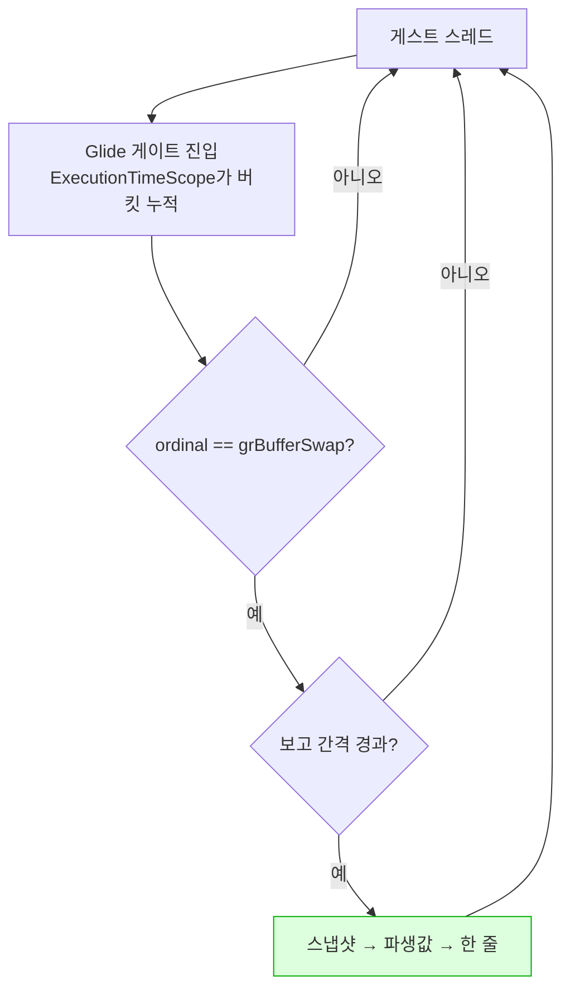

# Task 511 — 실행 중에 읽는 귀속 보고

작업 지시: [20260828-511](../work-orders/20260828-511-live-execution-profile-report.md) ·
작업 로그: [20260828-511](../work-logs/20260828-511-live-execution-profile-report.md) ·
frontier: [linux-port-frontier](../analysis/linux-port-frontier.md) ·
선행: [20260828-509](20260828-509-linux-execution-speed.md) ·
[20260828-510](20260828-510-linux-speed-first-split.md)

## 배경 — 벽은 하나이고 두 번째로 부딪혔습니다

Task 509는 프레임 수를 못 읽었고, Task 510은 귀속을 못 읽었습니다. **같은 벽입니다.**

귀속 계측 전부가 `Win32MinimalExecutionAttempt`를 거쳐 `main.cpp`가 출력하고, `attempt`를
채우는 `CopyThreadObservationToAttempt`의 주석이 전제를 적어 두었습니다.

> Task 333: read after the guest thread has stopped, so the backend's counters are quiescent
> and no lock is needed here.

**Linux에서 렌더까지 간 실행은 게스트 스레드가 멈추지 않습니다** — 509·510의 스물한 실행이
전부 `stopped=0`이고, 그 갈래는 `_Exit`으로 끝납니다(Task 508).

510이 공짜인 A/B를 다 써서 Glide 축을 배제했고 **프레임당 약 30 ms**를 남겼습니다. 그것을
가르려면 이 벽이 없어야 합니다.

## 결정 1 — 게스트 스레드가 스스로 냅니다

세 후보 중 하나를 고르는 문제입니다.

| 후보 | 왜 아닌가 / 왜인가 |
|---|---|
| 종료 갈래에서 덤프 | 카운터는 게스트 스레드가 쓰고 읽는 쪽은 호스트 스레드입니다. i386에서 64비트 읽기가 찢어질 수 있고, 표본이 실행 끝의 하나뿐입니다 |
| 회수를 성공시키기 | 게스트가 호스트 코드 안에 있을 때 돌아갈 자리를 만드는 문제 — 훨씬 큰 작업이고 511의 목적이 아닙니다 |
| **게스트 스레드에서 주기 보고** | **카운터를 쓰는 스레드가 곧 읽는 스레드입니다 — 경합이 원천적으로 없습니다.** 시간별 값도 같이 얻습니다 |

시간별 값이 덤인 것이 아닙니다. 이 저장소는 **"관측 창보다 긴 주기는 보이지 않는다"**에 이번
이식에서만 두 번 걸렸습니다(frontier 3.5절) — 30초는 "느리다", 240초는 "갇혔다", 1,200초에서야
실상이었습니다. 평균 하나는 "일정하게 느린 것"과 "어디서 무너지는 것"을 구분하지 못합니다.

## 결정 2 — 자리는 `grBufferSwap`입니다

게이트 진입마다 시계를 읽으면 **계측이 스스로 비용이 됩니다.** Task 353이 정한 규칙이
그것이고, `Win32ExecutionTimeProfile`의 주석 두 곳이 "이미 있는 타임스탬프를 쓰므로 시계
읽기가 늘지 않는다"를 근거로 들고 있습니다.

`grBufferSwap`은 **프레임당 한 번**이고, 게스트 스레드 위이며, **이미 같은 모양의 옵트인
훅이 그 자리에 있습니다** — `Win32GlideFrameDumpEnabled()` / `Win32GlideAdvanceFrameDump()`.
새 훅은 그 형태를 그대로 따릅니다.

비동기 시그널 안전성은 문제가 되지 않습니다. `fault_handler.h`가 그것을 이미 정해 두었습니다 —
*"Async-signal-safety does not apply. Every fault here is synchronous, so ordinary code may run in
the callback."*

## 결정 3 — 파생값은 공유 함수로 빼고, `main.cpp`도 그것을 씁니다

`veh_exclusive`와 `unaccounted`를 만드는 식이 지금 `main.cpp` 안에 있습니다. 여기에 복사본을
하나 더 두면 **두 보고가 서로 다른 수를 말하게 되는 날이 옵니다.**

`execution_time_profile`에 `Win32ExecutionTimeShares`와 그것을 계산하는 함수를 두고, `main.cpp`의
기존 유도 코드를 그 호출로 바꿉니다. **`main.cpp`의 출력은 한 글자도 바뀌지 않아야 합니다** —
이것은 추출이지 변경이 아닙니다.

## 결정 4 — 무엇을 찍는가

30 ms가 어디인지 가르는 데 필요한 최소는 최상위 다섯입니다.

| 항목 | Linux에서 크면 |
|---|---|
| `veh` (핸들러 총계) | 축은 **폴트 전달과 핸들러** — Linux에서는 시그널 전달입니다 |
| `glide-gate` | 510이 이미 배제했습니다. 크게 나오면 **510이 틀린 것**이므로 그것대로 소득입니다 |
| `port-io` | 축은 포트 I/O 트랩 |
| `dos` | 축은 DOS 서비스 HLE |
| `unaccounted` | 축은 **AOT 캐시 안의 게스트 실행 또는 커널 전이** |

`guest-run` 총계를 분모로 백분율과 절대 cycle을 함께 냅니다. **백분율만 내면 안 됩니다** —
510이 확인한 대로, 배율이 26.8배인 곳에서 백분율은 같은 절대 비용을 전혀 다르게 보이게
합니다.

## 이 작업이 하지 않는 것

* **하위 버킷 세분화를 하지 않습니다.** 최상위 다섯이 축을 가리키면 그때 그 안으로 들어갑니다.
* **회수 거절 자체를 고치지 않습니다.** 그것이 진짜 해법이지만 별도이고 훨씬 큽니다.
* **WSLg와 실제 데스크톱을 분리하지 않습니다.**
* 성능을 고치지 않습니다. 511은 **읽을 수 있게 만드는 것**까지입니다.
