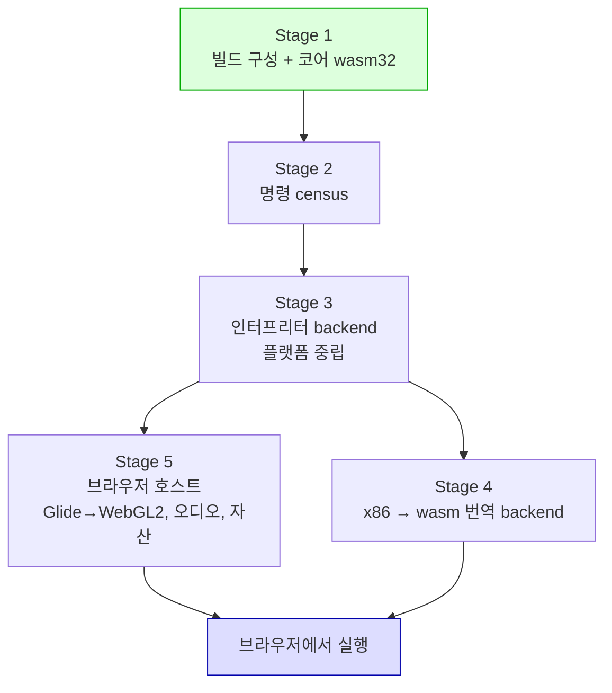

# 웹(WebAssembly) 실행 설계 — Stage 1: 빌드 구성

## 배경

목표는 **브라우저에서 원본 게임이 실행되는 것**입니다. 이 문서는 그 목표 전체의 구조를
정하고, 그중 Stage 1(빌드 구성)까지를 구현 범위로 확정합니다.

시작 전에 실제 의존 범위를 측정했습니다. Task 501이 Linux 이식 전에 한 것과 같은 절차입니다.

| 측정 | 결과 |
|---|---:|
| 전체 소스 | 222 |
| `src/platform/win32` | 82 |
| `src/platform/linux` | 10 |
| `repiu_exe` 공용 코어 | 58 |
| **코어의 `windows.h` include** | **0** |
| **코어의 인라인 어셈블리** | **0** |
| 의존성(SDL3·libchdr·miniz·Zydis·imgui·minimp3)의 Emscripten 지원 | **전부 있음** |
| 저장소 안 기존 wasm 코드 | **0** (Zydis 헤더의 `ZYAN_WASM` 감지뿐) |
| 설치된 emsdk | **없었음** (Windows·WSL 양쪽) |

`windows.h`를 include하는 9개 파일과 인라인 어셈블리를 쓰는 4개 파일은 **전부**
`src/host/win32/`와 `src/tools/aot_probe/`에 있고, 코어 라이브러리에는 하나도 없습니다.
AGENTS.md의 "플랫폼 공용 구조를 우선 설계한다"가 Linux 때와 마찬가지로 지켜져 있습니다.

**코어는 넘어갑니다. 넘어가지 않는 것은 실행 엔진입니다.**

## 결정 1: 이것은 이식이 아니라 네 번째 실행 backend입니다

Linux 이식(Task 501~512)은 이식이었습니다 — 같은 실행 모델을 다른 OS 위에 올렸고, VEH가
시그널이 되고 `VirtualProtect`가 `mprotect`가 됐을 뿐 **모델 자체는 그대로**였습니다.

웹은 다릅니다. 현재 backend 둘이 **모두** 네이티브 x86 위에 서 있습니다.

| backend | 서 있는 것 | wasm |
|---|---|---|
| `legacy` | 트랩 플래그 단일 스텝 + 하드웨어 폴트 전달 | **없음** |
| `dynamic` | RX로 매핑한 x86 코드 캐시 + INT3 sentinel | **없음** |

13개 플랫폼 헤더 중 다섯이 wasm에서 성립하지 않습니다.

| 헤더 | wasm에서 |
|---|---|
| `fault_handler.h` | **불가** — 하드웨어 폴트를 레지스터 컨텍스트와 함께 사용자 핸들러로 전달하는 개념이 없음 |
| `guest_cpu_context.h` | **무의미** — 호스트에 x86 레지스터 컨텍스트가 없음 |
| `guest_stack_switch.h` | **불가** — x86 어셈블리이고, wasm 호출 스택은 주소지정 불가 |
| `virtual_memory.h` | **불가** — 선형 메모리에 페이지 보호도 RW→RX 전환도 없음 |
| `host_process.h` | **불가** — 브라우저에 자식 프로세스 재실행이 없음 |
| `host_time.h` | 부분 — rdtsc 없음. 현재 모든 귀속 측정이 TSC cycle 기준 |
| `host_thread.h` | 부분 — Web Worker로 스레드는 되나 **정지·컨텍스트 조회 불가** |
| 나머지 6개 | 성립 |

따라서 웹은 `legacy`·`dynamic`에 이은 **세 번째 실행 backend**를 필요로 하고, 그것은
호스트 CPU가 게스트 명령을 직접 실행하지 않는 최초의 backend입니다.

## 결정 2: 기존 번역 계획 계층은 절반만 재사용됩니다

ARCHITECTURE.md는 `runtime::BuildAotCodeCacheImage`를 "플랫폼 공용 비실행 byte image"로
설명합니다. 이 문장을 **"타깃 중립"으로 읽으면 안 됩니다.** 헤더를 확인했습니다 —
`AotInstructionRecord`는 `kind`(제어 흐름·경계 분류)와 **원본 x86 바이트 `bytes`**를 함께
들고 있고, `kCopy`는 그 바이트를 캐시에 **그대로 복사**합니다.

즉 이 계층이 공용인 것은 **Win32 메모리 API에 묶여 있지 않다**는 뜻이지, x86에 묶여 있지
않다는 뜻이 아닙니다. 프로젝트는 지금까지 **게스트 명령의 의미를 해석한 적이 한 번도
없습니다.** 그것이 헌장의 "게임 로직을 재구현하지 않는다"가 실제로 산 방식입니다.

그래서 wasm backend가 기존 계층에서 **받는 것**과 **새로 만들어야 하는 것**이 갈립니다.

| plan 계층에서 받는 것 | 새로 만들어야 하는 것 |
|---|---|
| basic block 경계 | **명령 의미 → wasm 변환** |
| direct call/jump/Jcc edge | 게스트 레지스터·플래그 파일의 wasm 표현 |
| `kHleBoundary` — HLE 진입점 | 간접 분기 target 해결(호스트 폴트 없이) |
| `kPortIo`, `kSegmentOverrideMem` 등 분류 | SMC 감지(페이지 보호 없이) |
| `kIndirectExit`, `kJumpTable` | x87 |

**이 작업의 실제 크기는 오른쪽 열입니다.** 디코딩은 Zydis가 이미 벤더링되어 있어 공짜이지만,
**의미는 공짜가 아닙니다.**

## 결정 3: 게스트 메모리는 선형 메모리 안에 절대 주소로 놓습니다

`repiu_exe_analyzer`로 `pumpipx3`의 `PIU.EXE`를 실측했습니다.

| 항목 | 값 |
|---|---:|
| LE object 수 | 4 |
| 코드/데이터 object [2] | base `0x00020000`, 1,006,108 B |
| **총 virtual size** | **20,382,644 B (약 19.4 MB)** |
| runtime stack top | `0x013AA940` |
| **재배치 지원** | **이미 있음** — `Relocatable image base: 0x01000000`, 13,934/13,943 relocation 적용 |

**게스트 주소 공간 전체가 20 MB 남짓이고, 로더는 이미 재배치를 합니다.** 그러므로 wasm
선형 메모리의 낮은 구간을 게스트에 통째로 예약하고 **게스트 포인터를 선형 메모리 오프셋과
같게** 둘 수 있습니다. 게스트가 하는 포인터 산술이 번역 없이 그대로 성립하며, 이것이
"원본 코드를 수정하지 않는다"를 지키는 유일하게 값싼 방법입니다.

대가는 **페이지 보호가 없다**는 것입니다. 현재 SMC 감지와 페이지 retirement는 전부
`virtual_memory.h`의 보호 전환 위에 서 있습니다. wasm에는 하드웨어 등가물이 없으므로
**번역 시점에 코드 페이지로 향하는 store에 검사를 심는 방식**으로 바뀝니다. 이것은 성능
문제이자 정확성 문제이며, Stage 4의 핵심 설계 항목입니다.

## 결정 4: 다섯 단계로 나눕니다

| 단계 | 내용 | 산출물 | 게임 실행 |
|---|---|---|---|
| **1 (이 설계의 구현 범위)** | emsdk, CMake 웹 타깃, `repiu_exe`와 실행 무관 probe를 wasm32로 | wasm32에서 빌드·probe 통과 | **아니오** |
| 2 | 게스트가 실제로 쓰는 x86 명령 형태를 셈 | 구현해야 할 명령 목록과 개수 | 아니오 |
| 3 | 플랫폼 중립 x86 인터프리터 backend | **네이티브에서도 도는** 정확성 기준 | 느리게 예 |
| 4 | x86 → wasm 번역 backend | 속도 | 예 |
| 5 | 브라우저 호스트 (WebGL2·WebAudio·자산 전달) | 브라우저 화면 | 예 |

**Stage 3이 이 계획의 중심입니다.** 인터프리터는 플랫폼 중립 C++이므로 **Windows에서 기존
네이티브 실행과 나란히 돌려 차등 검증(differential testing)** 할 수 있습니다 — 같은 게스트
상태에서 한 명령을 인터프리터와 네이티브가 각각 실행하고 레지스터·플래그·메모리를
대조합니다. 이 대조가 없으면 Stage 4의 번역 버그를 브라우저 안에서 잡아야 하고, 그것은
이 저장소가 Linux 이식에서 이미 비싸게 배운 종류의 함정입니다.

인터프리터는 맨땅이 아닙니다 — `src/platform/win32/cpu_emul/instruction_emulation.cpp`
3,254줄이 이미 세그먼트 명령·traced memory·REP 문자열·INT 래퍼를 에뮬레이션하고 있습니다.
다만 이것은 **폴트 경계에서만** 도는 부분 집합이므로, 승격 대상이지 완성품이 아닙니다.

## 결정 5: Stage 1의 산출물은 게임을 실행하지 않습니다

Task 501이 Linux에서 한 것과 같습니다. 목적은 **빌드 체계와 코어 이식성을 실제 타깃에서
증명하는 것**이고, 그 위에서만 Stage 3~4의 난제를 다룰 수 있습니다.

Stage 1이 만드는 것:

1. `scripts/build_web_wasm.sh` — `build_linux_i386.sh`와 같은 형태. 툴체인 부재를 앞에서
   이름 붙여 실패시킵니다(수백 개의 헤더 오류로 원인이 묻히지 않게).
2. CMakeLists의 `if(EMSCRIPTEN)` 분기 — Win32/UNIX 전용 타깃을 제외하고 `repiu_exe`와
   실행 무관 probe만 남깁니다.
3. `src/platform/web/` — 성립하는 헤더의 구현, 성립하지 않는 다섯의 **명시적 실패 stub**.
   조용히 성공하는 더미를 두지 않습니다. 2026-08-27 세션이 "성공 신호 하나로 성공을
   판정"해 세 번 걸린 것이 정확히 이 함정입니다.
4. 측정: wasm32에서 컴파일되는 소스 수와 미해결 심볼 수. Linux 때와 같은 지표.

**wasm32는 포인터 폭 4바이트**이므로 i386과 같습니다. 잠재된 64비트 가정이 있다면 여기서
드러나고, 없다면 코어 이식성이 한 번 더 확인됩니다.

## 결정 7: CHD는 RAM 문제가 아니라 **파일 접근 문제**이고, 그래서 Stage 3을 제약합니다

"자산 전달"을 Stage 5 미확정으로 적어 뒀는데, 재보니 **그중 하나는 Stage 5까지 미룰 수 없습니다.**

### 잰 값

| 항목 | 값 |
|---|---:|
| CHD 한 타이틀 | 173,504,827 B (`pumpit8`) ~ 483,769,518 B (`pumpit3a`) |
| `pumpit1` CHD | 386,702,556 B |
| **추출된 mount** `pumpit1` | 13,667,762 B / 120 파일 |
| **추출된 mount** `pumpit8` | 175,316,728 B / 230 파일 |
| 게스트 예약 (`0x015D7000`) | 22,900,736 B |
| AOT 코드 캐시 최소 capacity | 16 MiB |
| CHD hunk 버퍼 | `hunkbytes` **한 개** |
| Emscripten 기본 힙 | 16 MiB, 늘리지 않고 abort (Task 514에서 실측) |

### RAM은 병목이 아닙니다

`chd_cd_image.cpp`가 `chd_open(path, CHD_OPEN_READ, ...)`로 경로를 열고 `chd_read`로 **hunk
하나씩** 읽습니다. 369 MB 파일이 힙에 올라가지 않습니다. 런타임 RAM은 게스트 예약 22.9 MB +
AOT 캐시 16 MiB + arena + hunk 버퍼이고, 코드 주석이 기록한 133.8 MB live arena를 최대로
잡아도 **170 MB 수준**입니다. wasm32 주소 공간 4 GB와 브라우저 상한 안에 여유가 있습니다.

Task 514의 OOM은 용량 문제가 아니라 **기본값 문제**였고 `-sALLOW_MEMORY_GROWTH=1`로 끝났습니다.

### 그런데 CHD를 버릴 수 없습니다

mount는 ISO 트리를 **추출**하는데(`piu_chd_mount.cpp`의 `ExtractTree`), `pumpit1`은 369 MB
CHD에서 13.7 MB만 나옵니다. 나머지는 **레드북 오디오 트랙**이고, MSCDEX HLE가
`context->cd_image`를 실행 내내 들고 재생합니다(`dpmi_mscdex_services.cpp`).

**즉 CHD는 플레이 내내 랜덤 읽기가 가능해야 합니다.** "한 번 풀고 버린다"가 성립하지 않습니다.

### 그래서 실행 모델이 정해집니다 (추정 — 브라우저 쪽은 측정하지 않았습니다)

libchdr은 블로킹 stdio를 씁니다. 브라우저에서 동기 파일 I/O가 성립하는 곳은
**OPFS synchronous access handle**뿐이고, 그것은 **Web Worker 안에서만** 쓸 수 있습니다.

| 방식 | 문제 |
|---|---|
| MEMFS | 시작 전 369 MB 다운로드 + 힙에 369 MB. 가능하지만 최악 |
| HTTP range | hunk마다 왕복. CD 오디오 스트리밍에 지연이 치명적 |
| **OPFS + 동기 access handle** | 맞는 답. 대신 **엔진 전체가 Worker에서 돌아야 합니다** |

**이것이 Stage 5 항목이 아닌 이유입니다.** Worker 제약은 위 "스레드 모델"과 같은 자리에
떨어지고, 그것은 Stage 3이 정하는 것입니다. 나중에 옮기면 인터프리터의 실행 루프를 다시
씁니다 — x87 표현과 같은 종류의 함정입니다.

**제품 차원의 사실 하나** (기술 blocker는 아닙니다): 타이틀당 173~484 MB를 받아 OPFS에
저장해야 하고, `pumpit8`은 추출 파일 175 MB가 더 붙습니다.

## 미확정 — 확인하지 않고 넘어가는 것들

| 항목 | 왜 지금 정하지 않는가 |
|---|---|
| **x87 80비트 정밀도** | 게스트는 80비트 확장 정밀도를 씁니다(`x87_context.cpp`가 sign+exponent 16비트와 significand 64비트를 직접 다룹니다). wasm에는 `f32`/`f64`뿐입니다. **Task 514가 절반 답했습니다** — 80비트 메모리 피연산자 14곳과 `fldcw`/`fnstcw` 14회로 **관측 가능은 확인**됐고, 레지스터 파일 전체가 메모리로 노출되는지는 미확정입니다 |
| **스레드 모델** | 엔진은 게스트 스레드와 호스트 스레드의 rendezvous를 씁니다. 브라우저에서는 SharedArrayBuffer와 COOP/COEP 헤더가 필요하고, 스레드 정지·컨텍스트 조회는 불가능합니다. Stage 3에서 모델을 다시 세웁니다. **아래 결정 7이 여기에 제약을 하나 더 얹습니다 — 엔진이 Worker에서 돌아야 합니다** |
| **성능 계측 방법론** | 현재 모든 귀속이 TSC cycle 기준입니다. wasm에 사이클 카운터가 없고 `performance.now()`는 의도적으로 거칠게 만들어져 있습니다. Task 509~512의 측정 절차를 그대로 옮길 수 없습니다 |
| **자산 전달** | ~~CHD가 큽니다. fetch/OPFS/스트리밍 중 무엇인지 Stage 5에서 정합니다~~ → **아래 결정 7로 옮겼습니다.** 측정해 보니 Stage 5로 미룰 수 없는 부분이 있습니다 |
| **Glide → WebGL2** | 현재 백엔드는 SDL3 + OpenGL입니다. Emscripten이 WebGL2로 매핑하지만 셰이더와 확장 사용을 확인한 적이 없습니다 |

## 범위 밖

- 게임 로직 재구현. 헌장 그대로입니다.
- DOSBox 계열 코드 통합.
- Stage 2~5의 구현. 각각 별도 설계·작업 지시로 진행합니다.

---

# Web (WebAssembly) Execution Design — Stage 1: Build Configuration

## Background

The goal is **the original game running in a browser**. This document fixes the structure of that
whole goal and scopes implementation to Stage 1, the build configuration.

The real dependency surface was measured first, by the same procedure Task 501 used before the
Linux port.

| Measurement | Result |
|---|---:|
| Total sources | 222 |
| `src/platform/win32` | 82 |
| `src/platform/linux` | 10 |
| `repiu_exe` shared core | 58 |
| **`windows.h` includes in the core** | **0** |
| **Inline assembly in the core** | **0** |
| Emscripten support in dependencies (SDL3, libchdr, miniz, Zydis, imgui, minimp3) | **all present** |
| Existing wasm code in the repository | **0** (only Zydis' `ZYAN_WASM` detection) |
| emsdk installed | **not previously** (neither Windows nor WSL) |

The nine files that include `windows.h` and the four that use inline assembly are **all** under
`src/host/win32/` and `src/tools/aot_probe/`; not one is in the core library. AGENTS.md's "design
shared structures first" held here exactly as it did for Linux.

**The core carries over. The execution engine does not.**

## Decision 1: this is not a port, it is a fourth execution backend

The Linux port (Tasks 501-512) was a port: the same execution model on a different OS. VEH became a
signal and `VirtualProtect` became `mprotect`, but **the model itself was unchanged**.

The web is different. **Both** current backends stand on native x86.

| Backend | What it stands on | On wasm |
|---|---|---|
| `legacy` | Trap-flag single-stepping plus hardware fault delivery | **absent** |
| `dynamic` | An RX-mapped x86 code cache with INT3 sentinels | **absent** |

Five of the thirteen platform headers do not hold on wasm.

| Header | On wasm |
|---|---|
| `fault_handler.h` | **impossible** — there is no notion of delivering a hardware fault, with register context, to a user handler |
| `guest_cpu_context.h` | **meaningless** — the host has no x86 register context |
| `guest_stack_switch.h` | **impossible** — it is x86 assembly, and the wasm call stack is not addressable |
| `virtual_memory.h` | **impossible** — linear memory has neither page protection nor an RW-to-RX flip |
| `host_process.h` | **impossible** — a browser has no child-process relaunch |
| `host_time.h` | partial — no rdtsc, and every attribution measurement today is in TSC cycles |
| `host_thread.h` | partial — Web Workers give threads, but **no suspend and no context query** |
| The other six | hold |

So the web needs a **third execution backend** after `legacy` and `dynamic`, and it is the first one
in which the host CPU does not execute guest instructions directly.

## Decision 2: the existing translation-plan layer is reused by half

ARCHITECTURE.md describes `runtime::BuildAotCodeCacheImage` as a "platform-neutral, non-executable
byte image". **That sentence must not be read as target-neutral.** The header confirms it:
`AotInstructionRecord` carries a `kind` (control-flow and boundary classification) alongside the
**original x86 `bytes`**, and `kCopy` copies those bytes into the cache **verbatim**.

What is neutral there is freedom from the Win32 memory APIs, not freedom from x86. **The project has
never once interpreted the meaning of a guest instruction.** That is how the charter's "do not
reimplement the game logic" has actually been lived.

So the wasm backend's inheritance splits cleanly.

| Received from the plan layer | Has to be built |
|---|---|
| Basic-block boundaries | **Instruction semantics to wasm** |
| Direct call/jump/Jcc edges | A wasm representation of the guest register and flag file |
| `kHleBoundary` entry points | Indirect-branch target resolution without host faults |
| `kPortIo`, `kSegmentOverrideMem` and other classifications | SMC detection without page protection |
| `kIndirectExit`, `kJumpTable` | x87 |

**The right column is the true size of this work.** Decoding is free because Zydis is already
vendored; **semantics are not free.**

## Decision 3: guest memory sits in linear memory at absolute addresses

`repiu_exe_analyzer` was run against `pumpipx3`'s `PIU.EXE`.

| Item | Value |
|---|---:|
| LE objects | 4 |
| Code/data object [2] | base `0x00020000`, 1,006,108 B |
| **Total virtual size** | **20,382,644 B (about 19.4 MB)** |
| Runtime stack top | `0x013AA940` |
| **Relocation support** | **already present** — `Relocatable image base: 0x01000000`, 13,934 of 13,943 relocations applied |

**The entire guest address space is a little over 20 MB, and the loader already relocates.** The low
region of wasm linear memory can therefore be reserved for the guest whole, with **guest pointers
equal to linear-memory offsets**. Guest pointer arithmetic then holds with no translation, which is
the only cheap way to keep "do not modify the original code".

The price is **no page protection**. SMC detection and page retirement stand entirely on the
protection flips in `virtual_memory.h`, and wasm has no hardware equivalent. They become
**translation-time checks planted on stores that target code pages** — a performance problem and a
correctness problem at once, and the central design item of Stage 4.

## Decision 4: five stages

| Stage | Content | Deliverable | Game runs |
|---|---|---|---|
| **1 (implemented from this design)** | emsdk, a CMake web target, `repiu_exe` and the execution-free probes as wasm32 | Builds and passes probes on wasm32 | **no** |
| 2 | Count the x86 instruction forms the guest actually uses | The list and count that must be implemented | no |
| 3 | A platform-neutral x86 interpreter backend | A correctness reference that **also runs natively** | slowly, yes |
| 4 | An x86-to-wasm translation backend | Speed | yes |
| 5 | The browser host (WebGL2, WebAudio, asset delivery) | A picture in a browser | yes |

**Stage 3 is the centre of this plan.** Because the interpreter is platform-neutral C++, it can run
**alongside the existing native execution on Windows for differential testing** — the same guest
state stepped once by the interpreter and once natively, then registers, flags and memory compared.
Without that comparison, Stage 4's translation bugs would have to be caught inside a browser, which
is exactly the class of trap this repository already paid for during the Linux port.

The interpreter does not start from nothing:
`src/platform/win32/cpu_emul/instruction_emulation.cpp` is 3,254 lines already emulating segment
instructions, traced memory, REP string operations and INT wrappers. But it runs **only at fault
boundaries**, so it is a candidate for promotion, not a finished article.

## Decision 5: Stage 1's deliverable does not run the game

Same as what Task 501 did on Linux. The purpose is to **prove the build system and the core's
portability on the real target**, and only on top of that can Stages 3 and 4 be attempted.

What Stage 1 builds:

1. `scripts/build_web_wasm.sh`, shaped like `build_linux_i386.sh`. A missing toolchain is named up
   front rather than buried under hundreds of header errors.
2. An `if(EMSCRIPTEN)` branch in CMakeLists that excludes the Win32- and UNIX-only targets and keeps
   `repiu_exe` and the execution-free probes.
3. `src/platform/web/`, with implementations for the headers that hold and **explicitly failing
   stubs** for the five that do not. No dummy that quietly succeeds: the 2026-08-27 session was
   caught three times by "one success signal read as success", and this is that exact trap.
4. Measurement: how many sources compile for wasm32 and how many symbols stay unresolved. The same
   metrics as the Linux stage.

**wasm32 has 4-byte pointers**, like i386. Any latent 64-bit assumption surfaces here; if none does,
the core's portability is confirmed once more.

## Decision 7: the CHD is a **file-access** problem, not a RAM one, and so it constrains Stage 3

"Asset delivery" was filed as unresolved for Stage 5. Measured, **one part of it cannot wait for
Stage 5.**

### Measured

| Item | Value |
|---|---:|
| CHD per title | 173,504,827 B (`pumpit8`) to 483,769,518 B (`pumpit3a`) |
| `pumpit1` CHD | 386,702,556 B |
| **Extracted mount**, `pumpit1` | 13,667,762 B across 120 files |
| **Extracted mount**, `pumpit8` | 175,316,728 B across 230 files |
| Guest reservation (`0x015D7000`) | 22,900,736 B |
| AOT code-cache minimum capacity | 16 MiB |
| CHD hunk buffer | **one** `hunkbytes` |
| Emscripten default heap | 16 MiB, aborts rather than grows (measured in Task 514) |

### RAM is not the blocker

`chd_cd_image.cpp` opens by path with `chd_open(path, CHD_OPEN_READ, ...)` and reads **one hunk at
a time** with `chd_read`. A 369 MB file never enters the heap. Runtime RAM is the 22.9 MB guest
reservation plus a 16 MiB AOT cache plus the arena and one hunk buffer — **around 170 MB** even
taking the 133.8 MB live arena the code comments record. That sits well inside wasm32's 4 GB address
space and a browser's cap.

Task 514's OOM was not a capacity problem but a **default** one, and `-sALLOW_MEMORY_GROWTH=1`
closed it.

### But the CHD cannot be discarded

The mount **extracts** the ISO tree (`ExtractTree` in `piu_chd_mount.cpp`), and `pumpit1` yields
13.7 MB out of a 369 MB CHD. The rest is **Redbook audio**, which the MSCDEX HLE plays by holding
`context->cd_image` for the whole run (`dpmi_mscdex_services.cpp`).

**So the CHD has to stay randomly readable throughout play.** "Extract once and drop it" does not
hold.

### Which settles the execution model (estimated — the browser side was not measured)

libchdr uses blocking stdio. The only place synchronous file I/O holds in a browser is an **OPFS
synchronous access handle**, and those are usable **only inside a Web Worker**.

| Approach | Problem |
|---|---|
| MEMFS | A 369 MB download before start and 369 MB of heap. Possible, and the worst option |
| HTTP range requests | A round trip per hunk. Latency is fatal to CD-audio streaming |
| **OPFS plus a sync access handle** | The right answer, at the price that **the whole engine runs in a Worker** |

**That is why this is not a Stage 5 item.** The Worker constraint lands in the same place as the
thread model above, and that is Stage 3's to settle. Moving it later means rewriting the
interpreter's execution loop — the same class of trap as the x87 representation.

**One product-level fact** (not a technical blocker): 173 to 484 MB per title has to be downloaded
and kept in OPFS, and `pumpit8` adds 175 MB of extracted files on top.

## Unresolved — carried across without confirmation

| Item | Why it is not settled now |
|---|---|
| **x87 80-bit precision** | The guest uses 80-bit extended precision (`x87_context.cpp` handles a 16-bit sign-and-exponent and a 64-bit significand directly). wasm has only `f32` and `f64`. **Task 514 answered half of it**: fourteen 80-bit memory operands and fourteen `fldcw`/`fnstcw` **confirm they are observable**, while whether the whole register file reaches memory stays open |
| **Thread model** | The engine uses a rendezvous between the guest thread and a host thread. A browser needs SharedArrayBuffer and COOP/COEP headers, and thread suspend and context query are impossible. Stage 3 rebuilds the model. **Decision 7 below adds one more constraint here — the engine has to run in a Worker** |
| **Profiling methodology** | Every attribution today is in TSC cycles. wasm has no cycle counter and `performance.now()` is deliberately coarsened. The procedures from Tasks 509-512 cannot be carried over unchanged |
| **Asset delivery** | ~~CHDs are large. fetch, OPFS or streaming is settled in Stage 5~~ → **moved to Decision 7 below.** Measurement showed part of it cannot wait for Stage 5 |
| **Glide to WebGL2** | The backend today is SDL3 plus OpenGL. Emscripten maps that onto WebGL2, but the shaders and extension use have never been checked against it |

## Out of scope

- Reimplementing the game logic. Exactly as the charter says.
- Integrating DOSBox-family code.
- Implementing Stages 2 through 5. Each proceeds under its own design and work order.
