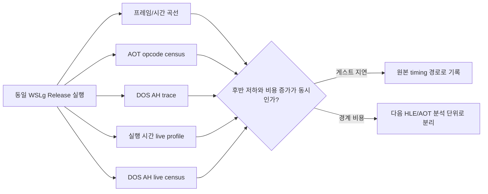

# 20260830-528 pumpipx3와 pumpit1 성능 차이 귀속 설계

## 목적

`pumpipx3`를 `pumpit1`과 같은 WSLg Linux i386 Release 조건에서 실행하고, 이미 확인된
프레임 차이를 원본 게스트 코드의 의도된 지연과 HLE/AOT 경계 비용으로 분리합니다.
이번 단위에서는 게임 로직이나 실행 파일을 수정하지 않습니다.

## 현재 단서

중단된 측정에서 `pumpit1`은 약 33.48 FPS, `pumpipx3`는 약 18.93 FPS였습니다.
`pumpipx3`는 실행 후반에 약 5 FPS로 내려갔고, AOT 경계 표본의 약 94.2%가 opcode
`CD`였습니다. 이는 `INT 21h` 명령이 반복된다는 뜻이지만, `AH=2Ch` DOS 서비스 본체는
이전 Task 402에서 wall time의 중심 비용이 아닌 것으로 판정되었습니다.

따라서 다음 세 가지를 같은 실행에서 대조합니다.

1. 프레임 곡선이 언제 갈라지는가.
2. `INT 21h/AH=2Ch` 호출 빈도와 DOS 서비스 비용이 그 시점에 증가하는가.
3. `veh`, AOT 경계, 재진입 및 게스트 실행 cycle이 함께 변하는가.

초기 trace는 `pumpipx3`에서 `INT 21h/AH=2Ch`가 집중됨을 보였지만, trace 자체가 자기
보정 루프의 호출 횟수와 프레임 속도를 바꿉니다. 또한 기존 AH 누적 카운터는 여러
interrupt vector를 합산하므로, 최종 실행에서는 `INT 21h` 전용 AH 누적 카운터를 live
report에서 1회 읽어 출력합니다. 이 계측은 DOS 호출마다 로그를 쓰지 않으므로 호출
빈도 측정에 영향을 주지 않습니다.

## 측정 불변 조건

* `build/linux_i386/repiu` Release 실행 파일을 사용합니다.
* ROM set은 각각 `pumpit1`, `pumpipx3`로 고정합니다.
* `REPIU_STALL_TIMEOUT_MS=0`, `REPIU_GLIDE_SWAP_INTERVAL=0`을 사용합니다.
* 실행 제한 시간, live profile 간격, 출력 redirection은 두 타이틀에 동일하게 적용합니다.
* `REPIU_DOS_INT_TRACE=1`은 호출 분포를 확인하는 보조 측정으로만 사용하고, trace가
  wall-time을 왜곡할 수 있으므로 FPS의 최종 판정은 trace가 없는 실행으로 합니다.
* 단일 실행의 절대 FPS가 아니라 동일 조건 반복 실행의 곡선과 cycle/frame을 비교합니다.

## 판정 규칙

* `AH=2Ch` 호출 수가 많아도 DOS 본체 비율과 경계 외 비용이 증가하지 않으면, 호출 수를
  곧바로 병목으로 판정하지 않습니다. Task 402의 self-calibrating delay 결론을 유지합니다.
* 후반 저하 시점에 `cycles/frame`, `veh` 또는 AOT 경계가 함께 상승하면 해당 축을 다음
  분석 대상으로 지정합니다.
* 프레임만 낮고 `guest_run` cycle이 의도된 대기와 함께 증가하면 원본 게스트 timing으로
  기록하며 성능 수정은 별도 승인 없이는 하지 않습니다.
* 로그 필드가 채워지지 않은 경우 그 필드에서 결론을 내리지 않고, 측정 공백으로 기록합니다.
* trace 없는 실행의 `[repiu-live-dos]`를 DOS 호출 분포의 기준으로 사용하고, trace 결과는
  해당 AH의 의미를 확인하는 보조 증거로만 사용합니다.

## 범위 밖

* 원본 EXE 패치, 게임 timing 우회, DOS 서비스 의미 변경
* AOT direct edge/linking 최적화
* WSLg/X11 자체의 독립적인 성능 개선

## 추가 계측

`LiveDosCounters`는 전체 HLE interrupt 처리 수와 `INT 21h` 전용 AH 카운터를 live
report용 값으로 옮깁니다. reporter는 전체 처리 수, `INT 21h` 처리 수, 그리고 INT 21h
상위 AH 네 개만 출력합니다. 카운터의 증가 위치나 DOS 서비스 동작은 변경하지 않습니다.

---

# 20260830-528 Performance Attribution Design for pumpipx3 vs pumpit1

## Objective

Run `pumpipx3` and `pumpit1` under the same WSLg Linux i386 Release conditions and separate
the already observed frame-rate difference into intentional guest delay and HLE/AOT boundary
cost. This unit does not modify game logic or the original executable.

## Current clues

The interrupted measurement saw approximately 33.48 FPS for `pumpit1` and 18.93 FPS for
`pumpipx3`. `pumpipx3` fell to about 5 FPS late in the run, and approximately 94.2% of its
AOT-boundary samples had opcode `CD`. That means repeated `INT 21h` instructions, but Task 402
already rejected the `AH=2Ch` DOS-service body as the dominant wall-time cost.

The same run therefore compares:

1. When the frame curves diverge.
2. Whether `INT 21h/AH=2Ch` frequency and DOS-service cost rise at that point.
3. Whether VEH, AOT boundaries, reentries, and guest-run cycles change with it.

The initial trace showed concentration on `INT 21h/AH=2Ch` in `pumpipx3`, but tracing itself
changes the calibration loop's call count and frame rate. The existing AH counter also combines
multiple interrupt vectors, so final runs read an INT 21h-specific AH histogram once in the live
reporter. This does not log every DOS call and therefore does not perturb the frequency
measurement.

## Measurement invariants

* Use the Release executable `build/linux_i386/repiu`.
* Fix the ROM sets to `pumpit1` and `pumpipx3`.
* Use `REPIU_STALL_TIMEOUT_MS=0` and `REPIU_GLIDE_SWAP_INTERVAL=0`.
* Apply identical execution limits, live-profile intervals, and output redirection to both titles.
* Use `REPIU_DOS_INT_TRACE=1` only as a call-distribution aid. Because tracing can distort wall
  time, final FPS conclusions come from runs without tracing.
* Compare repeated same-condition curves and cycles/frame, not one absolute FPS result.

## Decision rules

* A high `AH=2Ch` count alone is not a bottleneck. If DOS-body share and non-boundary cost do
  not rise, retain Task 402's self-calibrating-delay conclusion.
* If `cycles/frame`, `veh`, or AOT boundaries rise at the late-drop point, carry that axis into
  the next analysis unit.
* If only FPS is lower while guest-run cycles rise with intentional waiting, record it as original
  guest timing and do not change performance without separate approval.
* If a live field is unpopulated, do not infer from it; record a measurement gap.
* Use `[repiu-live-dos]` from trace-free runs as the DOS distribution baseline. Treat trace output
  only as supporting evidence for identifying the AH meaning.

## Out of scope

* Patching the original EXE, bypassing game timing, or changing DOS-service semantics
* AOT direct-edge/linking optimization
* Independent WSLg/X11 performance work

## Additional instrumentation

`LiveDosCounters` copies the total HLE-interrupt count and the INT 21h-specific AH histogram into
a value suitable for the live report. The reporter prints the total handled count, INT 21h count,
and the top four INT 21h AH values. It does not change where the counters increment or alter
DOS-service behavior.
