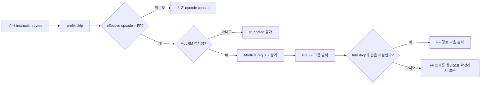

# 20260830-529 pumpipx3 FF 경계 원인 귀속 설계

## 목적

Task 528에서 `pumpipx3`의 AOT 경계 표본이 `CD`에 집중되고 late drop 주변에 `FF` 표본이
증가한 사실을 확인했습니다. 그러나 현재 계측은 `FF` opcode만 세므로 해당 명령이
간접 call(`/2`), 간접 jump(`/4`) 또는 다른 ModRM 그룹인지 알 수 없습니다.

이번 단위는 원본 게스트 코드를 수정하지 않고, 이미 캡처된 경계 instruction bytes의 ModRM
reg 필드만 분류하여 `FF` 경계의 실제 형태를 확인합니다. 성능 최적화나 실행 경로 변경은
범위에 포함하지 않습니다.

## 현재 단서

* `pumpipx3` 60초 실행은 약 35.6초부터 5 FPS 수준으로 내려갔습니다.
* 같은 실행의 AOT `FF` 표본은 live 표본 #3의 `3627`에서 #4의 `15813`으로 증가했습니다.
* Task 528에서 `AH2C` 누적 수는 late drop과 함께 증가하지 않았고, DOS 서비스 본체 단독
  원인 가설은 유지되지 않았습니다.
* x86 `FF` instruction은 opcode 뒤 ModRM의 reg 필드로 기능 그룹을 구분합니다. 현재
  경계 캡처는 최대 4바이트이므로 `FF` 직후의 ModRM을 안전하게 읽을 수 있는 경우만
  분류합니다.

## 계측 설계

`AotBoundaryOpcodeCensus`에 다음 누적 필드를 추가합니다.

* `ff_group_counts[8]`: `((ModRM >> 3) & 7)`별 `FF /0`~`FF /7` 카운트
* `ff_modrm_truncated_count`: `FF`는 보였지만 ModRM 바이트가 캡처되지 않은 표본 수

`RecordAotBoundaryOpcodeSample`가 prefix를 건너뛴 뒤 유효 opcode가 `0xFF`이고 다음
바이트가 있으면 위 배열을 갱신합니다. 이는 기존 경계 표본 1회당 수행되는 분류에 한정되며,
게스트 메모리 재조회나 formatted logging을 추가하지 않습니다.

live reporter는 기존 opcode 줄과 분리된 `[repiu-live-ff]` 줄에 non-zero 그룹만 누적
출력합니다. `/2`와 `/4`가 증가하는지, 그리고 증가 시점이 late drop과 일치하는지만
판정합니다. ModRM의 addressing mode와 동적 target은 이번 단위에서 추적하지 않습니다.

## 불변 조건과 판정

* `RecordAotBoundaryOpcodeSample`의 기존 `sample_count` 및 opcode histogram partition을
  변경하지 않습니다.
* bytes가 null이거나 길이가 부족하면 읽지 않고 truncated/empty 규칙을 따릅니다.
* 계측은 누적 카운터만 갱신하며 `EIP`, `EFLAGS`, cache target, HLE 의미를 변경하지 않습니다.
* `/2` 또는 `/4`가 late drop 구간에 증가하지 않으면, FF 그룹은 해당 drop의 직접 원인으로
  판정하지 않습니다.
* `/2` 또는 `/4`가 증가하더라도 이 단위에서는 최적화하지 않고, 다음 단위에서 해당
  instruction의 addressing mode와 target 분포를 별도로 확인합니다.

## 검증 전략

* 기존 `aot_boundary_opcode_census_probe`에 FF `/2`, `/4`, truncated 입력과 partition
  검사를 추가합니다.
* Linux i386 Release를 다시 빌드합니다.
* `pumpipx3`와 `pumpit1`을 `REPIU_STALL_TIMEOUT_MS=0`, `REPIU_GLIDE_SWAP_INTERVAL=0`,
  동일한 60초 timeout 및 live profile 조건에서 trace 없이 실행합니다.
* live FF 그룹의 누적 변화와 frame-rate curve를 시간축으로 비교합니다.

---

# 20260830-529 Design — FF Boundary Attribution for pumpipx3

## Objective

Task 528 established that `pumpipx3` has a large AOT-boundary population and that `FF` samples
increase near the late drop. The current census records only the `FF` opcode, so it cannot tell
whether the instruction is an indirect call (`/2`), an indirect jump (`/4`), or another ModRM
group.

This unit classifies the ModRM reg field from the already captured boundary instruction bytes,
without changing original guest code. It does not optimize or alter execution paths.

## Current clues

* The 60-second `pumpipx3` run fell to roughly 5 FPS from about 35.6 seconds onward.
* Its AOT `FF` samples rose from `3627` at live sample #3 to `15813` at #4.
* Task 528 showed that cumulative `AH2C` did not rise with the late drop, so the DOS-service-body
  hypothesis remains rejected as a standalone explanation.
* An x86 `FF` instruction selects its operation from the ModRM reg field. The current boundary
  capture reads up to four bytes, so the ModRM byte is classified only when safely captured.

## Instrumentation design

Add these cumulative fields to `AotBoundaryOpcodeCensus`:

* `ff_group_counts[8]`: counts for `FF /0` through `FF /7`, using `((ModRM >> 3) & 7)`
* `ff_modrm_truncated_count`: samples where `FF` was visible but its ModRM byte was not captured

After skipping prefixes, `RecordAotBoundaryOpcodeSample` updates these fields when the effective
opcode is `0xFF`. The work stays inside the existing per-boundary classification and adds no guest
memory reread or formatted logging.

The live reporter prints non-zero groups cumulatively on a separate `[repiu-live-ff]` line. The
decision is whether `/2` or `/4` grows at the same point as the late drop. Addressing modes and
dynamic targets are intentionally left for a later unit.

## Invariants and decision rules

* Preserve the existing `sample_count` and opcode-histogram partition identity.
* Do not read beyond the captured bytes; preserve the existing empty/truncated rules.
* Update counters only; do not change `EIP`, `EFLAGS`, cache targets, or HLE semantics.
* If `/2` and `/4` do not grow during the late-drop interval, do not attribute the drop directly
  to an FF group.
* Even if `/2` or `/4` grows, do not optimize in this unit. First measure addressing modes and
  target distribution in a separate unit.

## Verification strategy

* Extend `aot_boundary_opcode_census_probe` with FF `/2`, `/4`, truncated-input, and partition
  checks.
* Rebuild Linux i386 Release.
* Run both titles trace-free with identical 60-second timeout and live-profile settings.
* Compare cumulative live FF groups against the frame-rate curve on the same time axis.
