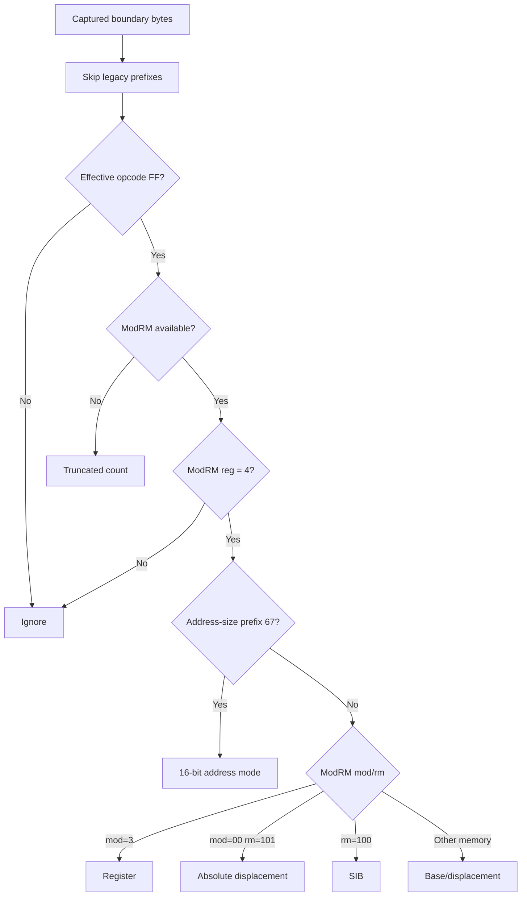

# 20260830-530 pumpipx3 FF /4 site·addressing mode 귀속 설계

## 목적

Task 529는 `pumpipx3`의 late drop과 AOT `FF /4` 누적 증가가 같은 구간에서 발생한다는 것을
확인했지만, 그 증가가 한 guest site의 반복인지 여러 site의 전환인지 구분하지 못했습니다.
이번 단위에서는 `FF /4` 표본을 guest EIP/site와 ModRM addressing mode로 분해합니다.

이번 단위의 목적은 관측뿐입니다. 원본 EXE, AOT cache, indirect-jump dispatch, guest register와
memory의 의미를 변경하지 않습니다. resolved target 값은 addressing mode와 site 분포를 확인한
후 다음 단위에서 별도로 추가합니다.

## 현재 구조와 제약

`HandleAotReentry`는 boundary guest EIP와 최대 4바이트의 읽기 가능 instruction window를 이미
확보합니다. `RecordAotOtherBoundarySample`은 `kOther` 표본에 대해 opcode census를 호출하므로,
`FF /4` site census도 같은 지점에 연결할 수 있습니다.

현재 window만으로 다음 정보를 안전하게 얻을 수 있습니다.

* guest EIP: 표본이 발생한 boundary instruction 주소
* ModRM reg field: `FF /4` 여부
* addressing mode: register, absolute displacement, base, SIB, 또는 16-bit address-size
* captured bytes 변화: 같은 site에서 instruction bytes가 달라지는지

반대로 register 값과 memory operand를 읽지 않으면 resolved target은 결정하지 않습니다. 특히
SIB/jump-table과 displacement가 섞인 memory operand를 임의로 추정하지 않도록 target은 이 단위에서
보류합니다.

## 설계

### 고정 크기 site census

새 `AotFfBoundaryAttribution` 구조는 guest thread의 `ThreadContext` 안에 보관하며, 동적 할당을
하지 않는 고정 32-slot 표를 사용합니다. 각 slot은 다음을 저장합니다.

* `guest_eip`, 누적 `count`
* 마지막으로 관측한 packed instruction bytes와 ModRM
* addressing mode
* 동일 site에서 bytes가 바뀐 횟수

32개를 초과하는 새로운 site는 `site_overflow_count`로 세고 기존 slot을 교체하지 않습니다.
이렇게 하면 상위 site의 count가 뒤늦게 다른 site로 오염되지 않고, overflow 자체도 미확정으로
남길 수 있습니다.

### addressing mode 분류

유효 `FF` 뒤 ModRM을 다음처럼 분류합니다.

분류는 opcode census와 같은 bounded prefix walk를 사용합니다. instruction length를 완전히
decode하지 않으며, bytes를 더 읽거나 guest memory를 재조회하지 않습니다.

### live 출력

기존 `[repiu-live-ff]`는 그룹 누적값을 계속 출력합니다. 별도의
`[repiu-live-ff-site]` 줄에는 count 기준 상위 8개 site를 출력합니다. 각 항목은 EIP, count,
mode, 마지막 packed bytes, bytes variant count를 포함하고, 표 전체가 넘친 경우 overflow도
표시합니다.

live reporter가 formatter 책임만 갖도록, 상위 8개 선택은 guest thread가 `LiveAotCounters`를
채우는 지점에서 수행합니다. 표본마다 formatted logging을 하지 않습니다.

## 불변 조건

* 기존 `FF` group histogram과 `sample_count` 합의를 변경하지 않습니다.
* census는 이미 읽기 가능하다고 확인된 최대 4바이트만 사용합니다.
* site 표가 가득 차도 기존 slot을 교체하거나 실행을 중단하지 않습니다.
* `EIP`, `EFLAGS`, cache target, register, guest memory, HLE 결과를 쓰지 않습니다.
* resolved target을 추정하지 않고, target 귀속은 다음 분석 단위로 넘깁니다.

## 검증 및 측정

* probe에 register/absolute/base/SIB/16-bit mode와 site ranking/overflow 검사를 추가합니다.
* Linux i386 Release 빌드를 수행합니다.
* 동일한 trace-free 60초 조건으로 `pumpipx3`와 `pumpit1`을 실행합니다.
* #3→#4 late-drop 구간에서 상위 site count, mode, bytes variant를 비교합니다.
* 한 site가 `/4` 증가를 지배하면 다음 단위는 그 site의 operand와 resolved target을 관측합니다.
  여러 site가 함께 늘거나 overflow가 발생하면 site capacity 또는 별도 표본화 전략을 먼저
  검토합니다.

---

# 20260830-530 Design: pumpipx3 FF /4 Site and Addressing-Mode Attribution

## Objective

Task 529 confirmed that the `pumpipx3` late drop and the cumulative AOT `FF /4` increase occur in
the same interval, but it could not distinguish one repeatedly executed guest site from a change
across many sites. This unit splits `FF /4` samples by guest EIP/site and ModRM addressing mode.

This is observational only. Original EXE code, the AOT cache, indirect-jump dispatch, and guest
register/memory semantics remain unchanged. Resolved target values are deferred until the site and
addressing-mode distribution is known.

## Current structure and constraints

`HandleAotReentry` already has the boundary guest EIP and a readable instruction window of up to four
bytes. `RecordAotOtherBoundarySample` invokes the opcode census for `kOther` samples, so the `FF /4`
site census can attach at the same point.

From the existing window we can safely obtain:

* guest EIP: the boundary instruction address
* ModRM reg field: whether the instruction is `FF /4`
* addressing mode: register, absolute displacement, base, SIB, or 16-bit address-size
* captured-byte changes: whether one site changes instruction bytes

Without reading register values and memory operands, a resolved target must not be inferred. In
particular, SIB/jump-table and displacement operands are left unresolved in this unit.

## Design

### Fixed-size site census

The new `AotFfBoundaryAttribution` state lives in the guest thread's `ThreadContext` and uses a fixed
32-slot table with no dynamic allocation. Each slot stores:

* `guest_eip` and cumulative `count`
* the last packed instruction bytes and ModRM
* addressing mode
* the number of byte variants observed at that site

New sites beyond 32 are counted in `site_overflow_count` and do not replace existing slots. This
keeps established site counts from being displaced while making capacity loss explicit.

### Addressing-mode classification

After the same bounded legacy-prefix walk used by the opcode census, an effective `FF` with ModRM
reg field 4 is classified as register (`mod=3`), absolute displacement (`mod=00, rm=101`), SIB
(`rm=100`), base/displacement memory, or 16-bit address-size when prefix `67` is present. Missing
ModRM is counted as truncated. The classifier does not fully decode instruction length, read more
bytes, or reread guest memory.

### Live output

The existing `[repiu-live-ff]` line continues to report cumulative groups. A separate
`[repiu-live-ff-site]` line reports the top eight sites by count, including EIP, count, mode, last
packed bytes, byte-variant count, and table overflow. Top-eight selection happens while the guest
thread fills `LiveAotCounters`, keeping the reporter a formatter and avoiding formatted logging per
sample.

## Invariants

* Preserve the existing `FF` group histogram and `sample_count` identity.
* Use only the already validated readable window of at most four bytes.
* Never replace a full site slot or stop execution because of capacity.
* Do not write `EIP`, `EFLAGS`, cache targets, registers, guest memory, or HLE results.
* Do not infer resolved targets; defer target attribution to a later unit.

## Verification and measurement

* Extend the probe with register/absolute/base/SIB/16-bit mode and site ranking/overflow checks.
* Build Linux i386 Release.
* Run both titles trace-free for 60 seconds under identical conditions.
* Compare top site counts, modes, and byte variants across the #3-to-#4 late-drop interval.
* If one site dominates, make its operand and resolved target the next observational unit. If many
  sites grow or capacity overflows, review capacity or sampling before resolving targets.
