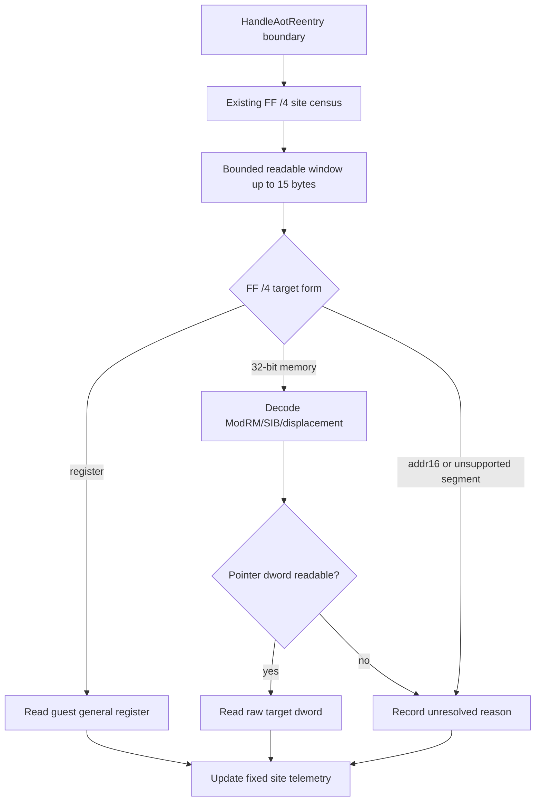

# 20260830-531 pumpipx3 FF /4 displacement·resolved target 귀속 설계

## 목적

Task 530은 `pumpipx3`에서 반복되는 AOT `FF /4`가 특정 guest EIP에 집중되며, 특히
`0x010EF6DE`가 late-drop 구간의 대부분을 차지한다는 사실을 확인했습니다. 그러나
`FF /4`가 어느 displacement를 사용하고, indirect target으로 어떤 dword를 읽는지는
아직 확인하지 못했습니다.

이번 단위의 목적은 기존 site·addressing-mode 관측 결과에 displacement, operand pointer,
읽힌 target을 추가하여 두 타이틀의 차이를 더 좁히는 것입니다. 관측은 원본 EXE의 실행,
AOT cache, guest register, guest memory의 값을 변경하지 않아야 합니다.

## 확인된 실행 지점과 제약

`HandleAotReentry`는 boundary guest EIP와 읽기 가능한 instruction window를 확보하고,
`RecordAotOtherBoundarySample`은 `kOther` boundary를 `AotFfBoundaryAttribution`에
기록합니다. 다만 기존 window는 최대 4바이트이므로 `CS:FF /4`의 SIB와 displacement를
완전히 담지 못할 수 있습니다.

이번 evaluator는 해당 guest EIP에서 runtime guest memory 범위 안의 최대 15바이트만
추가로 읽습니다. 이는 x86 legacy instruction의 bounded observation window이며, 전체
명령어를 실행하거나 decoder 상태를 변경하지 않습니다. 필요한 바이트가 없으면
`instruction truncated`로 기록합니다.

## 설계

### target decode

site census와 중복되지 않도록 `aot_ff_boundary_target_attribution.{h,cpp}`를 별도
하위 시스템으로 둡니다. evaluator는 동일한 legacy-prefix 규칙으로 다음을 판별합니다.

* `FF` 뒤 ModRM이 없으면 truncated입니다.
* ModRM reg field가 4가 아니면 target evaluator 대상이 아닙니다.
* `67` 주소 크기 prefix는 현재 32-bit target 계산에서 지원하지 않고 unresolved로 둡니다.
* `mod=3`은 guest general register에서 target을 읽습니다.
* 32-bit memory form은 ModRM/SIB와 `disp8` sign extension 또는 `disp32`를 계산합니다.
* 관측된 `CS` override(`2E`)와 기본 flat path는 segment base 0으로 처리합니다. 다른
  명시적 segment override는 selector 의미를 추측하지 않고 unresolved로 둡니다.

memory form의 effective pointer가 guest runtime 범위에서 dword read 가능할 때만 읽힌
값을 resolved target으로 기록합니다. target 값 자체가 실행 가능한 주소인지 여부는
이번 단위의 판단 대상이 아니며, raw dword로 보존합니다.

### 고정 상태와 실패 집계

기존 fixed 32-slot site table을 유지합니다. 각 site에 마지막 displacement, operand
pointer, target, target read/failure count, displacement 변화 count, target 변화 count를
추가합니다. site overflow로 slot을 확보하지 못한 표본은 기존 overflow에만 포함하고
target 상태를 임의의 slot에 귀속하지 않습니다.

전역 상태에는 resolved/unresolved 합계와 truncated, unsupported, unreadable breakdown을
추가합니다. unresolved 표본에서도 이전의 마지막 resolved 값은 지우지 않으며, live
출력에서 마지막 값과 실패 횟수를 함께 표시합니다.

### live 출력과 probe

기존 `[repiu-live-ff]`와 `[repiu-live-ff-site]`의 의미를 유지하되 site line에 마지막
displacement(`d`), operand pointer(`p`), target(`t`), resolved/failure/change 수를
추가합니다. 표본마다 formatted logging을 수행하지 않고 기존처럼 frame snapshot에서
상위 8개 site를 formatter로 출력합니다.

probe는 register, absolute/SIB displacement, truncated, address-size prefix,
unreadable path를 합성 입력으로 검증하고, 실제 고정 site에 target 변화가 누적되는지
확인합니다.

## 불변 조건

* 원본 guest register, memory, EIP, EFLAGS, cache target, HLE 결과를 변경하지 않습니다.
* guest memory는 이미 runtime 범위 검사를 통과한 읽기만 수행합니다.
* instruction observation window는 최대 15바이트로 제한합니다.
* unsupported 또는 unreadable 상황에서 target을 추정하지 않습니다.
* 기존 FF group/sample/site count와 overflow 의미를 변경하지 않습니다.

## 검증 계획

1. Windows AOT probe에서 pure decode와 실제 fixed-site target accumulation을 검증합니다.
2. Linux i386 Release build를 수행합니다.
3. 동일한 trace-free 60초 조건으로 `pumpipx3`, `pumpit1`을 다시 실행합니다.
4. #3/#4/#5 live snapshot에서 dominant site의 displacement, pointer, target, resolved /
   unresolved count를 비교합니다.
5. 측정 결과는 analysis와 work log에 확인됨·추정·미확정으로 구분해 기록합니다.

---

# 20260830-531 Design: pumpipx3 FF /4 Displacement and Resolved-Target Attribution

## Objective

Task 530 established that the repeated AOT `FF /4` samples in `pumpipx3` concentrate at
specific guest EIPs, with `0x010EF6DE` dominating the late-drop interval. It did not yet
identify the displacement or dword target read by those indirect transfers.

This unit adds displacement, operand-pointer, and raw target observation to the existing site
and addressing-mode census. It must not modify original EXE execution, the AOT cache, guest
registers, or guest memory.

## Execution point and constraints

`HandleAotReentry` already has the boundary guest EIP and a readable instruction window, and
`RecordAotOtherBoundarySample` records `kOther` boundaries in `AotFfBoundaryAttribution`.
The established window is at most four bytes, so it may not contain the complete SIB and
displacement of a `CS:FF /4` instruction.

The evaluator rereads at most 15 readable bytes from the same guest EIP. This is a bounded
observation window for legacy x86 instructions; it does not execute the instruction or mutate
decoder state. Missing bytes are recorded as `instruction truncated`.

## Design

The target evaluator is separated into `aot_ff_boundary_target_attribution.{h,cpp}`. It uses
the same bounded legacy-prefix rules as the site census:

* Missing ModRM after `FF` is truncated.
* Only ModRM reg field 4 is a target-attribution candidate.
* Address-size prefix `67` is unresolved because this evaluator supports 32-bit addressing only.
* `mod=3` reads the target from the guest general register.
* 32-bit memory forms decode ModRM/SIB and sign-extend `disp8` or read `disp32`.
* The observed `CS` override (`2E`) and the default flat path use segment base zero. Other
  explicit segment overrides fail closed as unresolved rather than guessing selector meaning.

For a memory form, the effective pointer must be readable for a guest dword before the raw
target dword is recorded. Whether that dword is executable is outside this unit; it remains a
raw target observation.

The existing fixed 32-slot site table is retained. Each site gains the last displacement,
operand pointer, target, target-read/failure counts, displacement-change count, and
target-change count. Samples that cannot obtain a site slot contribute only to the established
overflow counter and are not attributed to an arbitrary target slot.

Global resolved/unresolved totals and truncated, unsupported, and unreadable breakdowns are
added. An unresolved sample does not erase the previous resolved values; live output shows the
last values and failure counts.

The existing `[repiu-live-ff]` and `[repiu-live-ff-site]` meanings remain intact. Site lines
add the last displacement (`d`), operand pointer (`p`), target (`t`), and resolution/change
counters. Formatting remains snapshot-based for the top eight sites; no formatted logging is
performed per sample.

## Invariants

* Do not modify guest registers, memory, EIP, EFLAGS, cache targets, or HLE results.
* Only read guest memory after the existing runtime-range check succeeds.
* Limit the observation window to 15 bytes.
* Never infer a target for unsupported or unreadable forms.
* Preserve existing FF-group, sample, site, and overflow meanings.

## Verification plan

1. Verify pure decode and fixed-site target accumulation in the Windows AOT probe.
2. Build Linux i386 Release.
3. Rerun `pumpipx3` and `pumpit1` for 60 seconds under identical trace-free conditions.
4. Compare displacement, pointer, target, and resolved/unresolved counts for the dominant sites
   in the #3/#4/#5 live snapshots.
5. Record confirmed, inferred, and unresolved results in the analysis and work log.
