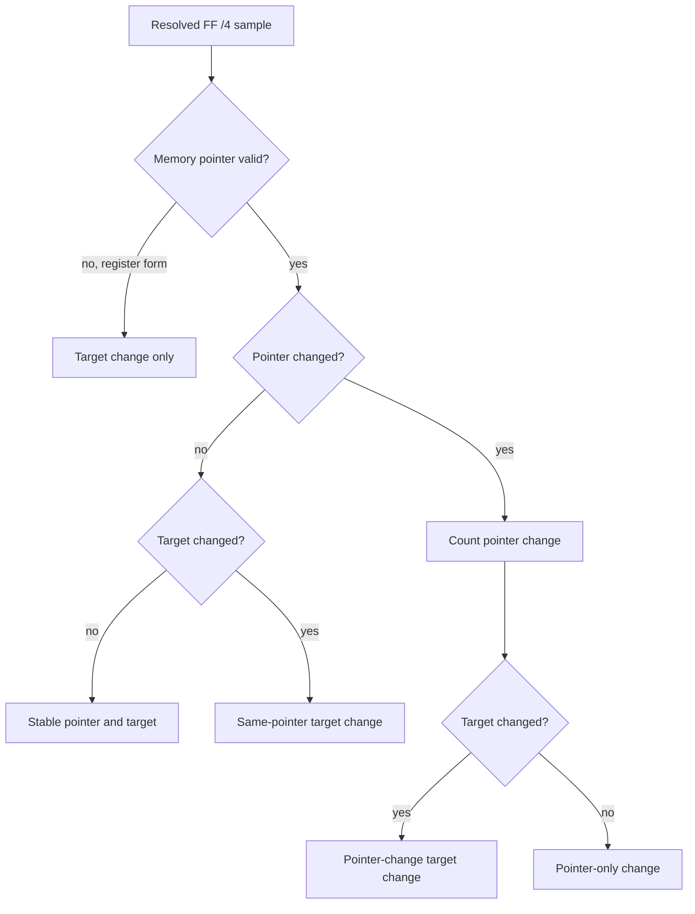

# 20260830-532 pumpipx3 FF /4 pointer·target 변화 분리 관측 설계

## 목적

Task 531은 `FF /4`의 displacement, runtime operand pointer, raw target을 관측했습니다.
그러나 site별 `target_change_count`만으로는 두 가지가 구분되지 않습니다.

1. register index가 바뀌어 다른 jump-table entry를 읽은 경우
2. 같은 pointer를 읽었지만 해당 table entry의 dword가 바뀐 경우

이번 단위는 이 두 원인을 관측 상태에서 분리합니다. 분리 결과가 확보되기 전에는
Task 531의 "target-table mutation" 해석을 가설로만 유지합니다.

## 범위와 불변 조건

* 기존 guest 실행, AOT dispatch, target 계산은 변경하지 않습니다.
* 기존 `FF /4` sample/site/overflow와 resolved/unresolved 의미를 유지합니다.
* 표본마다 formatted logging을 추가하지 않습니다.
* pointer 변화는 32-bit memory operand가 resolved된 표본에서만 계산합니다. register-form
  target은 pointer 변화 축에 포함하지 않습니다.
* unresolved 표본은 마지막 resolved pointer/target을 지우지 않으며, 다음 resolved 표본과
  변화 여부를 비교합니다.

## 설계

`AotFfBoundarySite`에 다음 누적 상태를 추가합니다.

* `last_pointer_address_valid`: 마지막 resolved memory operand pointer가 유효한지 표시
* `pointer_change_count`: 이전 resolved memory pointer와 현재 pointer가 다른 횟수
* `target_change_same_pointer_count`: target이 바뀌었지만 pointer는 같은 횟수
* `target_change_pointer_count`: target과 pointer가 함께 바뀐 횟수

기존 `target_change_count`는 전체 target 변화 count로 유지합니다. 따라서 다음 불변식으로
분류 결과를 검사합니다.

```text
target_change_count >=
    target_change_same_pointer_count + target_change_pointer_count
```

위 등식이 아닌 부등식인 이유는 이전 표본이 register-form이거나 pointer validity가 없는
상태일 수 있기 때문입니다. 같은 pointer에서 target만 변한 표본만이 table-entry mutation과
직접 일치하며, pointer가 함께 변한 표본은 index/register 변화의 후보입니다.



live site line에는 pointer validity와 세 분류 count를 추가합니다. probe는 같은 synthetic
 32-bit SIB instruction에서 index 0과 index 1을 번갈아 읽고, 같은 pointer의 target dword를
 변경하여 두 분류가 서로 다른 count로 누적되는지 확인합니다.

## 측정 계획

Task 531과 동일한 trace-free 60초 조건으로 `pumpipx3`, `pumpit1`을 재실행하고, #3/#4/#5
snapshot에서 다음을 비교합니다.

* site별 마지막 pointer/target
* `pointer_change_count`
* same-pointer target change와 pointer-change target change
* 기존 resolved/unresolved breakdown

정적 `repiu_aot_probe` 결과는 주소·instruction 확인에만 사용하며, pointer 변화 분류는
runtime 측정 결과로 판정합니다. writer 귀속과 per-target cycle 귀속은 이 단위에서도
확정하지 않고 다음 축으로 남깁니다.

## 검증 기준

* 기존 Task 531 probe와 새 pointer/target 분류 probe가 모두 통과합니다.
* synthetic index 변화가 pointer-change count로만, 같은 pointer의 dword 변경이
  same-pointer target-change count로 기록됩니다.
* Linux i386 Release build가 통과합니다.
* 양 타이틀에서 최소 #3/#4/#5 live snapshot을 확보합니다.
* 결과 문서에서 확인됨·추정·미확정을 분리합니다.

---

# 20260830-532 Design: Separating FF /4 Pointer and Target Changes in Pumpipx3

## Objective

Task 531 observed the displacement, runtime operand pointer, and raw target of `FF /4`, but its
per-site `target_change_count` cannot distinguish two causes:

1. the register index changed and a different jump-table entry was read; or
2. the same pointer was read while that table entry's dword changed.

This unit separates those causes in observation state. Until the split is measured, Task 531's
"target-table mutation" interpretation remains a hypothesis.

## Scope and invariants

* Do not change guest execution, AOT dispatch, or target calculation.
* Preserve existing `FF /4` sample/site/overflow and resolved/unresolved meanings.
* Do not add formatted logging per sample.
* Count pointer changes only for resolved 32-bit memory operands. Register-form targets do not
  participate in the pointer-change axis.
* An unresolved sample does not erase the last resolved pointer/target; the next resolved sample
  is compared against that state.

## Design

Add the following accumulated fields to `AotFfBoundarySite`:

* `last_pointer_address_valid`: whether the last resolved memory-operand pointer is valid
* `pointer_change_count`: resolved samples whose pointer differs from the previous resolved pointer
* `target_change_with_same_pointer_count`: target changes with an unchanged pointer
* `target_change_with_pointer_change_count`: target changes accompanied by a pointer change

Keep the existing `target_change_count` as the total target-change count. The classification is
checked with:

```text
target_change_count >=
    target_change_same_pointer_count + target_change_pointer_count
```

The relation is an inequality because the previous sample may be a register form or have no valid
pointer. A target-only change with an unchanged pointer directly matches table-entry mutation;
pointer-and-target changes are candidates for index/register changes.

The live site line adds pointer validity and the three classification counters. The probe records two
samples at one synthetic 32-bit SIB pointer, changes that pointer's target dword, and then selects a
second index to prove that the two categories accumulate separately.

## Measurement plan

Rerun both titles with Task 531's identical trace-free 60-second settings and compare at #3/#4/#5:

* last pointer/target per site
* `pointer_change_count`
* same-pointer target changes and pointer-change target changes
* existing resolved/unresolved breakdown

Use the static `repiu_aot_probe` only to confirm addresses and instructions. Decide pointer-change
classification from runtime measurements. Writer attribution and per-target cycle attribution
remain follow-up axes.

## Acceptance criteria

* Existing Task 531 probe checks and the new pointer/target classification checks pass.
* Synthetic index changes count as pointer changes, while a dword change at the same pointer counts
  as a same-pointer target change.
* Linux i386 Release build passes.
* At least #3/#4/#5 live snapshots are captured for both titles.
* Confirmed, inferred, and unresolved findings are separated in the result documents.
