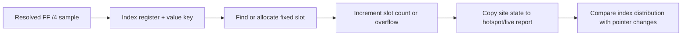

# 20260830-534 FF /4 index 값 분포 관측 설계

## 목적

Task 533은 `pumpipx3` dominant `FF /4` site의 마지막 SIB index가 EDX=7임을 확인했고,
pointer 변화 count가 index 변화 count와 일치함을 확인했습니다. 그러나 live snapshot은
마지막 index만 보존하므로 측정 window 중 `7→다른 값→7`처럼 되돌아오는 변화를 직접 확인할
수 없습니다.

이번 작업은 resolved `FF /4` sample마다 관측된 index register/value를 고정 용량 histogram에
누적하여, pointer 변화가 어떤 index 값 집합에서 발생하는지 확인합니다. 이는 Task 531의
same-pointer target-table mutation 해석을 더 검증하고, Task 533의 producer 후보를 값 분포와
대조하기 위한 관측 전용 작업입니다.

## 범위와 불변 조건

* 원본 guest code, register, memory, EIP, AOT dispatch 결과를 변경하지 않습니다.
* resolved 32-bit SIB operand에 대해서만 index histogram을 갱신합니다.
* register-form, 16-bit address-size, unsupported segment, unreadable target은 기존
  fail-closed 및 failure count 의미를 유지합니다.
* histogram은 site state와 hotspot state에 고정 용량으로 저장하며 동적 할당을 사용하지
  않습니다.
* 새 표본마다 formatted logging을 수행하지 않습니다.
* histogram은 pointer/target change count를 대체하지 않고, 그 원인 후보를 분류하는 보조
  관측값으로만 사용합니다.

## 설계

`AotFfBoundarySite`에 최대 8개의 index observation slot을 추가합니다. 각 slot은 index
register 번호, index 값, 해당 조합의 resolved sample count를 보존합니다. 새로운 조합이
용량 안에서 발견되면 slot을 추가하고, 기존 조합이면 count를 증가시킵니다. 용량을 넘는
조합은 `index_value_observation_overflow_count`로 세어 histogram이 불완전함을 명시합니다.

hotspot ranking은 site의 histogram을 그대로 복사합니다. live site line에는 slot 수,
overflow count, 각 slot의 `register:value:count`를 추가하여 종료 시점의 분포를 확인할 수
있게 합니다. 빈 slot은 count 0으로 표시하며 기존 fixed hotspot capacity와 line buffer
제한을 확인합니다.

index component가 존재하는 site에서 다음 불변 관계를 검사합니다.

```text
sum(index_slot.count) + index_value_observation_overflow_count
    == index_value_observation_sample_count
pointer_change_count == index_value_change_count
```

첫 관계가 성립하면 index component가 있는 resolved sample이 histogram에 누락되지 않았다는
뜻입니다. base-only 또는 index가 없는 resolved operand는 `target_read_count`에는 포함되지만
`index_value_observation_sample_count`에는 포함되지 않습니다. 두 번째 관계는 Task 533의
component 분류를 계속 검증합니다. Histogram만으로 register 값을 만든 producer instruction이나
guest memory writer를 확정하지는 않습니다.



## 측정 계획

Task 533과 동일한 trace-free 60초 조건으로 `pumpipx3`와 `pumpit1`을 다시 실행하고,
dominant site에서 다음을 비교합니다.

* index register/value별 관측 count와 distinct slot 수
* histogram count 합계 및 overflow
* pointer/index/target change count
* 마지막 index와 histogram의 일치 여부
* static jump-table index 및 Task 533 producer 후보와의 대응

이번 작업에서도 resolved target instruction의 순수 cycle 비용은 측정하지 않습니다. 분포가
확인된 뒤 별도 timing boundary에서 target 실행 구간을 분리합니다.

## 검증 기준

* synthetic probe에서 동일 index 재관측은 하나의 slot count만 증가합니다.
* synthetic probe에서 두 번째 index는 새 slot으로 기록되고 overflow는 증가하지 않습니다.
* index histogram count 합계가 index component observation sample count와 일치합니다.
* 기존 Task 533 probe, Win32 x86 Debug build, Linux i386 Release build가 통과합니다.
* 두 title의 실제 histogram과 confirmed/inferred/unresolved 결과가 작업 로그와 analysis
  문서에 기록됩니다.

---

# 20260830-534 Design: FF /4 Index-Value Distribution Observation

## Objective

Task 533 confirmed that the last SIB index at the dominant pumpipx3 `FF /4` site was EDX=7 and
that pointer changes matched index changes. A live snapshot keeps only the last index, so it cannot
show a transient `7→other→7` sequence within one measurement window.

This unit accumulates a fixed-capacity histogram of resolved `FF /4` index register/value pairs.
The goal is to identify the set of index values behind pointer changes, further test Task 531's
same-pointer target-table mutation interpretation, and compare the value distribution with Task
533's producer candidate. This remains observational only.

## Scope and invariants

* Do not change original guest code, registers, memory, EIP, or AOT dispatch results.
* Update the index histogram only for resolved 32-bit SIB operands.
* Preserve existing fail-closed behavior and failure counters for register form, 16-bit address
  size, unsupported segments, and unreadable targets.
* Store the histogram in fixed-capacity site and hotspot state without dynamic allocation.
* Do not format a log line for every sample.
* Treat the histogram as supporting evidence; it does not replace pointer/target change counts or
  prove a producer instruction or guest memory writer.

## Design

Add up to eight index observation slots to `AotFfBoundarySite`. Each slot stores an index register
number, index value, and resolved-sample count for that pair. A new pair allocates a slot while
capacity remains; an existing pair increments its count. Additional pairs increment
`index_value_observation_overflow_count` so an incomplete histogram is explicit.

Ranking copies the histogram from site to hotspot. The live site line adds the slot count, overflow
count, and each slot's `register:value:count`. Empty slots have count zero. Existing fixed hotspot
capacity and line-buffer limits remain in force.

For each site with an index component, verify:

```text
sum(index_slot.count) + index_value_observation_overflow_count
    == index_value_observation_sample_count
pointer_change_count == index_value_change_count
```

The first relation shows that resolved samples with an index component were not omitted from the
histogram. Base-only or index-free resolved operands remain in `target_read_count` but not in
`index_value_observation_sample_count`. The second relation continues Task 533's component
classification. The histogram alone does not identify the producer of the register value or a
guest memory writer.

## Measurement plan

Rerun both titles under Task 533's identical trace-free 60-second conditions and compare index
register/value counts, distinct slots, overflow, pointer/index/target changes, last index, and
static jump-table/producer correlation. Pure resolved-target instruction cycles remain deferred to
a separate timing-boundary unit.

## Acceptance criteria

* Repeating one index in the synthetic probe increments one slot count.
* A second index creates a new slot without increasing overflow.
* Index histogram counts sum to index-component observation counts.
* Existing Task 533 checks, the Win32 x86 Debug build, and the Linux i386 Release build pass.
* Runtime histograms and confirmed, inferred, and unresolved findings are recorded in the work log
  and analysis documents.
