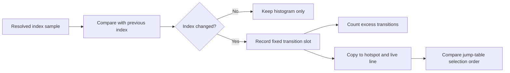

# 20260830-535 FF /4 index 전환 순서 관측 설계

## 목적

Task 534는 `pumpipx3` dominant site에서 EDX=0과 EDX=7, `pumpit1` site에서 EAX=3과 EAX=2가
관측된다는 것을 확인했습니다. 그러나 histogram은 값의 빈도만 보존하므로 값이 어떤 순서로
전환되었는지, 한 번 전환된 뒤 되돌아왔는지를 확인할 수 없습니다.

이번 작업은 index 값이 실제로 변경될 때마다 고정 용량 transition trace에 이전 값과 현재
값을 기록합니다. 이를 통해 두 title의 jump-table 선택 패턴을 비교하고, pointer/target 변화
count의 의미를 더 좁힙니다.

## 범위와 불변 조건

* 원본 guest code, register, memory, EIP, AOT dispatch 결과를 변경하지 않습니다.
* 두 sample 모두 유효한 resolved SIB index component이고 값 또는 register가 달라진 경우에만
  transition을 기록합니다.
* register-form, 16-bit address-size, unsupported segment, unreadable target은 기존
  fail-closed 및 failure count 의미를 유지합니다.
* site와 hotspot에 최대 32개의 transition을 고정 저장하고, 초과 transition은 별도 count로
  표시합니다. 동적 할당은 사용하지 않습니다.
* sample마다 formatted logging을 수행하지 않습니다.
* transition trace는 pointer/target change count의 보조 관측이며 producer나 guest writer를
  확정하는 증거로 사용하지 않습니다.

## 설계

`AotFfBoundarySite`에 이전 index register/value와 현재 index register/value를 담는 transition
slot을 최대 32개 추가합니다. index 값 변경이 발생하면 전체 transition count를 증가시키고,
slot 여유가 있으면 trace에 저장하며, 용량을 넘으면 overflow sample count만 증가시킵니다.
기존 Task 534 histogram은 계속 유지합니다.

hotspot ranking은 transition trace를 site에서 그대로 복사합니다. live site line에는 전체
transition count, 저장 slot 수, overflow count, 저장된 각 transition의
`from-register/from-value>to-register/to-value`를 추가합니다.

각 index-bearing site에서 다음 관계를 검사합니다.

```text
index_transition_count == index_value_change_count
index_transition_slot_count + index_transition_overflow_count
    == index_transition_count
```

첫 관계는 transition hook이 기존 component-change 판정과 같은 사건을 기록하는지 확인합니다.
두 번째 관계는 trace가 용량 초과로 잘렸는지를 확인합니다. transition 순서만으로 register
producer instruction이나 guest memory writer를 확정하지는 않습니다.



## 측정 계획

Task 534와 동일한 trace-free 60초 조건으로 두 title을 실행하고 dominant site에서 다음을
추출합니다.

* transition 순서와 from/to index 값
* transition count, slot count, overflow
* histogram 분포와 pointer/index/target change count
* pumpipx3의 index 0/7 target과 pumpit1의 index 2/3 target 대응

이번 작업에서도 순수 target instruction cycle 비용은 측정하지 않습니다. transition 순서가
확인된 후 별도 timing boundary에서 target 실행 구간을 분리합니다.

## 검증 기준

* synthetic probe에서 동일 index 반복은 transition을 만들지 않습니다.
* synthetic probe에서 EDX=0→EDX=1 변경은 transition 하나로 기록됩니다.
* transition count가 index value change count와 일치합니다.
* transition slot 합계와 overflow 합계가 전체 transition count와 일치합니다.
* 기존 Task 534 probe, Win32 x86 Debug build, Linux i386 Release build가 통과합니다.
* 두 title의 transition 결과와 confirmed/inferred/unresolved 결과가 문서에 기록됩니다.

---

# 20260830-535 Design: FF /4 Index Transition Order Observation

## Objective

Task 534 confirmed EDX=0 and EDX=7 at the dominant pumpipx3 site, and EAX=3 and EAX=2 at the
pumpit1 site. Its histogram preserves frequencies only, so it cannot show transition order or
whether a value returns after a transient change.

This unit records the previous and current index register/value whenever a valid resolved SIB index
changes. The fixed transition trace compares jump-table selection patterns between the two titles
and narrows the meaning of pointer/target change counts.

## Scope and invariants

* Do not change original guest code, registers, memory, EIP, or AOT dispatch results.
* Record a transition only when both samples have valid resolved SIB index components and the
  register or value changes.
* Preserve existing fail-closed behavior and failure counters for register form, 16-bit address
  size, unsupported segments, and unreadable targets.
* Store at most 32 transitions per site and hotspot; count excess transitions separately without
  dynamic allocation.
* Do not format a log line for every sample.
* Treat the transition trace as supporting evidence, not proof of a producer or guest writer.

## Design

Add up to 32 transition slots to `AotFfBoundarySite`, each storing the previous and current index
register/value. Every index change increments the total transition count. If capacity remains, the
transition is stored; otherwise only the overflow sample count increases. Task 534's histogram is
retained.

Hotspot ranking copies the transition trace. The live site line reports total transitions, stored
slots, overflow count, and each stored transition as
`from-register/from-value>to-register/to-value`.

For each index-bearing site, verify:

```text
index_transition_count == index_value_change_count
index_transition_slot_count + index_transition_overflow_count
    == index_transition_count
```

The first relation verifies that transition recording matches the existing component-change event.
The second shows whether the trace was truncated by capacity. Transition order alone does not prove
the producer instruction or guest memory writer.

## Measurement plan

Rerun both titles under Task 534's identical trace-free 60-second conditions. Extract transition
order, counts, overflow, histogram distribution, pointer/index/target changes, and the corresponding
pumpipx3 and pumpit1 jump-table targets. Pure target-instruction cycles remain deferred to a
separate timing-boundary unit.

## Acceptance criteria

* Repeating one index creates no transition.
* EDX=0→EDX=1 in the synthetic probe creates one transition.
* Transition count equals index-value change count.
* Stored plus overflow transitions equal total transitions.
* Existing Task 534 checks, the Win32 x86 Debug build, and the Linux i386 Release build pass.
* Runtime transition results and confirmed, inferred, and unresolved findings are documented.
