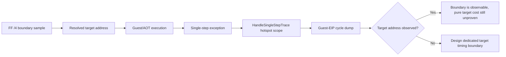

# 20260830-536 FF /4 target hotspot timing 경계 확인 설계

## 목적

Task 535는 `pumpipx3`의 `0↔7`, `pumpit1`의 `3↔2` FF /4 index 선택 순서를 확인했지만,
resolved target instruction 자체의 cycle 비용은 아직 측정하지 않았습니다. 현재 저장소에는
`HandleSingleStepTrace`의 guest EIP별 `SingleStepHotspotProfile`이 이미 있으므로, 먼저 이
기존 timing 경계가 FF /4 target 주소를 실제로 관측하는지 확인합니다.

이번 작업은 target cycle 비용을 주장하는 작업이 아니라, 기존 계측의 관측 범위와 다음 전용
timing boundary의 필요 여부를 판정하는 reconnaissance입니다.

## 범위와 불변식

* 원본 guest code, register, memory, EIP, AOT dispatch 결과를 변경하지 않습니다.
* `REPIU_SINGLE_STEP_HOTSPOT_PROFILE=1`과 dump 경로만 활성화하고 기존 실행 조건을 유지합니다.
* `pumpipx3` target 후보 `0x010EF6E6`, `0x010EF8E9`와 `pumpit1` target 후보
  `0x010F1CFD`, `0x010F1CF4`가 hotspot dump에 나타나는지 확인합니다.
* dump의 `sample_count`, `total_cycles`, outcome/stage 분포는 관측 사실로만 기록합니다.
* `SingleStepHotspotCycleScope`의 handler window를 target instruction 자체의 순수 cycle로
  명명하지 않습니다.
* dump 미생성, target 주소 미관측, timeout cleanup 실패를 target resolution 실패와
  구분합니다.

## 기존 경계 모델

`SingleStepHotspotCycleScope`는 single-step exception에서 `HandleSingleStepTrace` 전체를
측정합니다. 따라서 target 주소가 dump에 있어도 그 값은 target instruction만의 비용이
아니라 해당 EIP에서 수행된 handler/재진입 작업의 비용입니다.



## 측정 계획

Task 535와 동일한 60초 runtime 조건에 다음 두 profile 설정을 추가합니다.

```text
REPIU_SINGLE_STEP_HOTSPOT_PROFILE=1
REPIU_SINGLE_STEP_HOTSPOT_DUMP=/mnt/c/Users/nworkers/AppData/Local/Temp/repiu_task536_<title>_hotspot.txt
```

각 dump에서 네 target 후보의 entry 존재 여부, sample count, total/max cycles, outcome 및
stage count를 추출합니다. FF live line의 resolved/transition 결과와 함께 비교하되,
hotspot cycle을 순수 target cycle로 환산하지 않습니다.

## 판정 기준

* 두 title의 dump가 생성되어야 합니다.
* target 후보 주소가 관측되면 기존 경계가 해당 주소를 포착한다는 것만 확인합니다.
* target 후보 주소가 관측되지 않으면 기존 hotspot profile은 이 target 비용 질문에 부적합한
  것으로 판정합니다.
* 어느 경우에도 pure target cycle cost 또는 late drop causality를 확정하지 않습니다.
* 결과, cleanup 상태, 다음 timing boundary 필요 여부를 analysis와 work-log에 기록합니다.

---

# 20260830-536 Design: FF /4 Target Hotspot Timing-Boundary Check

## Objective

Task 535 confirmed the `0↔7` pumpipx3 and `3↔2` pumpit1 FF /4 index-selection order, but it
did not measure the cycle cost of the resolved target instruction. The repository already has a
guest-EIP `SingleStepHotspotProfile` around `HandleSingleStepTrace`, so this unit checks whether
that existing timing boundary observes the resolved target addresses.

This is a reconnaissance unit. It does not claim target cycle cost; it decides whether a dedicated
timing boundary is required.

## Scope and invariants

* Do not change original guest code, registers, memory, EIP, or AOT dispatch results.
* Enable only the single-step hotspot profile and dump path while preserving Task 535 runtime
  conditions.
* Check for pumpipx3 target candidates `0x010EF6E6`, `0x010EF8E9` and pumpit1 target candidates
  `0x010F1CFD`, `0x010F1CF4` in the dumps.
* Treat dump sample counts, cycles, outcomes, and stages as observations only.
* Do not name the `SingleStepHotspotCycleScope` handler window as pure target-instruction cycles.
* Distinguish missing dumps, unobserved targets, and timeout cleanup failures from target-resolution
  failures.

## Existing boundary model

`SingleStepHotspotCycleScope` measures the whole `HandleSingleStepTrace` call at a single-step
exception. Even if a target address appears in the dump, its value is the handler/re-entry window
at that EIP, not the pure target instruction cost.

## Measurement plan

Add these settings to the identical 60-second runtime conditions used by Task 535:

```text
REPIU_SINGLE_STEP_HOTSPOT_PROFILE=1
REPIU_SINGLE_STEP_HOTSPOT_DUMP=/mnt/c/Users/nworkers/AppData/Local/Temp/repiu_task536_<title>_hotspot.txt
```

For each dump, extract whether the four target candidates are present, with sample count,
total/max cycles, outcome counts, and stage counts. Compare these facts with the resolved/transition
FF live lines without converting hotspot cycles into pure target cycles.

## Decision criteria

* Both title dumps must be generated.
* If a target candidate appears, conclude only that the existing boundary observes that address.
* If no target candidate appears, conclude that the existing hotspot profile is unsuitable for this
  target-cost question.
* In neither case claim pure target cycle cost or late-drop causality.
* Record results, cleanup state, and whether a dedicated timing boundary is required.
