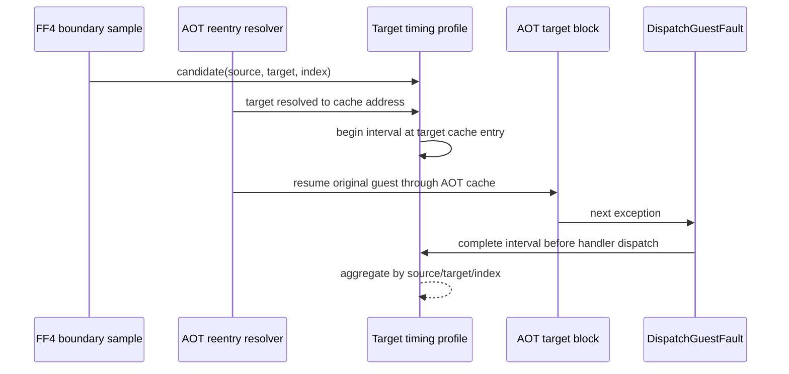

# 20260830-537 FF4 AOT 대상 구간 계측 설계

## 목적

Task 536에서 기존 `SingleStepHotspotProfile`이 FF4가 해석한 대상 주소를 관측하지
않는다는 사실을 확인했습니다. 다음 단계에서는 원본 FF4 명령어를 실행한 뒤 해석된
게스트 대상이 AOT 캐시로 재진입한 시점부터 다음 예외가 `DispatchGuestFault`에
도착한 시점까지를 별도 계측합니다.

이 값은 대상 블록만의 순수 명령어 사이클이 아닙니다. AOT 대상 블록, 그 블록이
발생시킨 예외, 호스트의 예외 진입 경로가 함께 포함될 수 있으므로 보고서와 분석
문서에서 `AOT target interval`로만 부릅니다.

## 설계 원칙

* 원본 게스트 코드와 FF4 명령어는 수정하지 않습니다.
* 계측 상태는 `AotFfBoundaryAttribution`에 연결하되, 시간 구간의 자료구조와
  갱신 함수는 `aot_ff_target_timing` 전용 파일로 분리합니다.
* 동적 컨테이너와 파일 I/O를 사용하지 않고 고정된 16개 key 슬롯으로 제한합니다.
* `REPIU_AOT_FF_TARGET_TIMING=1`일 때만 cycle counter를 읽습니다.
* key는 source guest EIP, resolved target guest EIP, AOT cache target,
  index register/value로 구성하여 pumpipx3의 index 0/7과 pumpit1의 index 2/3을
  분리합니다.
* 다음 예외가 없으면 해당 구간은 완료되지 않은 active interval로 남깁니다.
* 완료된 구간의 cycle 값은 대상 코드 자체의 비용으로 해석하지 않습니다.

## 경계와 상태 흐름

후보는 `RecordAotFfBoundaryTargetSample`이 실제 메모리 indirect target을 읽어
성공했을 때만 설정합니다. 이후 single-step 경로가 동일한 target을
`ResolveAotTransferTarget`로 AOT cache 주소에 연결할 때 interval을 시작합니다.
후보와 target이 맞지 않으면 후보를 폐기하고 mismatch를 세어 stale attribution을
숨기지 않습니다.

구간 종료는 모든 예외의 공통 진입점인 `DispatchGuestFault`의 초기에 둡니다. 따라서
종료 cycle은 특정 예외 처리기나 cleanup 성공 여부에 종속되지 않으며, 해당 공통
진입점까지의 구간이라는 뜻을 유지합니다.

## 출력과 검증

live profile에는 기존 FF site 긴 라인과 분리된 `[repiu-live-ff-target]` 라인을
추가합니다. 이 라인은 시작 수, 완료 수, active/candidate 상태, mismatch 및
overflow, 그리고 유효한 key별 count/total/min/max를 출력합니다.

합성 AOT probe에서는 후보 설정, target match, 100 cycle 완료, key별 aggregate를
검증합니다. 실제 ROM 실행에서는 두 타이틀을 같은 Task 536 조건으로 실행하고,
완료 수와 active 수를 함께 기록합니다. 측정 결과가 0이거나 active로 남는 경우에도
그 사실을 target resolution 실패와 구분하여 문서화합니다.

---

# 20260830-537 Design: FF4 AOT Target-Interval Timing

## Objective

Task 536 established that the existing `SingleStepHotspotProfile` does not observe the
resolved target addresses produced by FF4 attribution. This task adds a separate interval
measurement from the point where that guest target is resolved to an AOT cache entry until
the next exception reaches `DispatchGuestFault`.

This is not a pure instruction-cycle measurement of the target. It may include the AOT
target block, the exception it raises, and host exception-entry work. The reports and
analysis therefore call it only an `AOT target interval`.

## Design rules

* Do not modify guest code or the original FF4 instruction.
* Attach the profile to `AotFfBoundaryAttribution`, while keeping the timing data
  structure and update functions in dedicated `aot_ff_target_timing` files.
* Use no dynamic containers or file I/O; cap the aggregate at 16 fixed key slots.
* Read the cycle counter only when `REPIU_AOT_FF_TARGET_TIMING=1` is set.
* Key records by source guest EIP, resolved target guest EIP, AOT cache target, and index
  register/value so pumpipx3 indices 0/7 and pumpit1 indices 2/3 remain distinct.
* Leave an interval active when no following exception arrives.
* Never interpret a completed interval as the cost of target code alone.

## Boundaries and state flow

The FF4 target sampler creates a candidate only after it successfully reads the indirect
target. The single-step reentry path starts the interval when the same target resolves to
an AOT cache address. A mismatch is discarded and counted. The common fault dispatcher
closes the interval before any exception handler runs, making the boundary independent of
which handler or cleanup path eventually claims the fault.

## Output and verification

Live profiling adds a separate `[repiu-live-ff-target]` line containing started/completed
counts, active/candidate state, mismatch and overflow counts, and per-key count/total/min/max.
The synthetic AOT probe verifies one matching 100-cycle interval and its aggregate. Real
ROM runs repeat the Task 536 conditions for both titles and record completion and active
counts. A zero or active-only result is documented separately from target-resolution
failure.
