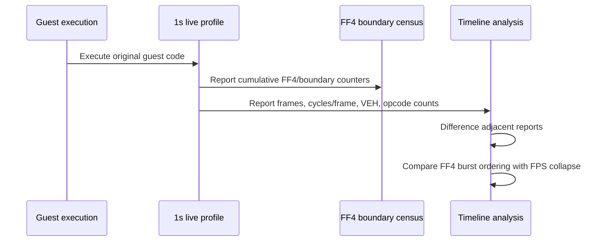

# Task 538: FF4 급증과 후반 성능 하락의 시간축 설계

## 한국어

### 목적

Task 537에서 `pumpipx3`의 FF4 해결 대상 수가 초반 약 2.8천 회에서 후반 약 15.8천 회로 증가하는 현상은 확인했지만, 10초 누적창만으로는 FF4 증가와 FPS 하락의 정확한 선후관계를 확정할 수 없습니다. 이 작업에서는 기존 실행 경로와 계측 코드를 유지한 채 라이브 프로파일 보고 간격만 1초로 줄여 두 현상을 같은 시간축에서 비교합니다.

### 측정 범위

- 대상: `pumpipx3`, 비교 기준: `pumpit1`
- 기존 Task 537 계측 활성화: `REPIU_AOT_FF_TARGET_TIMING=1`
- 라이브 프로파일 간격: `REPIU_LIVE_PROFILE_INTERVAL_MS=1000`
- 기존 실행시간 계측 활성화: `REPIU_EXECUTION_TIME_PROFILE=1`
- 각 타이틀은 동일한 60초 실행 조건으로 측정합니다.
- 로그는 셸 리다이렉션으로 직접 파일에 저장하여 콘솔 출력 병목을 피합니다.

### 판정 방법

라이브 출력은 누적 카운터이므로 인접한 보고 행의 차이를 계산합니다.

- `FF4 delta`: `repiu-live-ff-site`의 `samples` 차이
- `boundary delta`: `repiu-live-aot`의 `boundary` 차이
- `CD delta`: `repiu-live-opcode`의 `CD` 차이
- 성능: 해당 창의 `frames`, `cycles_per_frame`, `veh` 및 별도 frame-rate 출력

첫 번째 FF4 delta 급증 시점과 FPS가 지속적으로 낮아지는 시점을 비교합니다. FF4 증가가 먼저인지, 성능 하락이 먼저인지, 또는 같은 창에서만 관찰되는지를 기록하며, 시간적 선후관계만으로 인과관계를 단정하지 않습니다.

### 실행 흐름

### 성공 기준

1. 두 실행 파일에서 1초 간격 라이브 프로파일 로그를 확보합니다.
2. `pumpipx3`에서 FF4 delta가 증가하는 최초 구간과 FPS 하락 구간을 식별합니다.
3. `pumpit1`에서 동일한 FF4 급증이 없는지 비교합니다.
4. 결과를 확인됨/추정/미확정으로 구분하여 누적 분석 문서와 작업 로그에 반영합니다.

## English

### Purpose

Task 537 confirmed that `pumpipx3` FF4 resolved-target samples grow from roughly 2.8 thousand early to roughly 15.8 thousand late, but ten-second cumulative windows cannot establish the exact ordering between the FF4 increase and the FPS drop. This task keeps the guest execution path and instrumentation unchanged and reduces only the live profile interval to one second so both events can be compared on the same timeline.

### Measurement scope

- Target: `pumpipx3`; comparison baseline: `pumpit1`
- Keep Task 537 instrumentation enabled with `REPIU_AOT_FF_TARGET_TIMING=1`.
- Live profile interval: `REPIU_LIVE_PROFILE_INTERVAL_MS=1000`
- Keep execution profiling enabled with `REPIU_EXECUTION_TIME_PROFILE=1`.
- Run each title for the same 60-second duration.
- Redirect output directly to files to avoid console-output bottlenecks.

### Decision method

Live output is cumulative, so adjacent rows are differenced.

- `FF4 delta`: difference of `samples` from `repiu-live-ff-site`
- `boundary delta`: difference of `boundary` from `repiu-live-aot`
- `CD delta`: difference of `CD` from `repiu-live-opcode`
- Performance: window `frames`, `cycles_per_frame`, `veh`, and separate frame-rate output

Compare the first FF4 delta burst with the interval where FPS becomes persistently low. Record whether FF4 rises first, the performance drop rises first, or both are only visible in the same window. Temporal ordering alone must not be treated as proof of causality.

### Success criteria

1. Obtain one-second live-profile logs for both executables.
2. Identify the first `pumpipx3` interval with an FF4 delta increase and the FPS-degradation interval.
3. Compare whether `pumpit1` shows the same FF4 burst.
4. Record confirmed, inferred, and unresolved findings in the cumulative analysis and work log.
