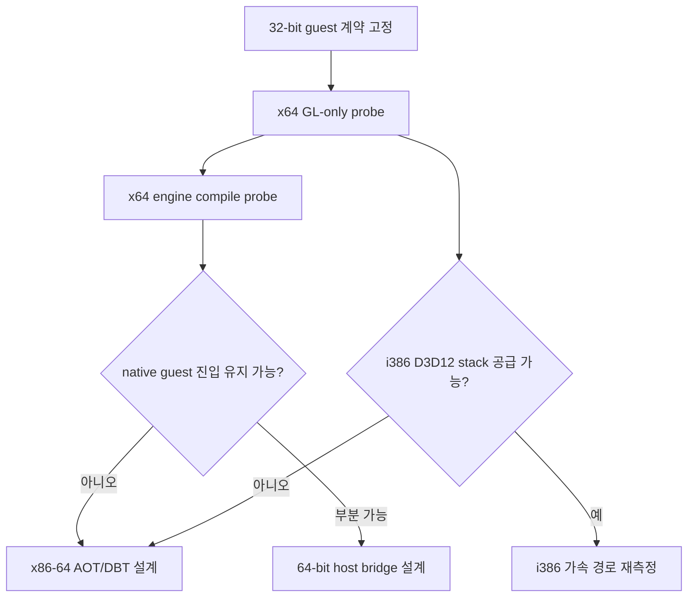

# 20260830-542 Linux x64 host 전환 타당성 설계

## 한국어

### 결정 요약

Linux x64 host 전환은 검토할 가치가 있습니다. 다만 목표는 원본 DOS/4G guest를
64-bit 코드로 변환하는 것이 아니라, **32-bit guest 계약을 유지하면서 host 실행
계층을 x86-64에 맞게 재설계하는 것**이어야 합니다. 현재의 32-bit native guest
실행 경로를 `-m64`만으로 재빌드하는 방식은 채택하지 않습니다.

첫 단계는 전체 포팅이 아니라 다음 두 가지 타당성 검증입니다.

1. x64 Linux 프로세스에서 WSLg D3D12 OpenGL context를 확보하는 graphics-only probe
2. x64 host에서 현재 engine을 컴파일해 architecture barrier를 분류하는 compile probe

### 보존해야 하는 guest 계약

- 원본 LE/DOS/4G image와 guest EIP/ESP/GPR은 32-bit 값으로 유지합니다.
- guest selector, segment semantics, x87 state, HLE ABI는 변경하지 않습니다.
- 원본 game logic과 guest memory layout은 64-bit host 포인터와 분리합니다.
- WSLg 가속은 host graphics process의 GL context 선택 문제로 취급합니다.

### 확인된 현재 제약

| 영역 | 현재 구현 | x64 전환 영향 |
|---|---|---|
| 빌드 | Linux script와 CMake가 `-m32` 사용 | x64 build profile 필요 |
| native entry | `IsDirectX86ExecutionSupported()`가 i386만 허용 | 현재 직접 guest 진입은 유지 불가 |
| signal context | `guest_cpu_context.cpp`가 `__i386__`와 `REG_EIP/REG_ESP`만 처리 | x86-64 `ucontext` adapter 필요 |
| stack/trampoline | GAS가 EAX/ESP/EBP와 32-bit cdecl/stdcall frame 사용 | x86-64 ABI 전용 bridge 필요 |
| AOT code cache | thunk·counter·cache 주소를 `uint32_t`로 patch하고 4 GiB 밖을 거부 | host pointer와 guest address를 분리해야 함 |
| code placement | non-PIE, fixed text/guest address range, rel32 patch | x64 code model과 relocation 정책 필요 |

### 후보 아키텍처

| 후보 | 장점 | 핵심 비용 | 판단 |
|---|---|---|---|
| x64 host + x86-64 AOT/DBT | WSLg x64 GL과 직접 결합, 장기적으로 가장 자연스러움 | native guest 진입·trampoline·code emitter·fault resume 재설계 | 장기 후보 |
| 32-bit guest + x64 renderer process | 원본 guest native 실행 보존 | Glide command/texture/LFB/frame presentation IPC 설계와 동기화 | 보조 후보 |
| i386 WSLg graphics stack 확보 | 소스 변경이 가장 작음 | 현재 Ubuntu/WSLg가 i386 D3D12 DRI와 host library를 제공하지 않음 | 우선 외부 의존성 확인 |
| x64 process 안의 직접 32-bit compatibility 실행 | guest native에 가까움 | 일반 C++ ABI, signal return, TLS, stack, loader 경계가 모두 불안정 | 채택하지 않음 |

### 권장 단계

1. graphics-only x64 probe에서 renderer를 `D3D12 (...), Accelerated: yes`로 확인합니다.
2. `-m64` compile probe를 실행하되, 소스 수정 없이 첫 barrier 목록을 얻습니다.
3. x64 host에서도 원본 guest를 직접 실행할지, x86-64 AOT/DBT로 실행할지 결정합니다.
4. 선택된 실행 모델에 맞추어 guest address(32-bit), host pointer(64-bit), emitted code
   pointer(relocation-aware)를 별도 타입과 API로 분리합니다.
5. 그 뒤에만 실제 Linux x64 실행 경로를 구현합니다.

### 이번 설계의 범위 밖

- 원본 guest instruction semantics를 C++ gameplay logic으로 재작성하는 것
- i386 D3D12 Mesa 또는 WSLg host library를 임의로 설치하는 것
- x64 포팅을 위해 원본 실행 파일을 수정하는 것

## English

### Decision summary

A Linux x64 host is worth evaluating. The goal must not be to convert the original
DOS/4G guest into 64-bit code; it must be to **keep the 32-bit guest contract while
redesigning the host execution layer for x86-64**. Rebuilding the current 32-bit native
guest path with only `-m64` is not an acceptable approach.

The first phase is two feasibility checks rather than a full port:

1. A graphics-only x64 Linux probe that obtains a WSLg D3D12 OpenGL context.
2. An x64 compile probe that classifies the current engine's architecture barriers.

### Guest contract to preserve

- Keep the original LE/DOS/4G image and guest EIP/ESP/GPR values 32-bit.
- Preserve guest selectors, segment semantics, x87 state, and the HLE ABI.
- Keep original game logic and guest memory layout separate from 64-bit host pointers.
- Treat WSLg acceleration as a host graphics-process context-selection concern.

### Confirmed current constraints

| Area | Current implementation | x64 impact |
|---|---|---|
| Build | Linux script and CMake use `-m32` | Need an x64 build profile |
| Native entry | `IsDirectX86ExecutionSupported()` accepts only i386 | Current direct guest entry cannot remain unchanged |
| Signal context | `guest_cpu_context.cpp` handles only `__i386__`, `REG_EIP`, and `REG_ESP` | Need an x86-64 `ucontext` adapter |
| Stack/trampoline | GAS uses EAX/ESP/EBP and 32-bit cdecl/stdcall frames | Need an x86-64 ABI bridge |
| AOT code cache | Patches thunk/counter/cache addresses as `uint32_t` and rejects addresses above 4 GiB | Separate host pointers from guest addresses |
| Code placement | Non-PIE, fixed text/guest ranges, and rel32 patches | Need an x64 code-model and relocation policy |

### Candidate architectures

| Candidate | Benefit | Main cost | Assessment |
|---|---|---|---|
| x64 host + x86-64 AOT/DBT | Directly fits WSLg x64 GL and is the cleanest long-term path | Redesign native entry, trampoline, code emitter, and fault resume | Long-term candidate |
| 32-bit guest + x64 renderer process | Preserves native guest execution | Requires Glide command/texture/LFB/frame-presentation IPC and synchronization | Secondary candidate |
| Obtain an i386 WSLg graphics stack | Smallest source change | Current Ubuntu/WSLg does not provide the i386 D3D12 DRI and host libraries | Check external dependency first |
| Direct 32-bit compatibility execution inside an x64 process | Closest to native guest execution | C++ ABI, signal return, TLS, stack, and loader boundaries are all unstable | Do not adopt |

### Recommended phases

1. Verify `D3D12 (...), Accelerated: yes` with a graphics-only x64 probe.
2. Run an `-m64` compile probe without source changes and obtain the first barrier list.
3. Decide whether an x64 host will use direct guest execution or x86-64 AOT/DBT.
4. Separate guest addresses (32-bit), host pointers (64-bit), and emitted-code pointers
   (relocation-aware types and APIs) according to that execution model.
5. Implement the Linux x64 execution path only after that decision.

### Out of scope for this design

- Rewriting original instruction semantics as C++ gameplay logic
- Arbitrarily installing an i386 Mesa D3D12 driver or WSLg host library
- Modifying the original executable for the x64 port
