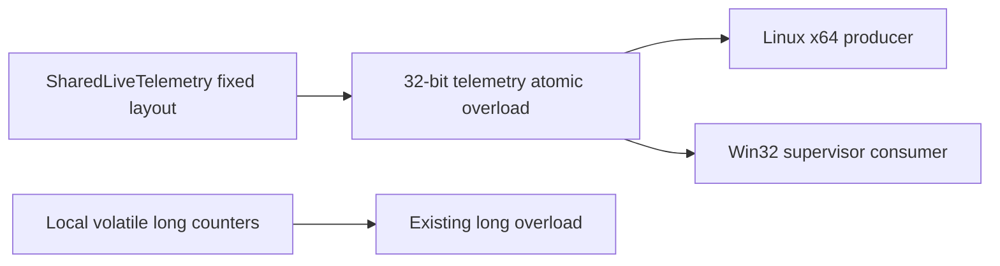

# 20260831-543 Linux x64 telemetry ABI 정규화 설계

## 한국어

### 배경

Linux x64 compile probe에서 `SharedLiveTelemetry`의 `static_assert(sizeof(long) == 4)`가
실패했습니다. Windows와 Linux i386에서 `long`은 4바이트이지만 Linux x86-64의
LP64 ABI에서는 8바이트입니다. 이 구조체는 다른 process가 map하는 shared-memory
layout이므로 host native type의 폭에 의존하면 안 됩니다.

### 설계 결정

- `SharedLiveTelemetry`의 모든 계수·상태 word를 `std::int32_t` 기반의 고정 폭 alias로
  표현합니다.
- `magic`과 `version` 및 기존 field 순서를 유지하여 Windows와 Linux i386의 shared
  layout을 보존합니다.
- 기존 내부 진단 counter의 `volatile long` API는 유지합니다. 이 단위에서는 shared
  telemetry field와 32-bit placement counter를 위한 32-bit atomic overload만 추가해
  기존 local counter의 의미와 ABI를 섞지 않습니다.
- Windows supervisor의 읽기 함수와 Linux call site의 pointer type을 새 field type에
  맞춥니다. 32-bit placement counter를 `volatile long*`로 재해석하던 call site도
  `std::uint32_t*` atomic 경로로 고칩니다.
- shared telemetry field에는 절대로 64-bit atomic access를 사용하지 않습니다.

### 호출 경계

`SharedLiveTelemetry`는 guest address나 host pointer를 담는 실행 ABI가 아니며,
이번 단위에서는 AOT entry·signal context·stack bridge를 변경하지 않습니다. 이
수정의 목적은 x64 compiler가 다음 실행 엔진 장벽까지 진행할 수 있도록 관측용
shared layout을 명시하는 것입니다.

### 검증

1. Linux x64 `repiu_exe`를 `--parallel 2`로 다시 빌드합니다.
2. `sizeof(LiveTelemetryWord)==4`와 `sizeof(SharedLiveTelemetry)`를 compile-time으로
   확인합니다.
3. Linux i386 빌드에서 기존 target을 다시 빌드해 shared ABI call site를 확인합니다.
4. Win32 소스가 `ReadInterlocked`와 새 field type으로 컴파일 가능한지 확인합니다.

## English

### Background

The Linux x64 compile probe stopped at `static_assert(sizeof(long) == 4)` in
`SharedLiveTelemetry`. `long` is four bytes on Windows and Linux i386, but eight bytes
under the Linux x86-64 LP64 ABI. Because this structure is mapped by another process,
its shared-memory layout must not depend on the host-native type width.

### Design decisions

- Represent every counter and state word in `SharedLiveTelemetry` with a fixed-width
  alias based on `std::int32_t`.
- Preserve the existing field order, including `magic` and `version`, so the Windows and
  Linux i386 shared layout remains unchanged.
- Keep the existing `volatile long` API for local diagnostic counters. Add only 32-bit
  atomic overloads for shared telemetry fields and 32-bit placement counters, so local
  counter semantics and the shared ABI remain separate.
- Update the Windows supervisor reader and Linux call-site pointer types. Replace the
  call sites that reinterpret 32-bit placement counters as `volatile long*` with the
  `std::uint32_t` atomic path.
- Never perform a 64-bit atomic access on a shared telemetry field.

`SharedLiveTelemetry` is not an execution ABI for guest addresses or host pointers, and
this unit does not change the AOT entry, signal context, or stack bridge. The goal is to
make the observation mapping explicit so the x64 compiler can reach the next execution
engine barrier.

### Verification

1. Rebuild the Linux x64 `repiu_exe` target with `--parallel 2`.
2. Verify `sizeof(LiveTelemetryWord)==4` and `sizeof(SharedLiveTelemetry)` at compile time.
3. Rebuild the Linux i386 target to check the existing shared-ABI call sites.
4. Check that the Win32 source compiles with `ReadInterlocked` and the new field type.
