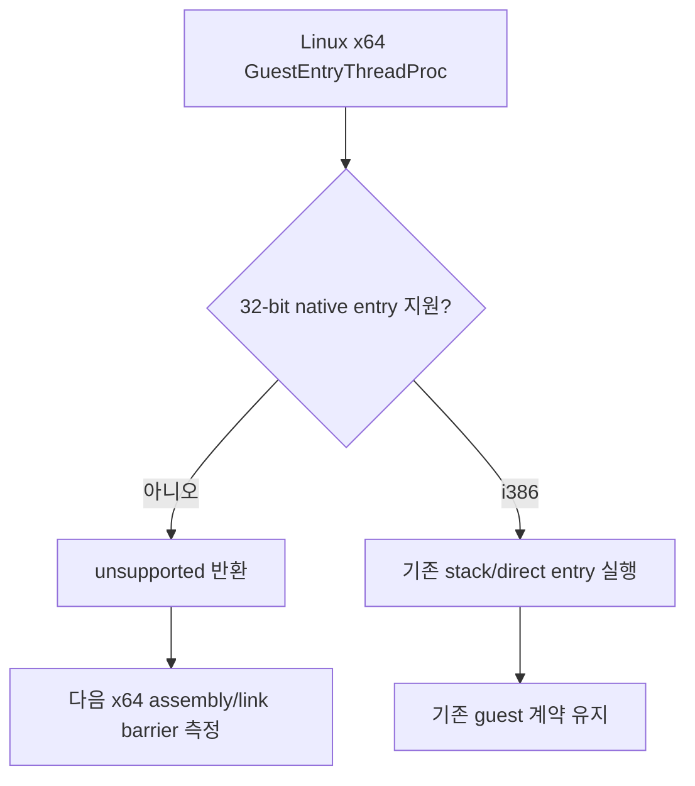

# 20260831-544 Linux x64 guest entry 빌드 경계 설계

## 한국어

### 배경

Task 543의 telemetry ABI 정규화 후 Linux x64 compile probe는
`CallGuestEntryWithStackTimed`와 `CallGuestEntryDirectTimed`가 선언되지 않은
상태에서 Linux guest thread procedure에 의해 호출되는 오류를 드러냈습니다.
두 함수는 32비트 native entry와 stack bridge를 전제로 합니다.

### 결정

- x64 host에서는 현재 Linux native guest entry procedure를 컴파일하지 않고
  unsupported 결과를 즉시 반환합니다.
- i386 경로의 호출·fault handler·stack state는 변경하지 않습니다.
- x64에서 해당 함수를 가짜 no-op 또는 32비트 함수 포인터로 연결하지 않습니다.
- 이 단위의 목적은 x64 실행을 제공하는 것이 아니라, 잘못된 ABI 진입을 차단한 뒤
  다음 compiler/assembler/linker 장벽을 안전하게 확인하는 것입니다.
- 실제 x64 guest 실행은 별도의 x86-64 AOT/DBT entry 및 fault-resume 설계에서
  구현합니다.

### 흐름

### 검증

1. Linux x64 `repiu_exe` compile probe를 다시 실행합니다.
2. x64 C++ 단계가 i386 timed entry 호출 오류 없이 통과하는지 확인합니다.
3. 다음 실패가 assembly, linker, 또는 다른 ABI mismatch인지 기록합니다.
4. Linux i386 및 Win32 회귀 target을 다시 빌드합니다.

## English

### Background

After Task 543 normalized the telemetry ABI, the Linux x64 compile probe exposed calls
from the Linux guest thread procedure to `CallGuestEntryWithStackTimed` and
`CallGuestEntryDirectTimed` without declarations. Both functions assume the 32-bit
native entry and stack bridge.

### Decision

- On an x64 host, do not compile the current Linux native guest-entry body; return an
  unsupported result immediately.
- Do not change the i386 call, fault-handler, or stack-state path.
- Do not connect the missing functions to fake no-ops or 32-bit function pointers on x64.
- This unit does not provide x64 guest execution. It blocks an invalid ABI entry and
  safely exposes the next compiler, assembler, or linker barrier.
- Actual x64 guest execution belongs to a separate x86-64 AOT/DBT entry and fault-resume
  design.

### Verification

1. Rerun the Linux x64 `repiu_exe` compile probe.
2. Verify that the x64 C++ stage passes the i386 timed-entry call errors.
3. Record whether the next failure is assembly, linker, or another ABI mismatch.
4. Rebuild the Linux i386 and Win32 regression targets.
