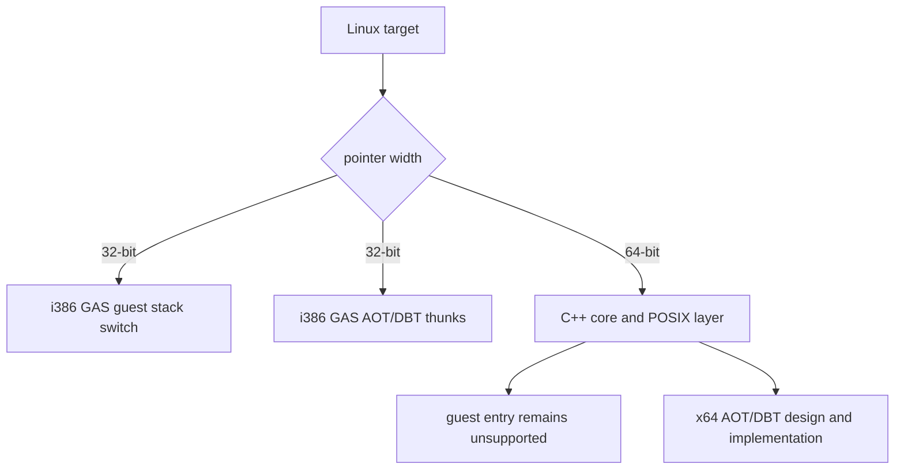

# 20260831-545 Linux x64 32-bit assembly 경계 설계

## 한국어

### 배경

Task 544에서 Linux x64 C++ 단계는 통과했지만, `aot_dbt_dispatch_thunks.S`가
`pusha`/`popa`와 32비트 stack ABI를 사용하여 64비트 assembler 단계에서 중단되었습니다.
`guest_stack_switch.S`도 EAX/ESP 기반의 동일한 i386 실행 계약을 사용합니다.

이 파일들은 현재 Linux i386 실행 경로의 구현이지, x64에서 재사용할 수 있는 공용
assembly가 아닙니다. x64에서 이들을 계속 수집하면 실제 x64 C++ 및 링크 장벽을
확인할 수 없고, 반대로 가짜 x64 thunk를 제공하면 아직 설계되지 않은 guest ABI를
실행 가능한 것처럼 보이게 됩니다.

### 결정

- Linux assembly 두 파일은 포인터 폭이 32비트인 빌드에서만 `repiu_exe`에 추가합니다.
- Linux x64에서는 현재 guest-entry와 AOT/DBT thunk 주소를 계속 `unsupported`로
  취급합니다. x64용 no-op thunk나 32비트 함수 포인터 shim은 추가하지 않습니다.
- `repiu_core_probe`의 `stack_bridge`와 `guest_stack_switch`도 i386에서만 빌드하고,
  x64 probe 출력에는 두 항목을 명시적으로 skipped로 표시합니다.
- `guest_cpu_context`, fault handler, virtual memory, host thread 같은 나머지
  POSIX 계층은 x64에서도 계속 빌드하여, assembly와 무관한 이식 장벽은 확인합니다.
- 이 작업은 x64 실행 구현이 아니라 compile/link probe를 더 진행하기 위한 구조적
  경계입니다. 실제 x64 실행은 별도의 x86-64 AOT/DBT frame, SysV ABI bridge,
  signal context, code emitter 설계가 완료된 뒤 추가합니다.

### 적용 범위

`CMAKE_SIZEOF_VOID_P == 4`를 기준으로 삼아 Linux i386 구성에서만 두 assembly와
두 assembly 의존 probe를 수집합니다. 이 기준은 호스트 문자열에 의존하지 않고 실제
컴파일 대상의 포인터 폭을 반영합니다.

### 검증

1. Linux x64 `repiu_exe`가 기존 `pusha`/`popa` assembler 오류 없이 빌드됩니다.
2. Linux x64 `repiu_core_probe`가 assembly 의존 두 probe를 skipped로 표시합니다.
3. Linux i386 `repiu_exe`와 `repiu_core_probe`는 기존 assembly 및 probe를 유지합니다.
4. x64 guest entry는 계속 unsupported를 반환하며, 이 작업만으로 실행 가능하다고
   보고하지 않습니다.

## English

### Background

Task 544 passed the Linux x64 C++ stage, but `aot_dbt_dispatch_thunks.S` stopped at the
64-bit assembler stage because it uses `pusha`/`popa` and a 32-bit stack ABI. The
`guest_stack_switch.S` file uses the same i386 execution contract through EAX/ESP.

These files implement the current Linux i386 execution path; they are not portable
assembly that can be reused on x64. Continuing to collect them on x64 hides the real
x64 C++ and link barriers. Providing fake x64 thunks would make an ABI that has not
been designed look executable.

### Decision

- Add the two Linux assembly files to `repiu_exe` only when the build has 32-bit
  pointers.
- Keep the current Linux x64 guest entry and AOT/DBT thunk addresses unsupported.
  Do not add x64 no-op thunks or 32-bit function-pointer shims.
- Build `stack_bridge` and `guest_stack_switch` in `repiu_core_probe` only on i386,
  and report both items explicitly as skipped in the x64 probe output.
- Continue building the other POSIX layers on x64, including guest context, fault
  handling, virtual memory, and host-thread code, so non-assembly porting barriers
  remain visible.
- This is a structural boundary for continuing the compile/link probe, not an x64
  execution implementation. Actual x64 execution requires a separate x86-64 AOT/DBT
  frame, SysV ABI bridge, signal-context adapter, and code-emitter design.

### Scope

Use `CMAKE_SIZEOF_VOID_P == 4` so the assembly and its two dependent probes are
collected only by Linux i386 configurations. This reflects the actual target pointer
width rather than a host-name string.

### Verification

1. The Linux x64 `repiu_exe` target builds past the current `pusha`/`popa` assembler
   errors.
2. The Linux x64 `repiu_core_probe` reports the two assembly-dependent probes as
   skipped.
3. Linux i386 keeps the existing assembly and probe coverage.
4. The x64 guest entry continues to return unsupported; this unit does not claim x64
   execution support.
