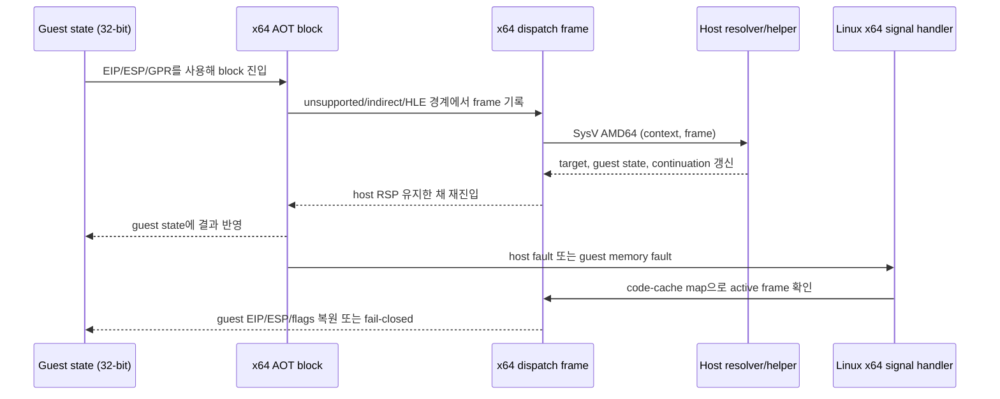

# 20260831-546 Linux x64 AOT/DBT 실행 모델 설계

## 한국어

### 목적

Linux x64에서 원본 DOS/4G guest의 32비트 실행 계약을 보존하면서 host 실행 계층을
x86-64에 맞게 재구성합니다. 원본 guest 바이트를 x64 프로세서에서 직접 실행하는
것이 아니라, 기존 LEGACY_32 decoder가 읽은 guest 의미를 x86-64 AOT/DBT 코드로
실행합니다.

### 현재 코드에서 확인된 제약

| 계층 | 현재 계약 | x64에서 필요한 변화 |
|---|---|---|
| decoder | `ZYDIS_MACHINE_MODE_LEGACY_32`, `ZYDIS_STACK_WIDTH_32` | guest source ISA로 유지 |
| instruction emission | 32비트 opcode를 `kCopy`로 복사하거나 imm32/rel32를 직접 기록 | host ISA별 emitter와 semantic re-encode 필요 |
| stack/control | `pushfd`, `pushad`, `call/ret`, ESP 기반 metadata | host RSP와 guest ESP를 분리 |
| dispatch frame | `pushad` 순서의 `uint32_t*` frame | 고정 x64 frame과 SysV ABI bridge 필요 |
| host address | cache/thunk/counter를 uint32 immediate로 patch | host pointer는 `uintptr_t`/RIP-relative relocation으로 관리 |
| segment | selector와 segment base를 native x86 경로에 fold | FS/GS host 의미와 guest selector 의미를 분리하고 필요 시 helper 경계 사용 |
| fault context | Linux i386 `REG_EIP`/`REG_ESP`만 변환 | x86-64 `REG_RIP`/`REG_RSP` 및 AOT frame 복원 경로 필요 |

### 결정

#### 1. guest 상태와 host 상태를 분리합니다

- guest GPR, EIP, ESP, EFLAGS, selector, x87 상태는 계속 고정 폭 32비트 guest
  상태로 보존합니다.
- host stack pointer, code-cache pointer, resolver function pointer, memory base는
  `uintptr_t` 또는 명시적인 host pointer로 관리합니다.
- x64 guest entry는 raw guest stack으로 RSP를 전환하지 않습니다. host RSP는
  SysV 호출과 signal delivery를 위해 계속 host stack을 가리키고, guest ESP는
  guest state 또는 guest-memory access helper가 사용합니다.
- 기존 i386 `StackSwitchCallState`와 `pushad` frame은 x64 경로의 ABI로 재사용하지
  않습니다.

#### 2. x64 dispatch frame은 별도 계약으로 만듭니다

x64 thunk는 `pushad`의 암묵적인 위치에 의존하지 않고, 이름 있는 고정 frame을
사용합니다. 최소 frame에는 다음이 포함됩니다.

- guest GPR 및 flags의 32비트 값
- guest source/EIP와 dispatch continuation의 32비트 값
- guest ESP와 metadata 위치의 32비트 값
- `ThreadContext*`, guest-memory view, host continuation 같은 host pointer
- resolver가 성공·fallback을 선택할 수 있는 상태

frame의 host pointer 필드는 guest image나 shared telemetry처럼 process boundary에
걸치는 구조체에 노출하지 않습니다. resolver 함수의 x64 Linux 선언은 SysV AMD64
인자 전달을 사용하고, bridge가 RSP 16-byte alignment와 callee-saved register를
보장합니다.

#### 3. host RSP를 guest ESP로 대체하지 않습니다

기존 stack switch는 guest ESP를 실제 ESP로 만들고 guest `call/ret/push/pop`을
native instruction으로 수행합니다. x64에서는 이 방식이 RSP 폭, return address
폭, SysV stack alignment를 동시에 깨뜨립니다.

첫 x64 emitter는 stack/control 명령을 다음 세 가지로 분류합니다.

1. guest state와 guest memory에 대해 명시적으로 동작하는 x64 sequence로 re-encode
2. helper 또는 dispatch boundary로 보내 semantic execution 수행
3. 검증되지 않은 경우 INT3/unsupported로 남겨 조용히 잘못 실행하지 않음

따라서 x64에서 `kCopy`는 “decoder가 읽은 바이트를 그대로 실행해도 되는가”를
자동으로 뜻하지 않습니다. 특히 32비트 address-size, segment override, stack
effect, near target, absolute address가 포함된 instruction은 별도 lowering이
필요합니다.

#### 4. code cache 주소와 guest 주소를 분리합니다

- guest address와 guest target은 계속 `std::uint32_t`입니다.
- x64 code-cache address와 host thunk/counter/table address는 `uintptr_t`입니다.
- cache 내부 branch는 범위가 보장되는 경우에만 rel32를 사용하고, host pointer는
  RIP-relative 또는 register에 64비트 값을 적재하는 relocation을 사용합니다.
- 기존 4 GiB 이하 배치 정책은 guest address 보존을 위해 필요한 부분과 host
  pointer를 4 GiB 아래에 두려는 우연한 가정으로 나누어 제거합니다.

**확정 (Task 551, 측정으로).** 위 두 갈래의 답이 실제로 갈렸고 측정으로 닫혔습니다.

- **guest memory는 하위 4 GiB에 둡니다.** 요구사항이지 선호가 아닙니다 — guest
  relocation이 이미 그 주소를 guest memory 안에 써 넣었기 때문입니다. x86-64 Linux가
  PIU 프로파일의 134 MB arena를 `0x00010000`에 `MAP_FIXED_NOREPLACE`로 정확히
  내주는 것을 확인했습니다. 이 배치가 성립하지 않는 host에서는 guest를 실행하지
  않습니다.
- **host pointer가 4 GiB 아래라는 가정은 제거합니다.** engine 자신의 image는
  Task 503이 `-no-pie -Wl,-Ttext-segment=0x40000000`으로 의도적으로 낮게 두지만,
  stack과 shared library는 build가 정할 수 없고 실측에서 4 GiB 위에 있습니다.
  둘 중 하나를 담을 수 있는 host pointer는 `uintptr_t`여야 합니다.

전자를 확정해도 `RIP`-relative는 사라지지 않습니다. `0x67` prefix는 RIP-relative를
끄지 못하고 EIP-relative로 바꿀 뿐이므로, 절대 `disp32`는 SIB 재인코딩이 필요합니다.
측정 근거는 [20260831-551 작업 로그](../work-logs/20260831-551-guest-address-space-placement.md),
이 확정에 따른 lowering 설계는
[20260831-552](20260831-552-linux-x64-memory-operand-lowering.md)에 있습니다.

#### 5. fault와 재진입은 x64 AOT frame을 기준으로 복원합니다

x64 signal handler는 host `ucontext_t`의 RIP/RSP를 읽을 수 있어야 하지만, host
RIP 자체를 guest EIP로 취급하지 않습니다. fault가 code cache 안에서 발생하면
code-cache address map과 active x64 frame에서 guest source/state를 복원합니다.
guest memory fault는 guest address와 access type을 별도로 기록합니다.

raw guest segment register를 host FS/GS에 설치하지 않으므로, x64 host TLS는
guest 실행 중에도 유효해야 합니다. guest selector가 native fold 조건을 만족하지
않으면 기존 HLE/단일-step 경계가 아니라 x64 semantic helper로 보내는 정책을
검증해야 합니다.

### 실행 흐름

### 구현 순서

1. guest address와 host pointer를 명시적으로 분리하는 x64 frame/type header를
   추가하고 양쪽 폭에 대한 static assertion을 작성합니다.
2. 실제 guest를 호출하지 않는 x64 ABI probe를 추가합니다. frame 수정, 16-byte
   stack alignment, callee-saved register, x87/SSE save/restore를 검증합니다.
3. x64 emitter의 작은 명령 subset을 re-encode합니다. 일반 GPR/flags와 제한된
   memory access만 먼저 허용하고, stack/segment/control 명령은 계속 fallback으로
   둡니다.
4. x64 dispatch resolver와 fault-context adapter를 연결합니다.
5. DOS/4GW sample에서 block 단위 상태 비교를 수행한 뒤 HLE/Glide 경계를
   단계적으로 활성화합니다.

### 비범위

- 원본 guest를 64비트 코드로 변환
- x64에서 기존 i386 assembly를 조건부 opcode만 바꾸어 재사용
- guest selector를 host TLS selector로 덮어쓰기
- x64 실행이 준비되기 전 unsupported path를 no-op으로 바꾸기

## English

### Objective

Rebuild the Linux x64 host execution layer while preserving the original DOS/4G
guest's 32-bit execution contract. The original guest bytes are not executed directly
by the x64 processor; the existing LEGACY_32 decoder remains the source ISA and its
guest meaning is executed by x86-64 AOT/DBT code.

### Confirmed constraints

The current decoder is already a LEGACY_32/32-bit-stack decoder, but the emitter copies
32-bit opcodes, writes imm32/rel32 operands, and uses 32-bit stack/control sequences.
The dispatch resolvers consume a `pushad`-ordered `uint32_t*` frame. Linux signal
conversion handles only i386 `REG_EIP`/`REG_ESP`. Segment folding also assumes the
32-bit native path. None of these contracts can be carried to x64 by changing the
compiler flags alone.

### Decisions

1. Keep guest GPRs, EIP, ESP, EFLAGS, selectors, and x87 state as fixed-width 32-bit
   guest state. Keep host stack/code-cache/resolver/memory pointers as `uintptr_t` or
   explicit host pointers.
2. Do not switch host RSP to the guest ESP. Host RSP remains a SysV stack; guest ESP is
   state used by the x64 emitter or guest-memory helpers.
3. Introduce a named x64 dispatch frame rather than reusing the implicit `pushad`
   layout. The Linux bridge must preserve callee-saved registers and 16-byte stack
   alignment for `(ThreadContext*, frame)` calls.
4. Keep guest addresses as `uint32_t`, but use pointer-width relocation for x64 cache,
   thunk, counter, and table addresses. Use rel32 only when its range is proven.

   **Settled by measurement in Task 551.** The two halves of this decision have
   different answers. **Guest memory is placed below 4 GiB** -- a requirement rather than
   a preference, because the guest's relocations have already written that address into
   guest memory; x86-64 Linux was measured giving the PIU profile's 134 MB arena exactly
   `0x00010000` through `MAP_FIXED_NOREPLACE`, and a host where that placement fails does
   not run the guest. **The assumption that host pointers sit below 4 GiB is removed**:
   the engine's own image is deliberately low (Task 503's
   `-no-pie -Wl,-Ttext-segment=0x40000000`), but the stack and the shared libraries are
   not the build's to place and measure above 4 GiB, so any host pointer that can hold
   one of those must be `uintptr_t`. Settling the first half does not retire
   `RIP`-relative: a `0x67` prefix makes the form `EIP`-relative rather than absolute, so
   an absolute `disp32` still needs SIB re-encoding. Evidence is in the
   [20260831-551 work log](../work-logs/20260831-551-guest-address-space-placement.md);
   the lowering this enables is designed in
   [20260831-552](20260831-552-linux-x64-memory-operand-lowering.md).
5. Treat copied 32-bit instruction bytes as x86-only unless the x64 emitter proves their
   long-mode semantics. Stack, segment, absolute-address, and control-flow instructions
   need explicit lowering or a semantic helper.
6. Recover x64 faults through the active x64 frame and code-cache map. Host RIP is not
   guest EIP. Do not install guest segments into host FS/GS; host TLS must remain valid.

### Implementation order

1. Add explicit guest-address/host-pointer x64 frame types and width assertions.
2. Add a synthetic x64 ABI probe for frame edits, stack alignment, callee-saved
   registers, and floating-point save/restore.
3. Re-encode a small x64 emitter subset for ordinary GPR/flags and restricted memory
   operations; keep stack/segment/control instructions on fallback initially.
4. Connect the x64 dispatch resolver and fault-context adapter.
5. Compare block-level guest state on a DOS/4GW sample before enabling HLE/Glide
   boundaries incrementally.

### Out of scope

- Converting the original guest to 64-bit code
- Reusing i386 assembly by changing only opcode spellings
- Overwriting host TLS selectors with guest selectors
- Turning unsupported paths into no-ops before x64 execution is ready
