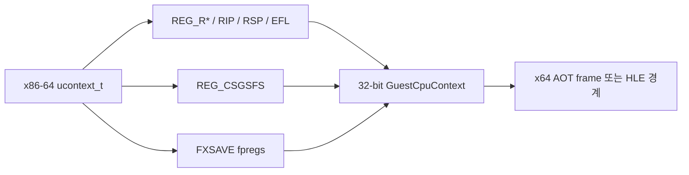

# 20260831-548 Linux x64 ucontext adapter 설계

## 한국어

### 배경

Task 547의 x64 frame/ABI probe를 빌드하는 과정에서 기존
`guest_cpu_context_probe`가 `REG_ESP`와 `REG_UESP`를 직접 사용하여 x64에서
컴파일되지 않는 것을 확인했습니다. 실제 Linux x64 `ucontext_t`는 `REG_RIP`,
`REG_RSP`와 64비트 GPR을 제공하며, segment selector는 `REG_CSGSFS` 하나에
packed되어 있습니다.

### 결정

- Linux x64 adapter는 `ucontext_t`의 64비트 GPR/RIP/RSP/EFLAGS를 읽고 guest
  context의 32비트 필드로 low 32 bits를 변환합니다.
- Store도 guest context를 32비트 값으로 zero-extend하여 x64 `ucontext_t`에
  기록합니다. 이 API는 x64 native host instruction을 재개하는 API가 아니며,
  실제 x64 AOT fault resume은 active x64 frame을 사용해야 합니다.
- x64 `CS/GS/FS`는 packed `REG_CSGSFS`에서 읽습니다. `DS/ES/SS`는 x64 signal
  context가 제공하지 않으므로 zero로 두고, segment를 signal return에 기록하지
  않습니다.
- x64 FXSAVE의 x87 80-bit register bytes는 기존 guest FSAVE-style
  `RegisterArea[80]`로 변환합니다. FXSAVE의 abridged tag는 guest 2-bit tag로
  확장하며, XMM/MXCSR는 현재 `GuestFloatingSaveArea` 계약에 포함하지 않습니다.
- i386 경로와 field name, fault access-bit 해석은 변경하지 않습니다.

### 흐름

### 비범위

- x64에서 원본 guest code를 native로 직접 실행
- host의 64비트 RIP/RSP를 32비트 guest EIP/ESP로 잘라 signal return
- x64 XMM/MXCSR를 기존 FSAVE-style 구조체에 임의로 추가
- x64 AOT emitter 또는 production dispatch thunk 구현

## English

### Background

While building the Task 547 x64 frame/ABI probe, the existing
`guest_cpu_context_probe` was found to use `REG_ESP` and `REG_UESP` directly, so it
could not compile on x64. Linux x64 `ucontext_t` provides `REG_RIP`, `REG_RSP`, and
64-bit GPRs; segment selectors are packed into one `REG_CSGSFS` slot.

### Decisions

- The Linux x64 adapter reads the 64-bit GPR/RIP/RSP/EFLAGS values and converts their
  low 32 bits into the guest context fields.
- Store writes the 32-bit guest values zero-extended into an x64 `ucontext_t`. This API
  is not an API for resuming an x64 host instruction; future x64 AOT fault recovery must
  use the active x64 frame.
- Read CS/GS/FS from packed `REG_CSGSFS`. Leave DS/ES/SS zero because the x64 signal
  context does not provide them, and do not write segment selectors on signal return.
- Convert the x87 80-bit register bytes from x64 FXSAVE into the existing guest
  FSAVE-style `RegisterArea[80]`. Expand FXSAVE's abridged tag into guest 2-bit tags;
  XMM/MXCSR are not part of the current `GuestFloatingSaveArea` contract.
- Leave the i386 path, field names, and fault access-bit interpretation unchanged.

### Out of scope

- Direct native execution of the original guest on x64
- Truncating host RIP/RSP into 32-bit guest EIP/ESP for signal return
- Adding x64 XMM/MXCSR fields arbitrarily to the FSAVE-style structure
- Implementing the x64 AOT emitter or production dispatch thunk
