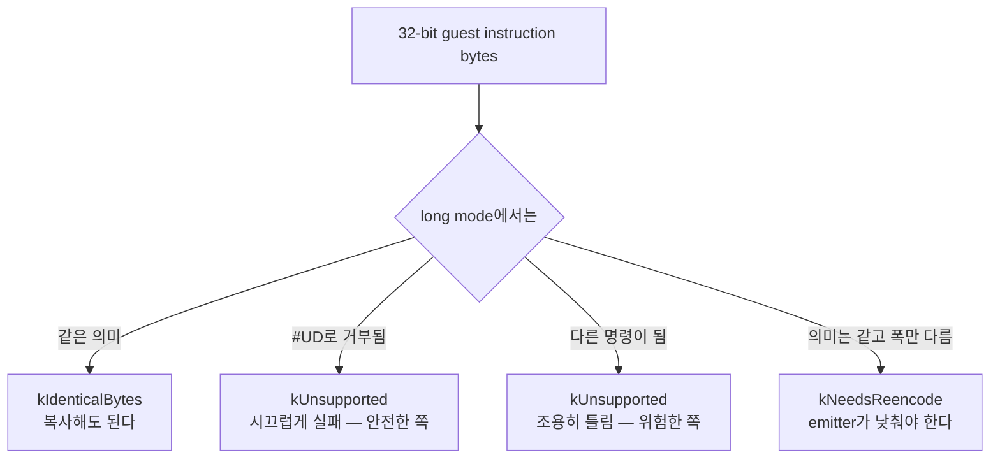

# 20260831-550 Linux x64 long-mode byte compatibility 설계

## 한국어

### 목적

Task 546 구현 순서 3단계, x64 emitter subset의 **전제 조건**을 만듭니다.

현재 emitter의 `kCopy`는 guest의 32비트 instruction 바이트를 code cache에 그대로
복사해 host가 실행하게 합니다. i386 host에서는 이것이 항등입니다. x86-64 host에서는
아닙니다. Task 546 결정 5가 이미 그렇게 적었습니다.

> Treat copied 32-bit instruction bytes as x86-only unless the x64 emitter proves
> their long-mode semantics.

"증명"할 주체가 아직 없습니다. 이번 단위는 그 판정기를 만듭니다. **emitter가 아니라
emitter가 무엇을 다루어도 되는지 정하는 경계**입니다.

### 왜 판정기가 먼저인가

x64에서 32비트 바이트를 실행할 때 위험한 것은 **fault가 나는 것**이 아니라 **조용히
다른 명령이 되는 것**입니다. Task 544가 만난 `pusha`/`popa`는 assembler가 거부해
주었지만, 그건 운이 좋은 쪽 끝입니다.



세 번째 갈래가 이 설계가 존재하는 이유입니다. 판정기는 **fail-closed**입니다. 항등임을
보인 경우에만 `kIdenticalBytes`이고, 모르면 거부합니다.

### 확인된 발산

#### A. 조용히 다른 명령이 되는 것 — 가장 위험

| 바이트 | 32비트 | 64비트 |
|---|---|---|
| `40`–`4F` | `INC`/`DEC r32` | **REX prefix** — 뒤따르는 명령에 붙는다 |
| `62` | `BOUND` | **EVEX prefix** |
| `63` | `ARPL` | **MOVSXD** |
| `C4` / `C5` | `LES` / `LDS` | **VEX3 / VEX2 prefix** |
| `A0`–`A3` | `MOV AL/eAX, moffs32` | `moffs64` — **명령 길이가 바뀐다** |
| ModRM `mod=00, rm=101` | 절대 `disp32` | **`RIP`-relative** |

`40`–`4F`와 `mod=00,rm=101` 두 줄이 특히 무겁습니다. 앞의 것은 32비트 코드에서 가장
흔한 1바이트 명령 축에 들고, 뒤의 것은 DOS extender 코드가 전역을 읽을 때마다 쓰는
형태입니다. 둘 다 예외를 일으키지 않고, 둘 다 다른 주소를 만듭니다.

`A0`–`A3`는 한 단계 더 나쁩니다. 길이가 5바이트에서 9바이트로 바뀌므로 그 **뒤에 오는
바이트들의 해석까지** 어긋납니다.

#### B. long mode에 아예 없는 것 — `#UD`

`06`/`0E`/`16`/`1E` (`PUSH` seg), `07`/`17`/`1F` (`POP` seg), `27`/`2F` (`DAA`/`DAS`),
`37`/`3F` (`AAA`/`AAS`), `60`/`61` (`PUSHAD`/`POPAD`), `9A` (far `CALL`), `CE` (`INTO`),
`D4`/`D5` (`AAM`/`AAD`), `D6` (`SALC`), `EA` (far `JMP`).

시끄럽게 실패하므로 조용한 오답보다는 낫지만, 판정기는 그래도 이들을 이름으로
거부합니다. `#UD`를 fault handler로 받아 처리하는 것은 실행 전략이지 정확성 논거가
아닙니다.

#### C. 의미는 같고 폭이 다른 것 — emitter가 낮춰야 함

stack을 건드리는 모든 것입니다. long mode에서 `PUSH`/`POP`의 기본 operand size는
64비트이고 32비트로 낮출 방법이 없습니다 — `66`은 16비트를 줍니다.

`50`–`5F` (`PUSH`/`POP r32`), `68`/`6A` (`PUSH imm`), `8F /0` (`POP r/m`),
`9C`/`9D` (`PUSHFD`/`POPFD`), `C2`/`C3` (`RET`), `C9` (`LEAVE`), `E8` (`CALL rel32`),
`FF /2`·`/3` (`CALL r/m`), `0F A0`/`A8`/`A1`/`A9` (`PUSH`/`POP FS`,`GS`).

`E9` (`JMP rel32`)는 stack을 건드리지 않으므로 이 목록에 없습니다.

#### D. 주소 계산

ModRM memory operand가 있는 모든 명령입니다. long mode의 기본 address size는 64비트
이므로 `mov eax,[ebx]`의 바이트는 `mov eax,[rbx]`로 읽힙니다. `67` prefix를 붙이면
32비트 주소 계산으로 돌아가고 결과는 64비트로 zero-extend 됩니다.

즉 `67`은 **guest memory가 하위 4 GiB에 매핑되어 있을 때만** 정답입니다. 그 배치
정책은 Task 546 결정 4가 남긴 미결 항목이고 이번 단위에서 정하지 않습니다. 따라서 이
판정기는 **memory operand가 있으면 `kIdenticalBytes`를 주지 않습니다.**

### 판정 결과

```
kIdenticalBytes  바이트를 그대로 실행해도 long mode에서 같은 의미다.
kNeedsReencode   의미는 표현 가능하지만 x64 emitter가 다시 인코딩해야 한다.
kUnsupported     이 단위가 항등성을 증명하지 못했다. 판정기의 기본값이다.
```

`kUnsupported`가 기본값인 것이 요점입니다. 아무도 살펴보지 않은 명령은 거부되고,
누군가 안전한 이유를 적어 넣을 때 비로소 통과합니다.

### 이번 단위가 통과시키는 subset

- memory operand 없음
- stack 접근 없음
- control flow 없음
- segment register 접근 없음
- 위 A·B·C 목록의 opcode 아님
- operand 폭이 8·16·32비트

남는 것은 register 대 register ALU와 `MOV`, 그리고 flags입니다. Task 546이 "일반
GPR/flags"라고 부른 바로 그 집합입니다.

### 비범위

- x64 emitter 자체 (다음 단위)
- guest memory 배치 정책과 `67` prefix 사용 여부 (Task 546 결정 4의 미결 항목)
- i386 경로의 어떤 변경도 — 판정기는 x64 emitter만 호출한다
- `#UD`를 fault handler로 받는 실행 전략

### 검증

판정기는 **거부를 증명하는 probe**로 검증합니다. 통과 목록보다 거부 목록이 중요하기
때문입니다. probe는 위 A·B·C 표의 항목을 바이트로 만들어 판정기에 넣고, 하나도
`kIdenticalBytes`를 받지 않는지 확인합니다. 특히 A의 여섯 줄은 개별 이름으로
보고합니다 — 조용히 통과하면 안 되는 것들이라 집계 하나에 묻히면 안 됩니다.

### 출처

* Intel® 64 and IA-32 Architectures Software Developer's Manual, Vol. 2 — opcode map,
  "Instructions Not Supported in 64-Bit Mode"
* AMD64 Architecture Programmer's Manual, Vol. 3 — 64-bit mode에서의 차이
* [KB: 32비트 encoding과 long mode](../kb/x86-32bit-encodings-in-long-mode.md)

## English

### Objective

Build the **precondition** for step 3 of Task 546's implementation order, the x64
emitter subset.

The emitter's `kCopy` copies the guest's 32-bit instruction bytes straight into the code
cache and lets the host execute them. On an i386 host that is the identity. On x86-64 it
is not, and Task 546's decision 5 already said so:

> Treat copied 32-bit instruction bytes as x86-only unless the x64 emitter proves their
> long-mode semantics.

Nothing does the proving yet. This unit builds that judgement -- **not the emitter, but
the boundary that decides what the emitter is allowed to touch.**

### Why the classifier comes first

What is dangerous about executing 32-bit bytes on x64 is not that they fault. It is that
they **quietly become different instructions**. Task 544 met `pusha`/`popa`, which the
assembler refused outright; that is the lucky end of the range.

The classifier is therefore **fail-closed**: `kIdenticalBytes` only where identity is
shown, and refusal wherever it is not known.

### Confirmed divergences

#### A. Quietly a different instruction -- the dangerous class

| Bytes | 32-bit | 64-bit |
|---|---|---|
| `40`–`4F` | `INC`/`DEC r32` | **REX prefix**, applied to what follows |
| `62` | `BOUND` | **EVEX prefix** |
| `63` | `ARPL` | **MOVSXD** |
| `C4` / `C5` | `LES` / `LDS` | **VEX3 / VEX2 prefix** |
| `A0`–`A3` | `MOV AL/eAX, moffs32` | `moffs64` -- **the instruction's length changes** |
| ModRM `mod=00, rm=101` | absolute `disp32` | **`RIP`-relative** |

The first and last rows carry the most weight. `INC`/`DEC r32` is among the most common
one-byte instructions in 32-bit code, and absolute `disp32` is how DOS-extender code
reads a global. Neither raises an exception; both produce a different address.

`A0`–`A3` is worse again: the length changes from five bytes to nine, so the
interpretation of the byte stream *after* it is wrong too.

#### B. Removed in long mode -- `#UD`

`06`/`0E`/`16`/`1E`, `07`/`17`/`1F`, `27`/`2F`, `37`/`3F`, `60`/`61`, `9A`, `CE`,
`D4`/`D5`, `D6`, `EA`.

These fail loudly, which is better than failing quietly, but the classifier still refuses
them by name. Catching `#UD` in a fault handler is an execution strategy, not an argument
about correctness.

#### C. Same meaning, different width -- the emitter must lower these

Everything that touches the stack. In long mode `PUSH`/`POP` default to a 64-bit operand
size and there is no way to ask for 32 -- `66` gives 16.

`50`–`5F`, `68`/`6A`, `8F /0`, `9C`/`9D`, `C2`/`C3`, `C9`, `E8`, `FF /2` and `/3`, and
`0F A0`/`A8`/`A1`/`A9`. `E9` is absent from this list because a `JMP rel32` touches no
stack.

#### D. Address computation

Every instruction with a ModRM memory operand. Long mode's default address size is 64,
so the bytes of `mov eax,[ebx]` read as `mov eax,[rbx]`. A `67` prefix restores 32-bit
address computation, zero-extended to 64 bits.

That makes `67` correct **only while guest memory is mapped below 4 GiB**, which is the
placement question Task 546's decision 4 left open and this unit does not settle. So this
classifier **never returns `kIdenticalBytes` for an instruction with a memory operand.**

### The verdicts

```
kIdenticalBytes  the bytes mean the same thing in long mode
kNeedsReencode   the meaning is expressible, but the x64 emitter must re-encode it
kUnsupported     this unit did not prove identity; the classifier's default
```

`kUnsupported` being the default is the point. An instruction nobody has considered is
refused, and passes only once someone writes down why it is safe.

### The subset this unit admits

No memory operand, no stack access, no control flow, no segment-register access, not one
of the opcodes in A/B/C above, and operands of 8, 16, or 32 bits. What remains is
register-to-register ALU and `MOV`, plus flags -- exactly the "ordinary GPR/flags" set
Task 546 named.

### Out of scope

The x64 emitter itself; the guest-memory placement policy and whether `67` is used; any
change to the i386 path; and the strategy of catching `#UD` in a fault handler.

### Verification

The classifier is verified by a probe that **proves refusals**, because the refusal list
matters more than the pass list. The probe builds the bytes for the rows of A, B, and C
and checks that not one of them is answered `kIdenticalBytes`. The six rows of A are
reported under their own names rather than folded into a count -- they are precisely the
ones that must never pass quietly.

### Sources

* Intel® 64 and IA-32 Architectures Software Developer's Manual, Vol. 2 -- opcode map and
  "Instructions Not Supported in 64-Bit Mode"
* AMD64 Architecture Programmer's Manual, Vol. 3 -- 64-bit mode differences
* [KB: 32-bit encodings in long mode](../kb/x86-32bit-encodings-in-long-mode.md)
