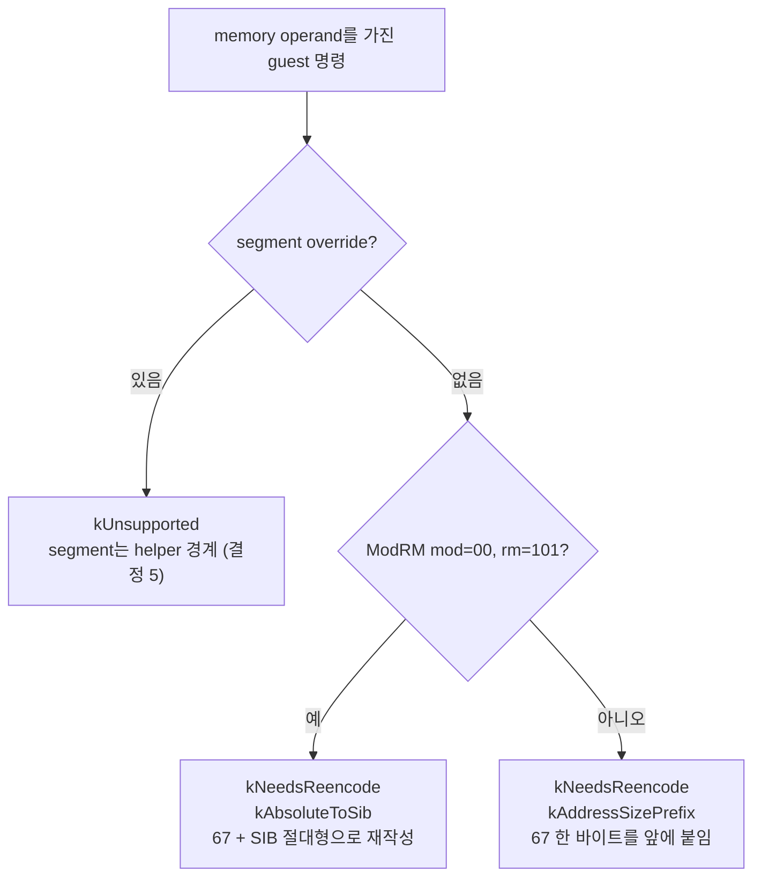

# 20260831-552 Linux x64 memory operand lowering 설계

## 한국어

### 목적

Task 546 결정 4가 "guest memory는 하위 4 GiB에 둔다"로 확정됐으므로, 그 결정이
열어 주는 것을 판정기에 반영합니다. guest memory operand는 더 이상 "모른다"가
아니라 **어떻게 낮출지 아는 것**이 됩니다.

Task 550 판정기는 memory operand를 전부 `kUnsupported`로 거절했습니다. 이유는
`0x67` prefix가 정답이 되려면 대상이 하위 4 GiB에 있어야 하는데 그 배치가 미결이었기
때문입니다. 이제 미결이 아닙니다.

### 왜 그래도 `kIdenticalBytes`가 아닌가

`0x67`을 붙이는 순간 바이트가 달라집니다. 복사가 아니라 lowering입니다. 따라서 이
단위가 하는 일은 memory operand를 `kUnsupported`에서 `kNeedsReencode`로 옮기고,
**어떤 lowering인지 이름을 붙이는 것**입니다.



### 두 가지 lowering

#### 1. `kAddressSizePrefix` — `0x67` 한 바이트

base/index register를 쓰는 보통의 형태입니다. long mode의 기본 address size가
64비트라 그대로 두면 64비트 register를 base로 읽지만, `0x67`을 붙이면 32비트로
계산하고 결과를 64비트로 zero-extend 합니다. guest의 32비트 wraparound까지 그대로
보존되며, 대상이 하위 4 GiB에 있으므로 zero-extend된 주소가 곧 guest 주소입니다.

```
8B 03           32비트: mov eax, [ebx]
67 8B 03        64비트: mov eax, [ebx]   (32비트 계산, zero-extend)
```

#### 2. `kAbsoluteToSib` — `0x67` + ModRM을 SIB 절대형으로 재작성

`mod=00, rm=101`은 prefix로 고쳐지지 않습니다. Intel SDM이 명시하듯 RIP-relative는
64-bit *mode*가 켜는 것이지 address size가 켜는 것이 아니고, `0x67`은 계산 결과를
32비트로 자를 뿐이라 **EIP-relative**가 됩니다. 여전히 상대 주소입니다.

절대 주소는 SIB로만 표현됩니다 — `mod=00`, `rm=100`(SIB 사용), SIB `base=101`,
`index=100`(index 없음).

```
8B 05 78 56 34 12        32비트: mov eax, [0x12345678]
67 8B 04 25 78 56 34 12  64비트: mov eax, [0x12345678]   (절대, zero-extend)
```

`0x67`이 여기서도 필요합니다. 붙이지 않으면 SIB 절대형의 `disp32`가 64비트로
**sign-extend** 되어, bit 31이 선 주소가 `0xFFFFFFFF8…`이 됩니다. 현재 arena는
`0x085E7000` 아래라 bit 31이 설 일이 없지만, 그것은 우연한 안전이지 규칙이 아닙니다.
`0x67`을 붙이면 32비트로 계산해 zero-extend 하므로 폭에 대한 가정이 필요 없습니다.

### segment override는 계속 거절합니다

`FS`/`GS`는 long mode에서 실제 base를 갖지만 host TLS가 `FS`를 쓰고 있고, 결정 5가
raw guest segment를 host `FS`/`GS`에 설치하지 않는다고 못박았습니다. `CS`/`DS`/`ES`/`SS`
override는 long mode에서 무시됩니다. 어느 쪽도 prefix 하나로 옮길 수 있는 문제가
아니므로 helper 경계로 남습니다.

### 검증 — SDM 인용이 아니라 실행으로

이 설계의 주장은 "이렇게 바꾸면 같은 주소를 읽는다"입니다. 그것은 매뉴얼을 인용해
확인할 것이 아니라 **실행해서 확인할 것**입니다.

x64 전용 probe가 하위 4 GiB에 실행 가능한 페이지를 잡고, 두 lowering 형태를 바이트로
써 넣고, 실제로 호출해서 의도한 주소의 값을 읽어 오는지 봅니다.

- `kAddressSizePrefix`: 상위 32비트가 0이 아닌 register를 base로 넘겨, `0x67`이 그
  상위 절반을 무시하는지 확인합니다. 이것이 붙이지 않았을 때와 갈리는 지점입니다.
- `kAbsoluteToSib`: 하위 4 GiB의 알려진 주소를 절대형으로 읽어, `RIP` 위치와
  무관하게 같은 값이 나오는지 확인합니다.

두 번째가 특히 중요합니다. 재작성하지 않은 형태는 `RIP` 상대라 **probe가 어디에
놓이느냐에 따라 결과가 달라지고**, 그것이 이 lowering이 필요한 이유 자체입니다.

### 비범위

- code cache emitter에 lowering을 실제로 연결하는 것 (다음 단위)
- stack/control 명령의 lowering — 여전히 `kNeedsReencode`로만 표시됩니다
- segment override
- `mmap_min_addr` 여유 0 문제 (Task 551이 남긴 별도 항목)

## English

### Objective

Task 546's decision 4 is settled as "guest memory is placed below 4 GiB", so the
classifier should now say what that decision unlocks. A guest memory operand stops being
"unknown" and becomes **something we know how to lower**.

Task 550's classifier refused every memory operand, because a `0x67` prefix is only
correct while the target lives below 4 GiB and that placement was undecided. It is
decided now.

### Why it is still not `kIdenticalBytes`

Adding `0x67` changes the bytes. That is a lowering, not a copy. So what this unit does
is move memory operands from `kUnsupported` to `kNeedsReencode` and **give the lowering a
name**.

### The two lowerings

#### 1. `kAddressSizePrefix` -- one `0x67` byte

The ordinary base/index forms. Long mode's default address size is 64, so the bytes
otherwise read a 64-bit register as the base; with `0x67` the address is computed in 32
bits and zero-extended. The guest's 32-bit wraparound is preserved exactly, and because
the target is below 4 GiB the zero-extended address *is* the guest address.

```
8B 03           32-bit: mov eax, [ebx]
67 8B 03        64-bit: mov eax, [ebx]   (computed in 32 bits, zero-extended)
```

#### 2. `kAbsoluteToSib` -- `0x67` plus a ModRM rewrite into SIB absolute form

`mod=00, rm=101` is not fixed by a prefix. As the Intel SDM states, RIP-relative
addressing is enabled by 64-bit *mode* rather than by address size, and `0x67` only
truncates the computed address -- so the form becomes **EIP-relative**. Still relative.

An absolute address is expressible only through SIB: `mod=00`, `rm=100` (SIB present),
with SIB `base=101` and `index=100` (no index).

```
8B 05 78 56 34 12        32-bit: mov eax, [0x12345678]
67 8B 04 25 78 56 34 12  64-bit: mov eax, [0x12345678]   (absolute, zero-extended)
```

The `0x67` is needed here too. Without it the SIB form's `disp32` is **sign-extended** to
64 bits, so any address with bit 31 set becomes `0xFFFFFFFF8…`. Today's arena ends below
`0x085E7000` and never sets that bit, but that is accidental safety rather than a rule.
With `0x67` the address is computed in 32 bits and zero-extended, and no assumption about
width is needed.

### Segment overrides stay refused

`FS`/`GS` have real bases in long mode, but host TLS uses `FS`, and decision 5 already
states that raw guest segments are not installed into host `FS`/`GS`. `CS`/`DS`/`ES`/`SS`
overrides are ignored in long mode. Neither is a problem a prefix moves, so both stay at
a helper boundary.

### Verification -- by execution, not by citing the manual

This design's claim is "rewritten this way, it reads the same address". That is not
something to confirm by quoting a manual; it is something to **run**.

An x64-only probe reserves an executable page below 4 GiB, writes both lowered forms as
bytes, calls them, and checks that the intended address was read.

- `kAddressSizePrefix`: pass a base register whose upper 32 bits are non-zero, and check
  that `0x67` ignores that upper half. That is exactly where it differs from not adding
  the prefix.
- `kAbsoluteToSib`: read a known low address in absolute form and check the value does
  not depend on where `RIP` happens to be.

The second matters most. The un-rewritten form is `RIP`-relative, so **its result depends
on where the probe was placed** -- which is the whole reason the lowering exists.

### Out of scope

Connecting the lowering to the code-cache emitter (the next unit); lowering the
stack and control instructions, which stay marked `kNeedsReencode` only; segment
overrides; and the zero `mmap_min_addr` headroom Task 551 left as its own item.
