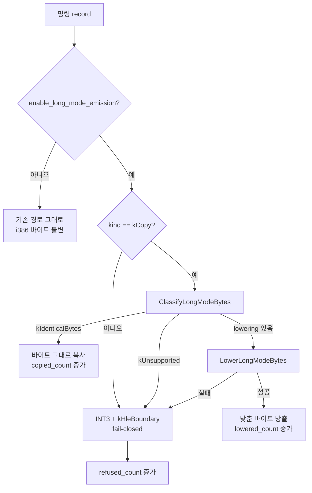
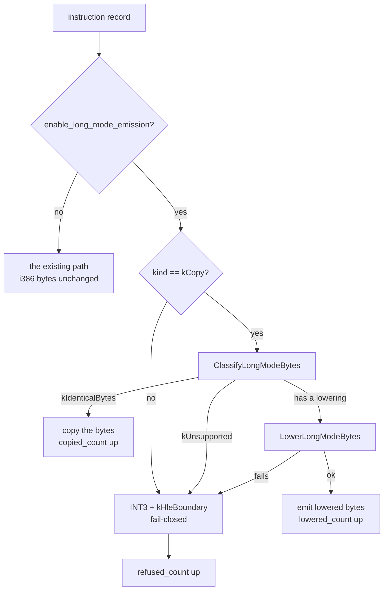

# 20260831-553 Linux x64 code cache long-mode 방출 설계 / Long-mode emission in the code cache

상위 설계: [20260831-546 x64 AOT/DBT 실행 모델](20260831-546-linux-x64-aot-dbt-execution-model.md) ·
선행: [20260831-550 판정기](20260831-550-linux-x64-long-mode-byte-compatibility.md),
[20260831-552 memory operand lowering](20260831-552-linux-x64-memory-operand-lowering.md) ·
현황: [Linux 이식 frontier](../analysis/linux-port-frontier.md)

## 한국어

### 목적

Task 550의 판정기와 Task 552의 lowering을 **code cache emitter에 연결합니다.** Task 546
구현 순서 3단계의 마무리이고, 인수인계(frontier 3.9)가 지목한 다음 한 걸음입니다.

지금까지 두 단위는 독립적으로 존재했습니다. emitter는 `ClassifyLongModeBytes`도
`LowerLongModeBytes`도 호출하지 않고, `kCopy`를 만나면 guest 바이트를 그대로
`image->bytes`에 넣습니다. 그래서 **i386 동작은 한 줄도 바뀌지 않았습니다.**

연결하는 순간 그 성질이 사라집니다. 그러므로 이 설계가 먼저 정할 것은 lowering을 어떻게
호출하느냐가 아니라 **어디까지가 x64 전용인가**입니다.

### 확인된 제약

emitter를 읽고 확인한 것 세 가지입니다.

1. `kCopy`는 `instruction.bytes`를 무조건 그대로 넣습니다
   ([aot_code_cache.cpp](../../src/runtime/aot_code_cache.cpp)의 방출 루프). 판정도 lowering도
   없습니다.
2. `kCopy` 외의 모든 kind는 **손으로 쓴 32비트 시퀀스**를 냅니다 — inline cache slot,
   host dispatch stub, guarded segment slot, timer safe point, `68 imm32` push. long mode는
   이 중 여럿의 의미를 **아무것도 일으키지 않고** 바꿉니다. `68 imm32`는 그곳에서 8바이트를
   밉니다.
3. 방출이 끝나면 image 전체를 `ZYDIS_MACHINE_MODE_LEGACY_32`로 다시 디코드해
   `emitted_length`를 정확히 덮는지 확인합니다. lowering된 바이트는 그 모드에서 **다른
   명령으로** 디코드됩니다 — 32비트 모드에서 `0x67`은 주소 크기를 16비트로 만들기
   때문입니다.

3번이 특히 중요하고, **처음 적었던 것보다 나쁩니다.** 검증이 보는 것은 길이 합계뿐이라
다른 명령들의 길이 합이 우연히 맞으면 아무 말도 하지 않습니다. 실제로 그랬습니다 —
아래 결정 3의 인용을 보십시오.

### 결정

#### 1. 경계는 build option입니다. `#ifdef`가 아닙니다

`AotCodeCacheBuildOptions::enable_long_mode_emission`을 추가하고 기본값을 `false`로 둡니다.
호스트 매크로로 가르지 않습니다.

방출은 순수 계산입니다 — 바이트를 만들 뿐 실행하지 않으므로, 같은 plan에 대한 답은 모든
호스트에서 같아야 합니다. `#ifdef`로 가르면 그 답을 **프로젝트가 실제로 시험 고리를 가진
호스트(Windows)에서 관측할 수 없게** 됩니다. Task 550이 판정기 probe를 x64 fence 밖에 둔
것과 같은 이유이고, 그때 적은 문장이 그대로 적용됩니다: Windows 실행과 Linux x64 실행이
서로 다른 답을 내면 그것은 주장이 흘렀다는 뜻입니다.

기본값이 `false`이므로 **i386 경로의 바이트는 여전히 한 바이트도 바뀌지 않습니다.**

#### 2. option의 뜻은 "long mode 호스트를 위해 방출한다"입니다. "복사본을 낮춘다"가 아닙니다

option이 켜지면 `kCopy`만 방출되고, **나머지 모든 kind는 fail-closed**로 갑니다 — 기존
INT3 + `kHleBoundary` fixup입니다.

`kCopy`만 낮추고 나머지 32비트 slot을 그대로 두는 것이 더 작은 변경이지만, 그것은 판정기가
막으려던 바로 그 실패를 한 층 위에서 다시 만드는 일입니다. 복사한 바이트는 조심스럽게
낮추면서 dispatch stub은 조용히 틀린 8바이트 push를 내는 image가 됩니다. Task 546 구현
순서 3단계가 "stack/segment/control은 처음에는 fallback으로 둔다"고 적은 것이 이것입니다.

#### 3. 검증 디코드는 option과 함께 모드를 바꿉니다

option이 켜지면 방출 후 검증을 `ZYDIS_MACHINE_MODE_LONG_64` / `ZYDIS_STACK_WIDTH_64`로
합니다. 그 바이트가 실행될 모드가 그것이기 때문입니다.

이것이 검증을 형식이 아니라 실제 확인으로 만듭니다. lowering이 만든 `67` prefix와 SIB
절대형은 long mode 디코더가 볼 때만 emitter가 의도한 길이를 가집니다.

> **구현 중 측정으로 보강됨.** 모드만 바꾸는 것으로는 부족했습니다. 검증 루프가 **길이
> 합계만** 보기 때문에, `67 8B 04 25 78 56 34 12`를 32비트 모드로 읽어 3바이트 `mov` +
> 5바이트 `and` 두 명령이 되어도 합이 8바이트로 맞아 통과합니다 — 판정기가 다루는
> "조용히 다른 명령"이 검증기에서 재현된 것입니다. long mode 방출에서는 map entry 하나가
> 정확히 명령 **한 개**이므로(복사·lowering·`0xCC`), 개수도 함께 확인합니다.

#### 4. 거절된 복사는 새 기법을 만들지 않습니다

판정기가 `kUnsupported`를 내거나 lowering이 실패하면 `0xCC` 한 바이트와
`AotFixupKind::kHleBoundary` fixup입니다. emitter가 이미 지원하지 못하는 모든 것에 쓰는
경로이고, 런타임은 그 INT3에서 guest 명령을 provenance로 재개합니다.

#### 5. 세 가지를 셉니다

image에 `long_mode_copied_count`, `long_mode_lowered_count`, `long_mode_refused_count`를
둡니다. 이것이 없으면 "연결됨"은 예/아니오 하나이고, **실제 plan의 몇 %를 x64가 낼 수
있는지 아무도 말할 수 없습니다.** 다음 단위(census)가 읽을 숫자입니다.

### 방출 판단

### 검증

probe 하나를 추가합니다. 방출은 실행이 아니라 계산이므로 **모든 호스트에서 도는
probe**이고, core probe의 공용 목록에 들어갑니다.

확인하는 것 네 가지:

1. **option이 꺼져 있으면 바이트가 동일합니다.** 이 항목이 "i386은 바뀌지 않았다"의
   시험이고, 기존 경로가 내는 바이트를 그대로 내야 합니다.
2. **복사 가능한 명령은 그대로 나옵니다.**
3. **memory operand는 `0x67`이 앞에 붙어 나오고, 절대형은 SIB 형태로 나옵니다.**
4. **거절되는 명령은 `0xCC` 하나로 나오고 fixup이 남습니다.** `40`(long mode에서 REX가 되는
   `inc eax`)이 조용히 복사되지 않는지가 이 probe의 핵심 항목입니다.

그리고 option을 켠 image가 `valid`인지 확인합니다. **측정으로 확인됨:** 결정 3의 모드
전환을 되돌린 build는 개수 검사가 들어간 뒤 `decode_failures=1`로 실패합니다. 개수 검사
없이 모드만 되돌렸을 때는 통과했으므로, 두 변경이 함께 있어야 이 항목이 성립합니다.

### 비범위

* stack/control 명령의 lowering. 여전히 `kNeedsReencode` 표시만 있고 변환이 없으므로 이
  단위에서는 fail-closed입니다.
* segment override.
* x64 dispatch resolver (Task 546 구현 순서 4단계의 남은 절반).
* 실제 guest 실행. Task 544의 fence는 그대로입니다 — 이 단위는 **바이트를 만드는 것**까지이고
  그 바이트를 x64에서 실행하는 것은 다음입니다.
* `mmap_min_addr` 여유 0 (Task 551이 남긴 별도 항목).

## English

### Objective

**Connect** Task 550's classifier and Task 552's lowering **to the code cache emitter.**
This finishes step 3 of Task 546's implementation order and is the next single step the
handoff (frontier 3.9) named.

Until now the two units stood on their own. The emitter calls neither
`ClassifyLongModeBytes` nor `LowerLongModeBytes`; on a `kCopy` it puts the guest's bytes
straight into `image->bytes`. That is why **not one line of i386 behaviour has changed.**

Wiring them ends that property. So what this design settles first is not how to call the
lowering but **where the x64-only boundary runs.**

### Confirmed constraints

Three things, confirmed by reading the emitter.

1. `kCopy` inserts `instruction.bytes` unconditionally (the emit loop in
   [aot_code_cache.cpp](../../src/runtime/aot_code_cache.cpp)). No judgement, no lowering.
2. Every kind other than `kCopy` emits a **hand-written 32-bit sequence** — inline cache
   slots, host dispatch stubs, guarded segment slots, timer safe points, `68 imm32`
   pushes. Long mode changes what several of these mean **without raising anything**:
   `68 imm32` pushes eight bytes there.
3. After emission the whole image is decoded again in `ZYDIS_MACHINE_MODE_LEGACY_32` and
   required to cover each `emitted_length` exactly. Lowered bytes decode to **different
   instructions** in that mode, because in 32-bit mode `0x67` means a 16-bit address size.

The third matters most, and it is **worse than first written here**: the check looks only
at total length, so when those different instructions happen to add up to the same total
it says nothing. That is what was measured -- see the note under decision 3.

### Decisions

#### 1. The boundary is a build option, not an `#ifdef`

Add `AotCodeCacheBuildOptions::enable_long_mode_emission`, defaulting to `false`. Do not
split it on a host macro.

Emission is pure computation — it produces bytes and executes nothing, so the answer for a
given plan must be the same on every host. An `#ifdef` would make that answer
**unobservable on the host where this project actually has a test loop (Windows)**. It is
the reason Task 550 kept the classifier probe outside the x64 fence, and the sentence
written there still applies: a Windows run and a Linux x64 run disagreeing would mean the
claim had drifted.

Because the default is `false`, **the i386 path's bytes still do not change by one byte.**

#### 2. The option means "emit for a long-mode host", not "lower the copies"

With the option on, only `kCopy` is emitted and **every other kind is fail-closed** — the
existing INT3 plus `kHleBoundary` fixup.

Lowering only the copies and leaving the other 32-bit slots would be the smaller change,
but it recreates one layer up exactly the failure the classifier exists to prevent: an
image that lowers copied bytes carefully while its dispatch stub quietly emits a wrong
eight-byte push. This is what step 3 of Task 546's implementation order means by "keep
stack/segment/control instructions on fallback initially".

#### 3. The verification decode changes mode with the option

With the option on, post-emission verification decodes in `ZYDIS_MACHINE_MODE_LONG_64` /
`ZYDIS_STACK_WIDTH_64`, because that is the mode those bytes are for.

This is what makes the verification a check rather than a formality: the `67` prefix and
the SIB absolute form the lowering produces have the length the emitter intended only when
a long-mode decoder reads them.

> **Strengthened by measurement during implementation.** Changing the mode was not enough.
> The verification loop checks **total length only**, so
> `67 8B 04 25 78 56 34 12` read in 32-bit mode as a three-byte `mov` plus a five-byte
> `and` still covers eight bytes and passes -- the classifier's "quietly a different
> instruction" reappearing inside the verifier. Under long-mode emission a map entry is
> exactly **one** instruction (a copy, a lowering, or one `0xCC`), so the count is checked
> alongside the length.

#### 4. A refused copy invents no new mechanism

When the classifier returns `kUnsupported` or the lowering fails, the emitter writes one
`0xCC` and an `AotFixupKind::kHleBoundary` fixup. That is the path the emitter already
uses for everything it cannot support, and the runtime resumes the guest instruction from
that INT3 through provenance.

#### 5. Three counts

The image carries `long_mode_copied_count`, `long_mode_lowered_count` and
`long_mode_refused_count`. Without them "wired" is one yes-or-no and **nobody can say what
fraction of a real plan an x64 host could emit.** These are the numbers the next unit (a
census) reads.

### The emission decision

### Verification

One probe is added. Emission is computation rather than execution, so it is a probe that
**runs on every host** and belongs in the core probe's shared list.

Four things it checks:

1. **With the option off the bytes are identical** to what the existing path produces.
   That item is the test of "i386 did not change".
2. **A copyable instruction comes out unchanged.**
3. **A memory operand comes out with `0x67` in front, and the absolute form comes out in
   the SIB encoding.**
4. **A refused instruction comes out as a single `0xCC` with a fixup.** Whether `40` (the
   `inc eax` that is a REX prefix in long mode) is quietly copied is this probe's central
   item.

It also checks that an image built with the option on is `valid`. **Confirmed by
measurement:** with the instruction-count check in place, a build with decision 3's mode
switch reverted fails at `decode_failures=1`. Reverting the mode alone, before the count
check existed, passed -- so the item holds only with both changes together.

### Out of scope

* Lowering the stack and control instructions. They are still marked `kNeedsReencode` with
  no transform, so they are fail-closed in this unit.
* Segment overrides.
* The x64 dispatch resolver (the remaining half of step 4 in Task 546's order).
* Actually executing a guest. Task 544's fence stands — this unit goes as far as
  **producing the bytes**; running them on x64 is next.
* The zero `mmap_min_addr` headroom (Task 551's separate item).
