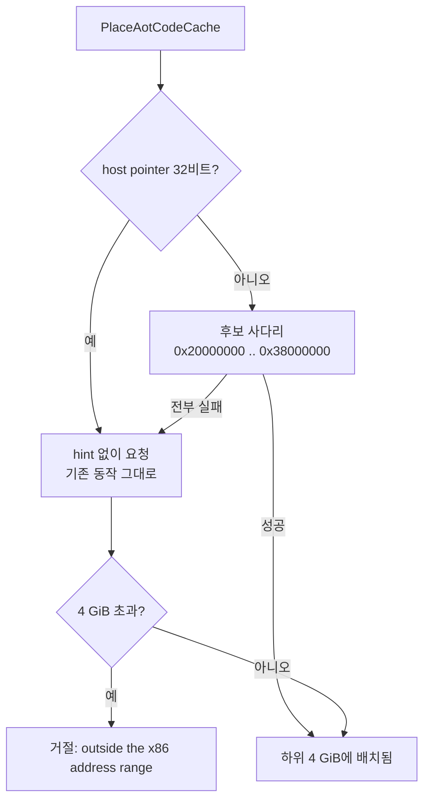
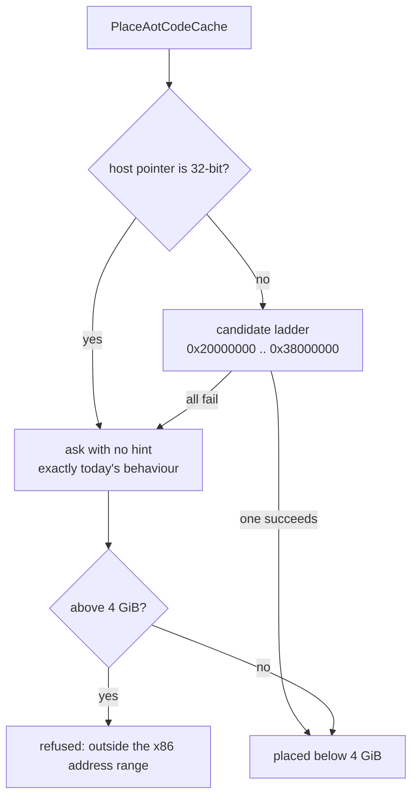

# 20260901-554 Linux x64 code cache 배치 설계 / Placing the code cache on an x64 host

상위 설계: [20260831-546 x64 AOT/DBT 실행 모델](20260831-546-linux-x64-aot-dbt-execution-model.md) ·
선행: [20260831-551 guest 주소 공간](../work-orders/20260831-551-guest-address-space-placement.md),
[20260831-553 long-mode 방출](20260831-553-linux-x64-code-cache-long-mode-emission.md) ·
현황: [Linux 이식 frontier](../analysis/linux-port-frontier.md)

## 한국어

### 목적

Task 553이 x64용 바이트를 만들 수 있게 했습니다. 이 단위는 **그 바이트를 어디에 두는가**를
정합니다. Task 546 구현 순서 4단계(dispatch resolver)로 가려면 먼저 통과해야 하는
지점입니다 — resolver가 frame에 써 넣는 continuation이 바로 code cache 주소이기 때문입니다.

### 측정 — x64에서는 code cache를 아예 배치할 수 없습니다

추론이 아니라 재서 확인했습니다. x86-64 Linux에서 16 MiB 익명 매핑을 hint 없이 요청하면:

| 요청 | 결과 | 하위 4 GiB |
|---|---|---|
| `hint=NULL` | `0x00007fddf72e8000` | 아니오 |
| `hint=NULL` (재요청) | `0x00007fddf72e8000` | 아니오 |
| `MAP_32BIT` | `0x00000000419d5000` | 예 |
| `hint=0x20000000` | `0x0000000020000000` | 예 |
| `hint=0x50000000` | `0x0000000050000000` | 예 |
| `hint=0x60000000` | `0x0000000060000000` | 예 |

그리고 `PlaceAotCodeCache`는 hint 없이 요청한 뒤 **4 GiB를 넘으면 거절합니다** — 메시지는
`AOT code cache is outside the x86 address range`입니다. 두 사실을 합치면 결론이 하나뿐입니다.

> **x64 host는 오늘 code cache를 하나도 배치하지 못합니다.** step 4의 모든 작업이 이 지점
> 아래에 있습니다.

이것은 Task 551의 `mmap_min_addr` 여유 0과 같은 종류의 발견입니다. 기본값이 마침 맞아떨어져
i386에서 보이지 않았을 뿐이고, 여기서는 기본값이 맞지 않아 **전부 실패**합니다.

### 결정

#### 1. cache 주소 API를 넓히지 않고, cache를 하위 4 GiB에 둡니다

`AotCodeCachePlacement::base_address`는 `std::uint32_t`이고 참조가 **121곳**입니다.
`FindAotGuestAddress`·`FindAotCacheAddress`도 `std::uint32_t`를 주고받습니다. 이것을
`uintptr_t`로 넓히는 것이 대안이지만, 세 가지 이유로 배치를 낮춥니다.

**첫째, cache 주소는 C++ 필드만이 아닙니다.** 방출된 바이트 안에도 들어 있습니다 —
inline cache의 `abs32` patch target, timer safe point의 request address, jump table의
항목. **C++ 필드를 넓혀도 방출된 `disp32`는 넓어지지 않습니다.** 오늘 long-mode 방출은
그 slot들을 내지 않지만(Task 553), Task 546 구현 순서는 x64용으로 다시 세울 것을 계획하고
있습니다.

**둘째, guest arena는 이미 하위 4 GiB가 요구사항입니다**(결정 4, Task 551이 측정).
cache도 낮게 두면 cache↔guest 상호 참조가 전부 `disp32`/`rel32` 범위 안에 남습니다.

**셋째, 121곳 대 hint 하나입니다.**

#### 2. hint는 guest arena와 engine image를 피하고, 실패하면 닫습니다

두 이웃의 위치는 이미 측정돼 있습니다.

* **guest arena**: `0x00010000`부터, PIU 프로파일에서 최대 `0x085D7000` — 상단 약 `0x08600000`
  (Task 551 probe).
* **engine image**: `0x40000000` (Task 503의 `-no-pie -Wl,-Ttext-segment=0x40000000`).

그 사이 `(0x08600000, 0x40000000)`가 cache의 창입니다. 128 MiB 간격 후보 네 개를 차례로
시도하고, `MAP_FIXED_NOREPLACE`이므로 이미 누가 있으면 **덮지 않고 실패**합니다. 후보를 여럿
두는 이유는 배치가 한 번만 일어난다는 보장이 없기 때문입니다.

#### 3. 64비트 host에서만 사다리를 탑니다

i386에서는 `ReserveMemory(nullptr, ...)`가 구조적으로 이미 32비트 주소를 돌려줍니다. 거기에
hint를 넣으면 커널이 성공했을 자리에서 실패할 수 있고, 바꿀 이유가 없습니다. 그래서
`sizeof(void*) > 4`일 때만 사다리를 타고, **i386 경로는 오늘과 한 줄도 다르지 않습니다.**

#### 4. 4 GiB 초과 거절은 남깁니다

지우지 않고 **평상 경로에서 마지막 방어선으로** 옮깁니다. 사다리가 전부 실패하면 여전히
거기에 도달하고, 그때 나오는 메시지는 지금과 같습니다.

### 비범위

* cache 주소 API를 `uintptr_t`로 넓히는 것. 결정 1이 그 필요를 없앱니다.
* x64 dispatch slot 방출과 thunk. 이 단위 다음입니다.
* dispatch resolver 자체(step 4의 본체).
* guest 실행. Task 544의 fence는 그대로입니다.

## English

### Objective

Task 553 made it possible to produce x64 bytes. This unit settles **where those bytes go.**
It is the gate in front of Task 546's step 4 (the dispatch resolver), because the
continuation a resolver writes into the frame *is* a code cache address.

### Measured -- an x64 host cannot place a code cache at all

Measured rather than inferred. On x86-64 Linux, an unhinted 16 MiB anonymous mapping:

| Request | Result | Below 4 GiB |
|---|---|---|
| `hint=NULL` | `0x00007fddf72e8000` | no |
| `hint=NULL` (again) | `0x00007fddf72e8000` | no |
| `MAP_32BIT` | `0x00000000419d5000` | yes |
| `hint=0x20000000` | `0x0000000020000000` | yes |
| `hint=0x50000000` | `0x0000000050000000` | yes |
| `hint=0x60000000` | `0x0000000060000000` | yes |

And `PlaceAotCodeCache` asks without a hint, then **refuses anything above 4 GiB** with
`AOT code cache is outside the x86 address range`. Put the two together and only one
conclusion is available.

> **An x64 host places no code cache today.** Every part of step 4 sits below this point.

This is the same kind of finding as Task 551's zero `mmap_min_addr` headroom. There the
defaults happened to line up and it stayed invisible on i386; here they do not line up, and
**everything fails.**

### Decisions

#### 1. Place the cache below 4 GiB rather than widen the cache-address API

`AotCodeCachePlacement::base_address` is a `std::uint32_t` with **121 references**, and
`FindAotGuestAddress` / `FindAotCacheAddress` pass `std::uint32_t` as well. Widening all of
that to `uintptr_t` is the alternative. Three reasons to lower the placement instead.

**First, a cache address is not only a C++ field.** It is also inside the emitted bytes --
the inline cache's `abs32` patch targets, the timer safe point's request address, the
jump table's entries. **Widening a C++ field does not widen an emitted `disp32`.** Today's
long-mode emission does not produce those slots (Task 553), but Task 546's implementation
order plans to rebuild them for x64.

**Second, the guest arena is already required to be below 4 GiB** (decision 4, measured in
Task 551). Keeping the cache low too keeps every cache-to-guest cross-reference inside
`disp32` and `rel32` range.

**Third, it is 121 sites against one hint.**

#### 2. The hint avoids the guest arena and the engine image, and fails closed

Both neighbours are already measured.

* **The guest arena**: from `0x00010000`, at most `0x085D7000` for the PIU profile -- a top
  of about `0x08600000` (Task 551's probe).
* **The engine image**: `0x40000000` (Task 503's `-no-pie -Wl,-Ttext-segment=0x40000000`).

The window between them, `(0x08600000, 0x40000000)`, is where the cache goes. Four
candidates 128 MiB apart are tried in turn, and because the mapping is
`MAP_FIXED_NOREPLACE` an occupied address **fails rather than overwriting**. There are
several candidates because nothing guarantees placement happens only once.

#### 3. Only a 64-bit host walks the ladder

On i386 `ReserveMemory(nullptr, ...)` already returns a 32-bit address by construction.
Adding a hint there could fail where the kernel would have succeeded, and there is no
reason to change it. So the ladder runs only when `sizeof(void*) > 4`, and **the i386 path
is not one line different from today.**

#### 4. The above-4-GiB refusal stays

It is not deleted but moved off the ordinary path and into the last line of defence. If
every candidate fails, control still reaches it, and the message it prints is the one it
prints now.

### Out of scope

* Widening the cache-address API to `uintptr_t`. Decision 1 removes the need.
* Emitting x64 dispatch slots and their thunk. That comes after this unit.
* The dispatch resolver itself (the body of step 4).
* Running a guest. Task 544's fence stands.
