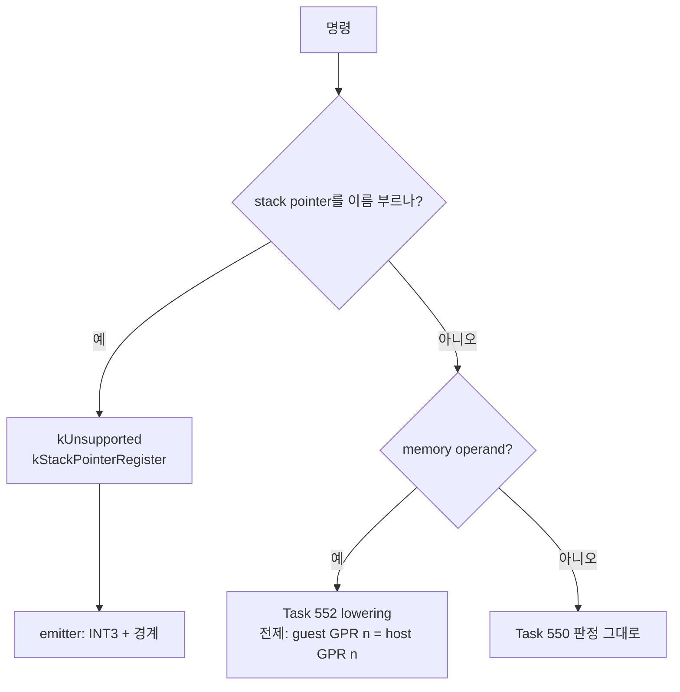
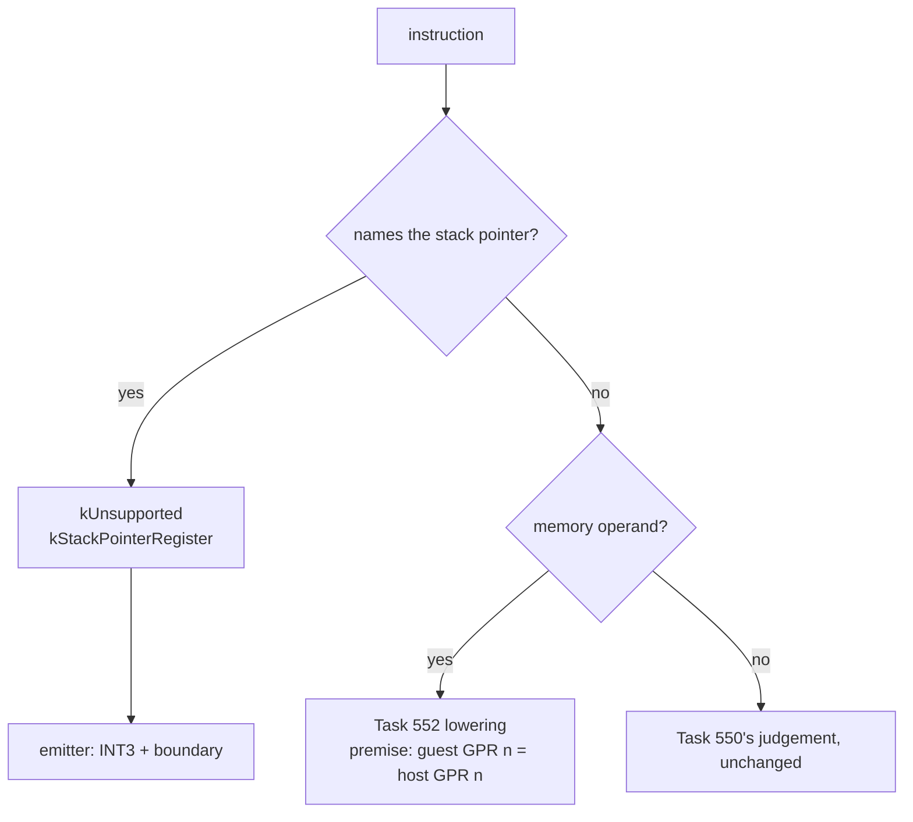

# 20260901-555 x64 lowering의 stack pointer 구멍 / The stack-pointer hole in the lowering

상위 설계: [20260831-546 x64 AOT/DBT 실행 모델](20260831-546-linux-x64-aot-dbt-execution-model.md) ·
직접 관련: [20260831-552 memory operand lowering](20260831-552-linux-x64-memory-operand-lowering.md),
[20260831-553 long-mode 방출](20260831-553-linux-x64-code-cache-long-mode-emission.md) ·
현황: [Linux 이식 frontier](../analysis/linux-port-frontier.md)

## 한국어

### 목적

Task 552의 lowering과 Task 553의 배선에 **guest `ESP`를 host `RSP`로 읽는 구멍**이
있습니다. 이 단위는 그것을 fail-closed로 닫고, **그 구멍을 만든 말하지 않은 전제**를
문서에 적습니다.

### 어떻게 생겼나

Task 552는 memory operand를 `0x67` 접두로 낮춥니다. 그 판단은 **주소가 하위 4 GiB에
있는가**만 봅니다 — base register가 무엇을 담고 있는지는 보지 않습니다.

그런데 Task 546 결정 3은 이렇게 정해 두었습니다.

> host RSP를 guest ESP로 대체하지 않습니다. host RSP는 SysV stack으로 남고, guest ESP는
> state입니다.

두 문장을 붙이면 결론이 나옵니다. **long mode에서 `ESP`는 host SysV stack pointer의 하위
절반입니다.** guest의 스택이 아닙니다.

### 두 가지 형태이고, 두 번째가 더 나쁩니다

| 형태 | 지금 판정 | 실제로 일어나는 일 |
|---|---|---|
| `mov eax,[esp+8]` | `kAddressSizePrefix` → `67 8B 44 24 08` | **host stack을 읽습니다.** 잘못된 데이터 |
| `add esp,16` | **`kIdenticalBytes`** → 그대로 복사 | **host RSP를 씁니다.** zero-extend 되어 host stack pointer가 파괴됩니다 |

첫 번째는 잘못된 값을 읽습니다. 두 번째는 **host가 돌아갈 길을 지웁니다.** 그리고 두 번째는
memory operand를 거치지 않으므로 Task 552의 lowering 경로가 아니라 **`kIdenticalBytes`
경로로 통과합니다** — 즉 Task 552보다 오래된 구멍이고, Task 550부터 있었습니다.

지금은 x64 image를 아무도 실행하지 않아(Task 544 fence) 무해합니다. 다만 Task 553이
lowering을 emitter에 연결했으므로 **고립된 함수의 흠이 아니라 방출 경로의 잠복 결함**입니다.

### 말하지 않은 전제

이 구멍은 실수 하나가 아니라 **적히지 않은 전제** 때문에 생겼습니다. Task 552의 lowering이
옳으려면 다음이 참이어야 합니다.

> lowering된 명령이 실행되는 시점에 **guest GPR *n*이 host GPR *n*에 들어 있다.**

`0x67`이 뜻을 갖는 이유가 이것입니다 — `[ebx+4]`가 guest의 `EBX`를 base로 쓴다는 전제가
없으면 접두를 붙이는 일 자체가 무의미합니다. 그런데 x64 emitter의 register mapping은
**아직 결정되지 않았습니다.** 그래서 이 전제는 대부분의 register에 대해 *미확정*입니다.

`ESP`만은 다릅니다. **결정 3이 이미 거짓으로 정해 두었습니다.**

### 결정

#### 1. stack pointer를 이름 부르는 명령은 전부 거절합니다

역할을 가리지 않습니다 — memory base, memory index, register operand, 읽든 쓰든.
divergence 사유를 `kStackPointerRegister`로 따로 둡니다. "왜 거절됐나"가 `kNone`으로
뭉뚱그려지면 다음 사람이 이 판단을 다시 하게 됩니다.

`SP`·`SPL`도 같이 봅니다. 폭이 다를 뿐 같은 레지스터입니다.

(`ESP`는 SIB index가 될 수 없습니다 — 그 인코딩은 "index 없음"을 뜻합니다. index 검사는
일어나는 경우를 막는 것이 아니라 검사를 완결시키는 쪽입니다.)

#### 2. 지금 낮추지 않고 지금 거절합니다

옳은 lowering은 guest `ESP`를 state에서 꺼내 쓰는 명시적 시퀀스입니다. 그것은 stack
명령 lowering과 **같은 일**이고, 그것이 다음 단위입니다. 그때까지는 거절이 맞습니다 —
지금 절반만 낮추면 다음 단위가 그것을 다시 뜯어야 합니다.

#### 3. 전제를 적습니다

`ESP`만 막고 끝내면 나머지 register에 대한 전제는 여전히 적히지 않은 채 남습니다.
lowering 옆에 그것을 문장으로 둡니다. **register mapping이 정해지는 순간 이 전제는
전제가 아니라 결정이 됩니다.**

`EBP`를 함께 거절하지 않는 이유도 여기 있습니다. 결정 3은 `RSP`만 지목합니다. `EBP`는
`EAX`나 `EBX`와 **같은 정도로 미확정**이지 더 나쁘지 않고, 미확정을 이유로 거절한다면
Task 552의 memory operand 허용 자체를 되돌리는 일이 됩니다. 그 허용은 측정으로 연
것입니다(Task 551).

### 검증

판정기 probe와 방출 probe 양쪽에 항목을 더합니다.

* `add esp,16` — 거절. **이 항목이 이 단위의 핵심입니다**: 지금은 `kIdenticalBytes`로
  통과합니다.
* `sub esp,0x20`, `mov eax,[esp+8]`, `mov [esp+4],ecx` — 거절.
* `mov eax,[ebx+8]` — **여전히 lowering 됩니다.** 거절이 표적이지 담요가 아니라는 것을
  같은 자리에서 보입니다.
* emitter: `ESP` 명령이 `0xCC` 하나와 경계 fixup으로 나옵니다.

### 비범위

* guest `ESP`를 state에서 꺼내는 lowering. 다음 단위(stack 명령)에서 함께 합니다.
* x64 emitter의 register mapping 결정.
* `EBP` — 결정 3이 지목하지 않았고, 다른 register와 같은 정도로 미확정입니다.

## English

### Objective

Task 552's lowering and Task 553's wiring hold a hole that **reads the host `RSP` where the
guest meant `ESP`**. This unit closes it fail-closed and writes down **the unstated premise
that produced it.**

### How it looks

Task 552 lowers a memory operand with a `0x67` prefix. That judgement asks only whether the
**address is below 4 GiB**; it never asks what the base register holds.

But Task 546's decision 3 already settled this:

> Do not switch host RSP to the guest ESP. Host RSP remains a SysV stack; guest ESP is
> state.

Put the two together. **In long mode `ESP` is the low half of the host's SysV stack
pointer.** It is not the guest's stack.

### Two shapes, and the second is worse

| Shape | Current verdict | What actually happens |
|---|---|---|
| `mov eax,[esp+8]` | `kAddressSizePrefix` → `67 8B 44 24 08` | **Reads the host stack.** Wrong data |
| `add esp,16` | **`kIdenticalBytes`** → copied as-is | **Writes host RSP**, zero-extended, destroying the host stack pointer |

The first reads the wrong value. The second **erases the host's way back.** And because the
second has no memory operand it does not go through Task 552's lowering at all -- it passes
on the **`kIdenticalBytes`** path, which makes it older than Task 552: it has been there
since Task 550.

Nothing executes an x64 image today (Task 544's fence), so it is harmless now. But Task 553
wired the lowering into the emitter, so this is **a latent defect on the emission path
rather than a blemish on an isolated function.**

### The unstated premise

This hole is not one slip; it comes from **something never written down.** For Task 552's
lowering to be correct, this must hold:

> At the moment a lowered instruction runs, **guest GPR *n* is in host GPR *n*.**

That is what makes `0x67` mean anything -- without the premise that `[ebx+4]` uses the
guest's `EBX` as a base, adding the prefix is pointless. And the x64 emitter's register
mapping **has not been decided.** So for most registers the premise is *undecided*.

`ESP` is the exception. **Decision 3 already decided it false.**

### Decisions

#### 1. Refuse every instruction that names the stack pointer

In any role -- memory base, memory index, register operand, read or written. The divergence
reason gets its own name, `kStackPointerRegister`, because a refusal folded into `kNone`
makes the next reader redo this judgement.

`SP` and `SPL` are checked with it; they are the same register at another width.

(`ESP` cannot be a SIB index -- that encoding means "no index" -- so the index check
completes the check rather than catching a case that occurs.)

#### 2. Refuse now rather than lower now

The correct lowering materialises guest `ESP` from state as an explicit sequence. That is
**the same work** as lowering the stack instructions, which is the next unit. Refusing is
right until then: lowering half of it now means the next unit takes it apart again.

#### 3. Write the premise down

Blocking `ESP` alone would leave the premise for every other register just as unwritten as
it was. It goes next to the lowering as a sentence. **When the register mapping is settled,
the premise stops being a premise and becomes a decision.**

That is also why `EBP` is not refused alongside. Decision 3 names `RSP` only. `EBP` is
**exactly as undecided** as `EAX` or `EBX`, not worse, and refusing on undecidedness would
undo Task 552's admission of memory operands altogether -- an admission that measurement
opened (Task 551).

### Verification

Items are added to both the classifier probe and the emission probe.

* `add esp,16` -- refused. **This item is the point of the unit**: today it passes as
  `kIdenticalBytes`.
* `sub esp,0x20`, `mov eax,[esp+8]`, `mov [esp+4],ecx` -- refused.
* `mov eax,[ebx+8]` -- **still lowered.** The refusal is targeted rather than a blanket, and
  that is shown in the same place.
* Emitter: an `ESP` instruction comes out as one `0xCC` with a boundary fixup.

### Out of scope

* Lowering guest `ESP` out of state. That happens with the stack instructions, next.
* Deciding the x64 emitter's register mapping.
* `EBP` -- decision 3 does not name it, and it is as undecided as any other register.
