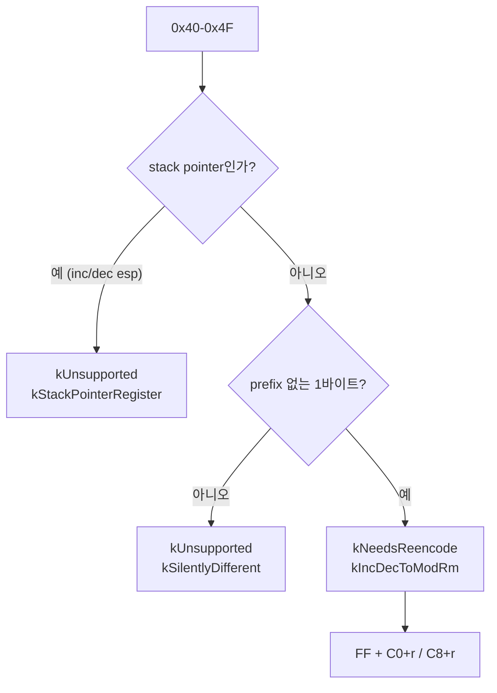
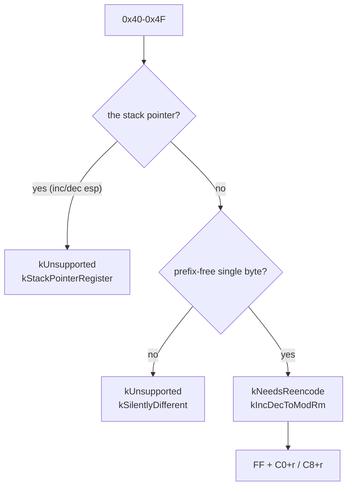

# 20260901-557 `INC`/`DEC r32`를 ModRM 형태로 / Re-encoding `INC`/`DEC r32`

상위 설계: [20260831-546 x64 AOT/DBT 실행 모델](20260831-546-linux-x64-aot-dbt-execution-model.md) ·
선행: [20260831-550 판정기](20260831-550-linux-x64-long-mode-byte-compatibility.md),
[20260901-556 방출 비율 census](20260901-556-x64-emittable-fraction-census.md) ·
현황: [Linux 이식 frontier](../analysis/linux-port-frontier.md)

## 한국어

### 목적

Task 556의 표에서 **노력 대비 건수가 가장 좋은 항목** 하나를 처리합니다. `INC`/`DEC r32`
**805건**이고, 재인코딩은 2바이트입니다.

연쇄를 열지는 못합니다 — block은 여전히 control flow에서 멈춥니다. 그럼에도 먼저 하는
이유는 **`silently-different`가 가장 위험한 부류**이기 때문입니다. 1,466건 중 805건이
여기서 없어집니다.

### 왜 지금 거절되는가

`0x40`–`0x4F`는 32비트에서 `INC r32`(`0x40+r`)와 `DEC r32`(`0x48+r`)입니다. long mode에서
**같은 바이트가 전부 REX prefix**이고, 뒤따르는 명령을 수정합니다. 아무것도 일으키지
않으므로 Task 550이 `kSilentlyDifferent`로 거절했습니다.

> 복사하면 잘못된 결과가 나오는 것이 아니라, **명령 하나가 사라지고 그 다음 명령이 다시
> 쓰입니다.**

### 재인코딩

같은 연산이 long mode에 그대로 있습니다. opcode에 박힌 register를 ModRM으로 옮기면 됩니다.

| 원본 | 뜻 | 낮춘 것 |
|---|---|---|
| `40+r` | `INC r32` | `FF` + ModRM `C0+r` (`FF /0`, mod=11) |
| `48+r` | `DEC r32` | `FF` + ModRM `C8+r` (`FF /1`, mod=11) |

ModRM은 `mod=11`(register direct), `reg`가 group extension(`/0`=INC, `/1`=DEC), `rm`이
register입니다. 1바이트가 2바이트가 됩니다.

**의미는 같습니다.** `FF /0`은 두 모드 모두 `INC r/m32`이고, 영향받는 flag도
같습니다(OF·SF·ZF·AF·PF, CF 제외). long mode에서는 32비트 결과가 상위 절반을 0으로
만들지만, guest register는 32비트이므로 그 절반은 guest 상태가 아닙니다.

그리고 `FF /0`·`FF /1`은 Task 550의 `NeedsWidthReencode`가 이미 **`FF` group에서
`/2`·`/3`(CALL·JMP)만** 걸러내고 `/0`·`/1`은 통과시키도록 적혀 있습니다. 즉 이 재인코딩의
결과물은 판정기가 이미 받아들이는 형태입니다.

### 결정

#### 1. `ESP`는 이 lowering을 타지 않습니다

`44`는 `inc esp`이고, 낮추면 `FF C4`가 되어 **host RSP를 씁니다.** Task 555가 닫은 바로 그
구멍입니다.

판정기 안에서 `r == 4`를 하드코딩하지 않고 **기존 `TouchesStackPointer`를 부릅니다.**
같은 지식을 두 곳에 적으면 한 곳만 고쳐질 수 있습니다.

이것이 필요한 이유는 순서 때문입니다. `0x40`–`0x4F` 판정은 opcode map 블록 안에서 **일찍
반환**하므로, 함수 뒤쪽의 stack pointer 검사에 닿지 않습니다. 검사를 앞으로 옮기는 대안은
택하지 않았습니다 — 그러면 `push`/`pop`이 `kNeedsReencode`에서 `kUnsupported`로 바뀌어
"뜻은 남았고 낮추면 된다"는 정보가 사라집니다.

#### 2. prefix 없는 1바이트 형태만 낮춥니다

`66 40`(`inc ax`)이나 `67 40` 같은 prefix 형태는 **거절을 유지합니다.** 낮출 수 없어서가
아니라, 이 단위가 증명하는 것을 최소로 두기 위해서입니다.

그리고 이 선택은 **스스로를 측정합니다**: census의 감소분이 정확히 805면 refused된
`INC`/`DEC`가 전부 평이한 형태였다는 뜻이고, 805보다 적으면 prefix 형태가 남아 있다는
뜻입니다. 어느 쪽이든 숫자가 말해 줍니다.

#### 3. `kIdenticalBytes`가 아니라 lowering입니다

바이트가 바뀌므로 복사가 아닙니다. `LongModeLowering::kIncDecToModRm`으로 이름을 붙여
`LowerLongModeBytes`가 만들어 냅니다 — 판정과 변환이 갈라지지 않게 하는 Task 552의 규칙
그대로입니다.

### 검증

* 여덟 개 register 전부에 대해 `INC`와 `DEC`의 낮춘 바이트를 확인합니다 — `40`→`FF C0`,
  `47`→`FF C7`, `48`→`FF C8`, `4F`→`FF CF` 같은 식으로 **경계와 중간을 함께** 봅니다.
* `44`(`inc esp`)와 `4C`(`dec esp`)는 `kStackPointerRegister`로 거절되는지 확인합니다.
* `66 40`은 계속 거절되는지 확인합니다.
* 낮춘 바이트가 **long mode 디코더로 원래 뜻과 같은 명령이 되는지** 확인합니다. 이것이
  이 단위의 핵심 항목입니다 — 표를 손으로 옮겨 적은 것이 맞다는 증거가 됩니다.
* emitter probe에 `INC`가 lowering으로 나오는지 더합니다.
* census를 다시 돌려 감소분을 기록합니다.

### 비범위

* `FF /6` `PUSH`, stack 명령 lowering — 다음 묶음입니다.
* prefix가 붙은 `INC`/`DEC`.
* `silently-different`의 나머지(moffs `A0`–`A3`, `BOUND`, `ARPL`, `LES`/`LDS`).

## English

### Objective

Take the **best count-per-effort item** in Task 556's table. `INC`/`DEC r32` is **805
instructions**, and the re-encoding is two bytes.

It opens no chain -- blocks still stop at control flow. It goes first because
**`silently-different` is the most dangerous class**, and 805 of its 1,466 disappear here.

### Why it is refused today

`0x40`-`0x4F` are `INC r32` (`0x40+r`) and `DEC r32` (`0x48+r`) in 32-bit mode. In long
mode **every one of those bytes is a REX prefix** that modifies the instruction after it.
Nothing raises, so Task 550 refused them as `kSilentlyDifferent`.

> Copying one does not produce a wrong result so much as **delete an instruction and
> rewrite its successor.**

### The re-encoding

The same operation exists in long mode. The register moves out of the opcode and into a
ModRM byte.

| Original | Meaning | Lowered |
|---|---|---|
| `40+r` | `INC r32` | `FF` + ModRM `C0+r` (`FF /0`, mod=11) |
| `48+r` | `DEC r32` | `FF` + ModRM `C8+r` (`FF /1`, mod=11) |

ModRM is `mod=11` (register direct), `reg` is the group extension (`/0` INC, `/1` DEC), and
`rm` is the register. One byte becomes two.

**The meaning is the same.** `FF /0` is `INC r/m32` in both modes and touches the same
flags (OF, SF, ZF, AF, PF; not CF). In long mode a 32-bit result zeroes the upper half, but
guest registers are 32-bit, so that half is not guest state.

And `FF /0` / `FF /1` are already a shape the classifier accepts: Task 550's
`NeedsWidthReencode` filters the `FF` group down to **`/2` and `/3` (CALL and JMP) only**,
deliberately leaving `/0` and `/1` eligible.

### Decisions

#### 1. `ESP` does not take this lowering

`44` is `inc esp`, and lowering it gives `FF C4`, which **writes host RSP** -- exactly the
hole Task 555 closed.

The check calls **the existing `TouchesStackPointer`** rather than hardcoding `r == 4`.
The same knowledge in two places is the same knowledge fixed in one.

It is needed because of ordering: the `0x40`-`0x4F` judgement **returns early** inside the
opcode-map block and never reaches the stack-pointer check further down. Moving that check
earlier was rejected as the alternative -- it would turn `push` and `pop` from
`kNeedsReencode` into `kUnsupported`, losing the statement that their meaning survives and
they can be lowered.

#### 2. Only the prefix-free one-byte form is lowered

Prefixed forms such as `66 40` (`inc ax`) or `67 40` **stay refused**. Not because they
could not be lowered, but to keep what this unit proves as small as possible.

And the choice **measures itself**: if the census drop is exactly 805, every refused
`INC`/`DEC` was the plain form; if it is less, prefixed forms remain. Either way the number
says so.

#### 3. It is a lowering, not `kIdenticalBytes`

The bytes change, so it is not a copy. It gets a name,
`LongModeLowering::kIncDecToModRm`, and `LowerLongModeBytes` produces it -- Task 552's rule
that the judgement and the rewrite must not drift apart.

### Verification

* The lowered bytes for `INC` and `DEC` across all eight registers -- `40`→`FF C0`,
  `47`→`FF C7`, `48`→`FF C8`, `4F`→`FF CF` -- checking **the ends and the middle**.
* `44` (`inc esp`) and `4C` (`dec esp`) are refused with `kStackPointerRegister`.
* `66 40` is still refused.
* The lowered bytes **decode in long mode to the instruction the original meant.** This is
  the central item: it is the evidence that a table copied by hand was copied right.
* An emission-probe item showing `INC` coming out lowered.
* The census re-run, with the drop recorded.

### Out of scope

* `FF /6` `PUSH` and the stack lowering -- the next pair.
* Prefixed `INC`/`DEC`.
* The rest of `silently-different` (moffs `A0`-`A3`, `BOUND`, `ARPL`, `LES`/`LDS`).
