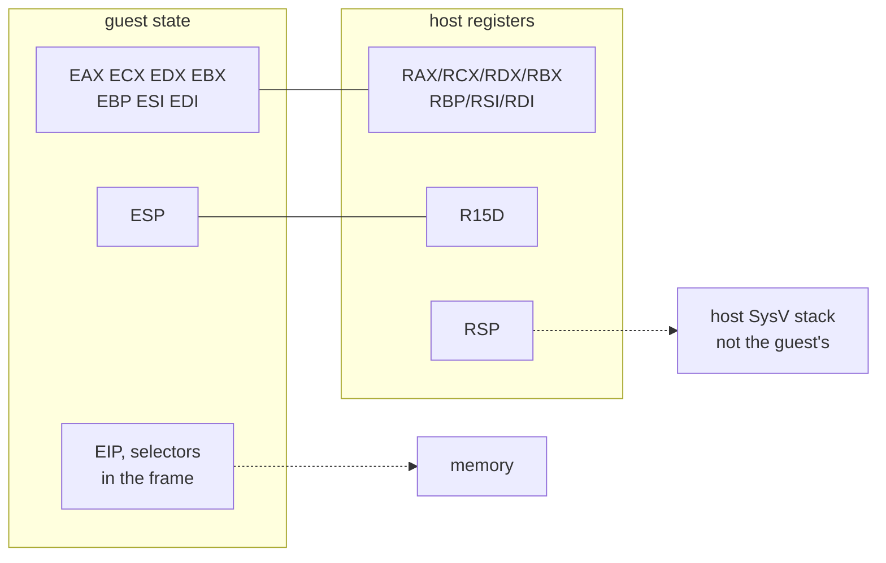

# 20260901-558 x64에서 guest 상태를 어디에 두는가 / Where guest state lives on x64

상위 설계: [20260831-546 x64 AOT/DBT 실행 모델](20260831-546-linux-x64-aot-dbt-execution-model.md) ·
선행: [20260831-552 memory operand lowering](20260831-552-linux-x64-memory-operand-lowering.md),
[20260901-555 stack pointer 거절](20260901-555-linux-x64-stack-pointer-refusal.md),
[20260901-557 `INC`/`DEC` 재인코딩](20260901-557-inc-dec-modrm-lowering.md) ·
현황: [Linux 이식 frontier](../analysis/linux-port-frontier.md)

## 한국어

### 목적

stack lowering을 쓰려면 먼저 **guest `ESP`가 어디 있는지** 답해야 합니다. 그 답은 guest
register 전체를 어디에 두느냐와 같은 질문이고, Task 555가 **적히지 않은 전제**로 기록해 둔
바로 그것입니다.

> lowering된 명령이 실행되는 시점에 guest GPR *n*이 host GPR *n*에 있다.

이 단위는 그 전제를 **결정으로 바꾸고, 실행해서 확인합니다.**

### 결정

#### 1. guest GPR *n*은 host GPR *n*에 둡니다 — 고른 것이 아니라 강제된 것입니다

| guest | host |
|---|---|
| `EAX` `ECX` `EDX` `EBX` | `RAX` `RCX` `RDX` `RBX`의 하위 32비트 |
| `EBP` `ESI` `EDI` | `RBP` `RSI` `RDI`의 하위 32비트 |
| `ESP` | **아래 결정 2** |

이것은 취향이 아닙니다. `kIdenticalBytes`가 존재하기 때문에 **다른 선택지가 없습니다.**
`add eax, ebx`를 바이트 그대로 복사해서 실행하는 것이 옳으려면, guest `EAX`가 host `RAX`에
있고 guest `EBX`가 host `RBX`에 있어야만 합니다. 다른 mapping을 고르는 순간 **어떤 명령도
복사할 수 없게 되고**, Tasks 550·552·553·557이 전부 무의미해집니다.

Task 552의 `0x67` lowering도 같은 이유로 이 mapping 위에 서 있습니다.

#### 2. guest `ESP`는 `R15D`에 둡니다

`RSP`는 host의 SysV stack이므로 쓸 수 없습니다(결정 3, Task 546). 남은 후보는 **frame의
메모리 슬롯**과 **확장 레지스터**입니다. 확장 레지스터를 고릅니다.

**이유 1 — guest 바이트는 확장 레지스터를 이름 부를 수 없습니다.** long mode에서 `R8`–`R15`를
지목하려면 REX prefix가 필요한데, 32비트 인코딩에는 REX가 없습니다(그 바이트는 32비트에서
`INC`/`DEC`입니다). 따라서 **복사된 guest 명령이 guest `ESP`의 거처를 건드리는 인코딩 자체가
존재하지 않습니다.** 메모리 슬롯에는 그런 보장이 없습니다 — 절대 주소를 쓰는 guest 명령이
원리상 frame을 가리킬 수 있습니다.

**이유 2 — callee-saved라서 SysV ABI가 대신 지켜 줍니다.** `R12`–`R15`는 callee-saved이므로
resolver를 C++로 불러도 guest `ESP`가 보존됩니다. `R8`–`R11`은 caller-saved라 매 호출마다
저장·복원이 필요합니다.

**`R15`를 고른 이유 — 인코딩에 예외가 없습니다.** `R12`는 base로 쓸 때 SIB가 필요하고
(`rm=100`), `R13`은 `mod=00`에서 `disp8`이 필요합니다(`rm=101`) — `RSP`·`RBP`가 가진 것과
같은 예외입니다. `R14`와 `R15`에는 둘 다 없습니다. `R15`를 쓰고 `R14`는 다음 예약을 위해
비워 둡니다.

#### 3. `R15`의 상위 절반은 항상 0이고, 그것이 주소 계산을 성립시킵니다

guest `ESP`를 통한 접근은 `[r15]`로 나가고, 이때 **64비트 `R15` 전체가 주소**입니다. 그래서
상위 절반이 0이어야 guest가 뜻한 주소가 됩니다.

유지 방법은 **32비트 연산으로만 쓰는 것**입니다. `sub r15d, 4`처럼 32비트로 쓰면 하드웨어가
상위 절반을 0으로 만들고, 결과는 guest의 32비트 wraparound와 zero-extension 그대로입니다.
진입할 때도 `mov r15d, [frame + esp]`로 32비트 적재합니다.

> **일반 GPR에는 이 조건이 필요 없습니다.** `0x67`이 붙은 memory operand는 주소를 32비트로
> 계산해 zero-extend하므로 base register의 상위 절반을 아예 보지 않습니다. 조건이 필요한
> 것은 prefix 없이 쓰이는 `R15` 하나입니다.

#### 4. 나머지 guest 상태는 frame에 둡니다

| 상태 | 위치 | 이유 |
|---|---|---|
| `EIP` | frame | block 안에서는 쓰이지 않습니다. control flow는 emitter와 resolver가 정합니다 |
| `EFLAGS` | host `RFLAGS` 하위 절반 | 복사된 산술이 자연히 씁니다 — GPR과 같은 항등 |
| selector | frame | host `FS`·`GS`에 넣지 않습니다(결정 6, Task 546) |
| x87 | host FPU | 인코딩이 long mode에서 같습니다(Task 557 측정) |

### 그림

### 검증 — 처음으로 x64가 guest 바이트를 실행합니다

지금까지 x64는 바이트를 **만들기만** 했습니다. 이 단위의 probe는 그것을 **실행합니다.**

1. `kCopy` 명령만으로 plan을 만들고 `enable_long_mode_emission`으로 image를 방출합니다 —
   복사되는 것, `0x67`로 낮춰지는 것, `FF /0`으로 재인코딩되는 것이 모두 들어갑니다.
2. 하위 4 GiB 실행 가능 페이지에 놓습니다(Task 554의 배치와 같은 이유로 하위여야 합니다).
3. 결정 1의 mapping대로 host register에 guest 값을 넣고, `R15D`에 guest `ESP`를 넣고
   **호출합니다.**
4. guest가 뜻한 결과가 나왔는지, 그리고 **`R15`가 그대로이고 상위 절반이 0인지** 봅니다.

마지막 항목이 이 단위의 핵심입니다. 복사된 guest 명령이 일곱 개 register를 모두 건드리는데
`R15`가 살아남는다면, **결정 2가 주장하는 "guest 바이트는 이 레지스터를 이름 부를 수
없다"가 실행으로 확인된 것**입니다.

방출된 image는 마지막에 INT3로 끝나므로(control flow가 fail-closed), probe는 **마지막
`kCopy`까지의 바이트만** 복사해 오고 자신의 `ret`을 붙입니다. 실행되는 것은 emitter가 낸
바이트 그대로이고, 돌아오는 길만 probe의 것입니다.

x64 전용 probe입니다 — 32비트 host에서는 시험할 대상이 없습니다.

### 비범위

* `PUSH`/`POP`/`CALL`/`RET`/`LEAVE`의 lowering. **다음 단위**이고, 이 결정 위에 올립니다.
* control flow와 dispatch resolver.
* `R14`의 용도. 비워 두고 필요할 때 정합니다.
* guest `EIP`를 register에 두는 것. frame으로 충분한지 다음 단위가 답합니다.

## English

### Objective

Writing the stack lowering requires answering **where guest `ESP` is** first. That question
is the same as where all the guest registers live, and it is exactly what Task 555 recorded
as **an unwritten premise**.

> At the moment a lowered instruction runs, guest GPR *n* is in host GPR *n*.

This unit turns that premise into a decision **and executes it to check.**

### Decisions

#### 1. Guest GPR *n* lives in host GPR *n* -- forced, not chosen

| Guest | Host |
|---|---|
| `EAX` `ECX` `EDX` `EBX` | low 32 of `RAX` `RCX` `RDX` `RBX` |
| `EBP` `ESI` `EDI` | low 32 of `RBP` `RSI` `RDI` |
| `ESP` | **decision 2 below** |

This is not a preference. Because `kIdenticalBytes` exists, **there is no other option.**
For `add eax, ebx` to be correct when copied byte for byte, guest `EAX` must be in host
`RAX` and guest `EBX` in host `RBX`. Choose any other mapping and **no instruction can ever
be copied**, which erases Tasks 550, 552, 553 and 557.

Task 552's `0x67` lowering stands on the same mapping for the same reason.

#### 2. Guest `ESP` lives in `R15D`

`RSP` is the host's SysV stack and is unavailable (decision 3, Task 546). That leaves **a
memory slot in the frame** or **an extended register**. The extended register wins.

**Reason 1 -- guest bytes cannot name an extended register.** Naming `R8`-`R15` in long mode
requires a REX prefix, and 32-bit encodings have no REX (those bytes are `INC`/`DEC`
there). So **no encoding exists by which a copied guest instruction could touch guest
`ESP`'s home.** A memory slot carries no such guarantee -- a guest instruction with an
absolute address could in principle name the frame.

**Reason 2 -- callee-saved, so the SysV ABI preserves it for us.** `R12`-`R15` are
callee-saved, so guest `ESP` survives a C++ resolver call by itself. `R8`-`R11` are
caller-saved and would need saving at every crossing.

**Why `R15` -- no encoding exception.** `R12` needs a SIB byte as a base (`rm=100`) and
`R13` needs a `disp8` at `mod=00` (`rm=101`) -- the same quirks `RSP` and `RBP` carry.
`R14` and `R15` have neither. `R15` is taken and `R14` is left for the next reservation.

#### 3. `R15`'s upper half is always zero, and that is what makes the addressing work

An access through guest `ESP` is emitted as `[r15]`, where **the whole 64-bit `R15` is the
address**. Its upper half must be zero for that to be the address the guest meant.

It is kept true by **writing it only with 32-bit operations**: `sub r15d, 4` zeroes the
upper half in hardware, and the result is the guest's own 32-bit wraparound and
zero-extension. Entry loads it the same way, `mov r15d, [frame + esp]`.

> **The ordinary GPRs need no such condition.** A `0x67`-prefixed memory operand computes
> the address in 32 bits and zero-extends it, so it never looks at the base register's
> upper half. The condition is needed for the one register used without the prefix: `R15`.

#### 4. The rest of guest state lives in the frame

| State | Where | Why |
|---|---|---|
| `EIP` | frame | unused inside a block; control flow belongs to the emitter and resolver |
| `EFLAGS` | low half of host `RFLAGS` | copied arithmetic writes it naturally -- the same identity as the GPRs |
| Selectors | frame | never installed into host `FS`/`GS` (decision 6, Task 546) |
| x87 | host FPU | the encodings are the same in long mode (measured in Task 557) |

### The picture

### Verification -- x64 executes guest bytes for the first time

Until now x64 has only **produced** bytes. This unit's probe **runs them.**

1. Build a plan of `kCopy` instructions only and emit it with
   `enable_long_mode_emission` -- including one that is copied, one lowered with `0x67`,
   and one re-encoded to `FF /0`.
2. Place it on an executable page below 4 GiB (low for the same reason as Task 554's
   placement).
3. Load the host registers per decision 1, put guest `ESP` in `R15D`, and **call it.**
4. Check the guest's intended results, and that **`R15` is unchanged with a zero upper
   half.**

That last item is the point of the unit. If copied guest instructions touch all seven
registers and `R15` survives, **decision 2's claim that guest bytes cannot name it has been
confirmed by execution** rather than by reading an encoding table.

The emitted image ends in an INT3, because control flow is fail-closed, so the probe copies
**only the bytes up to the last `kCopy`** and appends its own `ret`. What executes is
exactly what the emitter produced; only the way back is the probe's.

It is an x64-only probe -- on a 32-bit host there is nothing to test.

### Out of scope

* Lowering `PUSH`, `POP`, `CALL`, `RET` and `LEAVE`. **The next unit**, built on this
  decision.
* Control flow and the dispatch resolver.
* What `R14` is for. It stays free until something needs it.
* Holding guest `EIP` in a register. Whether the frame suffices is the next unit's
  question.
