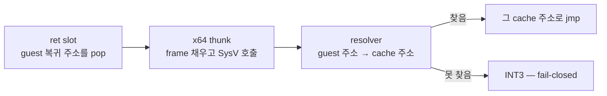

# 20260901-562 x64 return dispatch 설계

## 한국어

### 목적

`kReturn`을 방출하고, guest 복귀 주소를 cache 주소로 잇는 x64 dispatch 경로를
만듭니다. 남은 non-copy 1,805 중 1,105(61%)이며, **call과 짝이라 이것이 없으면 함수에
들어갈 수는 있어도 나올 수 없습니다.**

### return이 다른 이유

Task 560·561이 방출한 것은 전부 **대상이 emit 시점에 알려진** edge였습니다. rel32
하나로 끝났고 새 기계장치가 필요 없었던 이유가 그것입니다.

`ret`은 아닙니다. 대상은 guest stack에서 실행 중에 나오는 **guest 주소**이고, 뛰어야
할 곳은 **cache 주소**입니다. 둘을 잇는 것은 emit 시점에 없으므로 실행 중에 물어야
합니다.



### 결정

#### 1. return slot은 네 명령입니다

```text
45 8B 37        mov r14d, dword ptr [r15]   guest 복귀 주소 → scratch
45 8D 7F 04     lea r15d, [r15+4]           guest ESP += 4 (flag 불변)
49 BC <imm64>   movabs r12, thunk
41 FF E4        jmp r12
```

`LEA`인 이유는 Task 559와 같습니다 — guest `ret`도 flag를 바꾸지 않습니다.

**thunk 주소는 `movabs`로 register에 싣습니다.** rel32는 cache와 engine image 사이
거리가 보장되지 않아 쓸 수 없고(Task 554의 배치 사다리), `jmp qword ptr [rip+disp]`는
code 한가운데 8바이트 데이터를 남겨 **검증기가 그것을 명령으로 decode하려 듭니다** —
Task 561이 정확히 그 형태로 걸렸습니다.

#### 2. scratch는 R12입니다. R13이 아닙니다

R14D는 이미 emitter scratch이고, **R13은 실행 harness가 state 포인터로 쓰고
있습니다.** R13을 쓰면 emitted code가 harness를 부수므로, 남은 R12를 씁니다. R12의
"SIB 필요" 예외는 memory base로 쓸 때만이고 jump 대상으로는 무관합니다.

#### 3. thunk는 caller-saved guest register만 frame에 저장합니다

resolver는 SysV C 함수이므로 RBX·RBP·R12–R15를 보존합니다. 따라서 guest EBX·EBP와
`R15D`(guest ESP)는 저절로 살아남고, **EAX·ECX·EDX·ESI·EDI만** frame에 저장했다가
복원하면 됩니다. frame의 guest register 영역이 그 자리입니다.

전부 저장하는 편이 읽기 쉬우므로 EBX·EBP·ESP도 함께 씁니다 — resolver가 guest 상태
전체를 볼 수 있어야 하고, 비용은 store 세 번입니다.

#### 4. stack alignment는 가정하지 않고 강제합니다

thunk는 `call`이 아니라 `jmp`로 도달하므로 진입 시 RSP 위상이 무엇인지 계약이
없습니다. `and rsp, -16`으로 맞추고 원래 값을 저장했다 되돌립니다. 위상을 계산해
`sub rsp, 8`로 맞추는 것은 진입 경로가 하나뿐일 때만 성립하는 가정입니다.

#### 5. resolver가 찾지 못하면 INT3입니다

Task 553의 fail-closed를 그대로 따릅니다. 0을 돌려주면 thunk가 trap합니다.

#### 6. frame·context·resolver는 전역 포인터로 찾습니다

x64에는 아직 engine runtime이 없습니다(Task 544의 fence). 이번 단위는 **계약을
세우고 실행으로 증명**하는 것이고, engine이 생기면 그 전역이 실제 `ThreadContext`를
가리키게 됩니다. 전역이라는 것 자체가 최종 형태라는 뜻은 아니며, 그 점을 헤더에
적습니다.

### 검증 — call과 return이 이어져야 합니다

이 단위가 성립했다는 증거는 하나뿐입니다. **호출하고, 돌아오고, 호출 다음 명령이
실행되는 것.**

```
caller:  mov eax, 0x1111
         call callee
         mov eax, 0x4444     ← 여기가 실행되면 return이 이어진 것
callee:  mov eax, 0x3333
         ret
```

`eax = 0x4444`가 나와야 합니다. `0x3333`이면 return이 이어지지 않은 것이고, `0x1111`
이면 call도 가지 않은 것입니다. **세 값이 세 가지 실패를 구분합니다.**

resolver가 못 찾는 경우도 별도로 확인합니다 — 실행되지 않는 오류 경로는 작동한다는
증거가 없는 코드라는 것을 Task 561이 두 번 보여줬습니다.

### 비범위

- engine runtime 연결 (Task 544의 fence는 그대로)
- inline cache — 지금은 매 return이 resolver를 부릅니다. 먼저 이어진 뒤에 빠르게
  합니다
- `kIndirectExit`, `kJumpTable`

## English

### Objective

Emit `kReturn` and build the x64 dispatch path that joins a guest return address to a
cache address -- 1,105 of the 1,805 non-copy records left (61%). **It is call's pair:
without it control can enter a function but not leave.**

### Why return is different

Everything Tasks 560 and 561 emitted had a target **known at emit time**, which is why one
rel32 finished the job. `ret` does not: its target is a **guest address** that appears on
the guest stack at run time, and where control must go is a **cache address**. Nothing at
emit time joins the two, so it has to be asked at run time.

### Decisions

1. **The return slot is four instructions** -- load the guest return address into the
   scratch, `LEA` the guest ESP up by four (a guest `ret` changes no flags, Task 559's
   reason), load the thunk address with `movabs`, and jump to it.

   The thunk address goes into a register rather than a rel32, because the distance from
   the cache to the engine image is not guaranteed (Task 554's placement ladder), and
   rather than `jmp qword ptr [rip+disp]`, because that leaves eight bytes of data inside
   the code that **the verifier would try to decode as instructions** -- exactly the shape
   Task 561 was caught by.

2. **The scratch is R12, not R13.** R14D is already the emitter's scratch and **R13 holds
   the execution harness's state pointer**, so emitted code using R13 would break the
   harness. R12's "needs a SIB byte" caveat applies to it as a memory base, not as a jump
   target.

3. **The thunk saves only the caller-saved guest registers.** The resolver is a SysV C
   function, so it preserves RBX, RBP and R12-R15: guest EBX, EBP and `R15D` survive by
   themselves, and only EAX, ECX, EDX, ESI and EDI need the frame. EBX, EBP and ESP are
   written too, at a cost of three stores, so the resolver sees whole guest state.

4. **Stack alignment is forced, not assumed.** The thunk is reached by `jmp`, so nothing
   promises RSP's phase on entry. `and rsp, -16` with the original saved and restored is
   right for every entry path; computing the phase would hold only while there is one.

5. **A resolver that finds nothing means INT3**, keeping Task 553's fail-closed rule.

6. **The frame, context and resolver are found through global pointers.** x64 has no
   engine runtime yet (Task 544's fence). This unit establishes the contract and proves it
   by execution; when the engine arrives those globals point at the real `ThreadContext`.
   The globals are not the final shape, and the header says so.

### Verification -- the call and the return must join

There is only one piece of evidence that this unit worked: **calling, coming back, and
running the instruction after the call.**

```
caller:  mov eax, 0x1111
         call callee
         mov eax, 0x4444     <- reaching this is the return joining up
callee:  mov eax, 0x3333
         ret
```

`eax` must be `0x4444`. `0x3333` means the return did not join; `0x1111` means the call
never went. **Three values separate three different failures.**

The case where the resolver finds nothing is checked separately -- Task 561 showed twice
that an error path which never runs is code with no evidence it works.

### Out of scope

Engine runtime integration (Task 544's fence stands); an inline cache -- every return
calls the resolver for now, and making it fast comes after making it join;
`kIndirectExit` and `kJumpTable`.
