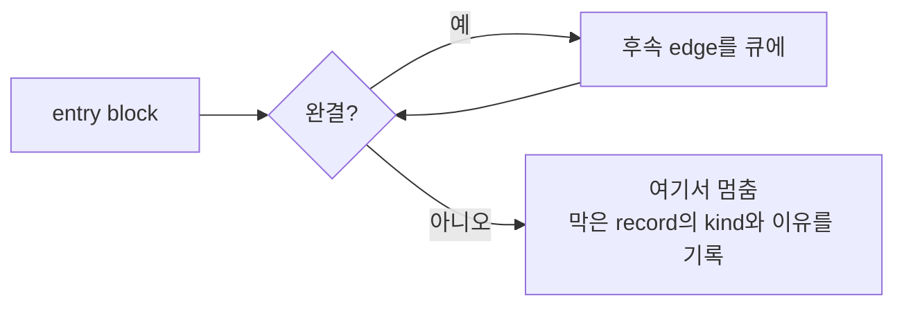

# 20260901-563 진입점 기준 도달 가능성 측정 설계

## 한국어

### 목적

"무엇이 실행을 막는가"를 나열이 아니라 측정으로 답합니다.

Task 556 이후 x64의 진척은 두 수로 읽혀 왔습니다 — 방출 가능 비율과 완결 block
비율. 562를 끝낸 시점에 각각 86.46%와 64.13%이고, 둘 다 "거의 다 왔다"처럼 읽힙니다.

**둘 다 이미지 전체에 대한 집계이고, 이미지는 실행이 아닙니다.**

### 다른 질문

| 질문 | 답하는 수 |
|---|---|
| 무엇이 **빠졌는가** | 방출 가능 비율, 완결 block 비율 |
| 무엇이 **가로막는가** | 진입점에서 도달 가능한 block 수 |

두 번째가 실행 여부를 정합니다. 이미지의 99%가 방출 가능해도 진입 직후 block 하나가
완결되지 않으면 체인은 거기서 끝납니다.

### 어떻게 재는가

진입점에서 시작해 **완결된 block만** 따라갑니다.

edge 처리:

* `kConditionalBranch` — target과 fallthrough 둘 다
* `kDirectJump` — target
* `kDirectCall` — **target과 fallthrough 둘 다.** 호출한 곳으로 돌아오기 때문입니다
* `kReturn` — **따라가지 않습니다.** 대상이 호출자이고, 그 fallthrough는 call을 따라갈
  때 이미 큐에 들어갔습니다
* 그 외 — fallthrough

`kReturn`을 따라가지 않으므로 이 측정은 **한쪽으로만 과소평가**합니다. 안전한 방향
입니다 — 실제보다 적게 나오지, 많게 나오지 않습니다.

### 무엇을 보고하는가

도달 가능 block 수와 명령 수, 그리고 **체인이 멈춘 지점을 record kind와 이유별로**
집계합니다. 이 표가 다음 단위를 고르는 목록이며, 이미지 전체 거부 집계와는 다릅니다.

진입 주소와 첫 정지 주소도 함께 찍습니다. 이 정도로 결과가 달라지는 주장은 disassembler
에서 확인할 수 있어야 하고, 믿어 달라고 할 것이 아닙니다.

### 비범위

- 실행 빈도 — 정적 도달 가능성이지 hot path가 아닙니다
- 간접 분기와 jump table의 대상 — 계획에 없는 edge는 별도로 셉니다

## English

### Objective

Answer "what blocks execution" by measuring rather than by listing.

Since Task 556 the x64 port's progress has been read through two numbers: the emittable
fraction and the complete-block fraction, 86.46% and 64.13% after Task 562. Both read as
"nearly there".

**Both are counts over the whole image, and an image is not a run.**

### A different question

| Question | The number that answers it |
|---|---|
| What is **missing** | emittable fraction, complete blocks |
| What is **in the way** | blocks reachable from the entry |

The second decides whether anything executes. Ninety-nine percent of an image can be
emittable and the chain still ends at the first block after the entry that is not
complete.

### How it is measured

Walk from the entry, following **only complete blocks**. A conditional branch queues both
its target and its fallthrough; a jump queues its target; **a call queues both**, because
control comes back; a **return queues nothing**, since its target is whoever called and
that fallthrough entered the queue when the call was taken.

Not following returns makes this an **under-approximation in one direction only**, which
is the safe one: it reports less reach than exists, never more.

### What it reports

Reachable blocks and instructions, and **where chains stopped, by record kind and
reason**. That table is the list the next unit is chosen from, and it is not the
image-wide refusal table.

The entry address and the first stopping address are printed too. A claim that changes
the reading this much has to be checkable in a disassembler rather than taken on trust.

### Out of scope

Execution frequency -- this is static reachability, not a hot path. Indirect branch and
jump-table targets; edges with no block in the plan are counted separately.
