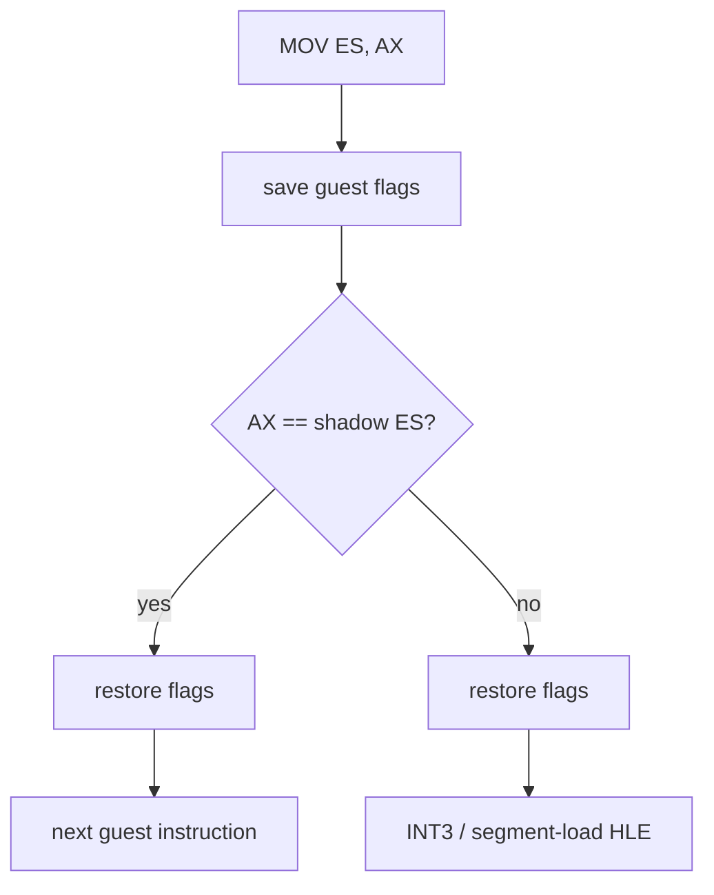

# 설계 20260902-569 — Linux x64 guarded segment load

## 문제

Task 568 뒤의 실제 도달 frontier는 `0x10f4ca2`의 `8e c0`, 즉
`MOV ES, AX`다. planner는 이 명령을 `kGuardedSegmentLoad`로 분류하지만 x64
emitter는 `kCopy`와 일부 전용 slot만 처리하므로 현재는 INT3 경계가 된다.

i386의 기존 guarded slot은 source selector, host에 설치된 물리 segment
selector, shadow selector가 모두 같을 때만 명령을 의미상 no-op으로 통과시킨다.
그러나 x64 결정은 guest selector를 host `ES`/`DS`에 설치하지 않는 것이다.
host selector를 비교하면 guest 의미가 아니라 host ABI를 비교하게 되고, 실제
guest와 무관하게 항상 fallback할 수 있다.

## 결정 1 — shadow와 같은 load만 no-op으로 발행한다

x64 slot은 source GPR의 하위 16비트와 해당 guest segment의 shadow selector를
비교한다. 같으면 guest-visible selector 상태가 바뀌지 않으므로 명령은 의미상
no-op이고 다음 guest 명령으로 간다. 다르면 selector와 descriptor base를 함께
갱신해야 하므로 slot 안에서 추측하지 않고 flags를 복원한 뒤 INT3 HLE 경계로
간다.

이 방식은 원본 명령의 효과를 재구현하지 않는다. 이미 성립한 guest 상태에서
효과가 없는 경우만 네이티브 경로로 인정하고, 실제 상태 변경은 기존 HLE에
남긴다.

## 결정 2 — flags 보존은 기존 long-mode lowering을 재사용한다

비교는 flags를 바꾸지만 원본 `MOV Sreg, r16`은 flags를 바꾸지 않는다. 따라서
Task 559의 `PUSHFD`/`POPFD` lowering을 앞뒤에 사용한다. guest ESP는 R15D에 있고
emitter scratch는 R14D라는 기존 register 배치를 바꾸지 않는다. source GPR을
포함한 guest GPR은 어느 것도 임시 레지스터로 사용하지 않는다.

shadow access는 Task 552와 같은 `67 66 39 /r` + SIB absolute `disp32` 형식으로
발행한다. 현재 code-cache/guest-state ABI처럼 shadow 주소는 하위 4 GiB에 있어야
하며, patch할 주소가 없으면 slot의 첫 바이트를 INT3로 바꿔 fail closed한다.

## 결정 3 — guarded-load byte patch를 runtime으로 분리한다

기존 `ReResolveWin32AotSegmentOverrides`는 guarded-load slot의 shadow 주소와
counter 주소를 직접 쓴다. 그 코드는 i386의 첫 바이트 `9C`와 두 counter operand가
항상 있다는 모양을 알고 있다. x64 slot에는 counter operand가 없고 시작부도
lowered flags-save sequence다.

Task 568에서 segment override에 적용한 경계를 그대로 따른다.

- emitter는 slot이 실제로 쓴 첫 5바이트를 site에 기록한다.
- runtime patch 함수는 이미 writable인 image bytes에 shadow/counter operand를
  쓴다.
- i386 site는 기존 두 counter operand를 유지한다.
- x64 site는 host counter 주소가 abs32에 들어간다고 보장할 수 없으므로 counter
  operand가 없음을 명시하고 shadow만 patch한다.
- engine은 page protection과 instruction-cache flush만 담당한다.

fallback 상수는 두지 않는다. site가 복원 바이트를 제공하지 않거나 필요한
operand 주소가 없으면 patch는 그 slot을 INT3로 닫는다.

## 결정 4 — emitter와 census는 같은 판정을 묻는다

`LongModeGuardedSegmentLoadEmittable`을 emitter 옆에 두고 census도 이를 호출한다.
발행 수는 `long_mode_guarded_segment_load_count`로 별도 기록한다. Task 568에서
측정 도구의 복제된 판정이 실제 수치를 틀리게 했으므로 새 kind를 세는 두 경로에
별도 조건을 다시 쓰지 않는다.

## 검증

- synthetic x64 실행에서 selector 일치 시 다음 명령이 실행되고 flags/GPR/ESP가
  보존되는지 확인한다.
- selector 불일치 시 다음 명령은 실행되지 않고 정확한 slot의 INT3가 관측되는지
  확인한다.
- unresolved patch 뒤 native patch로 되돌려 slot prologue가 복원되는지 확인한다.
- 기존 i386 guarded-load layout/patch probe가 그대로 통과하는지 확인한다.
- Linux x64/i386 core probe와 instruction census를 실행하고 `agrees=true`, 도달
  frontier와 수치를 기록한다.
- Win32 x86 및 x64 빌드/probe 회귀를 확인한다.

---

# Design 20260902-569 — Linux x64 guarded segment load

## Problem

The real reachability frontier after Task 568 is `8e c0` at `0x10f4ca2`,
`MOV ES, AX`. The planner classifies it as `kGuardedSegmentLoad`, but the x64
emitter handles only `kCopy` and a growing set of dedicated slots, so this is
currently an INT3 boundary.

The existing i386 guarded slot treats the instruction as a semantic no-op only
when the source selector, the physical segment selector installed in the host,
and the shadow selector all match. The x64 decision, however, is never to
install guest selectors into host `ES`/`DS`. Comparing the host selector would
therefore compare host ABI state rather than guest semantics and could always
fall back regardless of the guest.

## Decision 1 — emit only a load equal to the shadow as a no-op

The x64 slot compares the low 16 bits of the source GPR with the target guest
segment's shadow selector. Equality means no guest-visible selector state
changes, so the instruction is a semantic no-op and execution continues at the
next guest instruction. A mismatch requires updating both selector and
descriptor base; the slot does not guess. It restores flags and reaches the
INT3 HLE boundary.

This does not reimplement the original instruction. It admits only the case
that has no effect in already-established guest state and leaves real state
changes with the existing HLE.

## Decision 2 — reuse the existing long-mode flags lowering

The comparison changes flags while the original `MOV Sreg, r16` does not.
Task 559's `PUSHFD`/`POPFD` lowering therefore surrounds it. The existing
register placement remains unchanged: guest ESP is in R15D and emitter scratch
is R14D. No guest GPR, including the source, is used as scratch.

The shadow access uses Task 552's `67 66 39 /r` plus an absolute SIB `disp32`.
As with the current code-cache/guest-state ABI, the shadow must be below 4 GiB;
if no patchable address exists, the patcher changes the slot's first byte to
INT3 and fails closed.

## Decision 3 — split guarded-load byte patching into runtime

`ReResolveWin32AotSegmentOverrides` currently writes the guarded-load shadow
and counter addresses itself. It knows the i386 shape: first byte `9C` and two
counter operands always present. The x64 slot has neither those counter
operands nor that exact opening sequence.

Use the same seam established by Task 568 for segment overrides:

- the emitter records the first five bytes actually emitted in the site;
- a runtime patch function writes shadow/counter operands into already-writable
  image bytes;
- i386 sites retain both existing counter operands;
- x64 sites explicitly have no counter operands and patch only the shadow,
  because host counter addresses are not guaranteed to fit abs32;
- the engine owns only page protection and instruction-cache flushing.

There is no fallback constant. Missing restore bytes or required operand
addresses close that site with INT3.

## Decision 4 — emitter and census ask the same predicate

`LongModeGuardedSegmentLoadEmittable` lives beside the emitter and the census
calls it too. Emission is counted separately in
`long_mode_guarded_segment_load_count`. Task 568 showed that duplicated
measurement predicates produce wrong reachability, so no second condition is
written in either census path.

## Verification

- In synthetic x64 execution, a matching selector reaches the next instruction
  while preserving flags, GPRs, and ESP.
- A mismatching selector does not execute the next instruction and traps at the
  exact slot INT3.
- An unresolved patch followed by a native patch restores the slot prologue.
- The existing i386 guarded-load layout and patch probe remains passing.
- Run Linux x64/i386 core probes and instruction census; record `agrees=true`,
  reachability, and the new frontier.
- Verify Win32 x86 and x64 build/probe regressions.
