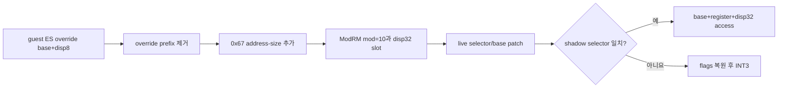

# 설계 20260902-570 — Linux x64 segment override base+disp8

## 목적

Task 569 뒤의 첫 reachable 정지 지점 `0x10fc27d`,
`26 8a 4f ff` = `mov cl, es:[edi-1]`을 long-mode code cache에서 실행 가능하게
만듭니다. 새로운 segment 의미를 추가하지 않고, Tasks 567–568에서 검증한 selector
guard와 live base patch를 `base+disp8` ModRM 형식에 적용합니다.

## 범위와 안전 조건

이번 단위가 새로 허용하는 형식은 다음 조건을 모두 만족합니다.

- `ES`, `SS`, `DS` override입니다. `FS`와 `GS`는 계속 거절합니다.
- legacy 32-bit decode에서 ModRM `mod=01`이고 SIB가 없습니다.
- displacement는 8비트이며 방출 시 부호 확장한 32비트 값으로 넓힙니다.
- opcode map은 기본 map입니다.
- 명령의 다른 operand가 guest `ESP`를 가리키지 않습니다. guest `ESP`는 host
  `R15D`에 있으므로 별도 재인코딩 없이 host `ESP`를 사용하면 안 됩니다.

기존 `mod=00 rm=101` absolute `disp32` 형식은 그대로 유지합니다. SIB, displacement가
없는 base 형식, 기존 `disp32` base 형식은 census가 다음 비용을 보여 줄 때까지 열지
않습니다.

## 바이트 변환

```text
guest:  26 8A 4F FF              mov cl, es:[edi-1]
access: 67 8A 8F <disp32>         mov cl, [edi+disp32]
                         disp32 = sign_extend(-1) + live ES base
```

`0x67`은 long mode에서 32-bit address size를 선택합니다. ModRM의 `reg`와 `rm`은
보존하고 `mod`만 `01`에서 `10`으로 바꿉니다. 원래 `disp8` 뒤의 immediate가 있다면
새 `disp32` 뒤에 그대로 둡니다.



## patch 계약

`AotSegmentOverrideSite::original_displacement`에는 `disp8`을 부호 확장한 값을
저장합니다. `PatchAotSegmentOverrideSites`는 기존 계약대로 이 값에 live segment
base를 더해 emitted `disp32`를 갱신합니다. 따라서 runtime patcher와 engine의 page
보호 경계는 변경하지 않습니다.

## 검증

Linux x64 실행 probe는 한 image 안에 새 `base+disp8` access를 먼저, 기존 absolute
access를 다음에 둡니다.

1. selector 일치: `EDI + ES_base - 1`의 byte가 `CL`로 들어오고, 이어지는 absolute
   access도 성공하며 guest ESP가 보존되어야 합니다.
2. selector 불일치: 첫 번째인 새 slot의 INT3가 한 번 발생하고 두 access 모두
   실행되지 않아야 합니다.
3. HLE/unresolved 뒤 native 재해결: 두 slot의 prologue가 복원되고 다시 실행되어야
   합니다.
4. Linux x64 census의 emitter/tally가 `agrees=true`여야 하며 새 first stop을 기록합니다.
5. Linux i386 및 Win32 x86 probe로 공용 patch 계약의 회귀가 없는지 확인합니다.

---

# Design 20260902-570 — Linux x64 segment-override base+disp8

## Objective

Make the first reachable stop after Task 569 executable in the long-mode code
cache: `26 8a 4f ff` at `0x10fc27d`, or `mov cl, es:[edi-1]`. This adds no new
segment semantics. It applies the selector guard and live-base patch verified
by Tasks 567–568 to a base-plus-disp8 ModRM form.

## Scope and safety conditions

The newly admitted form satisfies all of these conditions:

- it has an `ES`, `SS`, or `DS` override; `FS` and `GS` remain refused;
- legacy 32-bit decoding reports ModRM `mod=01` with no SIB;
- its 8-bit displacement is sign-extended and widened to 32 bits at emission;
- it uses the default opcode map; and
- no other operand names guest `ESP`. Guest `ESP` lives in host `R15D`, so an
  unmodified host-`ESP` encoding would be incorrect.

The existing `mod=00 rm=101` absolute-disp32 form remains admitted. SIB forms,
base forms without a displacement, and base forms already carrying disp32 stay
closed until the census shows which restriction matters next.

## Byte transform

```text
guest:  26 8A 4F FF              mov cl, es:[edi-1]
access: 67 8A 8F <disp32>         mov cl, [edi+disp32]
                         disp32 = sign_extend(-1) + live ES base
```

`0x67` selects 32-bit address size in long mode. The ModRM `reg` and `rm`
fields are preserved while `mod` changes from `01` to `10`. Any immediate
following the original disp8 is retained after the new disp32.

The diagram above expresses the same lowering and guard flow for both
languages.

## Patch contract

`AotSegmentOverrideSite::original_displacement` stores the sign-extended
disp8. `PatchAotSegmentOverrideSites` keeps its existing contract: add the live
segment base and write the emitted disp32. The runtime patcher and the engine's
page-protection seam therefore do not change.

## Verification

The Linux x64 execution probe puts the new base-plus-disp8 access first and the
existing absolute access second in one image.

1. Matching selector: the byte at `EDI + ES_base - 1` enters `CL`, the following
   absolute access also succeeds, and guest ESP is preserved.
2. Mismatching selector: the new first slot raises one INT3 and neither access
   executes.
3. Native re-resolution after HLE/unresolved routing: both prologues are
   restored and execute again.
4. The Linux x64 census reports `agrees=true` and records the new first stop.
5. Linux i386 and Win32 x86 probes check the shared patch contract for regressions.
