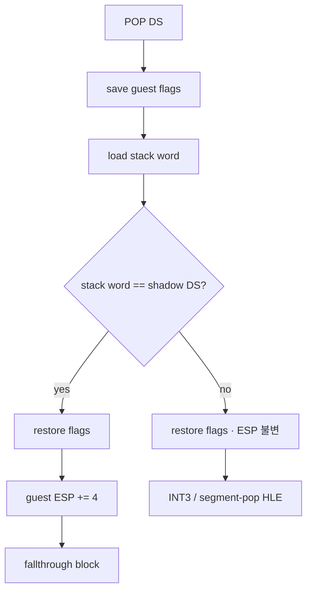
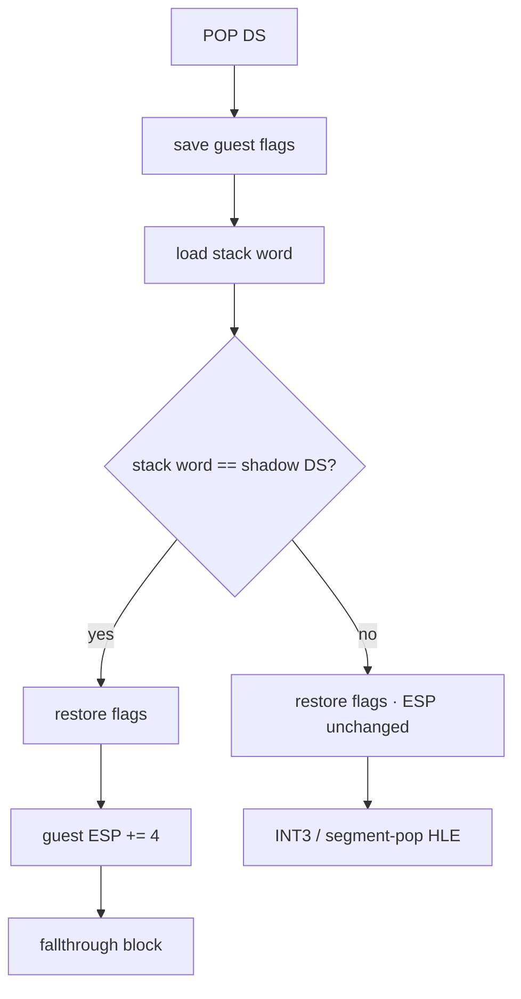

# 설계 20260902-571 — Linux x64 guarded segment pop

## 문제

Task 570 뒤의 첫 reachable 정지 지점은 `0x10fc2d5`, 바이트 `1f`, 즉 plain
`POP DS`다. planner는 이를 `kGuardedSegmentPop`으로 분류하고 census는 이
kind 하나만을 frontier로 보고한다. 이미지 안에는 같은 kind가 49개 있다.

i386 slot은 host에 설치된 물리 segment selector를 읽어 guest stack word 및
shadow selector와 비교한다. 그러나 Task 546 결정 5 이후 x64는 guest selector를
host segment register에 설치하지 않는다. 물리 selector를 읽으면 guest 의미가
아니라 host ABI를 읽게 되고, guest 상태와 무관하게 판정이 갈린다. Task 569가
`MOV Sreg, r16`에서 내린 결론과 같은 문제다.

`kGuardedSegmentPop`은 `kGuardedSegmentLoad`와 두 가지가 다르다.

1. source가 register가 아니라 **guest stack word**다.
2. planner에서 **block을 끝낸다**(`record.fallthrough_target = next`). 따라서
   fixup은 `guest_address + length`가 아니라 `fallthrough_target`을 쓴다.

## 결정 1 — shadow와 같은 stack word만 no-op으로 발행한다

x64 slot은 guest stack top의 하위 16비트를 해당 guest segment의 shadow selector와
비교한다. 같으면 guest-visible selector 상태가 바뀌지 않으므로 명령의 효과는
`ESP += 4` 하나뿐이고, slot이 그것을 수행한 뒤 다음 block으로 간다. 다르면
selector와 descriptor base를 함께 갱신해야 하므로 slot 안에서 추측하지 않고
**guest ESP를 진입 시점 값 그대로 둔 채** flags를 복원하고 INT3 HLE 경계로 간다.
stack word를 소비하지 않으므로 HLE는 원본 `POP`을 그대로 재실행할 수 있다.



Task 569와 같은 원칙이다. 원본 명령의 효과를 재구현하지 않고, 이미 성립한 guest
상태에서 selector 변경이 없는 경우만 네이티브로 인정한다.

## 결정 2 — flags 보존이 stack word의 위치를 4바이트 옮긴다

비교는 flags를 바꾸지만 원본 `POP Sreg`는 바꾸지 않는다. 따라서 Task 559의
`PUSHFD`/`POPFD` lowering을 앞뒤에 쓴다. 그런데 그 lowering은 **guest stack을**
쓴다(`lea r15d,[r15-4]` 뒤 `mov [r15], r14d`). 즉 flags를 저장한 뒤 guest ESP는
진입 값보다 4 작고, 비교해야 할 stack word는 `[r15]`가 아니라 **`[r15+4]`**에 있다.

이 오프셋이 이 단위에서 새로 생긴 유일한 위험이고, 아래 검증 1번이 정확히 그것을
겨눈다. guest ESP는 R15D, emitter scratch는 R14D라는 Task 558·559의 배치는
바꾸지 않으며 guest GPR은 어느 것도 임시로 쓰지 않는다.

```text
9C 41 5E 45 8D 7F FC 45 89 37   flags save (lowered PUSHFD)   ESP -= 4
45 8B 77 04                     mov r14d, [r15+4]             stack word
67 66 44 3B 34 25 <disp32>      cmp r14w, word ptr [shadow]
74 0B                           je success
45 8B 37 45 8D 7F 04 41 56 9D   flags restore                 ESP 복원
CC                              int3  (fallback_offset)
45 8B 37 45 8D 7F 04 41 56 9D   flags restore                 ESP 복원
45 8D 7F 04                     lea r15d,[r15+4]              POP 소비
E9 <rel32>                      jmp fallthrough_target
```

shadow access는 Task 552·569와 같은 `67 66 ... 25` absolute SIB `disp32` 형식이다.
`0x67`은 long mode에서 disp32를 RIP 상대나 부호 확장이 아니라 32비트 절대 주소로
읽게 한다. shadow는 현재 ABI대로 하위 4 GiB에 있어야 하고, patch할 주소가 없으면
slot의 첫 바이트를 INT3로 바꿔 fail closed한다.

## 결정 3 — pop patch도 runtime으로 옮기고, 엔진의 사본을 없앤다

Task 568(override)과 Task 569(load)가 세운 경계를 pop에도 적용한다. site는
emitter가 실제로 쓴 첫 5바이트(`guard_prologue`)와 counter operand 유무
(`has_counter_operands`)를 들고 다니고, `PatchAotGuardedSegmentPopSites`가
이미 writable한 image bytes에 shadow/counter operand를 쓴다.

여기에 더해 **엔진에 남아 있던 사본을 제거한다.** 현재
`ResolveAotGuardedSegmentPops`와 `ResolveAotGuardedSegmentLoads`는 첫 바이트가
`9C`라는 것과 counter operand가 항상 있다는 것을 스스로 알고 있다. x64 load site는
counter operand가 없어 두 offset이 0이므로, 이 경로는 counter 주소를
**image의 첫 4바이트에** 쓴다. dynamic append 경로에서 이는 방금 복사한 이미지의
시작부를 덮는 손상이다. x64가 아직 게스트를 돌리지 않아 드러나지 않았을 뿐이고,
돌리기 시작하는 순간 나타난다.

따라서 engine의 세 경로(정적 배치·dynamic append·재해결)를 모두 runtime patcher
호출로 바꾼다. engine에는 page 보호와 instruction cache flush만 남긴다. 이것은
Task 568이 "무엇을 쓸지는 emitter 옆에, 페이지를 여는 일은 engine에"라고 그은
경계를 완성하는 것이지 새 경계가 아니다.

fallback 상수는 두지 않는다. site가 복원 바이트를 제공하지 않거나 필요한 operand
주소가 없으면 patch는 그 slot을 INT3로 닫는다.

## 결정 4 — emitter와 census는 같은 판정을 묻는다

`LongModeGuardedSegmentPopEmittable`을 emitter 옆에 두고 census의 tally와
`RecordIsEmitted`가 모두 이를 호출한다. 발행 수는
`long_mode_guarded_segment_pop_count`로 별도 기록한다. Tasks 562·568에서 측정
도구의 복제된 판정이 실제 수치를 틀리게 했으므로 새 kind를 세는 어느 경로에도
조건을 다시 쓰지 않는다.

허용 대상은 i386 slot과 같은 `ES`·`DS`·`FS`·`GS`다. 이 slot은 host segment
register를 건드리지 않으므로 Task 569의 load와 마찬가지로 `FS`·`GS`를 거절할
이유가 없다. planner는 `CS`·`SS` pop을 만들지 않는다.

## 검증

- synthetic x64 실행에서 stack word가 shadow와 같으면 다음 명령이 실행되고
  flags와 guest GPR이 보존되며 **guest ESP가 정확히 4 증가**하는지 확인한다.
- stack word가 다르면 다음 명령이 실행되지 않고 정확한 slot의 INT3가 한 번
  관측되며 **guest ESP가 불변**인지 확인한다.
- unresolved patch 뒤 native patch로 되돌려 slot prologue가 복원되는지 확인한다.
- 기존 i386 guarded-pop layout/patch probe가 그대로 통과하는지 확인한다.
- Linux x64/i386 core probe와 instruction census를 실행하고 `agrees=true`,
  도달 frontier와 수치를 기록한다.
- Win32 x86 빌드/probe 회귀를 확인한다. 엔진 patch 경로를 건드리므로 i386
  guarded pop/load의 selector guard probe가 특히 중요하다.

---

# Design 20260902-571 — Linux x64 guarded segment pop

## Problem

The first reachable stop after Task 570 is `0x10fc2d5`, byte `1f`: a plain
`POP DS`. The planner classifies it as `kGuardedSegmentPop`, and the census
reports that single kind as the whole frontier. The image holds 49 of them.

The i386 slot reads the physical segment selector installed in the host and
compares it against both the guest stack word and the shadow selector. Since
Task 546's decision 5, however, x64 never installs guest selectors into host
segment registers. Reading the physical selector would read host ABI state
rather than guest semantics, and would decide independently of the guest. This
is the same problem Task 569 settled for `MOV Sreg, r16`.

`kGuardedSegmentPop` differs from `kGuardedSegmentLoad` in two ways:

1. its source is the **guest stack word**, not a register; and
2. it **ends a block** in the planner (`record.fallthrough_target = next`), so
   its fixup uses `fallthrough_target` rather than `guest_address + length`.

## Decision 1 — emit only a stack word equal to the shadow as a no-op

The x64 slot compares the low 16 bits of the guest stack top with the target
segment's shadow selector. Equality means no guest-visible selector state
changes, so the instruction's only remaining effect is `ESP += 4`; the slot
performs that and continues into the fallthrough block. A mismatch requires
updating both selector and descriptor base, so the slot does not guess: it
restores flags, **leaves guest ESP at its entry value**, and reaches the INT3
HLE boundary. Because the stack word is not consumed, the HLE can re-execute
the original `POP` unchanged.



This follows Task 569's rule. It does not reimplement the instruction; it
admits natively only the case that changes no selector in already-established
guest state.

## Decision 2 — preserving flags moves the stack word by four bytes

The comparison changes flags while the original `POP Sreg` does not, so Task
559's `PUSHFD`/`POPFD` lowering surrounds it. That lowering uses the **guest**
stack (`lea r15d,[r15-4]` then `mov [r15], r14d`). After the flags save, guest
ESP is four below its entry value and the word to compare is at **`[r15+4]`**,
not `[r15]`.

That offset is the one new hazard this unit introduces, and verification item 1
below aims exactly at it. Tasks 558 and 559's placement is unchanged -- guest
ESP in R15D, emitter scratch in R14D -- and no guest GPR is used as scratch.

```text
9C 41 5E 45 8D 7F FC 45 89 37   flags save (lowered PUSHFD)   ESP -= 4
45 8B 77 04                     mov r14d, [r15+4]             stack word
67 66 44 3B 34 25 <disp32>      cmp r14w, word ptr [shadow]
74 0B                           je success
45 8B 37 45 8D 7F 04 41 56 9D   flags restore                 ESP restored
CC                              int3  (fallback_offset)
45 8B 37 45 8D 7F 04 41 56 9D   flags restore                 ESP restored
45 8D 7F 04                     lea r15d,[r15+4]              consume the POP
E9 <rel32>                      jmp fallthrough_target
```

The shadow access uses the same absolute SIB disp32 form as Tasks 552 and 569.
The `0x67` makes long mode read the disp32 as a 32-bit absolute address rather
than a RIP-relative or sign-extended one. As with the current ABI the shadow
must live below 4 GiB; with no patchable address the patcher writes INT3 over
the slot's first byte and fails closed.

## Decision 3 — move pop patching into runtime too, and delete the engine's copy

Apply the seam Task 568 (overrides) and Task 569 (loads) established. The site
carries the first five bytes the emitter actually wrote (`guard_prologue`) and
whether it has counter operands (`has_counter_operands`), and
`PatchAotGuardedSegmentPopSites` writes shadow and counter operands into
already-writable image bytes.

Beyond that, **remove the copy still living in the engine.**
`ResolveAotGuardedSegmentPops` and `ResolveAotGuardedSegmentLoads` currently
know for themselves that a slot opens with `9C` and that counter operands are
always present. An x64 load site has no counter operands, so both offsets are
zero and this path writes counter addresses into the **image's first four
bytes**. On the dynamic-append path that corrupts the start of the image just
copied in. It is invisible only because x64 does not run a guest yet, and it
appears the moment it does.

All three engine paths -- static placement, dynamic append, and re-resolution --
therefore call the runtime patchers, leaving the engine with page protection and
instruction-cache flushing. This completes the boundary Task 568 drew ("what to
write belongs beside the emitter; opening a page belongs to the engine") rather
than drawing a new one.

There is no fallback constant. A site with no restore bytes, or a missing
required operand address, is closed with INT3.

## Decision 4 — emitter and census ask the same predicate

`LongModeGuardedSegmentPopEmittable` lives beside the emitter, and both the
census tally and `RecordIsEmitted` call it. Emission is counted separately in
`long_mode_guarded_segment_pop_count`. Tasks 562 and 568 showed that duplicated
measurement predicates produce wrong reachability, so no path counting the new
kind writes its own condition.

The admitted set is the i386 slot's: `ES`, `DS`, `FS`, and `GS`. This slot never
touches a host segment register, so as with Task 569's load there is no reason
to refuse `FS` or `GS`. The planner produces no `CS` or `SS` pop.

## Verification

- In synthetic x64 execution, a stack word equal to the shadow reaches the next
  instruction with flags and guest GPRs preserved and **guest ESP exactly four
  higher**.
- A differing stack word does not execute the next instruction, traps once at
  the exact slot INT3, and leaves **guest ESP unchanged**.
- An unresolved patch followed by a native patch restores the slot prologue.
- The existing i386 guarded-pop layout and patch probe still passes.
- Run the Linux x64 and i386 core probes and the instruction census; record
  `agrees=true`, reachability, and the new frontier.
- Check Win32 x86 build and probe regressions. Because this changes the engine
  patch paths, the i386 guarded pop/load selector-guard probe matters most.
