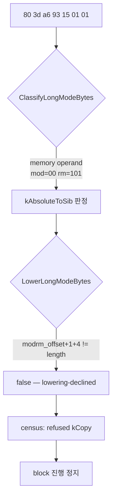
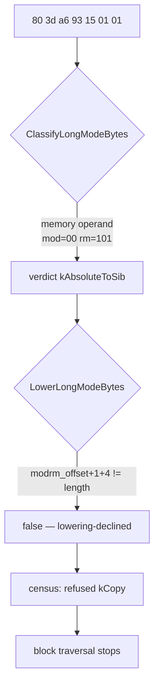

# 설계 20260902-572 — Linux x64 absolute displacement + immediate

## 목적

Task 571 뒤의 첫 reachable 정지 지점 `0x10fc2fa`,
`80 3d a6 93 15 01 01` = `cmp byte ptr [0x11593a6], 1`을 long-mode code cache에서
실행 가능하게 만듭니다.

이 단위는 앞의 세 단위(569, 570, 571)와 성격이 다릅니다. **새 slot을 추가하지
않습니다.** 분류기는 이미 이 명령을 `kAbsoluteToSib`로 판정하고 있고, 거절하는
것은 rewriter입니다. 따라서 이번 작업은 새 의미를 여는 것이 아니라 **이미 있는
lowering의 부당한 폭 제한을 없애는 것**입니다.

## 이 단위의 크기 — 남은 거절의 절반 이상

census 기준선(Task 571 시점, `roms/pumpipx3/PIU/PIU.EXE`)에서
`rip-relative/lowering-declined` 이유로 거절된 명령은 다음과 같습니다.

| mnemonic | 건수 |
|---|---:|
| `test` | 346 |
| `cmp` | 195 |
| `mov` | 167 |
| `or` | 104 |
| `and` | 40 |
| `xor` | 12 |
| `add` | 1 |
| **합계** | **865** |

전체 거절 1,609건 중 **865건(53.8%)**이 이 한 가지 이유입니다. 목록의 형태도
한 곳을 가리킵니다 — 전부 **immediate를 갖는 형식**입니다. `test`/`cmp`/`or`/
`and`/`xor`/`add`는 group 1과 `F6`/`F7` group 3의 imm 형식이고, `mov` 167건은
`C6`/`C7`의 `mov [abs32], imm` 형식입니다. immediate가 없는 `8b 0d <disp32>`
같은 형식은 이미 lowering을 통과하고 있어 이 목록에 없습니다.

즉 이 단위는 정지 지점 하나를 여는 작업이면서, 동시에 **지금 남아 있는 가장 큰
거절 부류 하나를 통째로 없애는 작업**입니다.

## 근인 — 판정과 재작성의 불일치

`ClassifyLongModeBytes`는 memory operand가 있고 ModRM이 `mod=00, rm=101`이면
`kRipRelativeDisplacement` / `kAbsoluteToSib`를 반환합니다. 여기까지는 이 명령도
통과합니다.

거절은 `LowerLongModeBytes`의 `kAbsoluteToSib` 분기에서 일어납니다.

```cpp
// 현재 코드
if (modrm_offset + 1U + 4U != length)
{
    return false;
}
```

이 조건은 **disp32가 명령의 마지막 필드일 것**을 요구합니다. 대상 명령은
그렇지 않습니다.

| offset | bytes | 필드 |
|---:|---|---|
| 0 | `80` | opcode (group 1, `imm8`) |
| 1 | `3d` | ModRM `mod=00 reg=111(CMP) rm=101` |
| 2–5 | `a6 93 15 01` | disp32 = `0x11593a6` |
| 6 | `01` | imm8 |

`modrm_offset + 1 + 4 = 6`이고 `length = 7`이므로 조건이 성립하지 않아 rewriter가
`false`를 반환합니다. census는 이것을 `rip-relative/lowering-declined`로 셉니다 —
**분류기는 할 수 있다고 말하고 rewriter는 못 한다고 말하는 상태**입니다.



## 설계 결정 1 — trailing immediate를 그대로 뒤에 둔다

immediate의 **값은 인코딩 안에서의 위치에 의존하지 않습니다.** SIB 한 바이트를
끼워 넣으면 immediate가 한 바이트 뒤로 밀리지만, 명령 안의 어떤 필드도 그 위치를
참조하지 않으므로 의미는 보존됩니다.

위치가 의미를 바꾸는 유일한 필드는 **RIP-relative displacement**이고, 이 lowering이
없애고 있는 것이 바로 그것입니다. 즉 이 재작성은 위치 의존성을 제거하는 방향이지
새로 만드는 방향이 아닙니다.

```text
guest:   80 3d a6 93 15 01 01
lowered: 67 80 3c 25 a6 93 15 01 01
         │  │  │  │  └─ disp32 (변경 없음)  └─ imm8 (변경 없음)
         │  │  │  └─ SIB: scale=0 index=100 base=101
         │  │  └─ ModRM: mod=00 reg=111 rm=100
         │  └─ opcode (변경 없음)
         └─ 0x67 address-size
```

immediate와 displacement는 **한 바이트도 바뀌지 않습니다.** 바뀌는 것은 ModRM의
`rm` 3비트와, 앞뒤로 붙는 두 바이트(`0x67`, SIB)뿐입니다.

### immediate가 relative일 수 있는가

없습니다. `is_relative` immediate는 분기 변위이고, 분기는 이 함수에 닿기 전에
`ClassifyLongModeBytes`의 control-flow 분기가 `kOperandWidth`로 먼저 잡습니다.
그래도 조건으로 적습니다 — 이 lowering의 전제가 "immediate는 위치와 무관하다"인데
`is_relative`는 정확히 그 전제를 깨는 유일한 종류이므로, 전제를 코드에 남기는
편이 낫습니다.

## 설계 결정 2 — 필드는 length 산술이 아니라 Zydis raw 정보로 찾는다

현재 코드는 `modrm_offset + 1 + 4 == length`라는 **산술 하나로** "disp32가 여기
있다"와 "뒤에 아무것도 없다"를 동시에 주장합니다. 폭 제한을 풀면 그 산술은 두
주장을 더 이상 함께 보증하지 못하므로, 필드 위치를 디코더에게 직접 묻습니다.

허용 조건:

- `raw.disp.size == 32` 이고 `raw.disp.offset == modrm_offset + 1`
- immediate 총 바이트 수를 `raw.imm[0].size`와 `raw.imm[1].size`에서 더한 값이
  `length - (disp.offset + 4)`와 정확히 같을 것
- 어떤 immediate도 `is_relative`가 아닐 것
- `length + 2 <= kMaxLoweredBytes`

두 번째 조건이 이 단위의 안전 장치입니다. displacement 끝과 명령 끝 사이의 바이트가
**전부 immediate로 설명되어야** 하며, 설명되지 않는 바이트가 하나라도 있으면
거절합니다. legacy 32-bit 디코드에서 ModRM/SIB/displacement 뒤에 오는 것은
immediate뿐이므로 이 조건은 통과해야 정상이고, 통과하지 못하면 그것은 이 unit이
이해하지 못한 인코딩입니다.

### `raw.disp.size == 32`이 막아 주는 것

`IsAbsoluteDisplacementForm`은 ModRM의 `mod`와 `rm` **필드만** 봅니다. 명령에
`0x67` prefix가 이미 붙어 있으면 guest는 16-bit addressing이고, 그때
`mod=00 rm=101`은 절대 주소가 아니라 `[DI]`입니다. 이 형식은 displacement가 없어
`disp.size == 0`이므로 위 조건에서 거절됩니다.

이것은 **새로 만드는 보호가 아니라 기존 보호를 명시적으로 옮기는 것**입니다.
지금은 `modrm_offset + 1 + 4 == length`가 우연히 같은 일을 하고 있고, 그 조건을
푸는 순간 보호가 사라지므로 조건을 대체하면서 함께 옮깁니다.

## 설계 결정 3 — 분류기는 바꾸지 않는다

분류기는 이미 옳은 판정을 내리고 있습니다. 분류기에 폭 조건을 추가하면 census의
`refused_mnemonics` 집계에서 이유가 `rip-relative/lowering-declined`에서
`rip-relative`로 바뀌어, **rewriter가 못 하는 것과 분류기가 안 된다고 판단한 것이
구분되지 않게 됩니다.** 그 구분은 census가 유지하는 정보이므로 보존합니다.

## 범위

이번 단위가 새로 허용하는 것은 `kAbsoluteToSib` 경로의 **trailing immediate**
뿐입니다. 다음은 열지 않습니다.

- segment override가 붙은 absolute 형식 — 계속 `kSegmentRegister`로 거절됩니다.
- guest `ESP`를 named operand로 갖는 형식 — 앞선 분기가 먼저 잡습니다.
- SIB가 있는 형식(`rm=100`) — `IsAbsoluteDisplacementForm`이 애초에 잡지 않습니다.
- `stack-pointer`(320건)와 `invalid-in-long-mode`(54건) 거절 — 다음 단위들의 몫입니다.

## 검증

1. **Linux x64 emitted-byte probe** — `cmp byte ptr [abs32], imm8` 형식을 실제로
   방출해 실행하고, 두 경우를 모두 관측합니다.
   - 메모리 값이 immediate와 같을 때와 다를 때 guest flags(ZF)가 각각 맞게
     설정될 것. **immediate가 실제로 비교에 쓰였음을 값으로 고정합니다** —
     immediate가 유실되거나 어긋나면 이 검사가 실패합니다.
   - 접근한 주소가 disp32가 가리키는 절대 주소일 것. RIP-relative로 남아 있으면
     다른 주소를 읽으므로 값이 어긋납니다.
   - guest `ESP`가 보존될 것.
2. **lowering 단위 검사** — 알려진 바이트열에 대해 `LowerLongModeBytes`가 설계
   결정 1의 표와 같은 바이트를 정확히 내는지 확인합니다.
3. **거절이 유지되는지** — `disp.size != 32`인 형식이 계속 거절되는지 확인합니다.
4. **census** — `agrees=true`를 유지하고, emittable/complete block/도달 가능 block과
   새 first stop을 기록합니다. `rip-relative/lowering-declined` 865건이 사라져야
   합니다.
5. **회귀** — Linux i386 Release `repiu_core_probe`와 Win32 x86 `repiu_aot_probe`.
   이 변경은 `LowerLongModeBytes`의 공용 경로를 건드리므로 i386 축에도 영향이
   있을 수 있습니다.

---

# Design 20260902-572 — Linux x64 absolute displacement with an immediate

## Objective

Make the first reachable stop after Task 571 executable in the long-mode code
cache: `80 3d a6 93 15 01 01` at `0x10fc2fa`, or
`cmp byte ptr [0x11593a6], 1`.

This unit differs in kind from the three before it (569, 570, 571). **It adds no
slot.** The classifier already judges this instruction `kAbsoluteToSib`; what
refuses it is the rewriter. The work is therefore not opening a new meaning but
**removing an unwarranted width restriction from a lowering that already
exists**.

## The size of this unit — more than half of what is left refused

In the census baseline at Task 571 (`roms/pumpipx3/PIU/PIU.EXE`), the
instructions refused for `rip-relative/lowering-declined` are:

| Mnemonic | Count |
|---|---:|
| `test` | 346 |
| `cmp` | 195 |
| `mov` | 167 |
| `or` | 104 |
| `and` | 40 |
| `xor` | 12 |
| `add` | 1 |
| **Total** | **865** |

That is **865 of 1,609 refusals (53.8%)** for one reason. The shape of the list
points at one place too: every entry is **a form carrying an immediate**.
`test`/`cmp`/`or`/`and`/`xor`/`add` are the imm forms of group 1 and the `F6`/`F7`
group 3, and the 167 `mov`s are `C6`/`C7`'s `mov [abs32], imm`. Forms with no
immediate, such as `8b 0d <disp32>`, already pass the lowering and are absent
from the list.

So this unit opens one stopping point and at the same time **removes the single
largest remaining class of refusals whole**.

## Root cause — the verdict and the rewrite disagree

`ClassifyLongModeBytes` returns `kRipRelativeDisplacement` /
`kAbsoluteToSib` for any instruction with a memory operand whose ModRM is
`mod=00, rm=101`. This instruction reaches that return.

The refusal happens in `LowerLongModeBytes`'s `kAbsoluteToSib` branch:

```cpp
// current code
if (modrm_offset + 1U + 4U != length)
{
    return false;
}
```

The condition demands that **the disp32 be the instruction's last field**. This
instruction's is not:

| Offset | Bytes | Field |
|---:|---|---|
| 0 | `80` | opcode (group 1, `imm8`) |
| 1 | `3d` | ModRM `mod=00 reg=111 (CMP) rm=101` |
| 2–5 | `a6 93 15 01` | disp32 = `0x11593a6` |
| 6 | `01` | imm8 |

`modrm_offset + 1 + 4 = 6` and `length = 7`, so the condition fails and the
rewriter returns `false`. The census counts this as
`rip-relative/lowering-declined` — **a state where the classifier says it can be
done and the rewriter says it cannot**.



## Decision 1 — carry the trailing immediate through unchanged

**An immediate's value does not depend on where it sits in the encoding.**
Inserting the SIB byte pushes the immediate one byte later, but no field in the
instruction refers to that offset, so the meaning survives.

The one field whose position does change meaning is the **RIP-relative
displacement**, and that is exactly what this lowering removes. The rewrite
moves away from position dependence rather than creating any.

```text
guest:   80 3d a6 93 15 01 01
lowered: 67 80 3c 25 a6 93 15 01 01
         │  │  │  │  └─ disp32 (unchanged)   └─ imm8 (unchanged)
         │  │  │  └─ SIB: scale=0 index=100 base=101
         │  │  └─ ModRM: mod=00 reg=111 rm=100
         │  └─ opcode (unchanged)
         └─ 0x67 address size
```

**Not one byte of the displacement or the immediate changes.** What changes is
ModRM's three `rm` bits and the two bytes wrapped around them.

### Can the immediate be relative?

No. An `is_relative` immediate is a branch displacement, and branches are caught
before this function by `ClassifyLongModeBytes`'s control-flow branch, which
returns `kOperandWidth`. The condition is written anyway: this lowering's premise
is that an immediate is position-independent, and `is_relative` is the one kind
that breaks exactly that premise, so the premise belongs in the code.

## Decision 2 — find fields from Zydis raw info, not from length arithmetic

The current code uses **one arithmetic identity** to assert both "the disp32 is
here" and "nothing follows it". Lifting the width restriction stops that
identity from carrying both claims, so the field positions are asked of the
decoder instead.

Admitted only when:

- `raw.disp.size == 32` and `raw.disp.offset == modrm_offset + 1`;
- the total immediate size, summed from `raw.imm[0].size` and `raw.imm[1].size`,
  exactly equals `length - (disp.offset + 4)`;
- no immediate is `is_relative`; and
- `length + 2 <= kMaxLoweredBytes`.

The second condition is this unit's safety property. Every byte between the end
of the displacement and the end of the instruction **must be accounted for as an
immediate**; a single unexplained byte refuses the instruction. In legacy 32-bit
decoding nothing but immediates follows ModRM/SIB/displacement, so the condition
should hold — and where it does not, the encoding is one this unit did not
understand.

### What `raw.disp.size == 32` protects

`IsAbsoluteDisplacementForm` inspects **only** ModRM's `mod` and `rm` fields. If
the instruction already carries a `0x67` prefix, the guest is using 16-bit
addressing, and there `mod=00 rm=101` is not an absolute address but `[DI]`.
That form has no displacement, so `disp.size == 0` refuses it above.

This is **not a new protection but an existing one made explicit**. Today
`modrm_offset + 1 + 4 == length` happens to do the same job; lifting it would
drop the protection, so it is carried across as the condition is replaced.

## Decision 3 — leave the classifier alone

The classifier's verdict is already right. Adding a width condition to it would
change the census's `refused_mnemonics` reason from
`rip-relative/lowering-declined` to `rip-relative`, **erasing the distinction
between what the rewriter cannot do and what the classifier judged impossible**.
That distinction is information the census maintains, so it is preserved.

## Scope

The only newly admitted thing is **a trailing immediate** on the
`kAbsoluteToSib` path. These stay closed:

- absolute forms carrying a segment override — still refused as
  `kSegmentRegister`;
- forms naming guest `ESP` — caught by an earlier branch;
- forms with a SIB (`rm=100`) — never matched by
  `IsAbsoluteDisplacementForm` at all; and
- the `stack-pointer` (320) and `invalid-in-long-mode` (54) refusals, which
  belong to later units.

## Verification

1. **Linux x64 emitted-byte probe** — actually emit and run a
   `cmp byte ptr [abs32], imm8` and observe both outcomes.
   - Guest flags (ZF) must be set correctly both when the memory value equals
     the immediate and when it does not. **This pins the immediate by its
     value**: a lost or misplaced immediate fails the check.
   - The address touched must be the absolute one the disp32 names. Left
     RIP-relative it would read a different address and the value would differ.
   - Guest `ESP` must be preserved.
2. **Lowering unit check** — for the known byte string, `LowerLongModeBytes`
   must produce exactly the bytes in decision 1's table.
3. **Refusals still hold** — forms with `disp.size != 32` must still be refused.
4. **Census** — `agrees=true` must hold; record emittable, complete blocks,
   reachable blocks, and the new first stop. The 865
   `rip-relative/lowering-declined` refusals should be gone.
5. **Regression** — Linux i386 Release `repiu_core_probe` and Win32 x86
   `repiu_aot_probe`. This change touches a shared path in
   `LowerLongModeBytes`, so the i386 axis may be affected.
