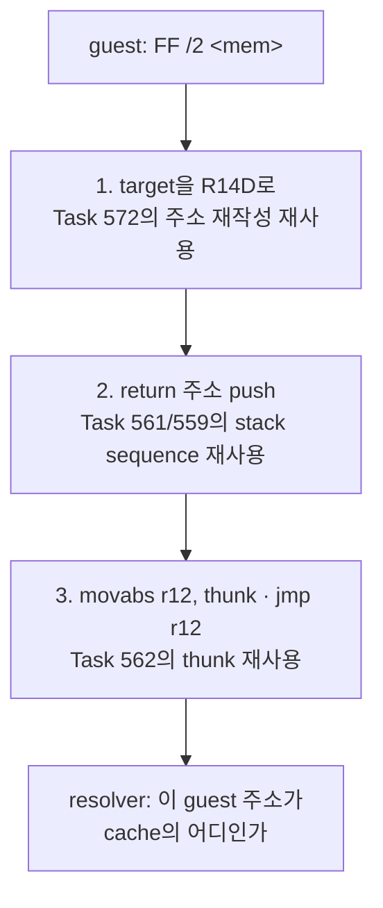
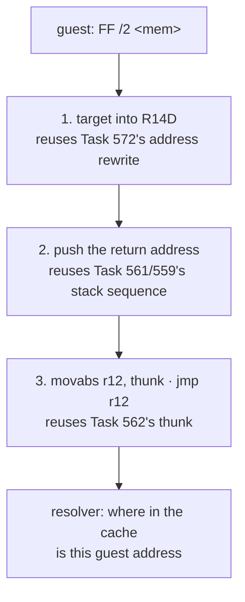

# 설계 20260903-573 — Linux x64 indirect call slot

## 목적

Task 572 뒤 reachable 정지 표에서 가장 큰 항목인 `kIndirectExit` 60건을 엽니다.
long-mode `kIndirectExit` 전용 slot을 추가해 emitter가 indirect call을 낼 수 있게
합니다.

## 측정 — 60건이 전부 call이고, 절반 이상이 갈 곳이 있다

census의 정지 표는 kind만 알려 주었습니다(`kIndirectExit 60`). kind는 unit을
고를 근거가 되지 못합니다 — indirect **call**과 indirect **jump**는 같은 slot을
쓰지만 walk를 완전히 다른 곳에 남깁니다. Task 557이 `kCopy` 행에 이유를 붙인 것과
같은 이유로, 이번에 형식을 붙여 다시 쟀습니다.

| 형식 | 건수 |
|---|---:|
| `call-base+disp` / return-in-plan | **34** |
| `call-base+disp` / return-absent | 20 |
| `call-abs32` / return-absent | 4 |
| `call-sib` / return-absent | 2 |
| **합계** | **60** |

두 가지가 확인됐습니다.

1. **60건 전부가 `FF /2`, 즉 indirect call입니다.** reachable frontier에 indirect
   jump는 하나도 없습니다.
2. **34건은 return 지점에 이미 plan block이 있습니다.** planner는 indirect exit에서
   block을 끝내고 다음 주소를 push하지 않으므로, 그 block들은 다른 경로가 도달해서
   생긴 것입니다.

두 번째가 이 unit을 할지 말지를 갈랐습니다. slot을 내면 walk가 return 지점을
요구하는데, 그 block이 없으면 정지가 "edge outside the plan"으로 **이름만
바뀝니다.** 34건은 실제로 walk가 이어지고, 26건은 plan 구멍으로 드러납니다 —
후자도 emitter가 아니라 planner의 문제라는 정보이므로 손해가 아닙니다.

## 설계 결정 1 — 세 조각은 이미 다 있다

indirect call은 새 기계가 아니라 기존 세 조각의 결합입니다.



Task 562의 thunk 계약은 "**R14D에 guest 주소가 있고, R15D가 guest ESP이고, guest
GPR이 host GPR에 있다 — 그 guest 주소로 가라**"입니다. 이 계약에 return에
고유한 것은 없습니다. 이름이 `ReturnThunk`인 것은 Task 562가 return을 위해
만들었기 때문이고, 계약 자체는 indirect call이 필요로 하는 것과 같습니다.

## 설계 결정 2 — 순서는 load 먼저다. 이것이 정확성 요건이다

x86의 `CALL r/m32`은 **target을 먼저 계산하고 그다음에 return 주소를
push합니다.** 순서를 뒤집으면 두 가지가 깨집니다.

- `call [esp+8]` 같은 ESP 상대 operand는 push가 R15D를 4 줄인 **뒤에** 읽게 되어
  다른 위치를 읽습니다.
- operand가 가리키는 위치가 push가 덮는 위치와 겹치면(`call [ebp-4]`에서 그
  주소가 곧 새 stack top인 경우) 읽는 값이 달라집니다.

따라서 slot의 순서는 **load → push → jmp**입니다.

### 그리고 push가 R14D를 건드리지 않아야 한다

load가 먼저이므로, push sequence가 R14D를 쓰면 방금 읽은 target이 파괴됩니다.
현재 `PUSH imm32`(`0x68`)의 lowering은 `lea r15d,[r15-4]`와
`mov dword ptr [r15], imm32` 두 개뿐이고 **R14D를 건드리지 않습니다.**

이것은 이 slot이 기대는 전제이지 slot이 보장하는 성질이 아닙니다. Task 559의
`PUSHFD`는 R14D를 scratch로 씁니다 — 같은 파일의 다른 sequence는 이미 그것을
쓰고 있으므로, `PUSH imm32`가 언젠가 그렇게 바뀌면 이 slot은 **조용히** 틀립니다.
그래서 probe가 이 전제를 값으로 고정합니다.

## 설계 결정 3 — 주소 재작성을 두 번째로 쓰지 않는다

target을 R14D로 읽는 명령은 guest의 `FF /2`와 **같은 memory operand**를 가져야
합니다. 그 operand를 long mode로 옮기는 것은 `0x67` 추가와, absolute 형식의 경우
ModRM을 SIB로 바꾸는 일입니다 — 즉 `LowerLongModeBytes`가 이미 하는 일이고,
Task 572가 방금 넓힌 바로 그 경로입니다.

그래서 손으로 재작성하지 않고, guest bytes에서 **opcode `FF`를 `8B`로 바꾸고
ModRM의 `reg`를 `010`(/2)에서 `110`으로 바꾼** 32-bit 명령을 합성해
`LowerLongModeBytes`에 넘깁니다. 32-bit에서 그것은 `mov esi, <operand>`이고,
mod/rm/SIB/displacement는 그대로입니다.

Task 561이 push를 직접 쓰지 않고 `68 <imm>`을 합성해 lowering에 넘긴 것과 같은
이유입니다 — 재작성의 두 번째 사본은 그것을 두 번째로 틀릴 자리입니다.

### ESI에서 R14D로 — REX 한 바이트

lowering이 낸 바이트는 `ESI`를 가리킵니다. `reg` 필드는 이미 `110`이므로
**REX.R(`0x44`) 한 바이트를 opcode 바로 앞에 끼우면** 같은 필드가 `R14`를
가리킵니다. REX는 legacy prefix 뒤·opcode 앞이어야 하므로 자리는 `0x67` 다음
입니다.

```text
guest:     FF 50 08                 call dword ptr [eax+8]
합성:      8B 70 08                 mov esi, [eax+8]
lowering:  67 8B 70 08              (kAddressSizePrefix)
REX 삽입:  67 44 8B 70 08           mov r14d, [eax+8]

guest:     FF 15 <abs32>            call dword ptr [abs32]
합성:      8B 35 <abs32>            mov esi, [abs32]
lowering:  67 8B 34 25 <abs32>      (kAbsoluteToSib, Task 572 경로)
REX 삽입:  67 44 8B 34 25 <abs32>   mov r14d, [abs32]
```

합성한 명령에는 prefix가 없으므로 lowering 출력은 반드시 `67 8B ...`로
시작합니다. 그 두 바이트를 **단언하고**, 아니면 거절합니다. 삽입 위치를 추측하지
않기 위한 조건입니다.

## 설계 결정 4 — guest `ESP`를 가리키는 operand는 거절한다

`call [esp+8]`처럼 operand가 guest ESP를 가리키면 lowering은
`kStackPointerToR15`를 반환하고, 그 경로는 **자기 REX를 이미 삽입합니다.** 거기에
REX.R을 또 붙일 수는 없고(REX는 하나뿐입니다) 두 의도를 합치는 것은 별개의
작업입니다.

측정된 60건 중 이 형식일 수 있는 것은 `call-sib` 2건뿐이므로, 이번에는
fail-closed로 두고 census가 비용을 보일 때 엽니다. Task 570이 SIB와 나머지
displacement 형식을 미룬 것과 같은 판단입니다.

## 범위

이번 단위가 여는 것은 `FF /2`의 **memory 형식**뿐입니다. 다음은 열지 않습니다.

- `FF /4` indirect jump — reachable 정지에 하나도 없습니다. 그리고 slot이 생기면
  walk의 fallthrough 처리가 달라져야 하므로(설계 결정 5) 함께 열지 않습니다.
- `mod=3` register 형식(`call eax`) — 측정된 정지에 없습니다.
- guest `ESP`를 가리키는 operand — 설계 결정 4.
- far call(`/3`)과 `FF` 이외의 opcode.

## 설계 결정 5 — walk의 fallthrough는 call에만 준다

census walk는 완결 block의 tail이 `kConditionalBranch`/`kDirectJump`/
`kDirectCall`/`kReturn`이 아니면 `default:`에서 `guest_address + length`를
push합니다. `kIndirectExit` block은 지금까지 완결된 적이 없어 이 경로가 한 번도
실행되지 않았습니다.

slot이 생기는 순간 실행됩니다. indirect **call**에게 그 주소는 return 지점이므로
옳지만, indirect **jump**에게는 fallthrough가 존재하지 않습니다 — 다음 바이트가
실행되는 명령의 시작이라는 보장조차 없습니다. 그대로 두면 walk가 도달하지 않는
코드를 도달했다고 셉니다.

그래서 `kIndirectExit` tail은 `FF /2`일 때만 return 지점을 push합니다. 지금
정지가 전부 call이므로 이 조건은 오늘 아무것도 바꾸지 않지만, **바꾸지 않는
것이 확인된 상태로** 두는 것이 목적입니다.

## 검증

1. **Linux x64 emitted-byte probe** — slot을 실제로 방출해 실행합니다.
   - target을 담은 메모리를 준비하고, resolver가 그 guest 주소를 받았는지
     확인합니다. **thunk에 도착한 R14D 값이 operand가 가리킨 값과 같아야
     합니다.**
   - guest stack에 return 주소가 놓이고 guest ESP가 정확히 4 줄어야 합니다.
   - **load와 push의 순서를 값으로 고정합니다**: operand가 push가 덮을 위치를
     가리키게 두고, 읽힌 target이 push 이전 값이어야 합니다. 순서가 뒤집히면
     이 검사가 실패합니다.
   - resolver가 0을 답하면 INT3 경계에 도달해야 합니다.
2. **거절 유지** — guest ESP를 가리키는 operand, `mod=3`, `FF /4`가 계속
   거절되는지 확인합니다.
3. **census** — `agrees=true`, 새 first stop, 정지 표와 도달 범위의 변화를
   기록합니다. 26건이 `edge outside the plan`으로 옮겨 가는지도 확인합니다.
4. **회귀** — Linux i386 Release `repiu_core_probe`와 Win32 x86 `repiu_aot_probe`.
   i386 emitter는 건드리지 않지만 census와 공용 헤더가 바뀝니다.

---

# Design 20260903-573 — Linux x64 indirect call slot

## Objective

Open the largest row in the reachable stop table after Task 572:
`kIndirectExit`, at 60. This adds a dedicated long-mode `kIndirectExit` slot so
the emitter can produce indirect calls.

## Measurement — all 60 are calls, and more than half have somewhere to go

The census's stop table named a kind and stopped there (`kIndirectExit 60`), and
a kind is not something a unit can be chosen from: an indirect **call** and an
indirect **jump** use the same slot but leave the walk in completely different
places. For the same reason Task 557 attached reasons to the `kCopy` rows, the
form was attached here and the measurement repeated.

| Form | Count |
|---|---:|
| `call-base+disp` / return-in-plan | **34** |
| `call-base+disp` / return-absent | 20 |
| `call-abs32` / return-absent | 4 |
| `call-sib` / return-absent | 2 |
| **Total** | **60** |

Two things are now established.

1. **All 60 are `FF /2`, indirect calls.** There is not one indirect jump in the
   reachable frontier.
2. **34 already have a plan block at their return site.** The planner ends a
   block at an indirect exit and does not push the following address, so those
   blocks exist because some other path reached them.

The second decided whether to do this unit at all. Emitting a slot makes the
walk ask for the return site, and where that block is absent the stop merely
**changes its name** to "edge outside the plan". Thirty-four continue the walk
for real; twenty-six surface as plan holes — which is information about the
planner rather than the emitter, so it is not a loss.

## Decision 1 — all three pieces already exist

An indirect call is not new machinery but a composition of three existing
pieces.



Task 562's thunk contract is "**R14D holds a guest address, R15D is guest ESP,
guest GPRs are in host GPRs — go to that guest address**". Nothing in that
contract is specific to returns. It is called `ReturnThunk` because Task 562
built it for returns; the contract itself is what an indirect call needs.

## Decision 2 — load first, and that is a correctness requirement

x86's `CALL r/m32` **computes the target before pushing the return address.**
Reversing that breaks two things:

- an ESP-relative operand such as `call [esp+8]` would be read **after** the
  push lowered guest ESP by four, addressing a different place; and
- an operand pointing at what the push overwrites (an address that is about to
  become the new stack top) would read a different value.

So the slot's order is **load → push → jmp**.

### And the push must leave R14D alone

Because the load comes first, a push sequence that used R14D would destroy the
target just read. Today `PUSH imm32` (`0x68`) lowers to exactly two
instructions, `lea r15d,[r15-4]` and `mov dword ptr [r15], imm32`, and **touches
no R14D**.

That is a premise this slot rests on, not a property it guarantees. Task 559's
`PUSHFD` does use R14D as scratch — another sequence in the same file already
does — so if `PUSH imm32` ever changed that way this slot would become
**silently** wrong. A probe therefore pins the premise by value.

## Decision 3 — do not write the address rewrite a second time

The instruction that reads the target into R14D must carry **the same memory
operand** as the guest's `FF /2`. Moving that operand into long mode means
adding `0x67` and, for the absolute form, rewriting ModRM into the SIB form —
which is what `LowerLongModeBytes` already does, on the very path Task 572 just
widened.

So rather than rewriting by hand, a 32-bit instruction is synthesised from the
guest bytes by **changing opcode `FF` to `8B` and ModRM's `reg` from `010` (the
`/2`) to `110`**, and handed to `LowerLongModeBytes`. In 32-bit terms that is
`mov esi, <operand>`, with mod/rm/SIB/displacement untouched.

This is Task 561's reasoning for the push, which it synthesised as `68 <imm>`
and passed to the lowering rather than writing out: a second copy of a rewrite
is a second place to get it wrong.

### From ESI to R14D — one REX byte

The lowered bytes name `ESI`. The `reg` field is already `110`, so **inserting
one REX.R byte (`0x44`) immediately before the opcode** makes the same field
name `R14`. REX must follow the legacy prefixes and precede the opcode, so its
place is right after the `0x67`.

```text
guest:     FF 50 08                 call dword ptr [eax+8]
synthesis: 8B 70 08                 mov esi, [eax+8]
lowering:  67 8B 70 08              (kAddressSizePrefix)
REX in:    67 44 8B 70 08           mov r14d, [eax+8]

guest:     FF 15 <abs32>            call dword ptr [abs32]
synthesis: 8B 35 <abs32>            mov esi, [abs32]
lowering:  67 8B 34 25 <abs32>      (kAbsoluteToSib, Task 572's path)
REX in:    67 44 8B 34 25 <abs32>   mov r14d, [abs32]
```

The synthesised instruction carries no prefixes, so the lowering's output must
begin `67 8B`. Those two bytes are **asserted**, and anything else is refused —
the condition that keeps the insertion point from being a guess.

## Decision 4 — refuse operands naming guest `ESP`

When the operand names guest ESP, as in `call [esp+8]`, the lowering returns
`kStackPointerToR15`, and that path **already inserts a REX of its own.** A
second REX cannot be added — there is only one — and merging the two intentions
is separate work.

Of the 60 measured stops only the 2 `call-sib` ones could have this shape, so it
stays fail-closed until the census shows the cost. This is the judgement Task
570 made when it deferred SIB and the remaining displacement forms.

## Scope

The only thing opened is the **memory forms of `FF /2`**. These stay closed:

- `FF /4` indirect jumps — not one appears in the reachable stops, and a slot
  for them would change how the walk handles fallthrough (decision 5), so they
  are not opened together;
- the `mod=3` register form (`call eax`) — absent from the measured stops;
- operands naming guest `ESP` — decision 4; and
- far calls (`/3`) and any opcode other than `FF`.

## Decision 5 — give the walk a fallthrough only for calls

The census walk pushes `guest_address + length` from its `default:` case
whenever a complete block's tail is not `kConditionalBranch`, `kDirectJump`,
`kDirectCall`, or `kReturn`. A `kIndirectExit` block has never been complete, so
that path has never once run.

It runs the moment a slot exists. For an indirect **call** the address is the
return site and is right; for an indirect **jump** there is no fallthrough at
all — nothing even promises the next byte begins an executed instruction. Left
as it is, the walk would count unreached code as reached.

So a `kIndirectExit` tail pushes its return site only when it is `FF /2`. Every
stop today is a call, so this condition changes nothing now — the point is to
have it in place **with that confirmed**.

## Verification

1. **Linux x64 emitted-byte probe** — emit the slot and run it.
   - Prepare memory holding a target and check the resolver received that guest
     address. **The R14D value arriving at the thunk must equal what the operand
     pointed at.**
   - The return address must land on the guest stack and guest ESP must fall by
     exactly four.
   - **Pin the load/push order by value**: point the operand at the location the
     push will overwrite and require the target read to be the pre-push value.
     Reversing the order fails this check.
   - A resolver answering zero must reach the INT3 boundary.
2. **Refusals still hold** — operands naming guest ESP, `mod=3`, and `FF /4`
   must still be refused.
3. **Census** — `agrees=true`, the new first stop, and the movement in the stop
   table and reachable set. Confirm the 26 move to `edge outside the plan`.
4. **Regression** — Linux i386 Release `repiu_core_probe` and Win32 x86
   `repiu_aot_probe`. The i386 emitter is untouched, but the census and shared
   headers change.
