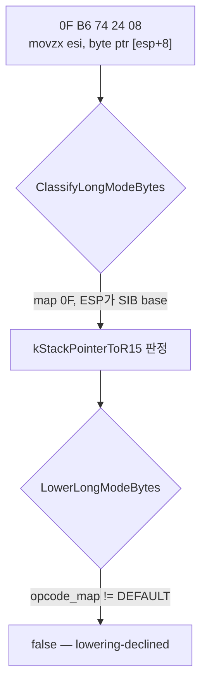
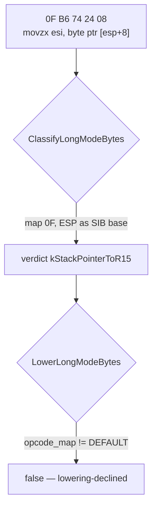

# 설계 20260903-574 — Linux x64 두 바이트 opcode의 `ESP` 재인코딩

## 목적

Task 573 뒤 정지 표에서 `stack-pointer/lowering-declined` 17건
(`imul` 10, `movzx` 7)을 엽니다. Task 564의 `kStackPointerToR15` lowering이
**두 바이트 opcode를 거절하고 있고**, 그 거절에는 근거가 없습니다.

## 측정 — 정지 표에 mnemonic을 붙이고 나서야 보였습니다

Task 573까지 정지 표의 `kCopy` 행은 이유만 달고 있었습니다
(`stack-pointer/lowering-declined 17`). 이유는 분류기가 왜 거절했는지를 말할 뿐
**무엇을 쓸지는 말하지 않습니다.** Task 573이 `kIndirectExit`를 형식으로 나눈 것과
같은 논리를 한 단계 아래에 적용해 mnemonic을 붙였습니다.

| 정지 | 건수 |
|---|---:|
| `invalid-in-long-mode` `push` (세그먼트 push) | 15 |
| `stack-pointer` `push` (`FF /6`) | 12 |
| `kJumpTable` | 12 |
| `stack-pointer/lowering-declined` `imul` | 10 |
| `stack-pointer/lowering-declined` `movzx` | 7 |
| `kGuardedSegmentRead` | 3 |
| `kIndirectExit` `call-sib` | 2 |
| 나머지 4종 | 각 1 |

`invalid-in-long-mode push` 15건과 `stack-pointer push` 12건이 같은 `push`라는
이름 아래 완전히 다른 두 작업이라는 것도 이 표가 처음 보여 준 것입니다. 앞의
것은 한 바이트 세그먼트 push(`06`/`0E`/`16`/`1E`)이고 뒤의 것은 `FF /6`입니다.

## 근인 — 주석이 사실이 아닙니다

`LowerLongModeBytes`의 `kStackPointerToR15` 분기:

```cpp
// ... 이 unit이 허용하는 모든 형식에서 opcode는 ModRM 앞 바이트다 --
// 두 바이트 opcode map은 여기 오지 않는다. `ESP`가 ModRM이나 SIB에 있는 것은
// 한 바이트 opcode의 형태이고, 그 밖은 위에서 이미 거절됐기 때문이다.
if (instruction.opcode_map != ZYDIS_OPCODE_MAP_DEFAULT)
{
    return false;
}
```

**주석의 주장이 틀렸습니다.** `movzx esi, byte ptr [esp+8]`은 `0F B6`이고 `ESP`는
SIB base입니다 — 두 바이트 opcode이면서 정확히 이 unit이 허용한다고 말하는
형태입니다. `movzx`의 인코딩은 `0F B6`과 `0F B7`뿐이므로, census가 센 `movzx`
18건은 **전부** 이 조건에서 거절된 것입니다. 다른 경로가 없습니다.

분류기는 map `0F`를 여기까지 보냅니다. `NeedsWidthReencodeTwoByte`에 걸리지 않는
`0F` 명령은 아래 공통 코드로 내려와 `TouchesStackPointer`를 만나고, 거기서
`kStackPointerToR15` 판정을 받습니다.



## 설계 결정 1 — opcode 시작은 ModRM에서 역산하지 않고 prefix 끝에서 읽습니다

현재 코드는 opcode 위치를 `modrm.offset - 1`로 구합니다. 그 식은 **한 바이트
opcode에서만** 참이고, 두 바이트를 허용하는 순간 `0F`와 실제 opcode 사이에 REX를
끼우게 됩니다 — REX는 opcode 전체 앞에 와야 하므로 그것은 다른 명령입니다.

prefix가 끝나는 자리가 곧 opcode가 시작하는 자리이므로 `raw.prefix_count`를
씁니다. 이것은 두 map 모두에서 참이고, 필수 prefix(`66`/`F2`/`F3`)가 있어도
REX가 그 뒤에 오게 되어 인코딩 규칙과 맞습니다.

## 설계 결정 2 — 레이아웃을 추측하지 않고 map으로 단언합니다

opcode 시작을 옮기는 것만으로는 부족합니다. `modrm.offset`이 정말 예상한 자리에
있는지 확인해야 합니다.

| map | 요구 |
|---|---|
| `DEFAULT` | `modrm.offset == prefix_count + 1` |
| `0F` | `modrm.offset == prefix_count + 2` |
| 그 밖 | 거절 |

`0F38`/`0F3A`는 분류기가 이미 거절하지만, 이 함수는 자기가 쓰는 레이아웃을 자기가
확인해야 합니다. Task 572가 `modrm_offset + 1 + 4 == length`라는 산술 하나에 두
주장을 얹었다가 그 중 하나만 필요했던 것과 같은 종류의 문제이므로, 조건을
명시적으로 나눕니다.

## 범위

이번 단위는 `kStackPointerToR15`의 **opcode 폭 제한만** 없앱니다. 다음은 열지
않습니다.

- `stack-pointer` `push`(`FF /6`) 12건 — implicit stack operand이므로 REX
  재인코딩이 아니라 stack sequence가 필요합니다. 별개 단위입니다.
- `invalid-in-long-mode` `push` 15건 — 세그먼트 push이고 shadow selector가
  필요하므로 patch site가 있는 slot이 필요합니다. 별개 단위입니다.
- `kJumpTable` 12건.

## 검증

1. **lowering 단위 검사** — `0F B6 74 24 08`(`movzx esi, byte ptr [esp+8]`)이
   `44 0F B6 74 24 08`이 아니라 **`41 0F B6 74 24 08`**을 내야 합니다. `ESP`는
   SIB base이므로 REX.B이고, 삽입 위치는 `0F` **앞**입니다. `0F`와 `B6` 사이에
   들어갔다면 다른 명령이 되므로 바이트를 정확히 비교합니다.
2. **Linux x64 emitted-byte probe** — 방출된 바이트를 실행합니다. guest ESP를
   R15D에 두고 그 위치에 값을 심어, `movzx`가 **guest stack의 값**을 읽어야
   합니다. 재인코딩이 없었다면 host RSP를 통해 읽어 다른 값이 나옵니다.
3. **거절 유지** — `0F38`/`0F3A` 계열이 계속 거절되는지 확인합니다.
4. **census** — `agrees=true`, 정지 표와 도달 범위 변화 기록.
5. **회귀** — Linux i386 Release `repiu_core_probe`, Win32 x86 `repiu_aot_probe`.

---

# Design 20260903-574 — Long-mode `ESP` re-encoding for two-byte opcodes

## Objective

Open the 17 `stack-pointer/lowering-declined` stops (`imul` 10, `movzx` 7)
remaining after Task 573. Task 564's `kStackPointerToR15` lowering **refuses
two-byte opcodes**, and that refusal has no basis.

## Measurement — visible only once the stop table carried mnemonics

Through Task 573 the stop table's `kCopy` rows carried only a reason
(`stack-pointer/lowering-declined 17`). A reason says why the classifier
refused; it **does not say what to write**. Applying Task 573's argument for
splitting `kIndirectExit` by form one level down, the mnemonic was attached.

| Stop | Count |
|---|---:|
| `invalid-in-long-mode` `push` (segment pushes) | 15 |
| `stack-pointer` `push` (`FF /6`) | 12 |
| `kJumpTable` | 12 |
| `stack-pointer/lowering-declined` `imul` | 10 |
| `stack-pointer/lowering-declined` `movzx` | 7 |
| `kGuardedSegmentRead` | 3 |
| `kIndirectExit` `call-sib` | 2 |
| four others | 1 each |

The table also showed for the first time that the 15 `invalid-in-long-mode push`
and the 12 `stack-pointer push` are two completely different pieces of work
sharing a name: the first are the one-byte segment pushes
(`06`/`0E`/`16`/`1E`), the second are `FF /6`.

## Root cause — the comment is not true

From `LowerLongModeBytes`'s `kStackPointerToR15` branch:

```cpp
// ... in every form this unit admits the opcode is the byte before it -- a
// two-byte opcode map never reaches here, because `ESP` in ModRM or SIB is a
// one-byte-opcode shape and anything else was refused above.
if (instruction.opcode_map != ZYDIS_OPCODE_MAP_DEFAULT)
{
    return false;
}
```

**The comment's claim is false.** `movzx esi, byte ptr [esp+8]` is `0F B6` with
`ESP` as the SIB base — a two-byte opcode in exactly the shape this unit says it
admits. `movzx` has no encoding other than `0F B6` and `0F B7`, so **all 18** of
the census's `movzx` refusals are this condition. There is no other path.

The classifier does send map `0F` here: a `0F` instruction that
`NeedsWidthReencodeTwoByte` does not claim falls through to the common code,
meets `TouchesStackPointer`, and is judged `kStackPointerToR15`.



## Decision 1 — read the opcode's start from the prefixes, not back from ModRM

The current code locates the opcode as `modrm.offset - 1`. That identity holds
**only for a one-byte opcode**, and the moment two-byte ones are admitted it
would insert the REX between `0F` and the opcode proper — REX belongs before the
whole opcode, so that is a different instruction.

Where the prefixes end is where the opcode begins, so `raw.prefix_count` is used
instead. That is true in both maps, and it puts the REX after any mandatory
prefix (`66`/`F2`/`F3`), which is what the encoding rules require.

## Decision 2 — assert the layout by map rather than assume it

Moving the opcode's start is not enough on its own; whether `modrm.offset` is
where it is expected has to be checked.

| Map | Required |
|---|---|
| `DEFAULT` | `modrm.offset == prefix_count + 1` |
| `0F` | `modrm.offset == prefix_count + 2` |
| anything else | refused |

`0F38` and `0F3A` are already refused by the classifier, but this function has
to verify the layout it writes into. It is the same shape of problem Task 572
had, where one arithmetic identity carried two claims and only one was wanted,
so the conditions are stated separately.

## Scope

This unit removes **only the opcode-width restriction** in
`kStackPointerToR15`. These stay closed:

- the 12 `stack-pointer` `push` (`FF /6`) — an implicit stack operand, which
  needs a stack sequence rather than a REX re-encode; a separate unit;
- the 15 `invalid-in-long-mode` `push` — segment pushes, which need the shadow
  selector and therefore a slot with a patch site; a separate unit; and
- the 12 `kJumpTable`.

## Verification

1. **Lowering unit check** — `0F B6 74 24 08`
   (`movzx esi, byte ptr [esp+8]`) must produce **`41 0F B6 74 24 08`**, not
   `44 0F B6 74 24 08`. `ESP` is the SIB base so the bit is REX.B, and the
   insertion point is **before** the `0F`. Placed between `0F` and `B6` it would
   be a different instruction, so the bytes are compared exactly.
2. **Linux x64 emitted-byte probe** — run the emitted bytes. With guest ESP in
   R15D and a value planted there, the `movzx` must read **the guest stack's**
   value; without the re-encoding it would read through host RSP and find
   something else.
3. **Refusals still hold** — the `0F38`/`0F3A` family must stay refused.
4. **Census** — `agrees=true`; record the stop table and reachable movement.
5. **Regression** — Linux i386 Release `repiu_core_probe` and Win32 x86
   `repiu_aot_probe`.
