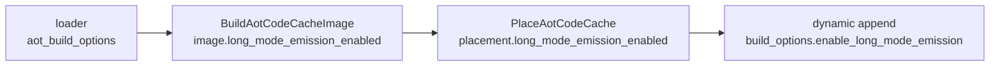

# 설계 20260903-576 — 엔진에 long-mode 방출 연결

## 목적

x86-64 host에서 엔진이 long-mode 이미지를 만들게 합니다. Task 575의 첫 실행이
`enable_long_mode_emission`을 **엔진 어디에서도 켜지 않는다**는 것을 드러냈고,
그 결과 x64 로더는 i386 방식 이미지를 만들고 있습니다.

3.20절 표의 항목 0이며, 항목 2·3보다 앞섭니다 — 그것들을 고쳐도 이것 없이는 x64가
i386 바이트를 실행하려 듭니다.

## 근거 — 이것은 선택지가 아닙니다

Task 550이 세운 전제가 그대로 답입니다. long mode는 게스트의 32비트 바이트 중
여럿을 **다르게 읽고, 그중 일부는 raise하지 않습니다.** 한 바이트 `inc eax`는
뒤따르는 것에 붙는 REX prefix가 되고, absolute `disp32`는 RIP-relative가 됩니다.

따라서 x86-64 host에서 `enable_long_mode_emission`이 꺼진 이미지는 **틀린
이미지**이지 다른 선택지가 아닙니다. env toggle로 두지 않는 이유가 이것입니다 —
끌 수 있게 두면 틀린 구성을 조용히 돌릴 수 있게 됩니다.

## 설계 결정 1 — host 아키텍처에서 유도하고, 한 곳에서 말합니다

`HostRequiresLongModeEmission()`을 runtime에 두고 모든 호출자가 그것을 묻습니다.
사실을 두 곳에 적으면 두 곳이 어긋납니다 — 이 프로젝트가 `agrees=` 줄을 두고
있는 이유와 같습니다.

판정은 **pointer 크기가 아니라 아키텍처**로 합니다. `__x86_64__` / `_M_X64`가
묻는 질문은 "CPU가 이 바이트를 long mode로 디코드하는가"이고, 그것이 실제 질문
입니다. x32 ABI처럼 pointer가 4바이트이면서 CPU는 long mode인 구성에서
`sizeof(void*)`는 틀린 답을 냅니다.

## 설계 결정 2 — 다른 옵션들과 같은 경로로 흘립니다

이미 절반이 되어 있습니다.

`BuildAotCodeCacheImage`는 이미 `image->long_mode_emission_enabled`에 기록합니다.
남은 것은 placement가 그것을 물려받고, dynamic append가 되읽는 것입니다 —
`timer_safe_points_enabled`가 이미 그렇게 흐르고 있으므로 같은 모양을 따릅니다.

**정적 배치와 dynamic append가 서로 다른 이미지 종류를 만드는 것**이 이 배선이
막는 실패입니다. append가 host를 다시 묻지 않고 placement에서 물려받으므로 둘이
어긋날 수 없습니다.

## 설계 결정 3 — validator는 건드리지 않습니다

`ValidateAotCodeCacheHleCoverage`는 i386 바이트 배치를 그대로 검사하고 long-mode
인식이 없습니다. Task 571의 작업 로그가 이것을 위험으로 적으면서 "Win32 전용
`repiu_aot_probe`에서만 호출된다"고 했는데, **그 서술은 불완전합니다** — 엔진의
dynamic append 경로도 호출합니다(`src/engine/aot_code_cache.cpp`).

그래도 이번 단위에서 바꾸지 않습니다.

- 정적 배치 경로는 이 함수를 호출하지 않으므로 이번 변경이 막히지 않습니다.
- dynamic append는 게스트가 도는 중에만 실행되고, x64는 guest entry가 닫혀 있어
  (Task 544) 도달하지 않습니다.

즉 이것은 **다음 blocker이지 이번 blocker가 아닙니다.** long-mode 이미지를 옳게
검사하는 것은 자기 probe를 갖는 별도 단위입니다. 여기서 함께 고치면 이번 단위가
무엇을 바꿨는지가 흐려집니다.

## 예측

이 변경 뒤 x64 `repiu`는 다음과 같아야 합니다.

1. AOT 이미지가 long-mode로 만들어지고 timer safe point site가 **0**이 됩니다.
2. 따라서 Task 575를 막던 `AOT timer safe-point request is unavailable`이
   사라집니다.
3. 배치가 성공하고, 실행은 **더 나아가서** 멈춥니다. 어디서 멈추는지는 예측하지
   않습니다 — 그것이 이 단위의 측정 결과입니다.

3번이 이 단위의 실제 산출물입니다. 1·2번은 가설이고 실행으로 확인합니다.

## 검증

1. **x64 링크와 실행** — `repiu`를 다시 빌드해 돌리고, 로그에서 timer safe point
   site 수와 정지 지점을 기록합니다. Task 575의 실행과 **같은 ROM 세트**로
   비교합니다.
2. **i386 회귀** — `HostRequiresLongModeEmission()`이 i386에서 false여야 하므로
   이미지 구성이 바뀌면 안 됩니다. `repiu` 링크와 `repiu_core_probe`.
3. **Win32 회귀** — `repiu_aot_probe`. Win32 x86도 32비트이므로 false입니다.
4. **census 불변** — census는 플래그를 스스로 켜므로 숫자가 바뀌면 안 됩니다.

---

# Design 20260903-576 — Wiring long-mode emission into the engine

## Objective

Make the engine build a long-mode image on an x86-64 host. Task 575's first run
revealed that **nothing in the engine ever sets** `enable_long_mode_emission`,
so the x64 loader is building an i386-style image.

This is item 0 of section 3.20's table and comes before items 2 and 3: fixing
those still leaves x64 trying to execute i386 bytes.

## Rationale — this is not a choice

Task 550's premise is the answer. Long mode **reads several of the guest's
32-bit encodings differently, and some of them raise nothing**: a one-byte
`inc eax` becomes a REX prefix on whatever follows, and an absolute `disp32`
becomes RIP-relative.

So on an x86-64 host, an image built with `enable_long_mode_emission` off is a
**wrong image**, not an alternative one. That is why this is not an environment
toggle: leaving it switchable leaves a wrong configuration quietly runnable.

## Decision 1 — derive it from the host architecture, and say it once

`HostRequiresLongModeEmission()` lives in the runtime and every caller asks it.
A fact written in two places is a fact whose two copies drift — the same reason
this project keeps an `agrees=` line.

The test is **architecture, not pointer size**. What `__x86_64__` / `_M_X64` asks
is "will the CPU decode these bytes in long mode", which is the actual question.
Under a configuration such as the x32 ABI, where pointers are four bytes and the
CPU is still in long mode, `sizeof(void*)` gives the wrong answer.

## Decision 2 — flow it the way every other option flows

Half of it already exists.

`BuildAotCodeCacheImage` already records `image->long_mode_emission_enabled`.
What remains is for the placement to inherit it and the dynamic-append path to
read it back — the shape `timer_safe_points_enabled` already has.

The failure this wiring prevents is **static placement and dynamic append
building different kinds of image**. Append inherits from the placement rather
than asking the host again, so the two cannot disagree.

## Decision 3 — leave the validator alone

`ValidateAotCodeCacheHleCoverage` checks i386 byte placement literally and has no
long-mode awareness. Task 571's work log recorded this as a hazard while saying
it "is called only from the Win32-only `repiu_aot_probe`", and **that statement
is incomplete**: the engine's dynamic-append path calls it too
(`src/engine/aot_code_cache.cpp`).

It is still not changed here.

- The static placement path does not call it, so this change is not blocked by
  it.
- Dynamic append runs only while a guest runs, and x64's guest entry is fenced
  (Task 544), so it is not reached.

It is **the next blocker, not this one**. Validating a long-mode image correctly
is a separate unit with its own probe; folding it in here would blur what this
unit changed.

## Prediction

After this change the x64 `repiu` should:

1. build the AOT image in long mode, with **zero** timer safe-point sites;
2. therefore stop reporting `AOT timer safe-point request is unavailable`, which
   is what blocked Task 575; and
3. place successfully and run **further** before stopping. Where it stops is not
   predicted — that is this unit's measurement.

Point 3 is the real output. Points 1 and 2 are hypotheses confirmed by running.

## Verification

1. **x64 link and run** — rebuild `repiu`, run it, and record the timer
   safe-point site count and the stopping point from the log, compared against
   Task 575's run on the **same ROM set**.
2. **i386 regression** — `HostRequiresLongModeEmission()` must be false on i386,
   so image composition must not change. The `repiu` link and
   `repiu_core_probe`.
3. **Win32 regression** — `repiu_aot_probe`. Win32 x86 is 32-bit, so also false.
4. **Census unchanged** — the census sets the flag itself, so its numbers must
   not move.
