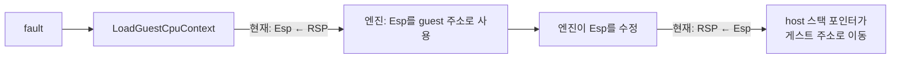
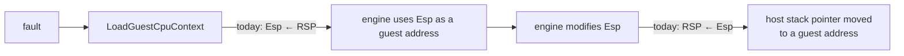

# 설계 20260903-577 — x64 fault 경로의 guest `ESP`

## 목적

x86-64 host에서 `GuestCpuContext::Esp`가 guest ESP를 담게 합니다. 지금은 host의
SysV 스택 포인터를 담고 있습니다.

3.20절 표의 항목 2입니다.

## 정정 — `Eip`는 이미 옳았습니다

3.20절은 이 항목을 "`Eip`와 `Esp` 둘 다 틀린 값"으로 적었습니다. **`Eip`는
틀리지 않았습니다.**

엔진은 fault 시점의 `Eip`를 **guest EIP가 아니라 cache 주소로 취급합니다** —
`IsAotCacheAddress(context, Eip)`로 판정하고
`AotGuestAddressForExecutionAddress`로 변환합니다. i386에서도 마찬가지입니다.
code cache가 게스트 바이트를 host 주소에 담고 있으므로, 그곳에서 발생한 fault의
EIP는 i386에서도 cache 주소입니다.

x64에서 `Eip = REG_RIP`의 하위 32비트가 그 cache 주소가 되려면 cache가 4 GiB
아래에 있어야 하는데, Task 554가 그것을 배치 조건으로 두고 있고 실제 실행이
확인해 줍니다.

```text
[loader] Win32 AOT cache base/bytes/entry: 0x20000000/326468/0x20000000
```

따라서 `Eip`의 잘림은 무손실이고 엔진이 기대하는 값과 같습니다. **3.20절의 그
서술을 정정합니다** — 이 항목은 `Esp` 하나입니다. Task 575의 주소 잘림 우려가
측정으로 반증된 것과 같은 종류의 오류였습니다.

## 근인 — `Esp`는 두 가지를 동시에 틀리게 합니다

```cpp
registers->Esp = Register(machine, REG_RSP);              // load
machine.gregs[REG_RSP] = merge(gregs[REG_RSP], registers.Esp);  // store
```

i386에서는 옳습니다 — guest ESP와 host ESP가 같은 레지스터입니다. x64에서는
Task 546 결정 3이 host RSP를 SysV 스택으로 두고 guest ESP를 `R15D`에 두므로
(Task 558), 둘은 다른 레지스터입니다.

**읽기 방향**: 엔진이 `Esp`를 guest 주소로 씁니다 — 게스트 스택에서
`[Esp]`, `[Esp+0x08]`, `[Esp+0x10]`을 읽고, `guest_return_esp`에 저장하고,
`in_range(Esp, ...)`로 게스트 arena 안인지 검사합니다. host RSP는 그 arena
밖이므로 이 검사들이 전부 어긋납니다.

**쓰기 방향이 더 나쁩니다.** 엔진은 `Esp`를 **수정합니다** — `ZYDIS_REGISTER_ESP`
쓰기, `RecoverToHost`의 `context->Esp = host_esp`. 지금 구조에서 그 값은
`REG_RSP`로 돌아가므로, **host 스택 포인터가 게스트 주소로 옮겨집니다.** 커널이
그 컨텍스트로 resume하므로 결과는 임의입니다.



## 설계 결정 1 — `Esp`는 `R15`에 연결하고, host `RSP`는 쓰지 않습니다

- 읽기: `registers->Esp = Register(machine, REG_R15);`
- 쓰기: `machine.gregs[REG_R15]`에 **zero-extend**해서 씁니다.
- `machine.gregs[REG_RSP]`는 **쓰지 않습니다.**

세 번째가 이 단위의 안전 조건입니다. host RSP는 커널이 resume에 쓰는 스택
포인터이고, 어떤 guest 값도 거기 들어가면 안 됩니다.

## 설계 결정 2 — `R15`는 merge가 아니라 zero-extend입니다

다른 레지스터는 상위 32비트를 보존하는 `merge`를 씁니다. `R15`는 다릅니다.

Task 558이 정한 불변식은 **`R15`의 상위 절반이 0**이라는 것입니다 — guest ESP를
통한 접근이 `[r15]`로 방출되고 거기서는 64비트 전체가 주소이기 때문입니다.
emitter는 `lea r15d, ...`로만 써서 하드웨어 zero-extend에 맡깁니다.

fault 경로도 같은 규칙을 따릅니다. `merge`는 상위 절반을 "있던 대로" 두는데,
그것은 불변식을 유지하는 것이 아니라 **가정하는 것**입니다. 32비트 값을
zero-extend해서 쓰면 emitter가 하드웨어로 하는 것과 같은 일이 됩니다.

## 설계 결정 3 — probe가 단언하는 계약을 바꿉니다

`guest_cpu_context_probe`는 지금 x64에서 `gregs[REG_RSP] == kEsp`를 단언합니다 —
**바꾸려는 그 가정을 검사하고 있습니다.** 그대로 두면 이 변경이 실패로 나오고,
지우면 아무것도 검사하지 않게 됩니다.

새 계약으로 바꿉니다.

1. `Esp`가 `R15`로 왕복할 것.
2. **host `RSP`가 보존될 것** — probe가 `RSP`에 알아볼 수 있는 값을 심고, store
   뒤에도 그대로여야 합니다. 이것이 설계 결정 1의 세 번째 조건을 값으로
   고정합니다.

두 번째가 없으면 `RSP`를 여전히 덮어쓰는 구현도 통과합니다.

## 범위

`Esp` 매핑만 바꿉니다. 다음은 건드리지 않습니다.

- `Eip` — 위에서 정정한 대로 이미 옳습니다.
- `ValidateAotCodeCacheHleCoverage`의 i386 전제(3.20 항목 5) — dynamic append
  경로이고 별도 단위입니다.
- guest entry 울타리(항목 3).

## 검증

1. **`guest_cpu_context_probe`** — 새 계약 두 가지. i386에서는 기존 계약이
   그대로여야 합니다(`Esp` ↔ `ESP`/`UESP`).
2. **Linux x64 `repiu_core_probe`** — 전부 통과.
3. **x64 `repiu` 실행** — Task 576과 같은 지점(guest entry 울타리)에서 멈춰야
   합니다. 이 단위는 아직 게스트를 돌리지 않으므로 정지 지점이 움직이면 그것이
   회귀입니다.
4. **i386 회귀** — `repiu` 링크와 `repiu_core_probe`.
5. **Win32 회귀** — `repiu_aot_probe`.

---

# Design 20260903-577 — Guest `ESP` in the x64 fault path

## Objective

Make `GuestCpuContext::Esp` hold guest ESP on an x86-64 host. It currently holds
the host's SysV stack pointer.

This is item 2 of section 3.20's table.

## Correction — `Eip` was already right

Section 3.20 recorded this item as "`Eip` and `Esp`, both wrong values". **`Eip`
is not wrong.**

The engine treats `Eip` at fault time as **a cache address rather than a guest
EIP**: it tests `IsAotCacheAddress(context, Eip)` and translates with
`AotGuestAddressForExecutionAddress`. The same is true on i386 — the code cache
holds guest bytes at a host address, so a fault inside it reports a cache address
there too.

For `Eip = REG_RIP`'s low 32 bits to be that cache address on x64, the cache has
to sit below 4 GiB, which Task 554 makes a placement condition and a real run
confirms:

```text
[loader] Win32 AOT cache base/bytes/entry: 0x20000000/326468/0x20000000
```

So the truncation is lossless and equals what the engine expects. **Section
3.20's statement is corrected**: this item is `Esp` alone. It was the same kind
of error as Task 575's address-truncation worry, which measurement also refuted.

## Root cause — `Esp` is wrong in two directions

```cpp
registers->Esp = Register(machine, REG_RSP);                     // load
machine.gregs[REG_RSP] = merge(gregs[REG_RSP], registers.Esp);   // store
```

Right on i386, where guest ESP and host ESP are the same register. On x64 they
are different registers: Task 546's decision 3 keeps host RSP as the SysV stack
and Task 558 puts guest ESP in `R15D`.

**Reading**: the engine uses `Esp` as a guest address — it reads `[Esp]`,
`[Esp+0x08]` and `[Esp+0x10]` from the guest stack, stores it as
`guest_return_esp`, and tests `in_range(Esp, ...)` against the guest arena. Host
RSP is outside that arena, so every one of those is wrong.

**Writing is worse.** The engine **modifies** `Esp` — through
`ZYDIS_REGISTER_ESP` writes and `RecoverToHost`'s `context->Esp = host_esp`. As
written, that value goes back into `REG_RSP`, so **the host stack pointer is
moved to a guest address**. The kernel resumes on that context, so the outcome is
arbitrary.



## Decision 1 — bind `Esp` to `R15` and never write host `RSP`

- Load: `registers->Esp = Register(machine, REG_R15);`
- Store: write `machine.gregs[REG_R15]`, **zero-extended**.
- **Do not write** `machine.gregs[REG_RSP]`.

The third is this unit's safety condition. Host RSP is the stack pointer the
kernel resumes on, and no guest value belongs in it.

## Decision 2 — `R15` is zero-extended, not merged

Every other register uses `merge`, preserving the upper 32 bits. `R15` is
different.

Task 558's invariant is that **`R15`'s upper half is zero**, because an access
through guest ESP is emitted as `[r15]` where the whole 64-bit register is the
address. The emitter maintains it by writing only `lea r15d, ...` and letting the
hardware zero-extend.

The fault path follows the same rule. `merge` leaves the upper half as it found
it, which **assumes** the invariant rather than maintaining it. Writing the
32-bit value zero-extended does what the emitter's hardware does.

## Decision 3 — change the contract the probe asserts

`guest_cpu_context_probe` currently asserts `gregs[REG_RSP] == kEsp` on x64 — it
is **checking the very assumption being changed**. Left alone it would report
this change as a failure; deleted it would check nothing.

It is replaced with the new contract:

1. `Esp` round-trips through `R15`; and
2. **host `RSP` is preserved** — the probe plants a recognisable value in `RSP`
   and requires it unchanged after the store. This pins decision 1's third
   condition by value.

Without the second, an implementation that still overwrote `RSP` would pass.

## Scope

Only the `Esp` mapping changes. Untouched:

- `Eip` — already correct, as corrected above;
- `ValidateAotCodeCacheHleCoverage`'s i386 assumption (3.20 item 5), which is on
  the dynamic-append path and a separate unit; and
- the guest-entry fence (item 3).

## Verification

1. **`guest_cpu_context_probe`** — both new contracts. On i386 the existing
   contract must be unchanged (`Esp` ↔ `ESP`/`UESP`).
2. **Linux x64 `repiu_core_probe`** — all pass.
3. **x64 `repiu` run** — must stop at the same place as Task 576 (the
   guest-entry fence). This unit does not start running a guest, so a moved
   stopping point is a regression.
4. **i386 regression** — the `repiu` link and `repiu_core_probe`.
5. **Win32 regression** — `repiu_aot_probe`.
