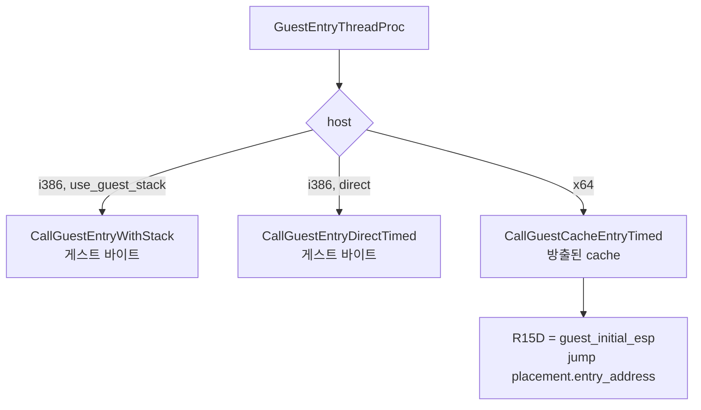
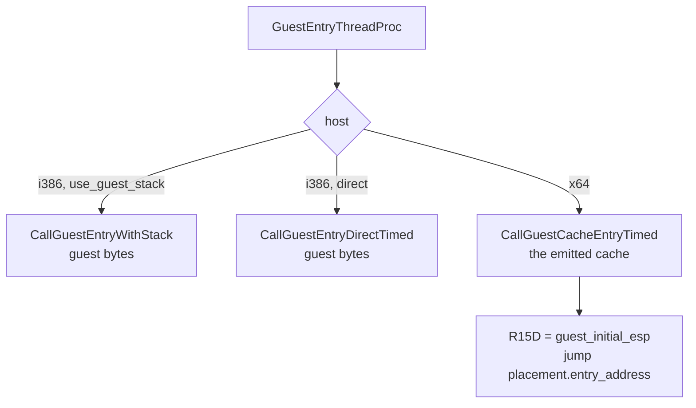

# 설계 20260903-578 — x64 guest entry: code cache로 들어가기

## 목적

x86-64 host에서 게스트가 실제로 실행되게 합니다. 3.20절 표의 항목 3이고,
**이 프로젝트에서 x64가 게스트 명령을 처음 실행하는 단위**입니다.

## 울타리는 둘이고, 하나는 틀리지 않았습니다

실행이 멈춘 지점은 `IsDirectX86ExecutionSupported()`입니다.

```cpp
bool IsDirectX86ExecutionSupported()
{
#if defined(_M_IX86) || defined(__i386__)
    return true;
#else
    return false;
#endif
}
```

이 함수가 묻는 것은 "**게스트 자신의 바이트로 뛰어들 수 있는가**"이고, x64에서
답은 **진짜로 아니오**입니다. Task 550이 세운 전제 그대로 — long mode는 그 바이트를
다르게 읽습니다. 이 울타리를 열어서는 안 됩니다.

x64에서 참이 되는 것은 **다른 능력**입니다: 게스트 바이트가 아니라 **방출된
long-mode code cache로 들어가는 것**. 그래서 기존 술어를 거짓말시키지 않고 새
술어를 둡니다.

| 술어 | 묻는 것 | i386 | x64 |
|---|---|---|---|
| `IsDirectX86ExecutionSupported` | 게스트 바이트로 뛰어드는가 | true | **false (유지)** |
| `IsGuestStackSwitchSupported` | 32비트 스택 전환이 있는가 | true | **false (유지)** |
| `IsCodeCacheEntrySupported` (신규) | 방출된 cache로 들어가는가 | false | **true** |

`IsGuestStackSwitchSupported`도 그대로 둡니다. x64에는 되돌릴 스택 전환이
없습니다 — host RSP는 SysV 스택으로 남고 guest ESP는 `R15D`에 있으므로(Task 558,
577), 전환이 아니라 **애초에 분리**되어 있습니다.

## 설계 결정 1 — 진입은 세 번째 경로입니다

`GuestEntryThreadProc`에는 지금 두 경로가 있습니다.

- **guest stack switch**: 32비트 전용, host ESP를 게스트 스택으로 옮김
- **direct**: 게스트 entry 주소를 함수 포인터로 호출

x64는 둘 다 아닙니다. **세 번째**입니다 — guest 상태를 Task 558의 매핑대로 싣고
(`ESP`는 `R15D`), placement의 `entry_address`로 들어갑니다. 게스트 바이트가 아니라
cache가 목적지라는 것이 차이의 전부입니다.



## 설계 결정 2 — 진입 브리지는 probe의 것을 승격시킵니다

`src/tools/aot_probe/linux_x64_guest_register_probe.S` 74줄이 이미 필요한 일을
합니다 — callee-saved 저장, state block에서 guest GPR 적재(`ESP`는 `R15D`),
대상 호출, 상태 회수.

새로 쓰지 않고 `src/platform/linux/guest_entry_x64.S`로 같은 모양을 둡니다. probe의
것은 **그대로 둡니다** — 두 곳이 같은 계약을 각자 검증하는 것이 낫고, probe가
plan/emitter를 직접 다루는 반면 이쪽은 placement를 다룹니다.

## 설계 결정 3 — resolver는 `FindAotCacheAddress` 위의 얇은 어댑터입니다

Task 562의 thunk가 부르는 resolver는 "이 guest 주소가 cache의 어디인가"만 답하면
되고, 엔진에는 그 질문에 답하는 `FindAotCacheAddress(placement, guest, &cache)`가
이미 있습니다.

resolver가 **0을 답하면 thunk가 `INT3`**을 놓습니다(Task 562). 그것이 fail-closed
경계이고, 아직 cache에 없는 guest 주소가 조용히 아무 데로나 가지 않게 합니다.

## 예측하지 않는 것

**게스트가 얼마나 나아가는지 예측하지 않습니다.** 그것이 이 단위의 측정
결과입니다. 실행이 어디서 멈추든 — 첫 명령, 첫 boundary, 첫 dynamic append —
그 지점이 다음 단위를 정합니다.

다만 하나는 예상됩니다. 첫 boundary가 cache에 없는 블록을 요구하면 dynamic
append가 돌고, 거기서 **3.20 항목 5**가 기다립니다 —
`ValidateAotCodeCacheHleCoverage`는 i386 바이트 배치를 그대로 검사하므로 long-mode
이미지에 실패합니다. 그것을 이번에 고치지 않는 이유는 설계 결정 4입니다.

## 설계 결정 4 — 항목 5는 고치지 않습니다

이 단위가 바꾸는 것은 **진입**이고, validator는 **append**입니다. 함께 고치면
"게스트가 어디까지 갔는가"라는 이 단위의 측정이 두 변경의 합이 되어 무엇이
무엇을 움직였는지 알 수 없게 됩니다.

게스트가 그 지점까지 갔다는 것이 확인되면, 그것이 항목 5를 여는 근거가 됩니다 —
지금은 도달 여부조차 관측된 적이 없습니다.

## 범위

- 신규: x64 진입 브리지, 엔진 resolver, `IsCodeCacheEntrySupported`, 진입 경로
  분기
- 유지: `IsDirectX86ExecutionSupported`, `IsGuestStackSwitchSupported` 둘 다 x64에서
  false
- 열지 않음: validator의 i386 전제(항목 5), x87 초기 상태, dynamic append의 x64
  적합성

## 검증

1. **x64 `repiu` 실행** — 정지 지점이 **움직여야 합니다.** Task 576·577은
   `minimal original entry execution requires a 32-bit host`에서 멈췄습니다.
   그 메시지가 그대로면 라우팅이 되지 않은 것이고, 이 단위의 실패입니다.
2. **관측 기록** — 어디까지 갔는지, 어떤 boundary를 몇 번 만났는지, 종료 코드가
   무엇인지. 예측이 아니라 관측을 기록합니다.
3. **예산 안에서 끝날 것** — 기존 timeout/stall 기계가 x64에서도 실행을
   회수해야 합니다. 무한 대기는 회귀입니다.
4. **i386 회귀** — `repiu` 링크와 `repiu_core_probe`. 진입 경로 분기는 공용
   함수를 건드립니다.
5. **Win32 회귀** — `repiu_aot_probe`.
6. **x64 `repiu_core_probe`** — 전부 통과.

---

# Design 20260903-578 — The x64 guest entry: into the code cache

## Objective

Make a guest actually execute on an x86-64 host. This is item 3 of section
3.20's table, and **the unit in which x64 executes its first guest
instruction.**

## There are two fences, and one of them is not wrong

Execution stops at `IsDirectX86ExecutionSupported()`.

```cpp
bool IsDirectX86ExecutionSupported()
{
#if defined(_M_IX86) || defined(__i386__)
    return true;
#else
    return false;
#endif
}
```

What that function asks is "**may we jump at the guest's own bytes**", and on
x64 the answer is **genuinely no** — Task 550's premise, unchanged: long mode
reads those bytes differently. This fence must not be opened.

What becomes true on x64 is **a different capability**: entering not the guest's
bytes but the **emitted long-mode code cache**. So rather than making the
existing predicate lie, a new one is added.

| Predicate | What it asks | i386 | x64 |
|---|---|---|---|
| `IsDirectX86ExecutionSupported` | jump at guest bytes | true | **false (kept)** |
| `IsGuestStackSwitchSupported` | is there a 32-bit stack switch | true | **false (kept)** |
| `IsCodeCacheEntrySupported` (new) | enter the emitted cache | false | **true** |

`IsGuestStackSwitchSupported` is kept false too. There is no stack switch to undo
on x64 — host RSP stays the SysV stack and guest ESP lives in `R15D` (Tasks 558
and 577), so the two are **separate to begin with** rather than switched.

## Decision 1 — the entry is a third path

`GuestEntryThreadProc` has two paths today:

- **guest stack switch**: 32-bit only, moving host ESP onto the guest stack;
- **direct**: calling the guest entry address as a function pointer.

x64 is neither. It is a **third**: load guest state under Task 558's mapping
(`ESP` into `R15D`) and enter at the placement's `entry_address`. The whole
difference is that the destination is the cache rather than the guest's bytes.



## Decision 2 — the entry bridge is the probe's, promoted

The 74 lines of `src/tools/aot_probe/linux_x64_guest_register_probe.S` already do
the work: save the callee-saved registers, load guest GPRs from a state block
(`ESP` into `R15D`), call the target, write the state back.

Rather than writing another, the same shape goes into
`src/platform/linux/guest_entry_x64.S`. The probe's copy **stays** — two places
verifying the same contract independently is better here, and the probe drives a
plan and an emitter while this one drives a placement.

## Decision 3 — the resolver is a thin adapter over `FindAotCacheAddress`

The resolver Task 562's thunk calls need only answer "where in the cache is this
guest address", and the engine already has
`FindAotCacheAddress(placement, guest, &cache)` for exactly that question.

A resolver that answers **zero makes the thunk plant an `INT3`** (Task 562). That
is the fail-closed boundary, and it keeps a guest address not yet in the cache
from quietly going anywhere.

## What is deliberately not predicted

**How far the guest gets is not predicted.** That is this unit's measurement.
Wherever execution stops — the first instruction, the first boundary, the first
dynamic append — that point chooses the next unit.

One thing is expected, though. If the first boundary asks for a block the cache
does not hold, dynamic append runs, and **3.20's item 5** is waiting there:
`ValidateAotCodeCacheHleCoverage` checks i386 byte placement literally and fails
on a long-mode image. Decision 4 says why that is not fixed here.

## Decision 4 — item 5 is not fixed here

This unit changes **entry**; the validator is on **append**. Fixing both would
make "how far did the guest get" the sum of two changes, with no way to say which
moved it.

Once a guest is observed reaching that point, that observation is the reason to
open item 5 — today it has never even been reached.

## Scope

- New: the x64 entry bridge, the engine resolver, `IsCodeCacheEntrySupported`,
  and the entry-path branch.
- Kept: `IsDirectX86ExecutionSupported` and `IsGuestStackSwitchSupported` both
  false on x64.
- Not opened: the validator's i386 assumption (item 5), initial x87 state, and
  whether dynamic append suits x64.

## Verification

1. **x64 `repiu` run** — the stopping point **must move**. Tasks 576 and 577
   stopped at `minimal original entry execution requires a 32-bit host`; if that
   message survives, the routing did not happen and the unit failed.
2. **Record the observation** — how far it got, which boundaries it met and how
   often, and the exit code. Observations, not predictions.
3. **It must finish within budget** — the existing timeout and stall machinery
   must reclaim the run on x64 too. Hanging is a regression.
4. **i386 regression** — the `repiu` link and `repiu_core_probe`. The entry-path
   branch touches shared functions.
5. **Win32 regression** — `repiu_aot_probe`.
6. **x64 `repiu_core_probe`** — all pass.
