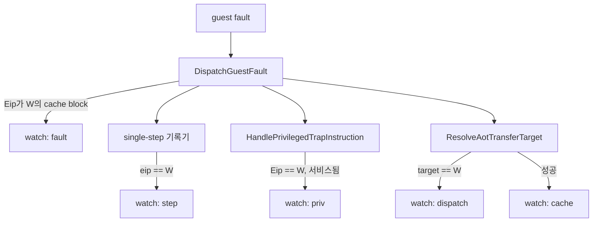
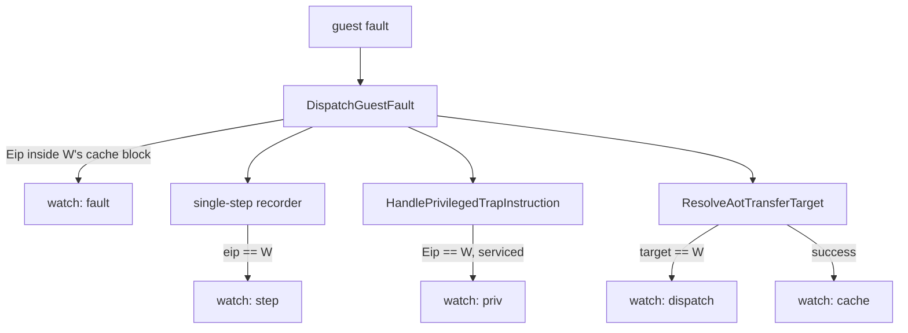

# 설계 20260903-581 — guest 주소 watch

## 목적

Task 580이 남긴 질문 하나에 답합니다.

> **i386은 guest `0x010F1728`의 `sti`를 어떻게 실행하는가?**

Task 580은 x64에서 그 명령이 cache 안에서 #GP를 일으키고, cache 주소를 guest
주소로 되돌리는 경로가 없어 어떤 HLE handler도 서비스하지 못한다는 것을
확인했습니다. 그리고 i386이 왜 같은 벽에 닿지 않는지는 **추정으로 남겼습니다.**

Task 580의 마지막 문단이 다음 단위에 지시한 것이 이것입니다 — 두 수정 방향 중
하나를 고르기 전에 **i386의 실제 경로를 먼저 재라.**

## 왜 이것을 먼저 재는가

Task 580은 두 가지 수정 방향을 열어 두었습니다.

1. cache 안의 access-violation 폴트도 guest 주소로 되돌린다(공백을 메운다).
2. x64도 dispatch를 거쳐 cache에 들어가게 한다(i386 경로를 따라간다).

**2번은 "i386 경로"가 무엇인지 모르면 고를 수 없습니다.** 그리고 1번을 고르더라도
i386이 같은 명령을 어떻게 넘기는지 알면 그 구현이 무엇과 일치해야 하는지가
정해집니다. 어느 쪽이든 이 측정이 앞섭니다.

그리고 이 세션에서 추정이 **네 번** 반증됐습니다 — Task 574의 SIB 기대값,
Task 575의 주소 잘림, Task 577의 `Eip`, Task 579의 kind 열. 다섯 번째를 만들지
않습니다.

## 설계 결정 1 — 주소 하나를 감시하는 watch를 둡니다

`REPIU_GUEST_WATCH`가 guest 주소 하나를 받고, 그 주소가 실행에 등장할 때마다
어떤 경로로 등장했는지 기록합니다.

주소를 하나로 제한하는 이유는 비용입니다. 감시가 꺼져 있으면 분기 하나,
켜져 있어도 비교 하나입니다. 목록이나 범위는 지금 필요한 질문이 아니고,
`AotResidencySample`이 Task 478에서 남긴 교훈 — 게이트 없는 계측이 평시 실행을
13.67% 먹었다 — 을 반복하지 않습니다.

## 설계 결정 2 — 이벤트는 다섯 가지입니다

실행이 한 guest 주소에 닿는 경로가 그만큼 있기 때문입니다.

| 이벤트 | 계측 지점 | 답하는 것 |
|---|---|---|
| `step` | single-step 기록기, `eip == W` | 인터프리터가 그 명령을 밟았다 |
| `dispatch` | `ResolveAotTransferTarget`, `target == W` | dispatch가 그리로 옮겨 달라는 요청을 받았다 |
| `cache` | 같은 지점, 성공 반환 | 실행이 W의 cache block으로 들어갔다 |
| `priv` | `HandlePrivilegedTrapInstruction`, `Eip == W` | privileged 명령이 **서비스됐다** |
| `fault` | `DispatchGuestFault` 진입, `Eip`가 W의 cache block 안 | cache 안에서 폴트가 났다 |

`dispatch`와 `cache`를 나누는 이유는 그 차이가 **Task 580의 두 방향을 가르는
지점**이기 때문입니다. dispatch가 요청을 받고 거절하면 실행은 single-step으로
떨어지고, 받아들이면 cache로 들어갑니다. 어느 쪽인지가 i386의 경로입니다.

## 설계 결정 3 — `fault` 이벤트 없이는 "0"이 애매합니다

앞의 네 이벤트만 두면 전부 0인 결과를 두 가지로 읽을 수 있습니다.

- 실행이 그 주소에 **닿은 적이 없다**.
- cache 안의 **직접 점프로 닿았다** — dispatch를 거치지 않으므로 아무 counter도
  오르지 않는다.

x64에서 실제로 일어난 것이 두 번째입니다. entry block의 `E9 rel32`가 곧장
W의 block으로 뜁니다. i386의 방출도 같으므로 같은 일이 일어날 수 있습니다.

`sti`는 CPL 3에서 **반드시** 폴트를 냅니다. 그래서 "cache 안에서 W의 block에
폴트가 났는가"가 그 두 번째 읽기를 확정하거나 배제합니다. `FindAotGuestAddress`가
이미 cache→guest 역방향 조회를 제공하므로 새 자료구조는 필요 없습니다.

## 설계 결정 4 — 관측만 하고 고치지 않습니다

Task 578·579·580과 같은 이유입니다. 이 단위는 **계측과 관측**이고, Task 580이
열어 둔 두 방향 중 하나를 고르는 것은 다음 단위입니다.

계측이 x64에서도 그대로 동작한다는 점은 부수적 이득이 아니라 설계 의도입니다 —
같은 counter로 두 호스트를 나란히 읽어야 "i386은 이렇게 하고 x64는 이렇게 한다"를
말할 수 있습니다. 그래서 코드는 플랫폼 분기 없이 `src/engine/telemetry/`에
둡니다.

## 설계 결정 5 — 출력은 즉시 줄 단위로 찍습니다

집계 요약이 아니라 발생 시점의 줄입니다.

```text
[repiu-watch] event=step guest=0x010F1728 n=1 eip=0x010F1728
[repiu-watch] event=priv guest=0x010F1728 n=1 eip=0x010F1728
```

이유는 **순서가 답의 일부**이기 때문입니다. `dispatch` 다음에 `step`이 오는 것과
그 반대는 서로 다른 이야기입니다. 종료 시 요약만 있으면 그 순서를 잃습니다.

이벤트 종류마다 처음 `kGuestAddressWatchPrintLimit`번만 찍고, counter는 계속
셉니다. 42초 실행에서 single-step이 14,304번 도는 것을 이미 봤으므로, 상한 없이
찍으면 답이 아니라 로그 홍수가 됩니다.

## 흐름



## 범위

- 신규: `src/engine/telemetry/guest_address_watch.{h,cpp}`
- 수정: 위 표의 네 계측 지점(호출 한 줄씩)
- 열지 않음: Task 580이 연 두 수정 방향, `pumpit2a`의 미해결 분기 1건

## 검증

1. **감시가 꺼진 실행이 불변일 것** — `REPIU_GUEST_WATCH` 없이 i386 `repiu`가
   Task 580과 같은 진행을 보이고 `[repiu-watch]` 줄이 하나도 나오지 않아야
   합니다.
2. **감시가 답을 낼 것** — `REPIU_GUEST_WATCH=0x010F1728`로 i386 `repiu`를
   돌렸을 때, 위 다섯 이벤트 중 무엇이 오르는지가 로그에 남아야 합니다.
   **어느 이벤트가 오를지는 이 문서가 예측하지 않습니다** — 예측을 적어 두면
   그것을 확인하려 들게 됩니다.
3. **두 호스트가 같은 계측을 가질 것** — x64 `repiu_core_probe`와 i386
   `repiu_core_probe`가 모두 통과해야 합니다.

## 한계 — 미리 적어 둡니다

`step`·`dispatch`·`cache`·`priv`가 모두 0이고 `fault`도 0이면, 그것은
"실행이 W에 닿지 않았다"는 뜻입니다 — 단, **cache 안의 직접 점프로 닿았고 그
명령이 폴트를 내지 않는 경우**는 여전히 보이지 않습니다. W가 `sti`인 이번
질문에는 해당하지 않지만, 이 watch를 다른 주소에 쓸 때는 해당합니다.

---

# Design 20260903-581 — A guest-address watch

## Purpose

Answer the one question Task 580 left open.

> **How does i386 execute the `sti` at guest `0x010F1728`?**

Task 580 confirmed that on x64 the instruction raises #GP inside the cache, and
that no path translates a cache address back to a guest address, so no HLE
handler can service it. Why i386 never meets the same wall was **left as an
inference.**

That closing paragraph is what instructs this unit: before choosing between the
two repair directions, **measure i386's actual path first.**

## Why measure this before anything else

Task 580 left two directions open.

1. Make an access-violation fault inside the cache translate back to a guest
   address too (fill the gap).
2. Have x64 reach the cache through dispatch as i386 does (follow the path).

**Direction 2 cannot be chosen without knowing what "i386's path" is.** And even
choosing direction 1 is better informed by knowing how i386 gets past the same
instruction, because that fixes what the implementation must agree with. Either
way, this measurement comes first.

Also: four inferences have been refuted this session — Task 574's SIB
expectation, Task 575's address truncation, Task 577's `Eip`, Task 579's kind
column. There will not be a fifth.

## Decision 1 — Watch exactly one address

`REPIU_GUEST_WATCH` takes one guest address, and every time execution reaches it
the watch records **which path** it arrived by.

One address rather than a list, because of cost: off, the watch is one
predictable branch; on, one comparison. Lists and ranges are not what the
present question needs, and Task 478's lesson from `AotResidencySample` —
ungated instrumentation eating 13.67% of ordinary guest-run — is not repeated.

## Decision 2 — Five events

Because there are that many ways execution reaches one guest address.

| Event | Hook | What it answers |
|---|---|---|
| `step` | single-step recorder, `eip == W` | the interpreter stepped it |
| `dispatch` | `ResolveAotTransferTarget`, `target == W` | dispatch was asked to transfer there |
| `cache` | same site, on success | execution entered W's cache block |
| `priv` | `HandlePrivilegedTrapInstruction`, `Eip == W` | the privileged instruction was **serviced** |
| `fault` | `DispatchGuestFault` entry, `Eip` inside W's cache block | a fault was raised inside the cache |

`dispatch` and `cache` are separate because that difference is **exactly what
separates Task 580's two directions**. If dispatch is asked and refuses,
execution falls back to single-stepping; if it accepts, execution enters the
cache. Which one happens is i386's path.

## Decision 3 — Without the `fault` event, a zero is ambiguous

With only the first four events, an all-zero result reads two ways.

- Execution **never reached** the address.
- It reached it **by a direct jump inside the cache** — no dispatch, so no
  counter moves.

The second is what actually happens on x64: the entry block's `E9 rel32` jumps
straight into W's block. i386's emission is identical, so the same thing can
happen there.

`sti` **must** fault at CPL 3. So "did a fault occur inside W's cache block"
settles or excludes that second reading. `FindAotGuestAddress` already provides
the cache→guest reverse lookup, so no new data structure is needed.

## Decision 4 — Observe only; repair nothing

The same reason as Tasks 578, 579 and 580. This unit is **instrumentation and
observation**; choosing between Task 580's two directions is the next one.

That the instrumentation works identically on x64 is design intent rather than a
side benefit — reading the same counters on both hosts is what makes "i386 does
this, x64 does that" sayable. So the code sits in `src/engine/telemetry/` with no
platform branch.

## Decision 5 — Print a line at the moment it happens

Lines as they occur, not an aggregate summary.

```text
[repiu-watch] event=step guest=0x010F1728 n=1 eip=0x010F1728
[repiu-watch] event=priv guest=0x010F1728 n=1 eip=0x010F1728
```

Because **the order is part of the answer.** `dispatch` followed by `step` tells
a different story than the reverse, and an exit summary loses that order.

Each event kind prints its first `kGuestAddressWatchPrintLimit` occurrences while
the counters keep counting. A 42-second run already showed 14,304 single steps,
so printing without a limit produces a log flood rather than an answer.

## Flow



## Scope

- New: `src/engine/telemetry/guest_address_watch.{h,cpp}`
- Modified: the four hook sites above, one call each
- Not opened: Task 580's two repair directions; `pumpit2a`'s one unresolved
  branch

## Verification

1. **A run with the watch off is unchanged** — without `REPIU_GUEST_WATCH`, the
   i386 `repiu` makes the same progress Task 580 recorded and prints no
   `[repiu-watch]` line at all.
2. **The watch produces an answer** — with `REPIU_GUEST_WATCH=0x010F1728`, the
   i386 `repiu` run must leave in the log which of the five events fire.
   **This document does not predict which** — writing a prediction down invites
   confirming it.
3. **Both hosts carry the same instrumentation** — the x64 and i386
   `repiu_core_probe` must both pass.

## A limitation, recorded up front

If `step`, `dispatch`, `cache`, `priv` and `fault` are all zero, that means
execution did not reach W — **except** for the case of reaching it by a direct
jump inside the cache with an instruction that does not fault. That case does
not apply to this question, where W is a `sti`, but it does apply to any other
address this watch is later pointed at.
