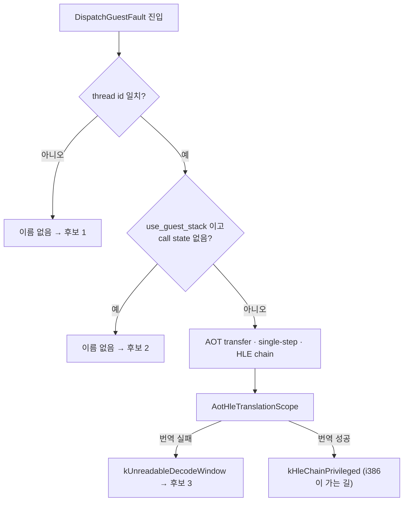
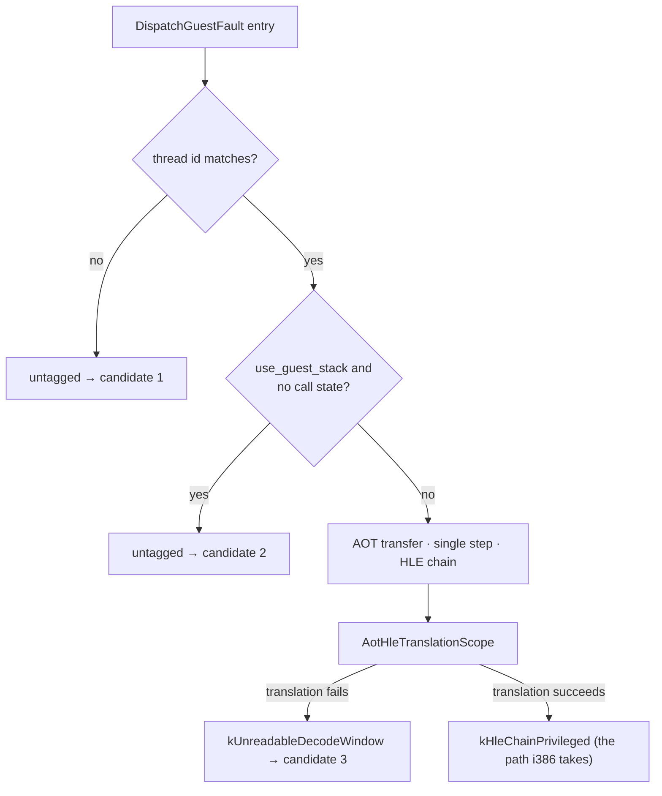

# 설계 20260903-582 — 폴트가 어디로 빠져나가는지 이름 붙이기

## 목적

Task 581이 남긴 질문 하나에 답합니다.

> **x64는 `DispatchGuestFault`의 어느 지점에서 그 폴트를 거절하는가?**

Task 581은 폴트가 그 함수에 **도달한다**는 것을 확인했습니다. `fault` 훅이 모든
조기 반환보다 위에 있고 x64에서 찍혔습니다. 그런데 i386이 서비스하는 같은 폴트를
x64는 서비스하지 못합니다. 그 사이 어디에서 나가는지가 남은 질문입니다.

## 후보는 셋입니다 — 그리고 서로 구분됩니다

코드를 읽어 좁힌 결과입니다. **이것은 후보 목록이며 어느 것인지는 재지
않았습니다.**

| # | 지점 | 조건 |
|---|---|---|
| 1 | `DispatchGuestFault` 초반 | `CurrentThreadId() != guest_thread_id` |
| 2 | 그 다음 | `use_guest_stack && (active_call_state == nullptr \|\| host_esp == 0)` |
| 3 | HLE chain 머리 | `AotHleTranslationScope`가 번역하지 못해 decode window가 안 읽힘 |

세 번째는 성격이 다릅니다. 앞의 둘은 "여기서 나갔다"이고 세 번째는 "여기까지
왔는데 `Eip`가 cache 주소로 남았다"입니다.

**셋이 서로 다른 exit site 이름으로 갈라진다는 것이 이 설계의 핵심입니다.**
세 번째는 이미 `kUnreadableDecodeWindow`로 표시되고, 앞의 둘만 이름이
없습니다.

## 설계 결정 1 — 새 계측을 만들지 않고 Task 410의 것을 씁니다

`VehExitSite`가 이미 있습니다. VEH가 예외를 게스트에게 돌려주는 지점마다 이름이
붙어 있고, `kUnknown`이 0인 것은 **표시되지 않은 exit이 스스로를 신고하도록**
하기 위해서라고 그 헤더가 적어 두었습니다.

지금 필요한 것은 새 축이 아니라 **그 축의 빠진 두 칸**입니다.



## 설계 결정 2 — `DispatchGuestFault` 초입의 첫 반환은 이미 배제됐습니다

그 함수의 가장 앞 반환은 `context == nullptr || fault.registers == nullptr`입니다.
**Task 581의 `fault` 훅이 그 아래에 있고 `context->aot_placement`를 읽으므로,
그 훅이 찍혔다는 사실 자체가 두 포인터가 유효함을 증명합니다.**

그래서 후보에서 뺍니다. 이름을 붙일 수도 없습니다 — `context`가 없으면 기록할
곳이 없습니다.

## 설계 결정 3 — 표시 위치는 반환 직전이고, 재정렬하지 않습니다

`last_veh_exit_site`를 `kUnknown`으로 되돌리는 회전 블록은 후보 1·2보다
**아래**에 있습니다. 그래서 그 두 곳에서 표시하지 않고 값을 읽으면 **직전
폴트의 값**을 읽게 됩니다.

회전 블록을 위로 옮기는 방법도 있지만 택하지 않습니다. 그 블록은
`last_veh_eip`·`last_veh_code`도 함께 회전시키고, 위로 옮기면 **다른 스레드의
폴트까지 그 이력에 들어갑니다.** 기존 계측의 의미가 바뀝니다.

두 곳에서 **명시적으로 표시**하면 그 문제가 없습니다. 표시한 값을 읽는 것이므로
낡은 값을 읽을 여지가 없습니다.

## 설계 결정 4 — 한 줄이 세 후보를 모두 가르게 합니다

exit site 이름만으로 후보 3은 갈리지만, 후보 1과 2는 **그 조건이 참인 이유**까지
알아야 다음 단위가 움직일 수 있습니다. 후보 2의 조건은 두 항의 OR입니다.

그래서 줄에 상태 두 개를 함께 찍습니다.

```text
[repiu-exit] site=<이름> eip=0x… code=0x… guest_stack=<0|1> call_state=<0|1> n=<n>
```

`use_guest_stack`과 `active_call_state != nullptr`입니다. 이 둘은 후보 2의 조건을
그대로 분해한 것이고, 동시에 `GuestThreadFaultCallback`이 거절을 복구로 바꿀 수
있는지도 같은 두 값이 결정합니다. **한 줄로 세 후보와 그 이유가 동시에
읽힙니다.**

## 설계 결정 5 — 출력은 엔진 쪽 한 곳에서 합니다

`GuestThreadFaultCallback`이 `DispatchGuestFault`의 반환을 받는 **유일한**
지점이고, `ThreadContext`를 손에 쥐고 있습니다.

platform 쪽 `ReportUnhandledFault`에 찍는 방법도 있지만 택하지 않습니다. 그것은
`ThreadContext`를 모르고, 알게 만들면 platform이 engine에 의존하게 됩니다 —
이 프로젝트가 피하는 방향입니다.

엔진 쪽에서 찍으면 platform의 `[repiu-fault]` 줄 **바로 앞**에 나오므로, 죽는
순간의 두 줄이 나란히 읽힙니다.

## 설계 결정 6 — opt-in 게이트를 둡니다

`REPIU_FAULT_EXIT_TRACE`. 꺼진 것이 기본입니다.

거절은 i386에서 드문 사건이 아닙니다 — `GuestThreadFaultCallback`은 거절을 받아
`RecoverToHost`로 정상 복구합니다. 게이트 없이 찍으면 평시 로그가 바뀌고,
Task 581이 지킨 "계측이 꺼진 실행은 한 줄도 다르지 않다"가 깨집니다.

이벤트 종류가 아니라 전체에 대해 처음 `kFaultExitTracePrintLimit`번만 찍습니다.

## 설계 결정 7 — 관측만 하고 고치지 않습니다

Task 578·579·580·581과 같습니다. 이 단위가 산출하는 것은 **이름 하나**입니다.
그 이름이 무엇이든, x64를 그 지점에서 통과시키는 것은 다음 단위입니다.

Task 581이 이 규율의 값을 다시 보였습니다 — Task 580이 추정을 결론으로 적었기
때문에 이미 있는 `AotHleTranslationScope`를 새로 만들러 갈 뻔했습니다.

## 범위

- 신규: `src/engine/telemetry/fault_exit_trace.{h,cpp}`
- 수정: `veh_exit_site.h`에 값 두 개 **추가**(재정렬 금지 — 헤더의 규칙),
  `execution_trampoline.cpp`의 조기 반환 두 곳과 `GuestThreadFaultCallback`
- 열지 않음: 밝혀질 지점의 수정, `pumpit2a`의 미해결 분기 1건

## 검증

1. **추적이 꺼진 실행이 불변일 것** — `REPIU_FAULT_EXIT_TRACE` 없이 i386
   `repiu`가 Task 581과 같은 진행을 보이고 `[repiu-exit]` 줄이 하나도 나오지
   않아야 합니다.
2. **x64가 이름을 낼 것** — x64 `repiu`가 죽기 직전 `[repiu-exit]`를 찍고, 그
   `site=`가 이 단위의 답입니다. **어느 이름일지는 이 문서가 예측하지
   않습니다.**
3. **i386의 같은 폴트가 다른 이름을 낼 것** — i386에서 같은 추적을 켜면 그
   `sti` 폴트는 `[repiu-exit]`를 내지 않아야 합니다(거절되지 않으므로). 이것이
   대조군입니다.
4. 두 호스트 `repiu_core_probe`, Win32 회귀.

## 한계

`kUnknown`이 나올 수 있습니다 — 표시되지 않은 exit이 하나 더 있다는 뜻이고,
그때는 이 단위가 답 대신 **다음에 이름 붙일 곳**을 알려 준 것입니다. 그것도
관측이므로 실패로 적지 않습니다.

---

# Design 20260903-582 — Naming where a fault leaves

## Purpose

Answer the question Task 581 left open.

> **Where in `DispatchGuestFault` does x64 decline that fault?**

Task 581 confirmed the fault **reaches** that function: its `fault` hook sits
above every early return and printed on x64. Yet x64 fails to service the same
fault i386 services. Where in between it leaves is what remains.

## Three candidates — and they are distinguishable

Narrowed by reading the code. **This is a candidate list; which one it is has
not been measured.**

| # | Point | Condition |
|---|---|---|
| 1 | Early in `DispatchGuestFault` | `CurrentThreadId() != guest_thread_id` |
| 2 | Just after | `use_guest_stack && (active_call_state == nullptr \|\| host_esp == 0)` |
| 3 | Head of the HLE chain | `AotHleTranslationScope` fails to translate, so the decode window is unreadable |

The third differs in kind. The first two are "it left here"; the third is "it got
this far and `Eip` stayed a cache address".

**That the three separate into distinct exit-site names is the point of this
design.** The third is already tagged `kUnreadableDecodeWindow`; only the first
two have no name.

## Decision 1 — Reuse Task 410's axis rather than build a new one

`VehExitSite` already exists. Every point at which the VEH hands an exception
back to the guest has a name, and its header records that `kUnknown` is zero on
purpose: **an exit that was never tagged reports the omission.**

What is needed now is not a new axis but **the two missing slots in that one**.



## Decision 2 — That function's very first return is already excluded

Its earliest return is `context == nullptr || fault.registers == nullptr`.
**Task 581's `fault` hook sits below it and dereferences
`context->aot_placement`, so the hook having printed is itself proof that both
pointers are valid.**

So it leaves the candidate list. It also could not be named — with no `context`
there is nowhere to record.

## Decision 3 — Tag at the return, and reorder nothing

The rotation block that resets `last_veh_exit_site` to `kUnknown` sits **below**
candidates 1 and 2. Reading that field at those two points without writing it
would therefore read **the previous fault's value**.

Moving the rotation above them is possible but rejected: it also rotates
`last_veh_eip` and `last_veh_code`, and moving it would **admit other threads'
faults into that history.** The meaning of existing instrumentation would
change.

Writing the tag **explicitly** at both points has no such problem. What is read
is what was just written, so there is no stale value to read.

## Decision 4 — One line separates all three candidates

The exit-site name alone separates candidate 3, but candidates 1 and 2 need the
*reason* their condition held before the next unit can act, and candidate 2's
condition is an OR of two terms.

So the line carries two pieces of state alongside.

```text
[repiu-exit] site=<name> eip=0x… code=0x… guest_stack=<0|1> call_state=<0|1> n=<n>
```

`use_guest_stack` and `active_call_state != nullptr`. Those two decompose
candidate 2's condition exactly, and the same two decide whether
`GuestThreadFaultCallback` can turn a decline into a recovery. **One line reads
out all three candidates and the reason at once.**

## Decision 5 — Print from one place, engine-side

`GuestThreadFaultCallback` is the **only** place that receives
`DispatchGuestFault`'s return, and it holds the `ThreadContext`.

Printing from the platform's `ReportUnhandledFault` was considered and rejected:
it knows nothing of `ThreadContext`, and teaching it would make platform depend
on engine — the direction this project avoids.

Printing engine-side puts the line **immediately before** the platform's
`[repiu-fault]`, so the two lines at the moment of death read together.

## Decision 6 — An opt-in gate

`REPIU_FAULT_EXIT_TRACE`, off by default.

A decline is not a rare event on i386: `GuestThreadFaultCallback` takes declines
and recovers normally through `RecoverToHost`. Printing ungated would change
ordinary logs and break what Task 581 held to — that a run with the
instrumentation off does not differ by a line.

The first `kFaultExitTracePrintLimit` occurrences print, counted over the whole
trace rather than per name.

## Decision 7 — Observe only; repair nothing

As in Tasks 578, 579, 580 and 581. What this unit produces is **one name**.
Whatever that name is, getting x64 past that point is the next unit.

Task 581 showed the value of this discipline again: because Task 580 wrote an
inference down as a conclusion, the next step was very nearly to build an
`AotHleTranslationScope` that already existed.

## Scope

- New: `src/engine/telemetry/fault_exit_trace.{h,cpp}`
- Modified: two **appended** values in `veh_exit_site.h` (no reordering — the
  header's own rule), the two early returns in `execution_trampoline.cpp`, and
  `GuestThreadFaultCallback`
- Not opened: fixing whichever point is found; `pumpit2a`'s one unresolved
  branch

## Verification

1. **A run with the trace off is unchanged** — without `REPIU_FAULT_EXIT_TRACE`,
   the i386 `repiu` makes the same progress Task 581 recorded and prints no
   `[repiu-exit]` line.
2. **x64 produces a name** — the x64 `repiu` prints `[repiu-exit]` just before
   dying, and its `site=` is this unit's answer. **This document does not
   predict which name.**
3. **The same fault on i386 produces a different outcome** — with the same trace
   on, i386's `sti` fault must print no `[repiu-exit]` at all, because it is
   never declined. That is the control.
4. `repiu_core_probe` on both hosts, and the Win32 regression.

## A limitation

`kUnknown` is a possible answer. It would mean there is one more untagged exit,
and that this unit produced not the answer but **the next place to put a name**.
That is still an observation, and would not be recorded as a failure.
