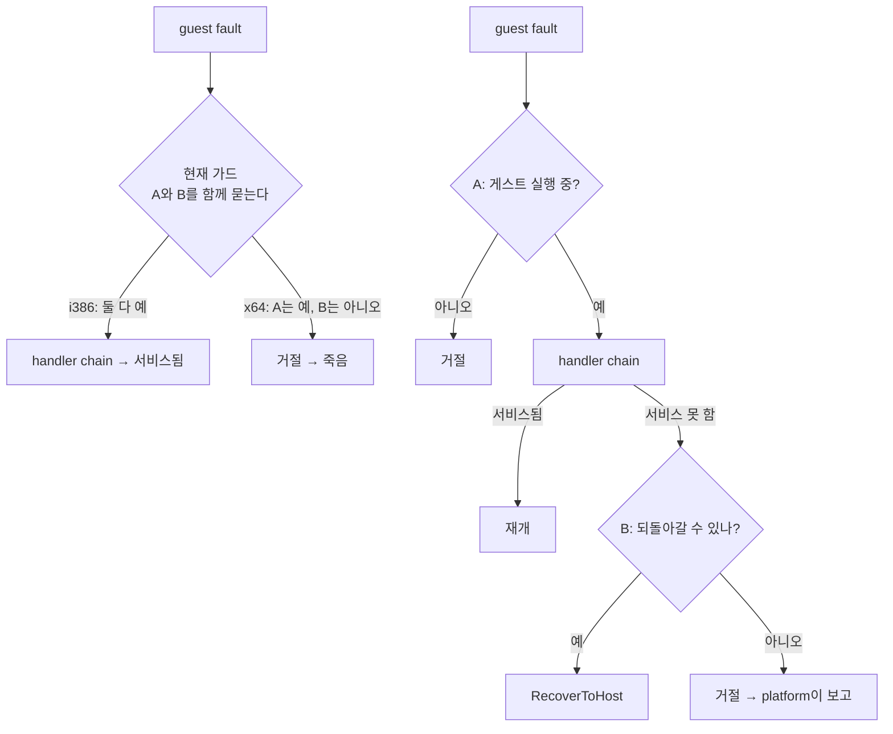
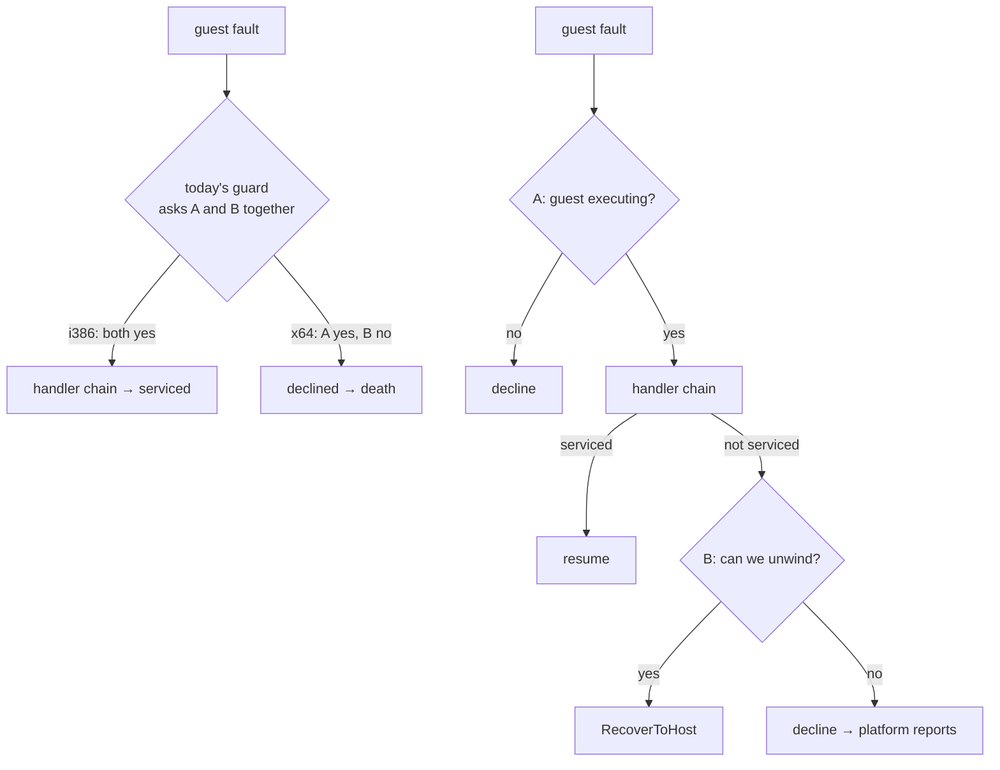

# 설계 20260903-583 — 가드가 실제로 묻는 것을 묻게 한다

## 목적

Task 582가 이름 붙인 지점을 x64가 통과하게 합니다.

```text
[repiu-exit] site=guest-stack-not-entered guest_stack=1 call_state=0
```

`DispatchGuestFault`의 두 번째 가드가 x64의 폴트를 **어떤 handler도 실행하기
전에** 거절합니다. Task 581이 찾은 `AotHleTranslationScope`는 고장 난 것이
아니라 도달하지 못합니다.

## 그 가드가 지키는 것 — 코드로 확인했습니다

```c
if (context->use_guest_stack &&
    (context->active_call_state == nullptr ||
     context->active_call_state->host_esp == 0))
{
    return repiu::platform::FaultDisposition::kNotHandled;
}
```

주석이 없어 코드로 확인했습니다. 두 가지가 나왔습니다.

**첫째, `host_esp`는 전환 어셈블리가 씁니다.** `guest_stack_switch.S`의

```asm
mov dword ptr [ecx + REPIU_STACK_SWITCH_HOST_ESP], esp
```

가 유일한 기록 지점입니다. 그러므로 `host_esp == 0`은 **"전환이 아직 실제로
일어나지 않았다"**는 뜻입니다. `FillGuestStackCallState`가 구조체를 채운 뒤
어셈블리가 실제로 스택을 갈아타기 전까지의 창입니다.

**둘째, 이 가드는 아래 두 줄의 전제조건입니다.**

```c
context->host_esp = context->active_call_state->host_esp;   // 4028행
context->host_esp = context->active_call_state->host_esp;   // 4378행
```

같은 함수 안에서 **조건 없이** 역참조합니다. 가드가 없으면 널 역참조입니다.
두 곳 다 "포기하고 호스트로 되돌아간다"는 경로이고, `RecoverToHost`가 저장된
호스트 ESP와 세그먼트를 되살려 게스트 실행이 끝난 것처럼 돌아가게 합니다.

## 진단 — 가드가 두 질문을 하나로 묶고 있습니다

| 질문 | 언제 물어야 하는가 |
|---|---|
| A. 게스트가 지금 실행 중인가? | 진입할 때 |
| B. 포기하면 호스트로 되돌아갈 수 있는가? | **포기할 때** |

**i386은 두 질문의 답이 같은 사실에서 나옵니다.** 전환이 일어났으면 게스트가
돌고 있고 동시에 돌아갈 ESP도 저장돼 있습니다. 그래서 하나로 묶여 있어도
지금까지 아무 문제가 없었습니다.

**x64는 두 답이 갈립니다.** 게스트는 실행 중이고(A는 예), 되돌아갈 전환은
애초에 없습니다(B는 아니오). 묶여 있으니 A까지 아니오가 되어 버립니다.



## 설계 결정 1 — 가드를 느슨하게 하지 않고 **쪼갭니다**

가드를 지우거나 조건만 넓히면 4028·4378이 **널 역참조**가 됩니다. 그러니
"통과시킨다"는 것만으로는 안 되고, B를 물어야 할 자리로 옮겨야 합니다.

- 진입 가드 → A만 묻습니다.
- 4028·4378 → B를 묻고, 아니오면 `kNotHandled`를 반환합니다.

## 설계 결정 2 — 포기 지점의 "아니오"는 오늘의 x64 동작 그대로입니다

이것이 이 변경이 x64를 **나쁘게 만들 수 없다**는 근거입니다.

x64에서 서비스 불가능한 폴트가 나면 지금도 `kNotHandled`로 끝나고 platform이
`[repiu-fault]`를 찍고 죽습니다. 4028·4378에서 널이면 같은 것을 반환하므로
**결과가 동일합니다.**

`RecoverToHost`를 부르는 쪽이 오히려 위험합니다. x64의 복구 심볼은
[guest_stack_recover_x64.S](../../src/platform/linux/guest_stack_recover_x64.S)에서
`ud2`이고, 그 파일이 적어 둔 대로 `Eip`가 32비트라 64비트 함수 주소를
**자릅니다.** 그러니 x64에서 그 경로로 보내는 것은 "복구"가 아니라 정의되지 않은
주소로 뛰는 것입니다. **이 단위는 그 경로를 열지 않습니다.**

## 설계 결정 3 — A는 실행 창 플래그로 묻고, i386의 판단은 한 비트도 바꾸지 않습니다

A를 묻는 새 항을 더합니다. 조건은 이 형태가 됩니다.

```c
const bool guest_stack_entered =
    context->active_call_state != nullptr &&
    context->active_call_state->host_esp != 0;
if (context->use_guest_stack && !guest_stack_entered &&
    !context->cache_entry_active)
```

`cache_entry_active`는 **x64의 `GuestCacheEntryThreadProc`만** 설정합니다.
i386에서는 항상 거짓이므로 **i386의 판단이 기존과 논리적으로 동일합니다.**
동작하는 호스트를 건드리는 수정에서 이것이 가장 중요한 성질입니다.

정적 술어 `IsCodeCacheEntrySupported()`를 쓰는 방법도 있고 새 상태가 필요
없다는 장점이 있습니다. 택하지 않습니다 — 그것은 "이 호스트가 cache 진입을 할 수
있는가"이지 "지금 게스트가 돌고 있는가"가 아닙니다. 실행 창은
`g_repiu_active_thread_context`가 이미 사실상 경계 짓고 있지만, **가드가 자기가
묻는 것을 말하지 않게 되는** 대가를 치릅니다. 불리언 하나가 더 쌉니다.

이것은 Task 578이 `IsGuestStackSwitchSupported`에 적용한 논리를 세 번째로
적용하는 것입니다 — 술어는 그대로 두고, **두 메커니즘을 아는 것은 그것을 읽는
쪽**입니다.

## 설계 결정 4 — 낡은 주석 하나를 같이 고칩니다

`guest_stack_recover_x64.S`가 이렇게 적고 있습니다.

> **Neither is reachable here.** ... `GuestEntryThreadProc` returns 4 on a
> non-i386 host (Task 544), so no guest thread starts on x64 at all.

Task 575 시점에는 사실이었습니다. Task 578이 `GuestCacheEntryThreadProc`을
추가한 뒤로는 **거짓입니다.**

이 단위가 그것을 고쳐야 하는 이유는 위생이 아닙니다. **이 변경이 x64를 그
파일이 도달 불가라고 적어 둔 영역에 더 가까이 보냅니다.** "여기 올 일 없음"이라고
적힌 주석 옆에서 도달 가능성을 늘리는 것은, 다음 사람이 읽을 때 정확히 잘못된
안심을 주는 조합입니다. 주석만 고치고 `ud2`는 그대로 둡니다.

## 설계 결정 5 — 이번에는 고치고, 무엇이 일어나는지 잽니다

Task 578~582는 관측 단위였습니다. **이 단위는 수정 단위입니다.**

다만 산출물은 "고쳤다"가 아니라 **"고친 뒤 x64가 어디까지 갔는가"**입니다.
가드 하나를 지났다고 게스트가 도는 것은 아니고, Task 578이 "울타리는 셋"이라고
적었다가 넷이었던 전례가 있습니다. 다섯 번째가 있을 수 있습니다.

**이 문서는 x64가 어디까지 갈지 예측하지 않습니다.**

## 범위

- 수정: `thread_context.h`(불리언 하나), `execution_trampoline.cpp`(진입 가드,
  포기 지점 두 곳, x64 thread proc의 설정·해제),
  `guest_stack_recover_x64.S`(주석만)
- 열지 않음: 복구 심볼의 `ud2`, `Eip` 32비트 절단, `pumpit2a`의 미해결 분기

## 검증

1. **i386이 불변일 것** — `pumpit2a`로 Task 582와 같은 진행(`last_eip`,
   `single_step` 규모)을 보이고, `REPIU_FAULT_EXIT_TRACE=1`에서
   `[repiu-exit]`가 여전히 0줄이어야 합니다. **이것이 가장 중요한 검증입니다.**
2. **x64가 그 가드를 지날 것** — `[repiu-exit] site=guest-stack-not-entered`가
   더는 나오지 않아야 합니다.
3. **x64가 `sti`를 서비스할 것** — `REPIU_GUEST_WATCH=0x010F1728`에서 `priv`
   이벤트가 나와야 합니다. i386이 내는 것과 같은 이벤트입니다.
4. **다음 정지점을 기록할 것** — 3이 되든 안 되든, x64가 어디서 멈추는지를
   관측으로 남깁니다.
5. 두 호스트 `repiu_core_probe`, Win32 configure·build·probe 회귀.

## 예상 실패

`AotHleTranslationScope`의 소멸자는 서비스 후의 guest `0x010F1729`를
`FindAotCacheAddress`로 cache 주소에 되돌립니다. 그 주소가 block 중간이라
address map에 항목이 있어야 합니다 — Task 579의 census는 `cache=0x6
guest=0x10f1729`를 보여 주었으므로 **있을 것으로 보이지만, 그 조회를 실제로
돌려 보지는 않았습니다.**

실패하면 `Eip`가 guest 주소로 남아 cache 밖에서 실행이 재개됩니다. 그것이
일어나면 관측으로 적고, 고치는 것은 다음 단위입니다.

---

# Design 20260903-583 — Let the guard ask what it actually needs

## Purpose

Get x64 past the point Task 582 named.

```text
[repiu-exit] site=guest-stack-not-entered guest_stack=1 call_state=0
```

`DispatchGuestFault`'s second guard refuses x64's fault **before any handler
runs.** The `AotHleTranslationScope` Task 581 found is not broken; it is never
reached.

## What that guard protects — established from the code

```c
if (context->use_guest_stack &&
    (context->active_call_state == nullptr ||
     context->active_call_state->host_esp == 0))
{
    return repiu::platform::FaultDisposition::kNotHandled;
}
```

It carries no comment, so this was established by reading. Two things came out.

**First, `host_esp` is written by the switch assembly.** In
`guest_stack_switch.S`:

```asm
mov dword ptr [ecx + REPIU_STACK_SWITCH_HOST_ESP], esp
```

is the only place it is stored. So `host_esp == 0` means **"the switch has not
actually happened yet"** — the window between `FillGuestStackCallState` filling
the structure and the assembly really moving onto the guest stack.

**Second, this guard is the precondition for two lines.**

```c
context->host_esp = context->active_call_state->host_esp;   // line 4028
context->host_esp = context->active_call_state->host_esp;   // line 4378
```

Both dereference **unconditionally**, in the same function. Without the guard
they are null dereferences. Both sit on "give up and unwind to the host" paths,
where `RecoverToHost` restores the saved host ESP and segments so that guest
execution appears to have returned normally.

## The diagnosis — the guard fuses two questions

| Question | When it should be asked |
|---|---|
| A. Is a guest executing right now? | on entry |
| B. If we give up, can we get back to the host? | **when giving up** |

**On i386 both answers come from the same fact.** If the switch happened, a
guest is running *and* there is a saved ESP to return to. Fusing them has
therefore never caused trouble.

**On x64 the two answers diverge.** A guest is executing (A is yes) and there is
no switch to undo (B is no). Fused, the no drags A down with it.



## Decision 1 — Split the guard rather than loosen it

Deleting it or merely widening its condition turns lines 4028 and 4378 into
**null dereferences**. So "let it through" is not enough on its own; question B
has to move to where it is actually asked.

- Entry guard → asks A only.
- Lines 4028 and 4378 → ask B, and return `kNotHandled` when the answer is no.

## Decision 2 — A "no" at the give-up sites is exactly today's x64 behavior

This is the argument that the change **cannot make x64 worse**.

An unserviceable fault on x64 already ends as `kNotHandled`, with the platform
printing `[repiu-fault]` and the process dying. Returning the same thing when
the call state is null makes that outcome **identical**.

Calling `RecoverToHost` would be the dangerous option. x64's recovery symbols
are `ud2` in
[guest_stack_recover_x64.S](../../src/platform/linux/guest_stack_recover_x64.S),
and as that file records, `Eip` is 32 bits and **truncates** a 64-bit function
address. Sending x64 down that path is not recovery; it is a jump to an
undefined address. **This unit does not open it.**

## Decision 3 — Ask A with an execution-window flag, leaving i386's decision bit-for-bit

A new term answers A. The condition becomes:

```c
const bool guest_stack_entered =
    context->active_call_state != nullptr &&
    context->active_call_state->host_esp != 0;
if (context->use_guest_stack && !guest_stack_entered &&
    !context->cache_entry_active)
```

`cache_entry_active` is set **only by x64's `GuestCacheEntryThreadProc`**. It is
always false on i386, so **i386's decision is logically identical to today's.**
For a change to a host that currently works, that is the property that matters
most.

Using the static predicate `IsCodeCacheEntrySupported()` instead would need no
new state. It is rejected: that predicate asks "can this host enter the cache",
not "is a guest running now". The execution window is already bounded in
practice by `g_repiu_active_thread_context`, but relying on that costs **the
guard no longer saying what it asks.** One boolean is cheaper.

This applies for the third time the reasoning Task 578 used on
`IsGuestStackSwitchSupported`: leave the predicate meaning what it means, and
make **the code that reads it** know about both mechanisms.

## Decision 4 — Fix one stale comment along with it

`guest_stack_recover_x64.S` says:

> **Neither is reachable here.** ... `GuestEntryThreadProc` returns 4 on a
> non-i386 host (Task 544), so no guest thread starts on x64 at all.

True as of Task 575. **False since Task 578** added
`GuestCacheEntryThreadProc`.

The reason to fix it here is not hygiene. **This change moves x64 closer to the
region that file declares unreachable.** Increasing reachability next to a
comment that says "nothing can get here" is precisely the combination that gives
the next reader the wrong reassurance. The comment is corrected; the `ud2`
bodies are left alone.

## Decision 5 — This one repairs, and then measures what happened

Tasks 578 through 582 were observation units. **This one is a repair.**

But its product is not "fixed"; it is **"how far x64 got afterwards"**. Passing
one guard does not make a guest run, and there is precedent: Task 578 wrote that
the fences were three, and they were four. There may be a fifth.

**This document does not predict how far x64 gets.**

## Scope

- Modified: `thread_context.h` (one boolean), `execution_trampoline.cpp` (the
  entry guard, the two give-up sites, set/clear in the x64 thread procedure),
  `guest_stack_recover_x64.S` (comment only)
- Not opened: the `ud2` recovery bodies, the 32-bit `Eip` truncation,
  `pumpit2a`'s unresolved branch

## Verification

1. **i386 is unchanged** — the same progress Task 582 recorded on `pumpit2a`
   (`last_eip`, single-step magnitude), and still zero `[repiu-exit]` lines
   under `REPIU_FAULT_EXIT_TRACE=1`. **This is the most important check.**
2. **x64 passes the guard** — `[repiu-exit] site=guest-stack-not-entered` must
   no longer appear.
3. **x64 services the `sti`** — with `REPIU_GUEST_WATCH=0x010F1728`, a `priv`
   event must appear, the same event i386 produces.
4. **The next stopping point is recorded** — whether or not 3 happens, where
   x64 stops is written down as an observation.
5. `repiu_core_probe` on both hosts; Win32 configure, build and probe
   regressions.

## An anticipated failure

`AotHleTranslationScope`'s destructor maps the post-service guest address
`0x010F1729` back through `FindAotCacheAddress`. That address is mid-block, so
the address map must hold an entry for it — Task 579's census showed
`cache=0x6 guest=0x10f1729`, so **it appears to, but that lookup has not been
run.**

If it fails, `Eip` stays a guest address and execution resumes outside the
cache. Should that happen it is recorded as an observation, and repairing it is
the next unit.
