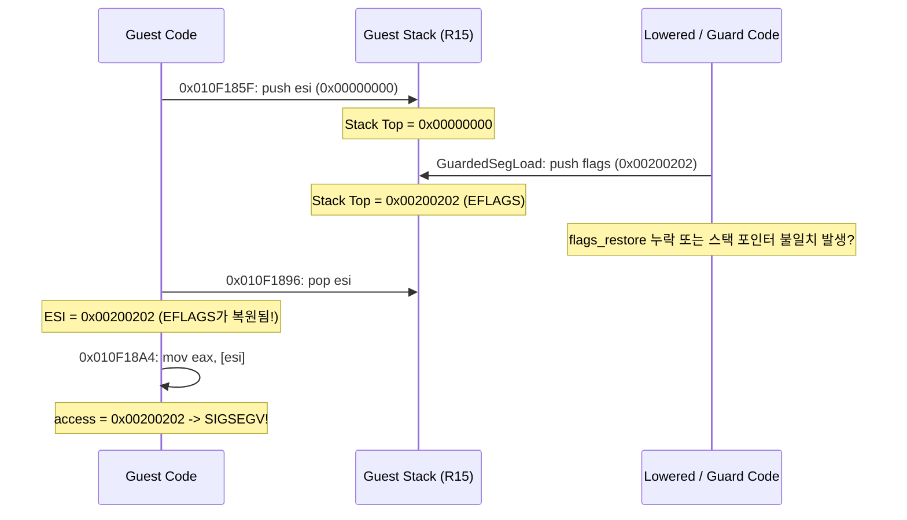
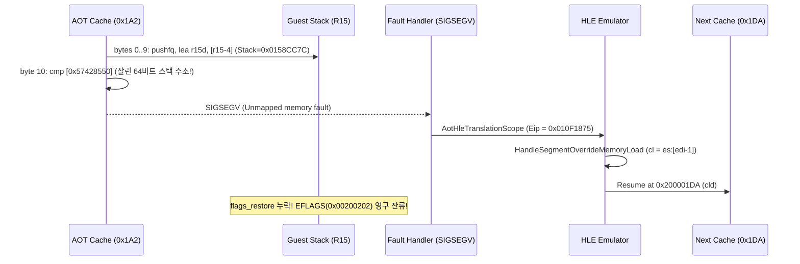
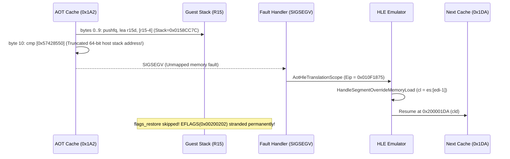

# 설계 20260904-585 — Linux x64 폴트 주소와 ESI/스택 불일치 원인 규명

## 목적

Task 584에서 확정된 다음 사실의 근본 원인을 밝히고 해결 경로를 수립합니다.

> guest `0x010F18A4`의 `mov eax, [esi]`가 `0x00200202`에서 폴트했다.
> 레지스터 상태는 `access == esi == 0x00200202`, `edx == 0x01380000`, `edi == 0x0138CC96`, `ebx == 0x00000024`, `esp == 0x0158CC74`이다.

## 발견 사항 요약

### 1. `0x00200202`의 비트 패턴은 `EFLAGS`이다

* 비트 1 (Reserved, 항상 1): `0x00000002`
* 비트 9 (IF, Interrupt Enable): `0x00000200`
* 비트 21 (ID, CPUID 지원): `0x00200000`
* 합계: `0x00200202`

이 값은 임의의 메모리 주소나 포인터가 아니라 x86 아키텍처의 전형적인 `EFLAGS` 레지스터 비트 패턴과 정확히 일치합니다.

### 2. 게스트 어셈블리 실행 흐름 추적

게스트 바이너리(`PIU.EXE`) 역어셈블 분석을 통해 `0x010F185F`~`0x010F18A4` 구간의 흐름이 확인되었습니다.

```assembly
0x010F175C: 29 f6             sub esi, esi             ; ESI = 0
0x010F1852: 89 35 5d 66 09 00 mov [0x09665D], esi     ; _Envptr 저장
0x010F1858: 66 89 0d 61 66 09 00 mov [0x096661], cx  ; 환경 세그먼트 셀렉터 저장
0x010F185F: 56                push esi                 ; ESI(=0) 스택에 백업
0x010F1860: 66 8e 05 38 66 09 00 mov es, [0x096638]   ; 커맨드라인 버퍼 준비
... (scasb로 공백 탐색, movsb로 커맨드라인 복사, stosb)
0x010F1896: 5e                pop esi                  ; 백업했던 ESI 복원!
0x010F1898: 57                push edi
0x010F1899: 52                push edx
0x010F189A: 26 66 8e 1d 61 66 09 00 mov ds, es:[0x096661] ; DS에 환경 세그먼트 로드!
0x010F18A2: 29 ed             sub ebp, ebp
0x010F18A4: 8b 06             mov eax, [esi]           ; DS:ESI (환경 블록) 첫 dword 읽기
0x010F18A6: 0d 20 20 20 20    or eax, 0x20202020
0x010F18AB: 3d 6e 6f 38 37    cmp eax, 0x37386f6e      ; "no87" 환경변수 검사!
```

### 3. 스택 불일치(Stack Drift) 가설

* `0x010F185F`에서 게스트 스택에 `push esi`(0)을 넣었습니다.
* 그러나 `0x010F1896`에서 `pop esi`를 했을 때 ESI에 들어간 값은 `0`이 아니라 `0x00200202`(`EFLAGS`)였습니다.
* 즉, `push esi`와 `pop esi` 사이에 실행된 명령들 중 무언가가 게스트 스택(`R15`)에 `EFLAGS`를 밀어넣고 완전히 복원하지 않았거나, 스택 포인터 `R15`의 오프셋이 어긋났음을 강력하게 시사합니다.
* 후보:
  1. `0x010F1889` 및 `0x010F188B`의 `kGuardedSegmentLoad`:
     `flags_save`(`pushfq; pop r14; lea r15d, [r15-4]; mov [r15], r14d`)를 통해 게스트 스택(`R15`)에 EFLAGS를 보관합니다. 만약 매치/폴백 분기에서 스택 복원(`lea r15d, [r15+4]`)이 누락되거나 이중 실행되면 스택에 EFLAGS가 남습니다.
  2. `kHleBoundary` 서비스(`0x010F1883`, `0x010F1886`): HLE 트랩 진입 및 복귀 과정에서 게스트 스택 포인터가 어긋났을 가능성.



### 4. 실측을 통한 근본 원인 확정 (Empirical Confirmation)

실시간 주소 감시(`REPIU_GUEST_WATCH`)와 레지스터 텔레메트리를 통해 스택 누수가 발생한 정확한 명령어와 원인을 포착했습니다.

1. **스택 드리프트 지점 특정**:
   - `guest=0x010F1860` (`push esi` 직후): `esp=0x0158CC80`, `esi=0x00000000`.
   - `guest=0x010F1875` (`cache=0x1A2`, `mov cl, es:[edi-1]`):
     `[repiu-watch] event=fault guest=0x010F1875 n=1 at=0x200001AC esi=0x00000000 esp=0x0158CC7C ebx=0x00000017 eflags=0x00210246`
     `at=0x200001AC`는 `cache=0x1A2`의 바이트 10인 `cmp word ptr [disp32], imm16`의 정확한 주소입니다.
   - `guest=0x010F1883`: `esp=0x0158CC7C`, `eflags=0x00200202`.

2. **64비트 호스트 포인터의 32비트 잘림 (Pointer Truncation)**:
   - Linux x86-64에서 `ThreadContext`는 `RunExecutionThread`의 호스트 스택(`0x7fff...`)에 할당됩니다.
   - `BuildAotSegmentTable`(`src/engine/aot/aot_runtime_dispatch.cpp`)은 `&context->guest_es` 등 호스트 스택 주소(`uintptr_t`, 8바이트)를 32비트(`uint32_t`)로 강제 캐스팅했습니다.
   - 이로 인해 상위 32비트가 잘려 `0x57428550` 같은 미매핑 저위 가상주소가 `disp32`로 패치되었습니다.

3. **롱모드 `0x67` 접두사 오버라이드와 SIGSEGV 발생 메커니즘**:
   - `EmitLongModeSegmentOverride`는 바이트 0..9에서 `flags_save`(`pushfq; pop r14; lea r15d, [r15-4]; mov [r15], r14d`)를 실행하여 게스트 스택에 `EFLAGS`를 밀어넣고 `R15`를 4바이트 감소시켰습니다.
   - 이어지는 바이트 10의 `67 66 81 3c 25 [disp32] [imm16]`(`cmp word ptr [disp32], imm16`)은 `0x67` 접두사로 인해 32비트 제로 확장 주소(`0x0000000057428550`)를 역참조하려다 즉시 `SIGSEGV`를 발생시켰습니다.
   - 시그널 핸들러는 이를 게스트 폴트로 포획하여 HLE(`HandleSegmentOverrideMemoryLoadInstruction`)로 넘겼고, HLE는 명령어를 에뮬레이트한 뒤 다음 게스트 명령어(`0x010F1879`, `cld`)로 복귀했습니다.
   - 그 결과, `cache=0x1A2`의 슬롯 에필로그(`flags_restore`: `lea r15d, [r15+4]; popfq`)가 **전혀 실행되지 못하고 건너뛰어졌습니다**.
   - 게스트 스택에는 `EFLAGS`(`0x00200202`)가 그대로 잔류했고, `0x010F1896`의 `pop esi`가 이를 ESI로 복원하여 `0x010F18A4`에서 크래시가 발생했습니다.



---

## 해결 방안 (Resolution)

### 32비트 가상 메모리에 고정된 Shadow Selector Block 도입

1. **`ShadowSelectorBlock` 구조체 정의**:
   ```cpp
   struct ShadowSelectorBlock
   {
       // 0=ES, 1=CS, 2=SS, 3=DS, 4=FS, 5=GS
       std::uint16_t selectors[6];
   };
   ```
2. **32비트 주소 공간 할당**:
   - `ThreadContext` 초기화 시 4GiB 이하의 32비트 주소 공간(`0x1F000000`, `0x27000000` 등 후보군 또는 `ReserveMemory` 32비트 후보군)에 읽기/쓰기 가능한 4KB 전용 페이지를 할당합니다.
   - 32비트 호스트에서는 일반 `ReserveMemory`가 자연스럽게 32비트 주소를 반환합니다.
   - 64비트 호스트에서는 `kAotCodeCacheCandidateBases`와 유사한 32비트 후보군 사다리를 통해 안전하게 `< 4GiB` 페이지를 확보합니다.
3. **세그먼트 레지스터 동기화**:
   - HLE에서 `context->guest_es`, `ds`, `ss`, `fs`, `gs`를 갱신할 때 `shadow_selectors` 블록의 값도 함께 동기화합니다.
4. **AOT 세그먼트 테이블 바인딩**:
   - `BuildAotSegmentTable` 및 런타임 재해석기에서 `shadow_address`로 `shadow_selectors` 블록의 32비트 주소를 제공합니다.
   - 이로써 롱모드 AOT의 `cmp word ptr [disp32]`가 실제 유효한 32비트 메모리를 참조하게 되어 SIGSEGV 폴트 없이 완벽하게 통과하고, 스택 복원(`lea r15d, [r15+4]`)이 정상적으로 수행됩니다.

---

# Design 20260904-585 — Investigate Linux x64 Fault Address and ESI/Stack Discrepancy

## Objective

Identify the root cause of the facts confirmed in Task 584 and establish a resolution path:

> At guest `0x010F18A4`, `mov eax, [esi]` faulted at `0x00200202`.
> Register state: `access == esi == 0x00200202`, `edx == 0x01380000`, `edi == 0x0138CC96`, `ebx == 0x00000024`, `esp == 0x0158CC74`.

## Summary of Findings

### 1. The Bit Pattern `0x00200202` is `EFLAGS`

* Bit 1 (Reserved, always 1): `0x00000002`
* Bit 9 (IF, Interrupt Enable): `0x00000200`
* Bit 21 (ID, CPUID support): `0x00200000`
* Total: `0x00200202`

This value is not an arbitrary address or pointer; it matches the exact architectural bit pattern of x86 `EFLAGS`.

### 2. Guest Assembly Execution Trace

Disassembly of `PIU.EXE` reveals the execution flow in `0x010F185F`~`0x010F18A4`:

```assembly
0x010F175C: 29 f6             sub esi, esi             ; ESI = 0
0x010F1852: 89 35 5d 66 09 00 mov [0x09665D], esi     ; Store _Envptr
0x010F1858: 66 89 0d 61 66 09 00 mov [0x096661], cx  ; Store environment selector
0x010F185F: 56                push esi                 ; Save ESI(=0) to guest stack
0x010F1860: 66 8e 05 38 66 09 00 mov es, [0x096638]   ; Prepare command line buffer
... (scasb scans space, movsb copies argument string, stosb)
0x010F1896: 5e                pop esi                  ; Restore saved ESI!
0x010F1898: 57                push edi
0x010F1899: 52                push edx
0x010F189A: 26 66 8e 1d 61 66 09 00 mov ds, es:[0x096661] ; Load environment selector to DS!
0x010F18A2: 29 ed             sub ebp, ebp
0x010F18A4: 8b 06             mov eax, [esi]           ; Read first dword of DS:ESI (environment block)
0x010F18A6: 0d 20 20 20 20    or eax, 0x20202020
0x010F18AB: 3d 6e 6f 38 37    cmp eax, 0x37386f6e      ; Check for "no87" environment variable!
```

### 3. Stack Drift Hypothesis

* `0x010F185F` pushed `ESI` (0) onto the guest stack.
* When `0x010F1896` executed `pop esi`, the popped value was `0x00200202` (`EFLAGS`) rather than 0.
### 4. Empirical Root Cause Confirmation

Live address-watch telemetry (`REPIU_GUEST_WATCH`) and register reporting pinpointed the exact instruction and mechanism:

1. **Stack Drift Pinpointed**:
   - `guest=0x010F1860` (immediately after `push esi`): `esp=0x0158CC80`, `esi=0x00000000`.
   - `guest=0x010F1875` (`cache=0x1A2`, `mov cl, es:[edi-1]`):
     `[repiu-watch] event=fault guest=0x010F1875 n=1 at=0x200001AC esi=0x00000000 esp=0x0158CC7C ebx=0x00000017 eflags=0x00210246`
     `at=0x200001AC` is byte 10 of `cache=0x1A2`: the `cmp word ptr [disp32], imm16` instruction!
   - `guest=0x010F1883`: `esp=0x0158CC7C`, `eflags=0x00200202`.

2. **64-bit Host Pointer Truncation**:
   - On Linux x86-64, `ThreadContext` is allocated on the host stack (`0x7fff...`).
   - `BuildAotSegmentTable` (`src/engine/aot/aot_runtime_dispatch.cpp`) unconditionally cast host stack pointer `&context->guest_es` (`uintptr_t`, 8 bytes) to `uint32_t`.
   - The high 32 bits were truncated, leaving unmapped low virtual addresses (e.g. `0x57428550`) patched into `disp32`.

3. **Long Mode `0x67` Prefix and SIGSEGV Fault Mechanism**:
   - `EmitLongModeSegmentOverride` executes `flags_save` (`pushfq; pop r14; lea r15d, [r15-4]; mov [r15], r14d`) at bytes 0..9, pushing `EFLAGS` onto the guest stack and decrementing `R15` by 4.
   - Byte 10 (`67 66 81 3c 25 [disp32] [imm16]`) uses prefix `0x67` (address size override), zero-extending `disp32` to `0x0000000057428550`.
   - Dereferencing unmapped memory at `0x0000000057428550` immediately triggered `SIGSEGV`.
   - The signal handler captured the fault and dispatched it to HLE (`HandleSegmentOverrideMemoryLoadInstruction`). HLE emulated the memory load and resumed at the next guest instruction (`0x010F1879`, `cld`).
   - Consequently, the slot's epilogue (`flags_restore`: `lea r15d, [r15+4]; popfq`) **never executed**.
   - `EFLAGS` (`0x00200202`) remained stranded on the guest stack, and at `0x010F1896`, `pop esi` popped this `EFLAGS` into `ESI`, crashing at `0x010F18A4`.



---

## Resolution

### Shadow Selector Block in 32-bit Virtual Memory

1. **`ShadowSelectorBlock` Structure**:
   ```cpp
   struct ShadowSelectorBlock
   {
       // 0=ES, 1=CS, 2=SS, 3=DS, 4=FS, 5=GS
       std::uint16_t selectors[6];
   };
   ```
2. **32-bit Address Space Allocation**:
   - Allocate a dedicated 4KB read/write page in `< 4GiB` virtual memory (`0x1F000000`, `0x27000000`, etc.) during `ThreadContext` initialization.
   - On 32-bit hosts, standard allocations naturally stay in 32-bit space.
   - On 64-bit hosts, a candidate ladder ensures a valid `< 4GiB` page.
3. **Segment Register Synchronization**:
   - Whenever HLE updates `guest_es`, `ds`, `ss`, `fs`, or `gs`, synchronize the shadow selector block entry in lockstep.
4. **AOT Segment Table Binding**:
   - `BuildAotSegmentTable` supplies the 32-bit address of `shadow_selectors` to `shadow_address`.
   - Long-mode AOT's `cmp word ptr [disp32]` safely accesses valid, mapped memory, avoiding SIGSEGV and allowing `flags_restore` (`lea r15d, [r15+4]`) to execute properly.

