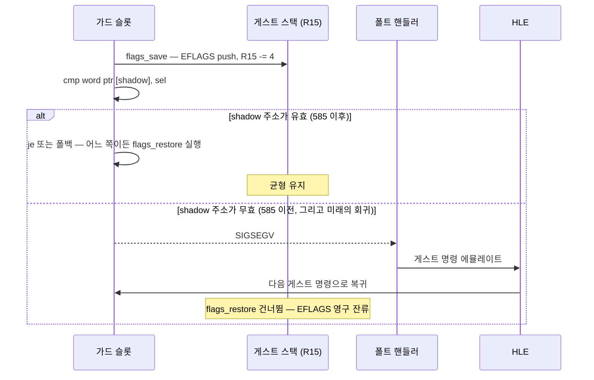

# 설계 20260904-586 — 가드 슬롯 패치 이음매 정리와 shadow selector 예약의 가시성

상위 작업: [20260904-585](20260904-585-linux-x64-fault-address.md)

## 배경

Task 585는 롱모드 가드 슬롯의 `cmp word ptr [disp32]`가 64비트 호스트 주소를 32비트로
잘라 미매핑 주소를 역참조하던 문제를, 4GiB 미만에 고정된 shadow selector 블록으로
해결했습니다. Linux x64 `pumpit1` 실행에서 확인된 결과는 다음과 같습니다.

| | 585 이전 | 585 이후 |
|---|---|---|
| signal | `0xb` (SIGSEGV) | `0x4` (SIGILL) |
| eip | `0x200002AA` (캐시 오프셋 `0x2AA`) | `0x010F7F86` (게스트 주소) |
| access | `0x00200202` (스택에 잔류한 EFLAGS) | `0x0` |
| `aot` 카운터 | `4/4` | `10/9` |

즉 EFLAGS 누수 경로는 닫혔고 프론티어가 전진했습니다. 이 단위는 585가 남긴 세 가지
결함과, 585와 무관하게 같은 자리에 남아 있던 중복 지식 하나를 정리합니다.

## 해결할 문제

### 1. `ResolveAotSegmentOverrides`가 i386 슬롯 머리를 상수로 쓴다 — 롱모드 파괴

`src/engine/aot_code_cache.cpp`의 `ResolveAotSegmentOverrides`는 native folded 정책에서
슬롯의 첫 4바이트를 직접 씁니다.

```cpp
image_bytes[site.cache_offset]      = 0x9CU;
image_bytes[site.cache_offset + 1U] = 0x66U;
image_bytes[site.cache_offset + 2U] = 0x81U;
image_bytes[site.cache_offset + 3U] = 0x3DU;
```

이것은 i386 슬롯의 머리(`9C 66 81 3D`)입니다. 롱모드 슬롯은 lowered `pushfd`
(`9C 41 5E 45 8D 7F FC 45 89 37`)로 열리므로, 위 네 바이트를 덮으면 슬롯이
`pushfq; cmp word ptr [rip+0x45FC7F8D], 0x3789` 뒤에 쓰레기가 붙은 형태로 바뀝니다.

Task 568이 `AotSegmentOverrideSite::guard_prologue`를 도입해 없앤 중복 지식이 바로
이것이고, Task 571이 pop/load resolver를 `runtime::Patch*Sites`로 옮길 때 이 함수만
남았습니다. 이 함수는 동적 append 경로(`AppendAotCodeCacheImage`)에서 **살아 있는
segment table과 함께** 호출되므로, `dynamic` 백엔드가 folded override를 가진 블록을
새로 붙이는 순간 x64에서 발현합니다.

같은 모양이 `ResolveAotGuardedSegmentReads`와 `ReResolveWin32AotSegmentOverrides`의
guarded read 루프에도 `0x9C` 한 바이트로 남아 있습니다. 현재 롱모드에는 read 슬롯
emitter가 없어 사이트 수가 0이지만, 지식이 두 곳에 중복된 상태는 같습니다.

### 2. shadow selector 블록 예약 실패가 무성이다

`ReserveAotShadowSelectorBlock`은 64비트 호스트에서 후보 5개가 모두 막히면
`ReserveMemory(nullptr, ...)` 폴백으로 내려갑니다. 그러나 x64에서 힌트 없는 `mmap`은
사실상 항상 4GiB 위를 돌려주므로 **이 폴백은 성공할 수 없습니다.** 결과는
`valid=false, block=nullptr`이고, `BuildAotSegmentTable`은 조용히
`&context->guest_xx`(x64에서 4GiB 초과)로 되돌아가 `addresses[seg] = 0`을 만들며,
모든 가드 슬롯이 `0xCC`로 닫힙니다. 안전하지만 로그 한 줄이 없어 원인을 볼 수 없습니다.

로더는 다른 모든 예약(fixed reserve, host range probe, arena, AOT cache)을 한 줄씩
찍습니다. 이 예약만 예외일 이유가 없습니다.

### 3. `aot_segment_patch`가 스스로 선언한 플랫폼 무의존 경계를 깼다

`include/repiu/runtime/aot_segment_patch.h`의 머리 주석은 이 이음매의 목적을
"패처가 플랫폼 계층 없이 링크되게 하는 것"이라고 적고 있습니다. 585는 이 파일에
`ReserveAotShadowSelectorBlock`을 넣으면서 `platform/virtual_memory.h`를 끌어왔고,
`thread_context.h`가 이 헤더를 포함하므로 그 의존이 엔진 전역으로 퍼졌습니다.

### 4. 가드 비교 폴트가 무성으로 게스트 스택을 오염시킨다

585가 없앤 것은 *오늘의 트리거*이지 *부류*가 아닙니다. 가드 슬롯은
`flags_save`(게스트 스택에 EFLAGS push, R15 -= 4) 다음에 비교를 두므로, 비교가
폴트하면 HLE가 명령을 에뮬레이트하고 다음 게스트 명령으로 복귀하면서 슬롯의
`flags_restore`가 통째로 건너뛰어집니다. 583/584/585가 세 단위에 걸쳐 추적한 것이
정확히 이 침묵이었습니다.



## 해결 방안

### A. 패치 지식을 한 곳으로

`ResolveAotSegmentOverrides`의 본문을 `runtime::PatchAotSegmentOverrideSites` 위임으로
바꿉니다. `segment_table == nullptr`(정적 배치)은 이미 존재하는 `EmptySegmentTable()`로
표현합니다 — 모든 shadow 주소가 0인 테이블은 패처가 사이트를 `0xCC`로 닫는 입력이므로
동작이 동일합니다.

guarded read 사이트에도 `guard_prologue`/`guard_prologue_size`를 붙이고
`RecordGuardPrologue`로 채운 뒤, `runtime::PatchAotGuardedSegmentReadSites`를 새로 만들어
`ResolveAotGuardedSegmentReads`와 `ReResolveWin32AotSegmentOverrides` 양쪽이 그것을
쓰게 합니다. 이로써 슬롯 머리 상수는 저장소에서 사라집니다.

### B. shadow selector 블록을 전용 파일로 옮기고 결과를 보고한다

`include/repiu/runtime/aot_shadow_selector_block.h`와
`src/runtime/aot_shadow_selector_block.cpp`로 분리합니다. `aot_segment_patch`는
플랫폼 무의존으로 되돌아갑니다.

예약 결과에 `message`를 실어, 64비트에서는 후보 사다리만 시도하고(성공할 수 없는 폴백을
제거) 실패 사유를 남깁니다. `RunExecutionThread`는 성공·실패 모두 한 줄을 찍습니다.

### C. 가드 비교 폴트 트립와이어

폴트 초크포인트(`DispatchGuestFault`)에서, 폴트한 캐시 주소가 어떤 가드 슬롯의
**비교 명령 구간** 안인지 확인합니다. 구간은 사이트가 이미 기록하는 오프셋으로 정확히
정의됩니다.

| 슬롯 | 구간 |
|---|---|
| segment override | `(cache_offset, guard_selector_offset + 2)` |
| guarded load / pop / read | `(cache_offset, shadow_address_offset + 4)` |

이 구간의 폴트는 "shadow 주소가 잘못됐다"와 동치이고, 그 시점에는 EFLAGS가 이미 게스트
스택에 올라가 있습니다. 카운터와 한 줄 진단을 남깁니다.

**의도적으로 복구하지 않습니다.** 585 이후 이 구간은 도달 불가여야 하고, 도달했다면
가정이 깨진 것입니다. 검증할 수 없는 상태에서 게스트 ESP와 EFLAGS를 임의로 되감는 것은
정확성을 최적화보다 우선한다는 원칙에 어긋납니다. 트립와이어는 다음 발생을 세 단위가
아니라 한 번의 실행으로 진단하게 만드는 것이 목적입니다.

## 범위 밖

* `context->guest_ss`가 초기화되지 않아 SS override 사이트가 영구히 HLE 경로를 타는
  문제. 585 이전부터의 사실이고 호스트 무관하게 성립하므로 별도 단위로 다룹니다.
* SIGILL(`eip=0x010F7F86`)로 옮겨간 새 프론티어. 별도 단위입니다.

---

# Design 20260904-586 — Closing the guard-slot patch seam and making the shadow-selector reservation visible

Parent task: [20260904-585](20260904-585-linux-x64-fault-address.md)

## Background

Task 585 replaced the truncated 64-bit host pointer that long-mode guard slots
dereferenced through `cmp word ptr [disp32]` with a shadow selector block pinned
below 4 GiB. The Linux x64 `pumpit1` run confirms it:

| | Before 585 | After 585 |
|---|---|---|
| signal | `0xb` (SIGSEGV) | `0x4` (SIGILL) |
| eip | `0x200002AA` (cache offset `0x2AA`) | `0x010F7F86` (guest address) |
| access | `0x00200202` (EFLAGS stranded on the stack) | `0x0` |
| `aot` counter | `4/4` | `10/9` |

The EFLAGS-leak path is closed and the frontier moved. This unit cleans up three
defects 585 left behind, plus one piece of duplicated knowledge that sat in the
same place independently of it.

## Problems

### 1. `ResolveAotSegmentOverrides` writes the i386 slot head as a constant

In `src/engine/aot_code_cache.cpp` the native-folded path writes the slot's
first four bytes directly as `9C 66 81 3D`. That is the i386 opening; a long-mode
slot opens with a lowered `pushfd` (`9C 41 5E 45 8D 7F FC 45 89 37`), so
overwriting those four bytes turns it into
`pushfq; cmp word ptr [rip+0x45FC7F8D], 0x3789` followed by garbage.

This is exactly the duplicated knowledge Task 568 introduced
`AotSegmentOverrideSite::guard_prologue` to remove, and the one function Task 571
missed when it moved the pop/load resolvers onto `runtime::Patch*Sites`. The
dynamic-append path calls it **with a live segment table**, so on x64 it fires as
soon as the `dynamic` backend appends a block carrying a folded override.

The same shape survives as a lone `0x9C` in `ResolveAotGuardedSegmentReads` and
in the guarded-read loop of `ReResolveWin32AotSegmentOverrides`. Long mode has no
read-slot emitter today, so the site count is zero, but the knowledge is still in
two places.

### 2. The shadow-selector reservation fails silently

On a 64-bit host `ReserveAotShadowSelectorBlock` falls through to
`ReserveMemory(nullptr, ...)` when all five candidates are taken. An unhinted
`mmap` on x86-64 effectively always returns an address above 4 GiB, so **that
fallback cannot succeed**. The result is `valid=false, block=nullptr`, and
`BuildAotSegmentTable` quietly reverts to `&context->guest_xx` — above 4 GiB on
x64 — producing `addresses[seg] = 0` and closing every guard slot with `0xCC`.
Safe, but with no log line the cause is invisible.

The loader prints a line for every other reservation. There is no reason for this
one to be the exception.

### 3. `aot_segment_patch` broke the platform-free seam it declares

The header comment in `include/repiu/runtime/aot_segment_patch.h` states that the
seam exists so the patcher links without the platform layer. Task 585 put
`ReserveAotShadowSelectorBlock` in that file, pulling in
`platform/virtual_memory.h`; because `thread_context.h` includes the header, that
dependency spread across the engine.

### 4. A guard-compare fault silently corrupts the guest stack

Task 585 removed today's trigger, not the class. A guard slot pushes EFLAGS onto
the guest stack in `flags_save` before it compares, so a faulting compare means
the HLE emulates the guest instruction and resumes at the *next* one, skipping
the slot's `flags_restore` entirely. That silence is what Tasks 583, 584 and 585
spent three units chasing.

## Resolution

### A. One home for patch knowledge

Delegate `ResolveAotSegmentOverrides` to `runtime::PatchAotSegmentOverrideSites`,
expressing the static-placement `nullptr` table as the existing
`EmptySegmentTable()` — an all-zero table is already the patcher's input for
"close every site", so the behaviour is identical.

Give guarded-read sites `guard_prologue`/`guard_prologue_size`, fill them with
`RecordGuardPrologue`, add `runtime::PatchAotGuardedSegmentReadSites`, and route
both callers through it. No slot-head constant remains in the repository.

### B. Move the shadow-selector block to its own files and report the result

Split it into `include/repiu/runtime/aot_shadow_selector_block.h` and
`src/runtime/aot_shadow_selector_block.cpp`, returning `aot_segment_patch` to
platform independence. Carry a `message` on the reservation, try only the
candidate ladder on 64-bit hosts (dropping the fallback that cannot succeed), and
have `RunExecutionThread` print one line whether it succeeds or fails.

### C. A guard-compare tripwire

At the fault choke point (`DispatchGuestFault`), check whether the faulting cache
address lies inside a guard slot's **compare instruction**. The window is defined
exactly by offsets the sites already record:

| Slot | Window |
|---|---|
| segment override | `(cache_offset, guard_selector_offset + 2)` |
| guarded load / pop / read | `(cache_offset, shadow_address_offset + 4)` |

A fault there is equivalent to "the shadow address is wrong", and EFLAGS is
already on the guest stack at that moment. Record a counter and one diagnostic
line.

**Deliberately no repair.** After 585 this window should be unreachable; reaching
it means a premise broke. Rewinding guest ESP and EFLAGS on a path that cannot be
exercised would put a guess where accuracy is required. The tripwire exists to
make the next occurrence a one-run diagnosis instead of a three-unit one.

## Out of scope

* `context->guest_ss` never being initialised, which pins SS override sites to
  the HLE path permanently. That predates 585 and holds on every host, so it is
  a separate unit.
* The new SIGILL frontier at `eip=0x010F7F86`. Also a separate unit.
